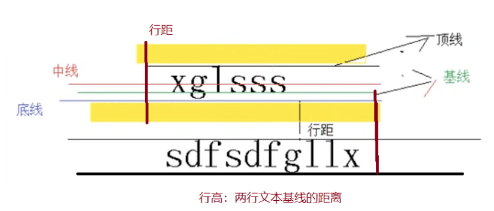

HTML Graphics - canvas 2

## 暂存

save() & restore()：save 和 restore 方法是用来保存和恢复 canvas 状态的

```javascript
<script type="text/javascript">
    //得到画布标签
var canvas = document.querySelector('canvas');
//使用上下文，得到一个2D画布
var ctx = canvas.getContext("2d");
//画画 
  ctx.fillRect(0,0,150,150);   // 使用默认设置绘制一个矩形
  ctx.save();                  // 保存默认状态

  ctx.fillStyle = '#09F'       // 在原有配置基础上对颜色做改变
  ctx.fillRect(15,15,120,120); // 使用新的设置绘制一个矩形

  ctx.save();                  // 保存当前状态
  ctx.fillStyle = '#FFF'       // 再次改变颜色配置
  ctx.globalAlpha = 0.5;    
  ctx.fillRect(30,30,90,90);   // 使用新的配置绘制一个矩形

  ctx.restore();               // 重新加载之前的颜色状态
  ctx.fillRect(45,45,60,60);   // 使用上一次的配置绘制一个矩形

  ctx.restore();               // 加载默认颜色配置
  ctx.fillRect(60,60,30,30);   // 使用加载的配置绘制一个矩形
</script>
```


## 变换

- translate(x, y)   

  ​	x 是左右偏移量，y 是上下偏移量

  ​	在canvas中translate是累加的

- rotate(angle)

  ​	旋转的角度(angle)，它是顺时针方向的，以弧度为单位的值。
  ​	旋转的中心点始终是 canvas 的原点，如果要改变它，我们需要用到 translate 方法
  ​	在canvas中rotate是累加的
  ​	

- scale(x, y)

  scale 方法接受两个参数。x,y 分别是横轴和纵轴的缩放因子，它们都必须是正值。
  ​	**比 1.0 小 ---- 缩小**

  ​	**比 1.0 大 ---- 放大**
  ​	在canvas中scale是累称的
  
- 变形

  ​	transform(m11, m12, m21, m22, dx, dy)
  
```
  m11 m21 dx
  m12 m22 dy
  0     0     1
```

  用以上矩阵进行图像变换。

  setTransform()：将当前的变换矩阵设置为默认的单位矩阵，然后在单位矩阵之上运用用户指定的变换。

  resetTransform()：重置为单位矩阵

## 渐变

**createLinearGradient(x1, y1, x2, y2)** 渐变的起点 (x1,y1) 与终点 (x2,y2)

**createRadialGradient(x1, y1, r1, x2, y2, r2)**  前三个定义一个以 (x1,y1) 为原点，半径为 r1 的圆，后三个参数则定义另一个以 (x2,y2) 为原点，半径为 r2 的圆。

创建出 canvasGradient 对象后，我们就可以用 addColorStop 方法给它上色了。

**gradient.addColorStop(position, color)** position 参数必须是一个 0.0 与 1.0 之间的数值，表示渐变中颜色所在的相对位置。例如，0.5 表示颜色会出现在正中间。

## 绘制文本

fillText(text, x, y [, maxWidth]) : 在(x,y)填充指定的文本
	strokeText(text, x, y [, maxWidth]) : 在(x,y)绘制文本边框

- font = 10px sans-serif (类似css)
- textAlign = start (默认) , end, left, right or center. 默认值是 start
- textBaseline = top, hanging, middle, alphabetic  (默认), ideographic, bottom 
- direction = ltr, rtl, inherit  (默认) 
- 文本测量：measureText()：将返回一个 TextMetrics对象的宽度、所在像素



```javascript
<script>
var c = document.getElementById("myCanvas");
var ctx = c.getContext("2d");

ctx.font = "20px Georgia";
ctx.strokeText("Hello World!", 10, 50);
ctx.font = "30px Verdana";

// Create gradient
var gradient = ctx.createLinearGradient(0, 0, c.width, 0);
gradient.addColorStop("0", "magenta");
gradient.addColorStop("0.5", "blue");
gradient.addColorStop("1.0", "red");

// Fill with gradient
ctx.strokeStyle = gradient;
ctx.strokeText("Big smile!", 10, 90);

ctx.fillText("Hello !", 150, 50);
</script>
```


## 绘制图片

**使用 Image 对象的 onload handler 来确保设置图案之前图像已经装载完毕。**

**drawImage(image, x, y)** 其中 image 是 image 或者 canvas 对象，x 和 y 是其在目标 canvas 里的起始坐标。

**drawImage(image, x, y, width, height)** width 和 height来控制当像canvas画入时应该缩放的大小。

**drawImage(image, sx, sy, sWidth, sHeight, dx, dy, dWidth, dHeight)** 前4个是定义图像源的切片位置和大小，后4个则是定义切片的目标显示位置和大小。

```javascript
// 图片绘制
context.drawImage(img, x, y, width, height);
//img为绘制图片的dom对象,x、y为绘制的左上角坐标.
//width, height 绘制图片的宽高
// 图片裁剪
context.drawImage(img, sx, sy, swidth, sheight, x, y, width, height);
// sx, sy 裁剪的xy坐标
// swidth, sheight 裁剪图片的xy
```

**createPattern(image, type)**  Image 可以是一个 Image 对象的引用，或者另一个 canvas 对象。Type 必须选：repeat，repeat-x，repeat-y 和 no-repeat。

```javascript
function draw() {
  var ctx = document.getElementById('canvas').getContext('2d');
  // 创建新 image 对象，用作图案
  var img = new Image();
  img.src = 'images/wallpaper.png';
  img.onload = function() {
    // 创建图案
    var ptrn = ctx.createPattern(img,'repeat');
    ctx.fillStyle = ptrn;
    ctx.fillRect(0,0,150,150);
  }
}
```

## 图片样式

createPattern(image, type)：该方法接受两个参数。Image 可以是一个 Image 对象的引用，或者另一个 canvas 对象。Type 必须是下面的字符串值之一：repeat，repeat-x，repeat-y 和 no-repeat。
**使用 Image 对象的 onload handler 来确保设置图案之前图像已经装载完毕。**

```html
<!DOCTYPE html>
<html>
<body>

<p>Image to use:</p>

<p>Canvas:</p>
<canvas id="myCanvas" width="300" height="150" style="border:1px solid #d3d3d3;">
Your browser does not support the HTML5 canvas tag.</canvas>
<br><br>

<button onclick="draw('repeat')">Repeat</button> 
<button onclick="draw('repeat-x')">Repeat-x</button> 
<button onclick="draw('repeat-y')">Repeat-y</button> 
<button onclick="draw('no-repeat')">No-repeat</button>     

<script>
function draw(direction){
  var c = document.getElementById("myCanvas");
  var ctx = c.getContext("2d");
  ctx.clearRect(0, 0, c.width, c.height); 
  var img = document.getElementById("lamp")
  var pat = ctx.createPattern(img, direction);
  ctx.rect(0, 0, 150, 100);
  ctx.fillStyle = pat;
  ctx.fill();
}
</script>

</body>
</html>
```


## 图片合成

全局透明度的设置 globalAlpha = value 这个属性影响到 canvas 里所有图形的透明度， 有效的值范围是 0.0 （完全透明）到 1.0（完全不透明） 默认是 1.0

###覆盖合成 source:新的图像(源) destination:已经绘制过的图形(目标)

**ctx.globalCompositeOperation = type**

- source-over(默认值):源在上面,新的图像层级比较高

- source-in  :只留下源与目标的重叠部分(源的那一部分)

- source-out :只留下源超过目标的部分

- source-atop:砍掉源溢出的部分

- destination-over:目标在上面,旧的图像层级比较高

- destination-in:只留下源与目标的重叠部分(目标的那一部分)

- destination-out:只留下目标超过源的部分

- destination-atop:砍掉目标溢出的部分

  ```html
  <!DOCTYPE html>
  <meta charset="utf-8"> 
  <canvas id="canvas-1" width="400" height="300">
  </canvas>
  
  <script>
  var c   = document.getElementById("canvas-1");
  var ctx = c.getContext("2d");
  ctx.globalCompositeOperation = "xor";
  ctx.fillStyle = "blue";
  ctx.fillRect(10, 10, 100, 100);
  ctx.fillStyle = "red";
  ctx.fillRect(50, 50, 100, 100);
  </script>
  ```

  

  

## 绘制阴影

- shadowOffsetX = float
  shadowOffsetX 和 shadowOffsetY 用来设定阴影在 X 和 Y 轴的延伸距离，它们是不受变换矩阵所影响的。负值表示阴影会往上或左延伸，正值则表示会往下或右延伸，它们默认都为 0。
- shadowOffsetY = float
  shadowOffsetX 和 shadowOffsetY 用来设定阴影在 X 和 Y 轴的延伸距离，它们是不受变换矩阵所影响的。负值表示阴影会往上或左延伸，正值则表示会往下或右延伸，它们默认都为 0。
- shadowBlur = float
  shadowBlur 用于设定阴影的模糊程度，其数值并不跟像素数量挂钩，也不受变换矩阵的影响，默认为 0。
- shadowColor = color
  shadowColor 是标准的 CSS 颜色值，用于设定阴影颜色效果，默认是全透明的黑色。

## ImageData 对象

其包含的内容有:width、height、data:Uint8ClampedArray 类型

createImageData(width, height):创建对象,颜色为黑色.

getImageData(x, y, width, height):这个方法会返回一个ImageData对象，它代表了画布区域的对象数据. x是图像数据矩形区域的左上角 x 坐标；y是图像数据矩形区域的左上角 y 坐标。

putImageData(myImageData, dx, dy):对场景进行像素数据的写入.

## 导出图像

将画布导出为图像 toDataURL(注意是canvas元素接口上的方法)

```javascript
var canvas  = document.getElementById("ex1");
var dataUrl = canvas.toDataURL();
```


## 判断线上的点

事件操作 ctx.isPointInPath(x, y) 判断在当前路径中是否包含检测点 x:检测点的X坐标 y:检测点的Y坐标

注意，此方法只作用于最新画出的canvas图像

```javascript
<script>
var c = document.getElementById("myCanvas");
var ctx = c.getContext("2d");
ctx.rect(20, 20, 150, 100);
if (ctx.isPointInPath(20, 50)){
  ctx.stroke();
};
</script> 
```


Reference：

W3school <https://www.w3schools.com/tags/ref_canvas.asp>

Canvas Tutorial  http://tutorials.jenkov.com/html5-canvas/index.html 

