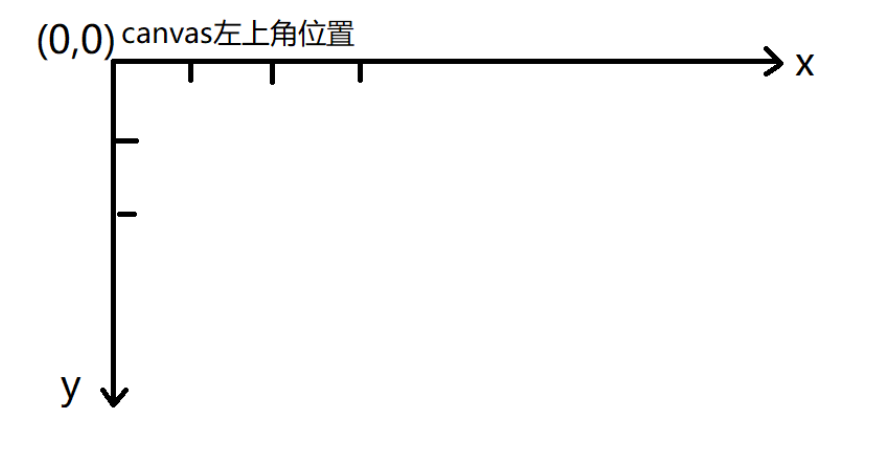
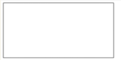
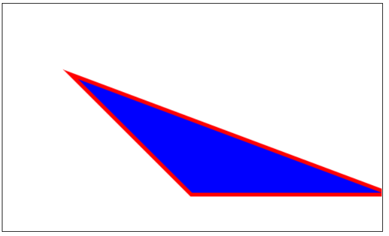
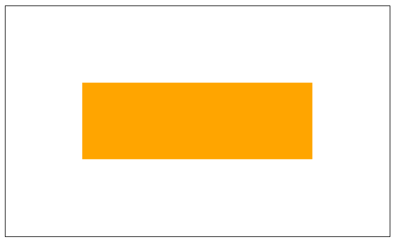
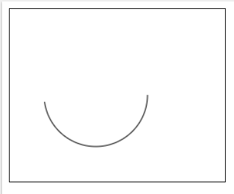
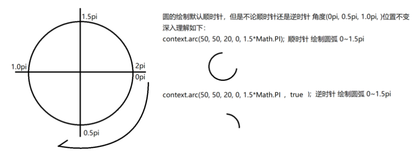
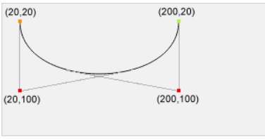
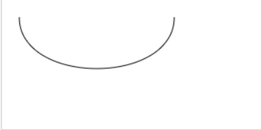
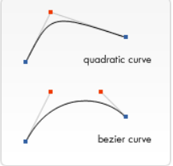
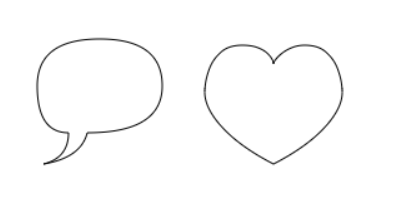

**HTML Graphics - canvas** 1

（ HTML Graphics  GoogleMaos SVG Canvas Game ）

- ## 基本信息

canvas的好处总结如下：

1. 常用于动态的，具有特效的图像显示。有漫画的感觉。
2. canvas可以做3D特效
3. canvas具有画布的功效，可以设计在线画图
4. canvas很炫。

`<canvas>`看起来和``元素很相像，唯一的不同就是它并没有 src 和 alt 属性。
实际上，`<canvas>`标签只有两个属性—— width和height 。 但是一定要有id （js需要）

html属性设置width height时只影响画布本身不影画布内容
css属性设置width height时不但会影响画布本身的高宽，还会使画布中的内容等比例缩放(影响画面质量)

By default, the `<canvas> `element has no border and no content.

## initial canvas



```html
<html>
<head>
    <meta charset="UTF-8" />
    <title>Document</title>
    <style type="text/css">
        canvas{border:1px solid #000;}
    </style>
</head>
<body>
    <canvas width="600" height="400"></canvas>
</body>
</html>
```



## rendering context- line

```javascript
<script type="text/javascript">
       var canvas = document.querySelector("canvas");
     //使用上下文，得到一个2D的画布
     var ctx = canvas.getContext("2d");
       // 简单线条 
  // 设置直线状态 起点 终点 宽度 颜色 
  // 线条相连成为形状
ctx.beginPath();     //声明要开始绘制路径
ctx.lineJoin = "round";//线条与线条间接合处的样式（miter 直角(default) /bevel 斜角 / round 圆角）
ctx.moveTo(100,100); //移动到绘制点，将“画笔”移动到100,100的位置
ctx.lineTo(250,250); //划线
ctx.lineTo(500,250); //划线
ctx.lineWidth = 10;  //线的粗细
ctx.strokeStyle = "red"; //线的颜色
ctx.fillStyle = "blue"; //准备填充的颜色
ctx.closePath();     //闭合路径（自动补全）
ctx.stroke();        //显示线（绘制线），可以绘制的路径显示出来
ctx.fill();          //填充颜色
  </script>
```



## rendering - shape

```javascript
fillRect(x,y,width,height)//填充矩形
strokeRect(x,y,width,height)//矩形边框
clearRect(x,y,width,height)//清除指定矩形区域，清楚部分变透明
```


```js
//直接形状
<script type="text/javascript">
     //得到画布标签
     var canvas = document.querySelector("canvas");
     //使用上下文，得到一个2D的画布
     var ctx = canvas.getContext("2d");
     //用ctx的方式画画
	//左上是（0,0）- x,y
     ctx.fillStyle = "orange"; //先提供一个颜色的笔
     ctx.fillRect(100, 100, 300, 100); //在根据以上颜色填充
</script>
```



## rendering - Arc

通过绘画弧形，完成图形建造

### 		**方法一：ctx.arc ( 圆心x, 圆心y, 半径, 开始的弧度, 结束的弧度, 是否逆时针 );**

```javascript
//ctx.arc(圆心x, 圆心y, 半径, 开始的弧度, 结束的弧度, 是否逆时针);
ctx.beginPath();  //开始绘制路径
// ctx.arc(100, 100, 60, 0, 6.28, false);
ctx.arc(100, 100, 60, 0, Math.PI * 2, false);
ctx.stroke(); //显示路径线
```

圆弧例子：

```javascript
<script type="text/javascript">
    //得到画布标签
var canvas = document.querySelector('canvas');
//使用上下文，得到一个2D画布
var ctx = canvas.getContext("2d");
//画画 
ctx.beginPath();  //开始绘制路径 
ctx.arc(100,100,60, 0, 3, false); //绘制圆弧（2*pi*r）
ctx.stroke(); //显示路径线
</script>
```






**注意: 绘制圆弧时不需要closePath(); 否则会连成一个闭环,为了防止两次绘制样式污染,每次绘制前执行beginPath()即可**

### 		**方法二：bezierCurveTo() Method**

bezierCurveTo(cp1x, cp1y, cp2x, cp2y, x, y) 绘制三次贝塞尔曲线，cp1x,cp1y为控制点一，cp2x,cp2y为控制点二，x,y为结束点。 起始点为moveto时指定的点



```javascript
var c = document.getElementById("myCanvas");
var ctx = c.getContext("2d");
ctx.beginPath();
ctx.moveTo(20, 20);
ctx.bezierCurveTo(20, 100, 200, 100, 200, 20);
ctx.stroke();
```




### 		方法三：quadraticCurveTo()  Method

quadraticCurveTo(cp1x, cp1y, x, y) 绘制二次贝塞尔曲线，cp1x,cp1y为一个控制点，x,y为结束点。 起始点为moveto时指定的点




总例子：

```javascript
// 弧形例子
ctx.beginPath();
ctx.arc(75,75,50,0,Math.PI*2,true);
ctx.moveTo(110,75);
ctx.arc(75,75,35,0,Math.PI,false);
ctx.moveTo(65,65);
ctx.arc(60,65,5,0,Math.PI*2,true);
ctx.moveTo(95,65);
ctx.arc(90,65,5,0,Math.PI*2,true);
ctx.stroke();

// 二次曲線
quadraticCurveTo(cp1x, cp1y, x, y)
// 三次曲線
bezierCurveTo(cp1x, cp1y, cp2x, cp2y, x, y)

// 二次曲線範例
ctx.beginPath();
ctx.moveTo(75,25);
ctx.quadraticCurveTo(25,25,25,62.5);
ctx.quadraticCurveTo(25,100,50,100);
ctx.quadraticCurveTo(50,120,30,125);
ctx.quadraticCurveTo(60,120,65,100);
ctx.quadraticCurveTo(125,100,125,62.5);
ctx.quadraticCurveTo(125,25,75,25);
ctx.stroke();

// 三次曲線範例
ctx.beginPath();
ctx.moveTo(75, 40);
ctx.bezierCurveTo(75, 37, 70, 25, 50, 25);
ctx.bezierCurveTo(20, 25, 20, 62.5, 20, 62.5);
ctx.bezierCurveTo(20, 80, 40, 102, 75, 120);
ctx.bezierCurveTo(110, 102, 130, 80, 130, 62.5);
ctx.bezierCurveTo(130, 62.5, 130, 25, 100, 25);
ctx.bezierCurveTo(85, 25, 75, 37, 75, 40);
ctx.stroke();
```




[Reference]: https://www.w3schools.com/tags/ref_canvas.asp

