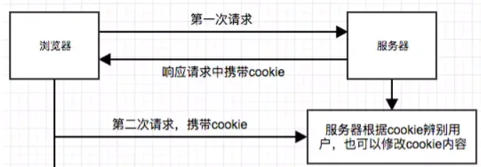
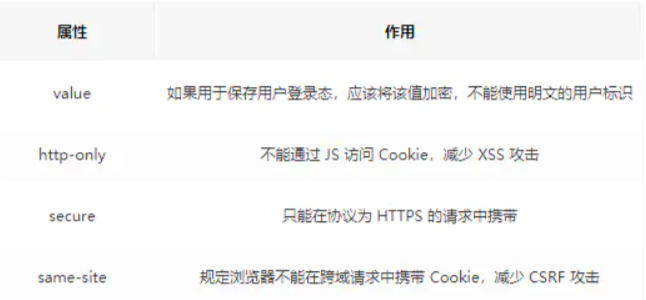
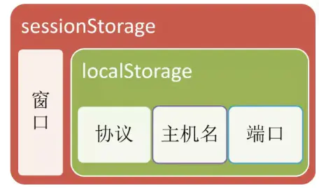
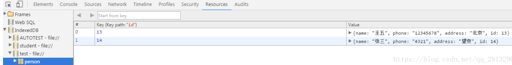
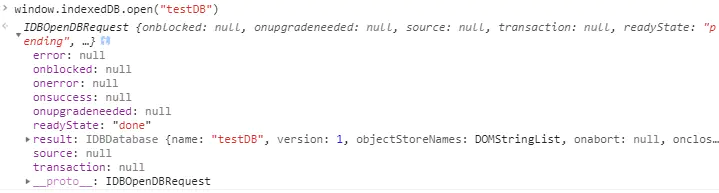
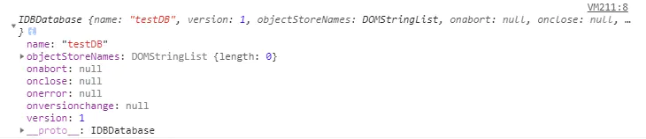
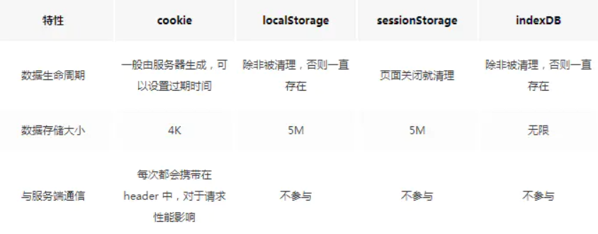
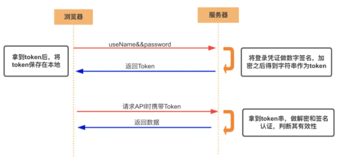
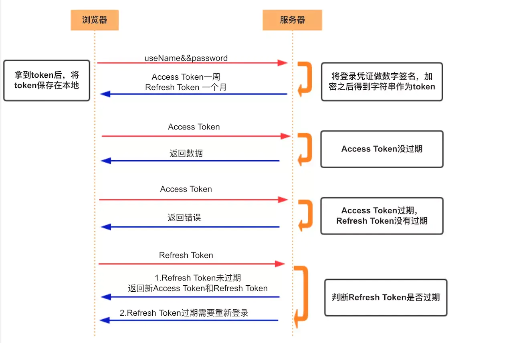

## Cookie

### 1. 定义

   **Cookie 的本职工作并非本地存储，而是“维持状态”**。因为HTTP协议是无状态的，HTTP协议自身不对请求和响应之间的通信状态进行保存

### 2. 做什么 在哪里

   Cookie指某些网站为了辨别用户身份而储存在用户本地终端上的数据(通常经过加密)。 cookie是服务端生成，客户端进行维护和存储

   **Cookie 以键值对的形式存在**。

   典型的应用场景有：

   - 记住密码，下次自动登录。
   - 购物车功能。
   - 记录用户浏览数据，进行商品（广告）推荐。

### 3. Cookie的原理及生成方式



Cookie的生成方式主要有两种：

- 生成方式一：http response header中的set-cookie
- 生成方式二：js中可以通过document.cookie可以读写cookie，以键值对的形式展示

### 4. Cookie的缺陷

- Cookie 不够大

- 过多的 Cookie 会带来巨大的性能浪费(带球跑啊)

- 由于在HTTP请求中的Cookie是明文传递的，所以安全性成问题，除非用HTTPS。

  所以要设置好属性

  

> **HTML5中新增了本地存储的解决方案----Web Storage，它分成两类：sessionStorage和localStorage**。这样有了WebStorage后，cookie能只做它应该做的事情了——作为客户端与服务器交互的通道，保持客户端状态。

## LocalStorage

### 1. 定义

本地存储的解决方案 

### 2. LocalStorage的特点

- 保存的数据长期存在，下一次访问该网站的时候，网页可以直接读取以前保存的数据。
- 大小为5M左右
- 仅在客户端使用，不和服务端进行通信
- 接口封装较好

基于上面的特点，LocalStorage可以作为浏览器本地缓存方案，用来提升网页首屏渲染速度(根据第一请求返回时，将一些不变信息直接存储在本地)。

### 3. 存入/读取数据

```js
localStorage.setItem("key","value");
var valueLocal = localStorage.getItem("key");
```

### 4. 好处

- 提升优化
  localStorage 只能做为提升用户体验的手段，而不能成为客户端逻辑的可靠的、唯一的依赖。
  方便网页的加载，避免取回数据前页面一片空白，如果不需要最新数据也可以减少向服务端请求的次数，从而减少用户等待从服务器获取数据的时间；
  网络状态不佳时仍可以显示离线数据。

- 访问限制
  只有当前设定localstorage的域下才能访问； 单标签页：两个tab（相同域）之间不能互通； 刷新或新开 tab 是可以访问到的，关闭浏览器重新打开原先tab也可访问。

- localStorage应用：
  存储一些需要刷新保存并且需要在页面关闭后仍然留下的信息。
  可以用于保存购物车中的内容；在之前项目中，用于保存上一次的用户浏览标签，并跳转到相应的路径下。

### 5.localstorage注意事项
  因为性能问题，不能过于依赖 JSON.stringify。value 尽量使用 string。
  如果需要多次写入localstorage，尽量一次性写入。
  localstorage是同步执行，可能会阻塞UI

## sessionStorage

### 1.sessionStorage的特点

- 会话级别的浏览器存储
- 大小为5M左右
- 仅在客户端使用，不和服务端进行通信
- 接口封装较好

基于上面的特点，sessionStorage 可以有效对表单信息进行维护，比如刷新时，表单信息不丢失。

### 2.访问限制
只有当前设定sessionStorage的域下才能访问； 单标签页：两个tab（相同域）之间不能互通； 在新开的tab下或者关闭本tab之后再打开，也不能访问之前写下的sessionStorage； 刷新本tab可以访问。

### 3.使用场景
存储一些当前页面刷新需要存储，且不需要在tab关闭时候留下的信息。
可以用来检测用户是否是刷新进入的页面，如音乐播放器恢复播放进度条的功能。 非常适合单页应用程序，可以方便在各业务模块进行传值。

#### webstorage 对比

localStorage只要在相同的协议、相同的主机名、相同的端口下，就能读取/修改到同一份localStorage数据。sessionStorage比localStorage更严苛一点，除了协议、主机名、端口外，还要求在同一窗口（也就是浏览器的标签页）下




**安全性：** Session 比 Cookie 安全，Session 是存储在服务器端的，Cookie 是存储在客户端的。

**存取值的类型不同**：Cookie 只支持存字符串数据，想要设置其他类型的数据，需要将其转换成字符串，Session 可以存任意数据类型。

**有效期不同：** Cookie 可设置为长时间保持，比如我们经常使用的默认登录功能，Session 一般失效时间较短，客户端关闭（默认情况下）或者 Session 超时都会失效。

**存储大小不同：** 单个 Cookie 保存的数据不能超过 4K，Session 可存储数据远高于 Cookie，但是当访问量过多，会占用过多的服务器资源。

>  Web Storage 是对 Cookie 的拓展，它只能用于存储少量的简单数据。当遇到大规模的、结构复杂的数据时，Web Storage 也爱莫能助了。这时候我们就要清楚我们的终极大 boss——IndexedDB！

## IndexedDB

IndexedDB 是一种低级API，**用于客户端存储大量结构化数据(包括文件和blobs)**。该API使用索引来实现对该数据的高性能搜索。IndexedDB 是一个运行在浏览器上的非关系型数据库。既然是数据库了，那就不是 5M、10M 这样小打小闹级别了。理论上来说，IndexedDB 是没有存储上限的（一般来说不会小于 250M）。它不仅可以存储字符串，还可以存储二进制数据。

> indexedDB就是一个非关系型数据库，它不需要你去写一些特定的sql语句来对数据库进行操作，因为它是nosql的，数据形式使用的是json

### 1. IndexedDB的特点

- 键值对储存。

**IndexedDB 内部采用对象仓库（object store）存放数据(没有表的概念)**。所有类型的数据都可以直接存入，包括 JavaScript 对象。对象仓库中，数据以"键值对"的形式保存，每一个数据记录都有对应的主键，主键是独一无二的，不能有重复，否则会抛出一个错误。

- 异步

IndexedDB 操作时不会锁死浏览器，用户依然可以进行其他操作，这与 LocalStorage 形成对比，后者的操作是同步的。异步设计是为了防止大量数据的读写，拖慢网页的表现。

- 支持事务。

IndexedDB 支持事务（transaction），这意味着一系列操作步骤之中，只要有一步失败，整个事务就都取消，数据库回滚到事务发生之前的状态，不存在只改写一部分数据的情况。

- 同源限制

IndexedDB 受到同源限制，每一个数据库对应创建它的域名。网页只能访问自身域名下的数据库，而不能访问跨域的数据库。

- 储存空间大

IndexedDB 的储存空间比 LocalStorage 大得多，一般来说不少于 250MB，甚至没有上限。

- 支持二进制储存。

IndexedDB 不仅可以储存字符串，还可以储存二进制数据（ArrayBuffer 对象和 Blob 对象）。

#### 细节重点

一个objectStore相当于一张表，里面存储的每条数据和一个键相关联。我们可以使用每条记录中的某个指定字段作为键值（keyPath），也可以使用自动生成的递增数字作为键值（keyGenerator），也可以不指定。选择键的类型不同，objectStore可以存储的数据结构也有差异。



> 会专门写一个怎么用这个的 链接在此~ [教程](https://www.zhangxinxu.com/wordpress/2017/07/html5-indexeddb-js-example/)

### 2.  IndexedDB的常见操作

在IndexedDB大部分操作并不是我们常用的调用方法，返回结果的模式，而是请求——响应的模式。

- 建立打开IndexedDB ----`window.indexedDB.open("testDB")`

这条指令并不会返回一个DB对象的句柄，我们得到的是一个`IDBOpenDBRequest`对象，而我们希望得到的DB对象在其result属性中



除了result，IDBOpenDBRequest接口定义了几个重要属性:

onerror: 请求失败的回调函数句柄

onsuccess:请求成功的回调函数句柄

onupgradeneeded:请求数据库版本变化句柄

```html
<script>
    function openDB(name) {
        var request = window.indexedDB.open(name); //建立打开IndexedDB
        request.onerror = function(e) {
            console.log("open indexdb error");
        };
        request.onsuccess = function(e) {
            myDB.db = e.target.result; //这是一个 IDBDatabase对象，这就是IndexedDB对象
            console.log(myDB.db); //此处就可以获取到db实例
        };
    }
    var myDB = {
        name: "testDB",
        version: "1",
        db: null
    };
    openDB(myDB.name);
</script> 
```

控制台得到一个 IDBDatabase对象，这就是IndexedDB对象



- 关闭IndexedDB----`indexdb.close()`

```js
function closeDB(db){
    db.close();
}
复制代码
```

- 删除IndexedDB----`window.indexedDB.deleteDatabase(indexdb)`

```js
function deleteDB(name) {
  indexedDB.deleteDatabase(name)
}
```

## WebStorage、cookie 和 IndexedDB之间的区别



- 作用域不同
  sessionStorage不在不同的浏览器窗口中共享，即使是同一个页面；
  localStorage在所有同源窗口中都是共享的；
  cookie也是在所有同源窗口中都是共享的。
  Web Storage支持事件通知机制，可以将数据更新的通知发送给监听者。
  Web Storage的api接口使用更方便。
- **session 是基于 cookie 实现的，session 存储在服务器端，sessionId 会被存储到客户端的cookie 中**

## 总结

正是浏览器存储、缓存技术的出现和发展，为我们的前端应用带来了无限的转机。近年来基于存储、缓存技术的第三方库层出不绝，此外还衍生出了 PWA 这样优秀的 Web 应用模型。总结下本文几个核心观点：

- Cookie 的本职工作并非本地存储，而是“维持状态”
- Web Storage 是 HTML5 专门为浏览器存储而提供的数据存储机制，不与服务端发生通信
- IndexedDB 用于客户端存储大量结构化数据

## Token

### Acesss Token

- **访问资源接口（API）时所需要的资源凭证**
- **简单 token 的组成：** uid(用户唯一的身份标识)、time(当前时间的时间戳)、sign（签名，token 的前几位以哈希算法压缩成的一定长度的十六进制字符串）
- 特点：
  - **服务端无状态化、可扩展性好**
  - **支持移动端设备**
  - 安全
  - 支持跨程序调用

- **token 的身份验证流程：**

  

1. 客户端使用用户名跟密码请求登录
2. 服务端收到请求，去验证用户名与密码
3. 验证成功后，服务端会签发一个 token 并把这个 token 发送给客户端
4. 客户端收到 token 以后，会把它存储起来，比如放在 cookie 里或者 localStorage 里
5. 客户端每次向服务端请求资源的时候需要带着服务端签发的 token
6. 服务端收到请求，然后去验证客户端请求里面带着的 token ，如果验证成功，就向客户端返回请求的数据

- **每一次请求都需要携带 token，需要把 token 放到 HTTP 的 Header 里**
- **基于 token 的用户认证是一种服务端无状态的认证方式，服务端不用存放 token 数据。用解析 token 的计算时间换取 session 的存储空间，从而减轻服务器的压力，减少频繁的查询数据库**
- **token 完全由应用管理，所以它可以避开同源策略**

### Refresh Token

- 另外一种 token——refresh token
- refresh token 是专用于刷新 access token 的 token。如果没有 refresh token，也可以刷新 access token，但每次刷新都要用户输入登录用户名与密码，会很麻烦。有了 refresh token，可以减少这个麻烦，客户端直接用 refresh token 去更新 access token，无需用户进行额外的操作。




- Access Token 的有效期比较短，当 Acesss Token 由于过期而失效时，使用 Refresh Token 就可以获取到新的 Token，如果 Refresh Token 也失效了，用户就只能重新登录了。
- Refresh Token 及过期时间是存储在服务器的数据库中，只有在申请新的 Acesss Token 时才会验证，不会对业务接口响应时间造成影响，也不需要向 Session 一样一直保持在内存中以应对大量的请求。

## Token 和 Session 的区别

- Session 是一种**记录服务器和客户端会话状态的机制，使服务端有状态化，可以记录会话信息**。而 Token 是**令牌**，**访问资源接口（API）时所需要的资源凭证**。Token **使服务端无状态化，不会存储会话信息。**
- Session 和 Token 并不矛盾，作为身份认证 Token 安全性比 Session 好，因为每一个请求都有签名还能防止监听以及重放攻击，而 Session 就必须依赖链路层来保障通讯安全了。**如果你需要实现有状态的会话，仍然可以增加 Session 来在服务器端保存一些状态。**
- 所谓 Session 认证只是简单的把 User 信息存储到 Session 里，因为 SessionID 的不可预测性，暂且认为是安全的。而 Token ，如果指的是 OAuth Token 或类似的机制的话，提供的是 认证 和 授权 ，认证是针对用户，授权是针对 App 。其目的是让某 App 有权利访问某用户的信息。这里的 Token 是唯一的。不可以转移到其它 App上，也不可以转到其它用户上。Session 只提供一种简单的认证，即只要有此 SessionID ，即认为有此 User 的全部权利。是需要严格保密的，这个数据应该只保存在站方，不应该共享给其它网站或者第三方 App。所以简单来说：**如果你的用户数据可能需要和第三方共享，或者允许第三方调用 API 接口，用 Token 。如果永远只是自己的网站，自己的 App，用什么就无所谓了**

## 常见问题

### 使用 cookie 时需要考虑的问题

- 因为存储在客户端，容易被客户端篡改，使用前需要验证合法性
- 不要存储敏感数据，比如用户密码，账户余额
- 使用 httpOnly 在一定程度上提高安全性
- 尽量减少 cookie 的体积，能存储的数据量不能超过 4kb
- 设置正确的 domain 和 path，减少数据传输
- **cookie 无法跨域**
- 一个浏览器针对一个网站最多存 20 个Cookie，浏览器一般只允许存放 300 个Cookie
- **移动端对 cookie 的支持不是很好，而 session 需要基于 cookie 实现，所以移动端常用的是 token**

### 使用 session 时需要考虑的问题

- 将 session 存储在服务器里面，当用户同时在线量比较多时，这些 session 会占据较多的内存，需要在服务端定期的去清理过期的 session
- 当网站采用**集群部署**的时候，会遇到多台 web 服务器之间如何做 session 共享的问题。因为 session 是由单个服务器创建的，但是处理用户请求的服务器不一定是那个创建 session 的服务器，那么该服务器就无法拿到之前已经放入到 session 中的登录凭证之类的信息了。
- 当多个应用要共享 session 时，除了以上问题，还会遇到跨域问题，因为不同的应用可能部署的主机不一样，需要在各个应用做好 cookie 跨域的处理。
- **sessionId 是存储在 cookie 中的，假如浏览器禁止 cookie 或不支持 cookie 怎么办？** 一般会把 sessionId 跟在 url 参数后面即重写 url，所以 session 不一定非得需要靠 cookie 实现
- **移动端对 cookie 的支持不是很好，而 session 需要基于 cookie 实现，所以移动端常用的是 token**

### 使用 token 时需要考虑的问题

- 如果你认为用数据库来存储 token 会导致查询时间太长，可以选择放在内存当中。比如 redis 很适合你对 token 查询的需求。
- **token 完全由应用管理，所以它可以避开同源策略**
- **token 可以避免 CSRF 攻击(因为不需要 cookie 了)**
- **移动端对 cookie 的支持不是很好，而 session 需要基于 cookie 实现，所以移动端常用的是 token**

## Reference

[对比Cookie、LocalStorage、sessionStorage与IndexedDB](https://juejin.cn/post/6844903814445662221#heading-1)

[傻傻分不清之 Cookie、Session、Token、JWT](https://juejin.cn/post/6844904034181070861)

**[彻底理解 cookie、session、token](https://www.cnblogs.com/moyand/p/9047978.html)**