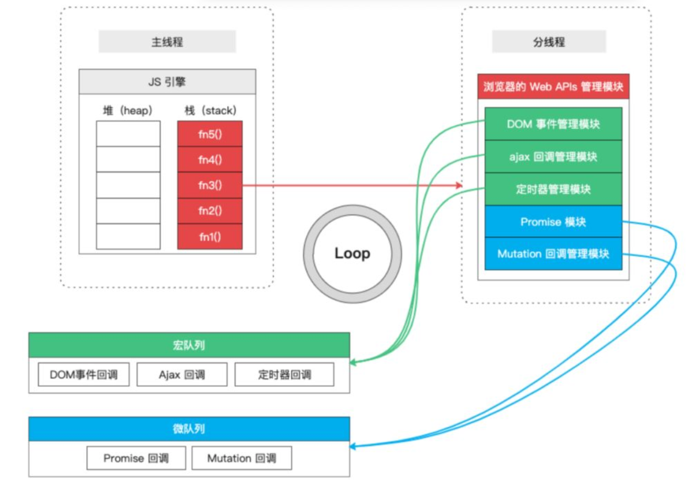
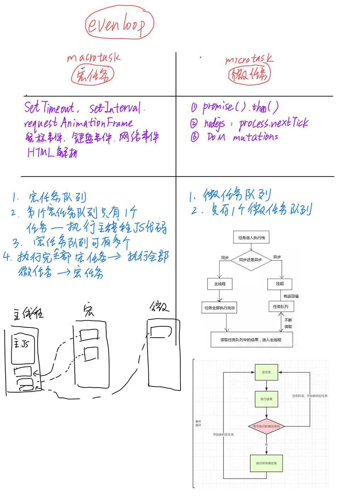
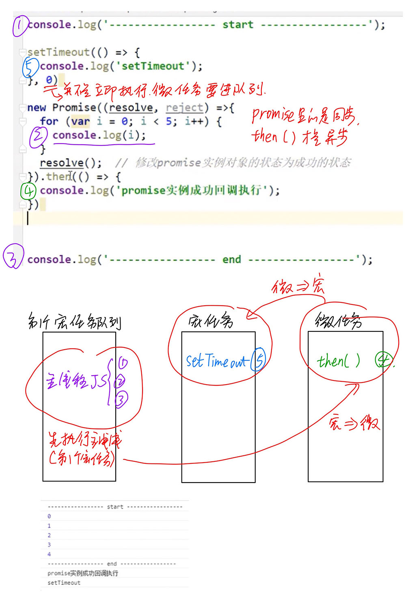
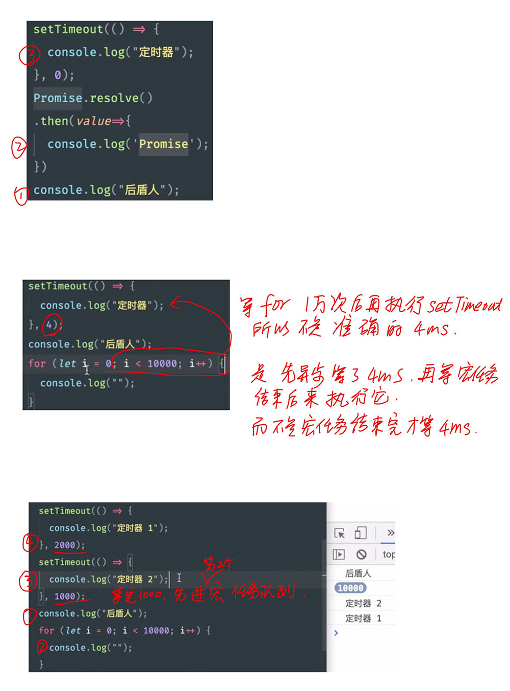
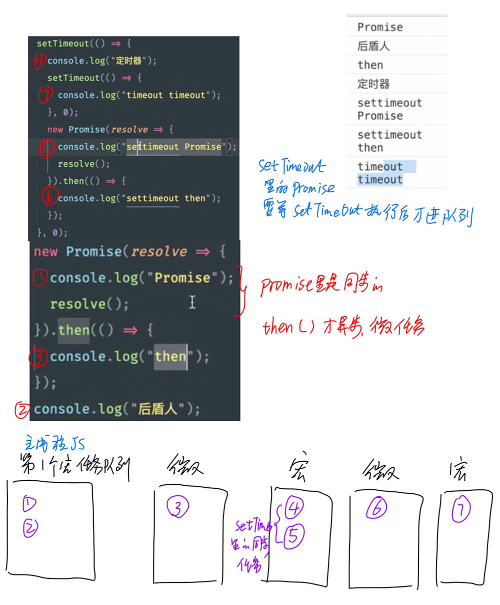

## JS异步之宏队列与微队列

[详细的解释](https://www.cnblogs.com/sunmarvell/p/9564815.html)



- **宏列队** **macrotask**：用来保存待执行的宏任务（回调），比如：定时器回调、DOM 事件回调、ajax 回调、script(整体代码)、setTimeout、setInterval、setImmediate、I/O、UI交互事件、postMessage、MessageChannel

  **优先级**：主代码块 > setImmediate > MessageChannel > setTimeout / setInterval

- **微列队** **microtask**：用来保存待执行的微任务（回调），比如：Promise回调：Promise.then、Mutation回调：MutationObserver、process.nextTick(Node环境)

  **优先级**：process.nextTick > Promise > MutationObserver

### 例子

```js
//输出下面的出现顺序 
setTimeout(() => {
            console.log(4);
        }, 0);
 
        new Promise(resolve=>{
            console.log(1);
            for(let i =0;i<10000;i++){
                i == 9999 && resolve();
            }
            console.log(2)
        }).then(()=>{
            console.log(5)
        })
 
        console.log(3)
```

```js
　　setTimeout(() => { //立即放入宏队列
      console.log('timeout callback1（）')
      Promise.resolve(3).then(
        value => { //立即放入微队列
          console.log('Promise onResolved3()', value)
        }
      )
    }, 0)

    setTimeout(() => { //立即放入宏队列
      console.log('timeout callback2（）')
    }, 0)

    Promise.resolve(1).then(
      value => { //立即放入微队列
        console.log('Promise onResolved1()', value)
        setTimeout(() => {
          console.log('timeout callback3（）', value)
        }, 0)
      }
    )

    Promise.resolve(2).then(
      value => { //立即放入微队列
        console.log('Promise onResolved2()', value)
      }
    )

    // Promise onResolved1() 1
    // Promise onResolved2() 2
    // timeout callback1（）
    // Promise onResolved3() 3
    // timeout callback2（）
    // timeout callback3（） 1
```


```js
// 先来看下下面这段代码
async function async1() {
  console.log('async1 start');
  await async2();
  console.log('async1 end');
}
async function async2() {
  console.log('async2');
}
 
console.log('script start');
 
setTimeout(function() {
  console.log('setTimeout');
}, 0)
 
async1();
 
new Promise(function(resolve) {
  console.log('promise1');
  resolve();
}).then(function() {
  console.log('promise2');
});
console.log('script end');
 
 
/*执行结果
script start
async1 start
async2
promise1
script end
async1 end
promise2
setTimeout
*/
```

从上往下看，先走同步队列，再走异步队列（包含微观任务队列和宏观任务队列）。

同步队列：script start → async1 start → async2 → promise1 → script end

异步队列：包括微观任务和宏观任务。

微观任务：async1 end → promise2

宏观任务: setTimeout →


## 总结对比!!!









## reference

1. [事件循环Eventloop 宏任务macrotask 微任务microtask](http://laker.me/blog/2020/03/20/20_0320_eventloop/)

2. https://blog.csdn.net/Miss_liangrm/article/details/103182530?utm_medium=distribute.pc_relevant.none-task-blog-BlogCommendFromMachineLearnPai2-1.control&depth_1-utm_source=distribute.pc_relevant.none-task-blog-BlogCommendFromMachineLearnPai2-1.control

3. https://www.cnblogs.com/sunmarvell/p/9564815.html