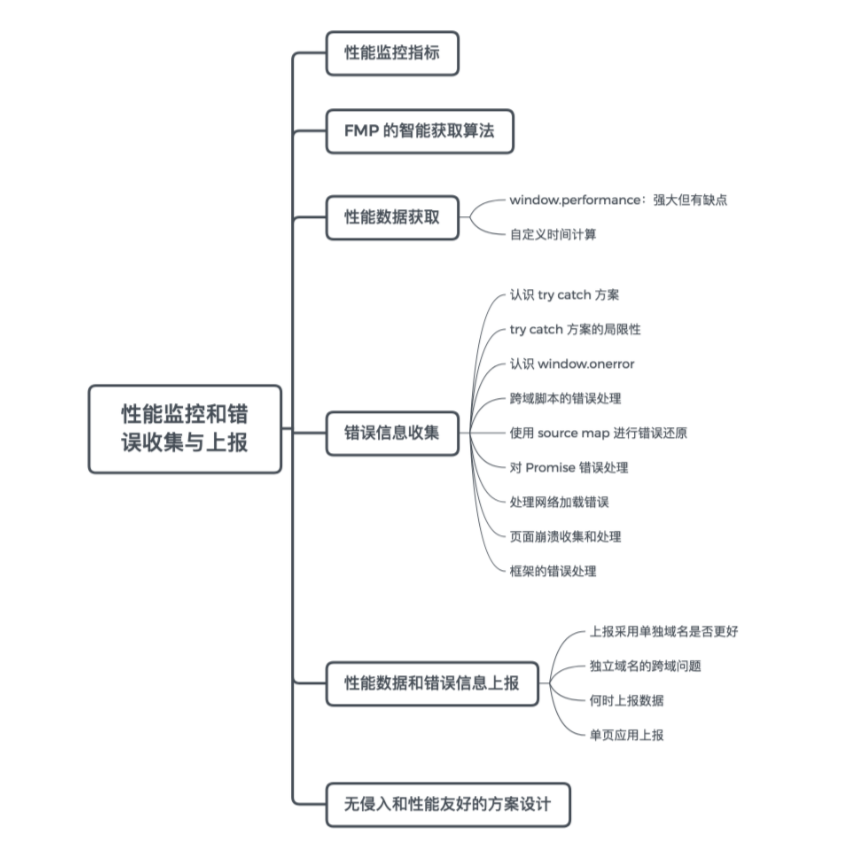

主要知识体系



# 性能监控指标

既然是性能监控，那我们首先需要明确衡量指标。一般来说，业界认可的常用指标有：

- 首次绘制（FP）和首次有内容绘制（FCP）时间
- 首次有意义绘制（FMP）时间
- 首屏时间
- 用户可交互（TTI）时间
- 总下载时间
- 自定义指标

接下来分别看看每个指标的含义。

> **首次绘制（FP）时间** ：对于应用页面，用户在视觉上首次出现不同于跳转之前的内容时间点，或者说是页面发生第一次绘制的时间点。

> **首次有内容绘制（FCP）时间** ：指浏览器完成渲染 DOM 中第一个内容的时间点，可能是文本、图像或者其他任何元素，此时用户应该在视觉上有直观的感受。

> **首次有意义绘制（FMP）时间** ：指页面关键元素渲染时间。这个概念并没有标准化定义，因为关键元素可以由开发者自行定义——究竟什么是“有意义”的内容，只有开发者或者产品经理自己了解。

> **首屏时间** ：对于所有网页应用，这是一个非常重要的指标。用大白话来说，就是进入页面之后，应用渲染完整个手机屏幕（未滚动之前）内容的时间。需要注意的是，业界对于这个指标其实同样并没有确切的定论，比如这个时间是否包含手机屏幕内图片的渲染完成时间。

> **用户可交互时间** ：顾名思义，也就是用户可以与应用进行交互的时间。一般来讲，我们认为是 domready 的时间，因为我们通常会在这时候绑定事件操作。如果页面中涉及交互的脚本没有下载完成，那么当然没有到达所谓的用户可交互时间。那么如何定义 domready 时间呢？我推荐参考司徒正美的文章：[何谓 domReady](https://www.cnblogs.com/rubylouvre/p/4536334.html)。

以上时间，我们可以通过下图对比认识：


这是我访问 Medium 移动网站分析得到的时序图，读者可根据网页加载的不同时段，体会各个时间节点的变化。更完整的信息由 Chrome DevTool 给出：


通过 Google Lighthouse 分析得到：


请注意 First Meaningful Paint 和 First Contentful Paint 以及 Time to Interactive（可交互时间）被收录其中。

这里我们先对这些时间节点以及数据有一个感性的认知，后面将会逐步学习如何统计这些时间，做出如上图一样的分析系统。接下来，我们继续学习一些概念。

> **总下载时间** ：页面所有资源加载完成所需要的时间。一般可以统计 window.onload 时间，这样可以统计出同步加载的资源全部加载完的耗时。如果页面中存在较多异步渲染，也可以将异步渲染全部完成的时间作为总下载时间。

> **自定义指标** ：由于应用特点不同，我们可以根据需求自定义时间。比如，一个类似 Instagram 的页面，页面由图片瀑布流组成，那么我们可能非常关心屏幕中第一排图片渲染完成的时间。

**这里我们提一下，DOMContentLoaded 与 load 事件的区别** 。其实从这两个事件的命名我们就能体会，DOMContentLoaded 指的是文档中 DOM 内容加载完毕的时间，也就是说 HTML 结构已经完整。但是我们知道，很多页面包含图片、特殊字体、视频、音频等其他资源，这些资源由网络请求获取，DOM 内容加载完毕时，由于这些资源往往需要额外的网络请求，还没有请求或者渲染完成。而当页面上所有资源加载完成后，load 事件才会被触发。因此，在时间线上，load 事件往往会落后于 DOMContentLoaded 事件。

如图：


表示页面加载一共请求了 13 个资源，大小为 309 KB，DOMContentLoaded 时间为 2.82 s，load 时间为 2.95 s，页面完全稳定时间 5.38 s 。

# FMP 的智能获取算法

另外结合自定义指标和首次有意义绘制（FMP）时间，稍做延伸：我们知道首次有意义绘制比较主观，开发者可以自行指定究竟哪些属于有意义的渲染元素。我们也可以通过 **FMP 的智能获取算法** 来完成自定义 FMP 时间。该算法实现过程如下。

**首先** ，获取有意义的渲染元素，一般认为：

- 体积占比比较大
- 屏幕内可见占比大
- 属于资源加载元素（img、svg、video、object、embed、canvas）
- 主要元素是多个组成的

具备这几个条件的元素，更像是有意义的元素。根据元素对页面视觉的贡献，我们对元素特点的权重进行划分：

```
const weightMap = {
    SVG: 2,
    IMG: 2,
    CANVAS: 3,
    OBJECT: 3,
    EMBED: 3,
    VIDEO: 3,
    OTHER: 1
}
```

**接着** ，我们对整个页面进行深度优先遍历搜索，之后对每一个元素进行分数计算，具体通过 element.getBoundingClientRect 获取元素的位置和大小，然后通过计算「width  *height*  weight * 元素在 viewport 的面积占比」的乘积，确定元素的最终得分。接着将该元素的子元素得分之和与其得分进行比较，取较大值，记录得分元素集。这个集合是“可视区域内得分最高的元素的集合”，我们会对这个集合的得分取均值，然后过滤出在平均分之上的元素集合，进行时间计算。这就得到了一个智能的 FMP 时间。

**最终** ，代码由 qbright 实现：[fmp-timing](https://github.com/qbright/fmp- timing)，感兴趣的读者可以自行了解细节。

# 性能数据获取

了解了上述性能指标，我们来分析一下这些性能指标数据究竟该如何计算获取。

## window.performance：强大但有缺点

目前最为流行和靠谱的方案是采用 Performance API，它非常强大：不仅包含了页面性能的相关数据，还带有页面资源加载和异步请求的相关数据。

调用 window.performance.timing 会返回一个对象，这个对象包含各种页面加载和渲染的时间节点。如图：


enter image description here

具体解析：

```js
const window.performance = { 
    memory: {
        usedJSHeapSize,
        totalJSHeapSize,
        jsHeapSizeLimit
    },

    navigation: {
        // 页面重定向跳转到当前页面的次数
        redirectCount,
        // 以哪种方式进入页面
        // 0 正常跳转进入
        // 1 window.location.reload() 重新刷新
        // 2 通过浏览器历史记录，以及前进后退进入
        // 255 其他方式进入
        type,         
    },

    timing: {
        // 等于前一个页面 unload 时间，如果没有前一个页面，则等于 fetchStart 时间
        navigationStart
        // 前一个页面 unload 时间，如果没有前一个页面或者前一个页面与当前页面不同域，则值为 0
        unloadEventStart,
        // 前一个页面 unload 事件绑定的回调函数执行完毕的时间
        unloadEventEnd,
        redirectStart,
        redirectEnd,
        // 检查缓存前，准备请求第一个资源的时间
        fetchStart,
        // 域名查询开始的时间
        domainLookupStart,
        // 域名查询结束的时间
        domainLookupEnd,
        // HTTP（TCP） 开始建立连接的时间            connectStart,
        // HTTP（TCP）建立连接结束的时间
        connectEnd,
        secureConnectionStart,
        // 连接建立完成后，请求文档开始的时间
        requestStart,
        // 连接建立完成后，文档开始返回并收到内容的时间
        responseStart,
        // 最后一个字节返回并收到内容的时间
        responseEnd,
        // Document.readyState 值为 loading 的时间
        domLoading,
        // Document.readyState 值为 interactive
        domInteractive,
        // DOMContentLoaded 事件开始时间
        domContentLoadedEventStart,
        // DOMContentLoaded 事件结束时间
        domContentLoadedEventEnd,
        // Document.readyState 值为 complete 的时间           
        domComplete,
        // load 事件开始的时间
        loadEventStart,
        // load 事件结束的时间
        loadEventEnd
    }
}
```

根据这些时间节点，我们选择相应的时间两两做差，便可以计算出一些典型指标：

```js
const calcTime = () => {
    let times = {}
    let t = window.performance.timing

    // 重定向时间
    times.redirectTime = t.redirectEnd - t.redirectStart

    // DNS 查询耗时
    times.dnsTime = t.domainLookupEnd - t.domainLookupStart

    // TCP 建立连接完成握手的时间
    connect = t.connectEnd - t.connectStart

    // TTFB 读取页面第一个字节的时间
    times.ttfbTime = t.responseStart - t.navigationStart

    // DNS 缓存时间
    times.appcacheTime = t.domainLookupStart - t.fetchStart

    // 卸载页面的时间
    times.unloadTime = t.unloadEventEnd - t.unloadEventStart

    // TCP 连接耗时
    times.tcpTime = t.connectEnd - t.connectStart

    // request 请求耗时
    times.reqTime = t.responseEnd - t.responseStart

    // 解析 DOM 树耗时
    times.analysisTime = t.domComplete - t.domInteractive

    // 白屏时间
    times.blankTime = t.domLoading - t.fetchStart

    // domReadyTime 即用户可交互时间
    times.domReadyTime = t.domContentLoadedEventEnd - t.fetchStart

    // 用户等待页面完全可用的时间
    times.loadPage = t.loadEventEnd - t.navigationStart

    return times
}
```

**这个 API 非常强大，但是并不适用所有场景** 。

比如：使用 window.performance.timing 所获的数据，在单页应用中改变 URL 但不刷新页面的情况下（单页应用典型路由方案），是不会更新的，还需要开发者重新设计统计方案。同时，可能无法满足一些自定义的数据。下面我们来分析一下部分无法直接获取的性能指标的计算方法。

## 自定义时间计算

**首屏时间的计算实现方式不尽相同，开发者可以根据自己的需求来确定首屏时间的计算方式。我列举几个典型的方案。**

### window.performance.timing.navigationStart

对于 **网页高度小于屏幕** 的网站来说，统计首屏时间非常简单，只要在页面底部加上脚本，完成当前时间的打印即可，这个时间再通过与 window.performance.timing.navigationStart 时间做差，即得到首屏渲染耗时。

但网页高度小于屏幕的站点毕竟是少数：对于 **网页高度大于一屏** 的页面来说，只要在估算接近于一屏幕的最后一个元素的位置后，插入计算脚本即可：

```
var time = +new Date() - window.performance.timing.navigationStart
```

显然上述方案是比较理想化的，我们很难通过自动化工具或者一段集中管理的代码进行统计。开发者直接在页面 DOM 中插入时间统计，不仅代码侵入性太强，而且成本很高。同时，这样的计算方式其实并没有考虑首屏图片加载的情况，也就是说首屏图片未加载完的情况下，我们也认为加载已经完成。

### 利用timer

如果要考虑首屏图片的加载，建议使用 **集中化脚本统计首屏时间** 的方法：使用定时器不断检测 img 节点，判断图片是否在首屏且加载完成，找到首屏加载最慢的图片加载完成的时间，从而计算出首屏时间。如果首屏有没有图片，就用 domready 时间：

```js
const win = window
const firstScreenHeight = win.screen.height
let firstScreenImgs = []
let isFindLastImg = false
let allImgLoaded = false
let collect = []

const t = setInterval(() => {
    let i, img
    if (isFindLastImg) {
        if (firstScreenImgs.length) {
            for (i = 0; i < firstScreenImgs.length; i++) {
                img = firstScreenImgs[i]
                if (!img.complete) {
                    allImgLoaded = false
                    break
                } else {
                    allImgLoaded = true
                }
            }
        } else {
            allImgLoaded = true
        }
        if (allImgLoaded) {
            collect.push({
                firstScreenLoaded: startTime - Date.now()
            })
            clearInterval(t)
        }
    } else {
        var imgs = body.querySelector('img')
        for (i = 0; i < imgs.length; i++) {
            img = imgs[i]
            let imgOffsetTop = getOffsetTop(img)
            if (imgOffsetTop > firstScreenHeight) {
                isFindLastImg = true
                break
            } else if (imgOffsetTop <= firstScreenHeight 
            && !img.hasPushed) {
                img.hasPushed = 1
                firstScreenImgs.push(img)
            }
        }
    }
}, 0)

const doc = document
doc.addEventListener('DOMContentLoaded', () => {
    const imgs = body.querySelector('img')
    if (!imgs.length) {
        isFindLastImg = true
    }
})

win.addEventListener('load', () => {
    allImgLoaded = true
    isFindLastImg = true
    if (t) {
        clearInterval(t)
    }
})
```

### 图片加载

另外一种方式是不使用定时器，且默认影响首屏时间的主要因素是图片的加载，如果没有图片，纯粹渲染文字是很快的，因此，可以通过统计首屏内图片的加载时间获取首屏渲染完成的时间。

```js
(function logFirstScreen() {
    let images = document.getElementsByTagName('img')
    let iLen = images.length
    let curMax = 0
    let inScreenLen = 0

    // 图片的加载回调
    function imageBack() {
        this.removeEventListener
        && this.removeEventListener('load', imageBack, !1)
        if (++curMax === inScreenLen) {
            // 所有在首屏的图片均已加载完成的话，发送日志
            log()
        }   
    } 
    // 对于所有的位于指定区域的图片，绑定回调事件
    for (var s = 0; s < iLen; s++) {
        var img = images[s]
        var offset = {
            top: 0
        }
        var curImg = img
        while (curImg.offsetParent) {
            offset.top += curImg.offsetTop
            curImg = curImg.offsetParent
        }
        // 判断图片在不在首屏
        if (document.documentElement.clientHeight < offset.top) {
            continue
        }
        // 图片还没有加载完成的话
        if (!img.complete) {
            inScreenLen++
            img.addEventListener('load', imageBack, !1)
        }
    }
    // 如果首屏没有图片的话，直接发送日志
    if (inScreenLen === 0) {
        log()
    }
    // 发送日志进行统计
    function log () {
        window.logInfo.firstScreen = +new Date() - window.performance.timing.navigationStart
        console.log('首屏时间：', +new Date() - window.performance.timing.navigationStart)
    }
})()
```

可见，除了使用教科书般强大的 Performance API 外，我们也完全拥有自主权来统计各种页面性能数据。这就需要开发者根据具体场景和业务需求，结合社区已有方案，找到完全适合自己的统计采集方式。

这节课我们介绍了性能核心指标以及获取方式，关键在于合理利用强大的 API。与此同时，对于“开放性”数据，我们需要结合实际，灵活进行开发。

# 错误信息收集

提到错误收集方案，大家应该会首先想到两种：try catch 捕获错误和 window.onerror 监听。

## try catch 方案 浏览器端的脚本逻辑错误

我们先看一下 try catch 方案：

```js
try {
    // 代码块
} catch(e) {
    // 错误处理
    // 在这里，我们可以将错误信息发送给服务端
}
```

这种方式需要开发者对预估有错误风险的代码进行包裹，这个包裹过程可以手动添加，也可以通过自动化工具或类库完成。

[例子解析 (这里例子我有点懵 过~ )](https://fe.mbear.top/xing-neng-you-hua/032-xing-neng-jian-kong-he-cuo-wu-shou-ji-yu-shang-bao-xia)

使用 try catch，我们可以保证页面不崩溃，并对错误进行兜底处理，这是一个非常好的习惯。

## try catch 方案的局限性

> 但是 try catch 处理异常的能力有限，对于同步运行的错误能抓取但是对于
>
> - 语法错误
> - 异步错误
>
> try catch 就无法 cover 了。

我们来看一个运行时非异步错误：

```js
try {
    a // 未定义变量 
} catch(e) {
    console.log(e)
}
```

可以被 try catch 处理。但是，将上述代码改动为语法错误：

```js
try {
    var a =\ 'a'
} catch(e) {
    console.log(e);
}
```

就无法捕获。

我们再看一下异步的情况：

```js
try {
    setTimeout(() => {
        a
    })
} catch(e) {
    console.log(e)
}
```

也无法捕获。


除非在 setTimeout 中再加一层 try catch：


> 总结一下， **try catch 能力有限，且对于代码的侵入性较强。但是对于语法以及异步错误catch不到**

## 认识 window.onerror 浏览器端的脚本逻辑错误

我们再看一下 window.onerror 对错误进行处理的方案：开发者只需要给 window 添加 onerror 事件监听，同时 **注意需要将 window.onerror 放在所有脚本之前，这样才能对语法异常和运行异常进行处理。**

```
window.onerror = function (message, source, lineno, colno, error) { 
    // ... 
}
```

这里的参数较为重要，包含稍后需要上传的信息：

- mesage 为错误信息提示
- source 为错误脚本地址
- lineno 为错误的代码所在行号
- colno 为错误的代码所在列号
- error 为错误的对象信息，比如 error.stack 获取错误的堆栈信息

> window.onerror 这种方式对代码侵入性较小，也就不必涉及 AST 自动插入脚本。除了对语法错误和网络错误（因为 **网络请求异常不会事件冒泡** ）无能为力以外，无论是异步还是非异步，onerror 都能捕获到运行时错误。

但是需要注意的是，如果想使用 window.onerror 函数消化错误，需要显示返回 true，以保证错误不会向上抛出，控制台也就不会看到一堆错误提示。

## 跨域脚本的错误处理

千万不要以为掌握了这些，就万事大吉了。现实场景多种多样，比如 **一种情况是：加载不同域的 JavaScript 脚本** ，这样的场景较为常见，比如加载第三方内容，以展示广告，进行性能测试、错误统计，或者想用第三方服务等。

对于不同域的 JavaScript 文件，window.onerror 不能保证获取有效信息。由于安全原因，不同浏览器返回的错误信息参数可能并不一致。比如，跨域之后 window.onerror 在很多浏览器中是无法捕获异常信息的，要统一返回 Script error，这就需要 **script 脚本设置为：**

```
crossorigin="anonymous"
```

同时**服务器添加 Access-Control-Allow-Origin** 以指定允许哪些域的请求访问。

## source map 进行错误还原;错误脚本是经过压缩的

到目前为止，我们已经学习了获取错误信息的“十八般武艺”。但是，如果错误脚本是经过压缩的，那么纵使你有千般本领，也无用武之地了，因为这样捕获到的错误信息的位置（行列号）就会出现较大偏差，错误代码也经过压缩而难以辨认。这时候就需要启用 source map。很多构建工具都支持 source map，比如我们利用 webpack 打包压缩生成的一份对应脚本的 map 文件进行追踪，在 webpack 中开启 source map 功能：

```
module.exports = {
    // ...
    devtool: '#source-map',
    // ...
}
```

更多 source map 的内容，感兴趣的读者还可以参考以下资料：

- [JavaScript Source Map 详解](http://www.ruanyifeng.com/blog/2013/01/javascript_source_map.html)
- [Using source maps](https://webpack.js.org/guides/development/#using-source-maps)

Webpack sourcemap 这里不是我们的重点，就不再展开。

## 对 Promise 错误处理

### try catch

**我们再来看一下针对 Promise 的错误收集与处理** 。我们都提倡养成写 Promise 的时候最后写上 catch 函数的习惯。ESLint 插件 eslint-plugin-promise 会帮我们完成这项工作，使用规则：catch-or-return 来保障代码中所有的 promise（被显式返回的除外）都有相应的 catch 处理。比如这样的写法：

```
var p = new Promise()
p.then(fn1)
p.then(fn1, fn2)
function fn1() {
    p.then(doSomething)
}
```

是无法通过代码检查的。

[AST 和 ESLint 相关内容感兴趣的话 请看原文 ,有更多讲解](https://fe.mbear.top/xing-neng-you-hua/032-xing-neng-jian-kong-he-cuo-wu-shou-ji-yu-shang-bao-xia#try-catch-fang-an-de-ju-xian-xing)

### 注册对 Promise 全局异常的捕获事件 unhandledrejection

```
window.addEventListener("unhandledrejection",  e => {
    e.preventDefault()
    console.log(e.reason)
    return true
})
```

## 处理网络加载错误

#### 资源加载失败,请求错误 onerror || window.addEventListener 

前面介绍的处理方式都是对已经在浏览器端的脚本逻辑错误进行的，我们设想用 script 标签，link 标签进行脚本或者其他资源加载时，由于某种原因（可能是服务器错误，也可能是网络不稳定），导致了脚本请求失败，网络加载错误。

```
<script src="***.js"></script>
<link rel="stylesheet" href="***.css">
```

为了捕获这些加载异常，我们可以：

```
<script src="***.js"  onerror="errorHandler(this)"></script>
<link rel="stylesheet" href="***.css" onerror="errorHandler(this)">
```

除此之外，也可以使用 window.addEventListener('error') 方式对加载异常进行处理，注意这时候我们无法使用 window.onerror 进行处理， **因为 window.onerror 事件是通过事件冒泡获取 error 信息的，而网络加载错误是不会进行事件冒泡的。**

这里多提一下， **不支持冒泡的事件还有** ：鼠标聚焦 / 失焦（focus / blur）、鼠标移动相关事件（mouseleave / mouseenter）、一些 UI 事件（如 scroll、resize 等）。

因此，我们也就知道 **window.addEventListener 不同于 window.onerror，它通过事件捕获获取 error 信息，从而可以对网络资源的加载异常进行处理：**

```
window.addEventListener('error', error => {
    console.log(error)
}, true)
```

#### 区分网络资源加载错误和其他一般错误

这里有个小技巧，普通错误的 error 对象中会有一个 error.message 属性，表示错误信息，而资源加载错误对应的 error 对象却没有，因此可以根据下面代码进行判断：

```
window.addEventListener('error', error => {
    if (!error.message) {
        // 网络资源加载错误
        console.log(error)
    }
}, true)
```

但是，也因为没有 error.message 属性，我们也就没有额外信息获取具体加载的错误细节，现阶段也无法具体区分加载的错误类别：比如是 404 资源不存在还是服务端错误等，只能配合后端日志进行排查。

#### **window.onerror 和 window.addEventListener('error') 的区别。**

- window.onerror 需要进行函数赋值：window.onerror = function() {//...}，因此重复声明后会被替换，后续赋值会覆盖之前的值。这是一个弊端。
- 不支持冒泡

请看下图示例：


> img 使用 onerror 以后，如果 onerror 指定的图片也是不存在的话，会出现无限死循环 404。

- 而 window.addEventListener('error') 可以绑定多个回调函数，按照绑定顺序依次执行，请看下图示例：


## 页面崩溃收集和处理

一个成熟的系统还需要收集崩溃和卡顿，对此我们可以监听 window 对象的 load 和 beforeunload 事件，并结合 sessionStorage 对网页崩溃实施监控：

```js
window.addEventListener('load', () => {
    sessionStorage.setItem('good_exit', 'pending')
})

window.addEventListener('beforeunload', () => {
    sessionStorage.setItem('good_exit', 'true')
})

if(sessionStorage.getItem('good_exit') &&
    sessionStorage.getItem('good_exit') !== 'true') {
    // 捕获到页面崩溃
}
```

代码很简单，思路是首先在网页 load 事件的回调里：利用 sessionStorage 记录 good_exit 值为 pending；接下来，在页面无异常退出前，即 beforeunload 事件回调中，修改 sessionStorage 记录的 good_exit 值为 true。因此，如果页面没有崩溃的话，good_exit 值都会在离开前设置为 true，否则就可以通过 sessionStorage.getItem('good_exit') && sessionStorage.getItem('good_exit') !== 'true' 判断出页面崩溃，并进行处理。

如果你的应用部署了 PWA，那么便可以享受 service worker 带来的福利！在这里，可以通过 service worker 来完成网页崩溃的处理工作。基本原理在于：service worker 和网页的主线程独立。因此，即便网页发生了崩溃现象，也不会影响 service worker 所在线程的工作。我们在监控网页的状态时，通过 navigator.serviceWorker.controller.postMessage API 来进行信息的获取和记录。

## 框架的错误处理

借鉴文的作者主要写的React [这里借鉴一个讲Vue的](https://mp.weixin.qq.com/s/OUKzCcMHUJH5CVtOJ1XKyA)

### 后端接口错误

通过`axios`的`interceptor`实现网络请求的`response`先进行一层拦截

```js
apiClient.interceptors.response.use(
  response => {
    return response;
  },
  error => {
    if (error.response.status == 401) {
      router.push({ name: "Login" });
    } else {
      message.error("出错了");
      return Promise.reject(error);
    }
  }
);
```

### 代码逻辑问题

#### 全局设置错误处理

设置全局错误处理函数 Vue.config.errorHandler

```js
Vue.config.errorHandler = function (err, vm, info) {
  // handle error
  // `info` 是 Vue 特定的错误信息，比如错误所在的生命周期钩子
  // 只在 2.2.0+ 可用
}
```

`errorHandler`指定组件的渲染和观察期间未捕获错误的处理函数。这个处理函数被调用时，可获取错误信息和 `Vue` 实例

不过值得注意的是，在不同`Vue` 版本中，该全局 `API` 作用的范围会有所不同：

> 从 2.2.0 起，这个钩子也会捕获组件生命周期钩子里的错误。同样的，当这个钩子是 `undefined` 时，被捕获的错误会通过 `console.error` 输出而避免应用崩

> 从 2.4.0 起，这个钩子也会捕获 Vue 自定义事件处理函数内部的错误了

> 从 2.6.0 起，这个钩子也会捕获 `v-on` DOM 监听器内部抛出的错误。另外，如果任何被覆盖的钩子或处理函数返回一个 Promise 链 (例如 async 函数)，则来自其 Promise 链的错误也会被处理

#### 生命周期钩子 `errorCaptured`

`errorCaptured`是 2.5.0 新增的一个生命钩子函数，当捕获到一个来自子孙组件的错误时被调用

基本类型

```js
(err: Error, vm: Component, info: string) => ? boolean
```

此钩子会收到三个参数：错误对象、发生错误的组件实例以及一个包含错误来源信息的字符串。此钩子可以返回 `false` 以阻止该错误继续向上传播

参考官网，错误传播规则如下：

- 默认情况下，如果全局的 `config.errorHandler` 被定义，所有的错误仍会发送它，因此这些错误仍然会向单一的分析服务的地方进行汇报
- 如果一个组件的继承或父级从属链路中存在多个 `errorCaptured` 钩子，则它们将会被相同的错误逐个唤起。
- 如果此 `errorCaptured` 钩子自身抛出了一个错误，则这个新错误和原本被捕获的错误都会发送给全局的 `config.errorHandler`
- 一个 `errorCaptured` 钩子能够返回 `false` 以阻止错误继续向上传播。本质上是说“这个错误已经被搞定了且应该被忽略”。它会阻止其它任何会被这个错误唤起的 `errorCaptured` 钩子和全局的 `config.errorHandler`

#### 例子

定义一个父组件`cat`

```js
Vue.component('cat', {
    template:`
        <div>
   <h1>Cat: </h1>
         <slot></slot>
        </div>`,
    props:{
        name:{
            required:true,
            type:String
        }
    },
    errorCaptured(err,vm,info) {
        console.log(`cat EC: ${err.toString()}\ninfo: ${info}`); 
        return false;
    }
});
```

定义一个子组件`kitten`，其中`dontexist()`并没有定义，存在错误

```js
Vue.component('kitten', {
    template:'<div><h1>Kitten: {{ dontexist() }}</h1></div>',
    props:{
        name:{
            required:true,
            type:String
        }
    }
});
```

页面中使用组件

```html
<div id="app" v-cloak>
    <cat name="my cat">
        <kitten></kitten>
    </cat>
</div>
```

在父组件的`errorCaptured`则能够捕获到信息

```
cat EC: TypeError: dontexist is not a function
info: render
```

**源码:`/src/core/util/error.js`**

#### 小结

- `handleError`在需要捕获异常的地方调用，首先获取到报错的组件，之后递归查找当前组件的父组件，依次调用`errorCaptured` 方法，在遍历调用完所有 `errorCaptured` 方法或 `errorCaptured` 方法有报错时，调用 `globalHandleError` 方法
- `globalHandleError`调用全局的 `errorHandler` 方法，再通过`logError`判断环境输出错误信息
- `invokeWithErrorHandling`更好的处理异步错误信息
- `logError`判断环境，选择不同的抛错方式。非生产环境下，调用`warn`方法处理错误

# 总结一下主要的错误或者异常

- JavaScript 语法错误、代码异常
- AJAX 请求异常（xhr.addEventListener('error', function (e) { //... })）
- 静态资源加载异常
- Promise 异常
- 跨域 Script error
- 页面崩溃
- 框架错误

# [性能数据和错误信息上报](https://fe.mbear.top/xing-neng-you-hua/032-xing-neng-jian-kong-he-cuo-wu-shou-ji-yu-shang-bao-xia#xing-neng-shu-ju-he-cuo-wu-xin-xi-shang-bao)

这里我暂时跳过了,因为没试过要上报的


## Reference

[前端优化](https://fe.mbear.top/xing-neng-you-hua/031-xing-neng-jian-kong-he-cuo-wu-shou-ji-yu-shang-bao-shang)

## 推荐阅读

[Lighthouse 的使用指导](https://mp.weixin.qq.com/s/5LeXxNhHCP0qP4W98e0lmA)