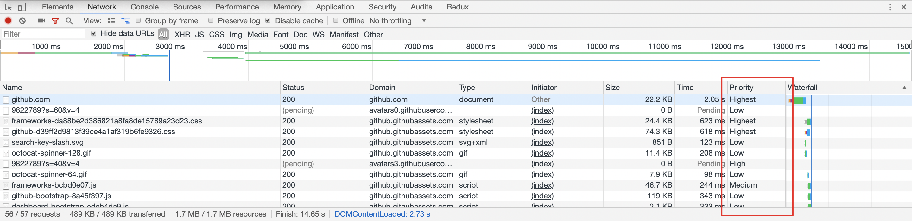

[TOC]


**前端如何优化性能？**(面试的回答主要方面)

- **页面工程优化**
- **代码细节优化**

**页面工程优化** 从页面请求开始，涉及网络协议、资源配置、浏览器性能、缓存等； **代码细节优化** 上相对零散，比如 JavaScript 对 DOM 操作，宿主环境的单线程相关内容等。(减少请求数量、减小资源大小、优化网络连接、优化资源加载、减少重绘回流、使用性能更好的API和构建优化)

# 工程优化方向

## 资源优化（静态资源走 CDN）

### 1. 图片优化
SVG 和 webP 是令人兴奋的新兴图片格式。SVG 适合于插画和简单图像的展示，而 webP 则在所有用到了 JPEG 和 PNG 的场景下成为了更好的选择。

#### PNG  Logo - 小图

优点 ：保真 但是体积过大

#### JPG banner 或者svg banner

`JPG` 最大的特点是**有损压缩**。这种高效的压缩算法使它成为了一种非常轻巧的图片格式。JPG 图片经常作为大的背景图、轮播图或 Banner 图出现。

#### WebP 

>WebP 是是一种支持有损压缩和无损压缩的图片文件格式，派生自图像编码格式 VP8,压缩下来体积会减少28%
>
>- PNG 转 WebP 的压缩率要高于 PNG 原图压缩率，同样支持有损与无损压缩
>- 转换后的 WebP 体积大幅减少，图片质量也得到保障（同时肉眼几乎无法看出差异）
>- 转换后的 WebP 支持 Alpha 透明和 24-bit 颜色数，不存在 PNG8 色彩不够丰富和在浏览器中可能会出现毛边的问题
>- **但是兼容性问题**

**主要处理：浏览器是否允许 WebP**

- 浏览器兼容性的预判
- 后端判断 header Accept

#### [雪碧图](https://css-tricks.com/css-sprites/)

> 雪碧图： 一种将小图标和背景图像合并到一张图片上，然后利用 CSS 的背景定位来显示其中的每一部分的>技术

> Base64 是一种用于传输 8Bit 字节码的编码方式，通过对图片进行 Base64 编码，我们可以直接将编码结果写入 HTML 或者写入 CSS，从而减少 HTTP 请求的次数。

小图片合成 **雪碧图**，低于 5K 的图片可以转换成 **base64** 内嵌;

合适场景下，使用 **iconfont** 或者 **svg**

#### 使用 SVG 应对矢量图场景

SVG（可缩放矢量图形）是一种基于 XML 语法的图像格式；**文本文件、体积小、不失真、兼容性好**

#### 使用 video 替代 GIF

#### 渐进式手机加载

- 基线 JPEG (baseline JPEG) 会从上往下逐步呈现
- 渐进式 JPEG (progressive JPEG) 则会从模糊到逐渐清晰，使人的感受上会更加平滑。

### 2. 开启gzip

　　HTTP协议上的GZIP编码是一种用来改进WEB应用程序性能的技术。通过向HTTP请求头中的Accept-Encoding

`Gzip` 压缩背后的原理，是在一个文本文件中找出一些重复出现的字符串、临时替换它们，从而使整个文件变小。根据这个原理，文件中代码的重复率越高，那么压缩的效率就越高，使用 `Gzip` 的收益也就越大。反之亦然。

在你的 `request headers` 中加上这么一句：

```text
accept-encoding:gzip
```

**webpack 的 Gzip 和服务端的 Gzip**

- 一般来说，`Gzip` 压缩是服务器的活儿：服务器了解到我们这边有一个 `Gzip` 压缩的需求，它会启动自己的 `CPU` 去为我们完成这个任务。而压缩文件这个过程本身是需要耗费时间的，大家可以理解为我们以服务器压缩的时间开销和 `CPU` 开销（以及浏览器解析压缩文件的开销）为代价，省下了一些传输过程中的时间开销。
- 既然存在着这样的交换，那么就要求我们学会权衡。服务器的 `CPU` 性能不是无限的，如果存在大量的压缩需求，服务器也扛不住的。服务器一旦因此慢下来了，用户还是要等。Webpack 中 `Gzip` 压缩操作的存在，事实上就是为了在构建过程中去做一部分服务器的工作，为服务器分压。
- 因此，这两个地方的 `Gzip` 压缩，谁也不能替代谁。它们必须和平共处，好好合作。作为开发者，我们也应该结合业务压力的实际强度情况，去做好这其中的权衡。

##  

> 对于一般的如果处理压缩
>
> [clean-css](https://github.com/jakubpawlowicz/clean-css)
>
> webpack可以使用如下插件进行压缩：
>
> - javascript: UglifyPlugin
>- CSS: MiniCssExtractPlugin
> - HTML: HtmlwebpackPlugin

### 3. 合并文件

把一些 CSS 文件进行合并来减少请求数

## 合理设置缓存策略

>  **缓存的一些应用场景**
>
> 1、每次都加载某个同样的静态文件 => 浪费带宽，重复请求 => 让浏览器使用本地缓存（协商缓存，返回304）
> 2、协商缓存还是要和服务器通信啊 => 有网络请求，不太舒服，感觉很low => 强制浏览器使用本地强缓存（返回200）
> 3、缓存要更新啊，兄弟，网络请求都没了，我咋知道啥时候要更新？=> 让请求（header加上ETag）或者url的修改与文件内容关联（文件名加哈希值）=> 开心，感觉自己很牛逼
> 4、CTO大佬说，我们买了阿里还是腾讯的CDN，几百G呢，用起来啊 => 把静态资源和动态网页分集群部署，静态资源部署到CDN节点上，网页中引用的资源变成对应的部署路径 => html中的资源引用和CDN上的静态资源对应的url地址联系起来了 => 问题来了，更新的时候先上线页面，还是先上线静态资源？（蠢，等到半天三四点啊，用户都睡了，随便你先上哪个）
> 5、老板说：我们的产品将来是国际化的，不存在所谓的半夜三点 => GG，咋办？=> 用非覆盖式发布啊，用文件的摘要信息来对资源文件进行重命名，把摘要信息放到资源文件发布路径中，这样，内容有修改的资源就变成了一个新的文件发布到线上，不会覆盖已有的资源文件。上线过程中，先全量部署静态资源，再灰度部署页面

### **浏览器缓存**

 通过设置请求的过期时间，合理运用浏览器缓存；

### **CDN缓存** 

 Content Delivery Network 的缩写，即“内容分发网络”。静态文件合理使用 CDN 缓存技术；

对于使用 CDN 的资源，DNS 解析会将 CDN 资源的域名解析到 CDN 服务的负载均衡器上，负载均衡器可以通过请求的信息获取用户对应的地理区域，从而通过负载均衡算法，在背后的诸多服务器中，综合选择一台地理位置近、负载低的机器来提供服务。

- HTML 放于自己的服务器上；
- 打包后的图片 / js / css 等资源上传到 CDN 上，文件带上 hash 值；
- 由于浏览器对单个域名请求的限制，可以将资源放在多个不同域的 CDN 上，可以绕开该限制；

### **服务器缓存**

将不变的数据、页面缓存到 内存 或 远程存储(redis等) 上；

### **数据缓存**

通过各种存储将不常变的数据进行缓存，缩短数据的获取时间

> 这里是摘抄自[blog](https://github.com/amandakelake/blog/issues/43)
>
> ### 1、大公司静态资源优化方案
>
> - 配置超长时间的本地缓存 —— 节省带宽，提高性能
> - 采用内容摘要作为缓存更新依据 —— 精确的缓存控制
> - 静态资源CDN部署 —— 优化网络请求
> - 更资源发布路径实现非覆盖式发布 —— 平滑升级
>
> ### 2、利用浏览器缓存机制
>
> - 对于某些不需要缓存的资源，可以使用 Cache-control: no-store ，表示该资源不需要缓存
> - 对于频繁变动的资源（比如经常需要刷新的首页，资讯论坛新闻类），可以使用 Cache-Control: no-cache 并配合 ETag 使用，表示该资源已被缓存，但是每次都会发送请求询问资源是否更新。
> - 对于代码文件来说，通常使用 Cache-Control: max-age=31536000 并配合策略缓存使用，然后对文件进行指纹处理，一旦文件名变动就会立刻下载新的文件。
>
> ### 3、静态资源文件通过Service Worker进行缓存控制和离线化加载

## 加载优化

### [异步script标签](https://javascript.plainenglish.io/async-and-defer-the-complete-guide-to-loading-javascript-properly-ce6edce1e6b5)

- 一般模式

```html
<script src="index.js"></script>
```

> 这种情况下 JS 会阻塞浏览器，浏览器必须等待 `index.js` 加载和执行完毕才能去做其它事情。

- async 模式：

```html
<script async src="index.js"></script>
```

> `async` 模式下，JS 不会阻塞浏览器做任何其它的事情。它的加载是异步的，当它加载结束，JS 脚本会**立即执行**。作用同defer，但是**不能保证脚本按顺序执行。**

- defer 模式（等待DOM）

```html
<script defer src="index.js"></script>
```

> `defer` 模式下，JS 的加载是异步的，执行是**被推迟的**。等整个文档解析完成、`DOMContentLoaded` 事件即将被触发时，被标记了 `defer` 的 JS 文件才会开始依次执行。

- 从应用的角度来说，一般当我们的脚本与 DOM 元素和其它脚本之间的依赖关系不强时，我们会选用 `async`；当脚本依赖于 DOM 元素和其它脚本的执行结果时，我们会选用 `defer`。

### 优先级加载

### 请求的优先级排序 - 页面大小，页面加载顺序

浏览器中的各类请求是有优先级排序的。低优请求会被排在高优之后再发送。



不过可惜的是，浏览器没有将优先级排序的能力给我们直接开放出来。但在一些场景下，我们可以通过更合理的使用媒体类型和媒体查询来实现资源加载的优先级。下面会介绍一下这种方法。

一些网站为了达到不同屏幕之间的兼容，可能会使用媒体查询的方式来构建它的样式系统。一般而言，我们都会把样式代码写在一起，例如导航的在各类屏幕下的样式都会放在 `navigator.css` 下，列表都会放在 `list.css` 下。

```html
<link rel="stylesheet" href="navigator.css" />
<link rel="stylesheet" href="list.css" />
```

这里带来的一个问题就是，在宽度小于 400px 的场景下，其实并不需要应用宽度 400px 以上的 CSS 样式。针对这个问题，`link` 标签上其实有一个 `media` 属性来处理媒体查询下的加载优先级。浏览器会优先下载匹配当前环境的样式资源，相对的，其他非匹配的优先级会下降。

```html
<link rel="stylesheet" href="navigator.css" media="all" />
<link rel="stylesheet" href="list.css" media="all" />
<link rel="stylesheet" href="navigator.small.css" media="(max-width: 500px)" />
<link rel="stylesheet" href="list.small.css" media="(max-width: 500px)" />
```

这样拆分后，当页面大于 500 px 时，`navigator.small.css` 和 `list.small.css` 的优先级会降低，同时，**它们也不再会阻塞页面的渲染**。需要注意的是，优先级降低代表可能会后加载，并非不加载。

### 使用 prefetch / preload 预加载等新特性

#### 1. prefetch  - 用DNS预解析

　　当浏览器访问一个域名的时候，需要解析一次DNS，获得对应域名的ip地址。在解析过程中，按照`浏览器缓存`、`系统缓存`、`路由器缓存`、`ISP(运营商)DNS缓存`、`根域名服务器`、`顶级域名服务器`、`主域名服务器`的顺序，逐步读取缓存，直到拿到IP地址

　　DNS Prefetch，即DNS预解析就是根据浏览器定义的规则，提前解析之后可能会用到的域名，使解析结果缓存到`系统缓存`中，缩短DNS解析时间，来提高网站的访问速度

　　方法是在 head 标签里面写上几个 link 标签

```html
<link rel="dns-prefecth" href="https://www.google.com">
<link rel="dns-prefecth" href="https://www.google-analytics.com">
```

　　对以上几个网站提前解析 DNS，由于它是并行的，不会堵塞页面渲染，这样可以缩短资源加载的时间

#### 2. preload js 提前加载

我们能不能提前把图表加载进来,避免图表渲染中加载时间过长的问题?这种提前加载的方法就是组件的预加载.

原理也很简单,就是在用户的鼠标还处于 hover 状态的时候就开始触发图表资源的加载,通常情况下当用户点击结束之后,加载也基本完成,这个时候图表会很顺利地渲染出来,不会出现延迟.

```js
/**
 * @param {*} factory 懒加载的组件
 * @param {*} next factory组件下面需要预加载的组件
 */
function lazyWithPreload(factory, next) {
  const Component = lazy(factory);
  Component.preload = next;
  return Component;
}
...
// 然后在组件的方法中触发预加载
  const preloadChart = () => {
    Modal.preload()
  }
```

[demo地址](https://github.com/xiaomuzhu/preload-lazy-component)

#### 5. preconnect

```js
<link rel="preconnect" href="https://my.com" crossorigin />
```

#### 4. html 表现预加载 display

```html

```

#### 5. image对象

```js
const image = new Image();
image.src = 'https://xxx.jpg';
```

### 图片懒加载 组件懒加载

> 这里的懒加载，预加载，按需加载原理部分写在另一个文章 链接在此

##### 懒加载 IntersectionObserver；监听页面滚动，判断图片是否进入视野

- 使用IntersectionObserver来实现图片可视区域的懒加载

  传统的做法中，需要使用scroll事件，并调用getBoundingClientRect方法，来实现可视区域的判断，即使使用了函数节流，也会造成页面回流。使用IntersectionObserver，则没有上述问题

-  监听页面滚动，判断图片是否进入视野

  当页面滚动的时候监听 scroll 事件，如果“懒加载元素”在可视区域内，就把图片的 src 属性或者文件 URL 路径设置成 data-lazy 属性值。
  
### 按需加载

  - 常规按需加载（如 JS 原生、jQuery）
  - 不同 App 按需加载（如 JS-SDK 脚本文件）
  - 不同设备按需加载（如 PC 端和 HTML5 端样式文件）
  - 不同分辨率按需加载（CSS Media Query）

Vue 异步加载举例：

```js
import Vue from 'vue';
import App from './App.vue';
import VueRouter from 'vue-router';

Vue.use(VueRouter);
const componentA = resolve => require(['src/a.vue' ], resolve);
const componentB = resolve => require(['src/b.vue' ], resolve);
const router = new VueRouter({
    routes: [{path:"a”,name:"/a”,component:componentA},
     {path:"b”,name:"/b”,component:componentB}]
})
new Vue({
    el: '#app',
    router: router,
    render: h => h(App)
})
```

#### 提取第三方库代码，减少冗余代码

## Webpack

**构建优化**

- 减少编译体积 `ContextReplacementPugin`、`IgnorePlugin`、`babel-plugin-import`、`babel-plugin-transform-runtime`
- 并行编译 `happypack`、`thread-loader`、`uglifyjsWebpackPlugin`开启并行
- 缓存 `cache-loader`、`hard-source-webpack-plugin`、`uglifyjsWebpackPlugin`开启缓存、`babel-loader`开启缓存
- 预编译 `dllWebpackPlugin && DllReferencePlugin`、`auto-dll-webapck-plugin`

**性能优化**

- 减少编译体积 `Tree-shaking`、`Scope Hositing`
- `hash`缓存 `webpack-md5-plugin`
- 拆包 `splitChunksPlugin`、`import()`、`require.ensure`

- 有哪些方式可以减少 `Webpack` 的打包时间
- 有哪些方式可以让 `Webpack` 打出来的包更小

### 减少 Webpack 打包时间

**1. 优化 Loader**

> 对于 `Loader` 来说，影响打包效率首当其冲必属 `Babel` 了。因为 `Babel` 会将代码转为字符串生成 `AST`，然后对 `AST` 继续进行转变最后再生成新的代码，项目越大，转换代码越多，效率就越低。当然了，我们是有办法优化的

> 首先我们可以优化 `Loader` 的文件搜索范围

```js
module.exports = {
  module: {
    rules: [
      {
        // js 文件才使用 babel
        test: /\.js$/,
        loader: 'babel-loader',
        // 只在 src 文件夹下查找
        include: [resolve('src')],
        // 不会去查找的路径
        exclude: /node_modules/
      }
    ]
  }
}
```

> 对于 `Babel` 来说，我们肯定是希望只作用在 `JS`代码上的，然后 `node_modules` 中使用的代码都是编译过的，所以我们也完全没有必要再去处理一遍

- 当然这样做还不够，我们还可以将 `Babel` 编译过的文件缓存起来，下次只需要编译更改过的代码文件即可，这样可以大幅度加快打包时间

```js
loader: 'babel-loader?cacheDirectory=true'
```

**2. HappyPack** (plugin)

> 受限于 `Node` 是单线程运行的，所以 `Webpack` 在打包的过程中也是单线程的，特别是在执行`Loader` 的时候，长时间编译的任务很多，这样就会导致等待的情况。

> `HappyPack` 可以将 `Loader` 的同步执行转换为并行的，这样就能充分利用系统资源来加快打包效率了

```js
module: {
  loaders: [
    {
      test: /\.js$/,
      include: [resolve('src')],
      exclude: /node_modules/,
      // id 后面的内容对应下面
      loader: 'happypack/loader?id=happybabel'
    }
  ]
},
plugins: [
  new HappyPack({
    id: 'happybabel',
    loaders: ['babel-loader?cacheDirectory'],
    // 开启 4 个线程
    threads: 4
  })
]
```

**3. DllPlugin**

> `DllPlugin` 可以将特定的**类库提前打包然后引入**。这种方式可以极大的减少打包类库的次数，只有当类库更新版本才有需要重新打包，并且也实现了将公共代码抽离成单独文件的优化方案。

接下来我们就来学习如何使用 `DllPlugin`

```js
// 单独配置在一个文件中
// webpack.dll.conf.js
const path = require('path')
const webpack = require('webpack')
module.exports = {
  entry: {
    // 想统一打包的类库
    vendor: ['react']
  },
  output: {
    path: path.join(__dirname, 'dist'),
    filename: '[name].dll.js',
    library: '[name]-[hash]'
  },
  plugins: [
    new webpack.DllPlugin({
      // name 必须和 output.library 一致
      name: '[name]-[hash]',
      // 该属性需要与 DllReferencePlugin 中一致
      context: __dirname,
      path: path.join(__dirname, 'dist', '[name]-manifest.json')
    })
  ]
}
```

> 然后我们需要执行这个配置文件生成依赖文件，接下来我们需要使用 `DllReferencePlugin` 将依赖文件引入项目中

```js
// webpack.conf.js
module.exports = {
  // ...省略其他配置
  plugins: [
    new webpack.DllReferencePlugin({
      context: __dirname,
      // manifest 就是之前打包出来的 json 文件
      manifest: require('./dist/vendor-manifest.json'),
    })
  ]
}
```

**4. 代码压缩**

> 在 `Webpack3` 中，我们一般使**用 `UglifyJS` 来压缩代码**，但是这个是单线程运行的，为了加快效率，我们可以使用 **`webpack-parallel-uglify-plugin`** 来并行运行 `UglifyJS`，从而提高效率。

> 在 `Webpack4` 中，我们就不需要以上这些操作了，只需要将 `mode` 设置为 `production` 就可以默认开启以上功能。代码压缩也是我们必做的性能优化方案，当然我们不止可以压缩 `JS` 代码，还可以压缩 `HTML`、`CSS` 代码，并且在压缩 `JS` 代码的过程中，我们还可以通过配置实现比如删除 `console.log` 这类代码的功能。

**5. 一些小的优化点**

> 我们还可以通过一些小的优化点来加快打包速度

- `resolve.extensions`：用来表明文件后缀列表，默认查找顺序是 `['.js', '.json']`，如果你的导入文件没有添加后缀就会按照这个顺序查找文件。我们应该尽可能减少后缀列表长度，然后将出现频率高的后缀排在前面
- `resolve.alias`：可以通过别名的方式来映射一个路径，能让 `Webpack` 更快找到路径
- `module.noParse`：如果你确定一个文件下没有其他依赖，就可以使用该属性让 Webpack 不扫描该文件，这种方式对于大型的类库很有帮助

### 减少 Webpack 打包后的文件体积

**1. 按需加载**

> 想必大家在开发 `SPA` 项目的时候，项目中都会存在十几甚至更多的路由页面。如果我们将这些页面全部打包进一个 `JS`文件的话，虽然将多个请求合并了，但是同样也加载了很多并不需要的代码，耗费了更长的时间。那么为了首页能更快地呈现给用户，我们肯定是希望首页能加载的文件体积越小越好，这时候我们就可以使用按需加载，将每个路由页面单独打包为一个文件。当然不仅仅路由可以按需加载，对于 `loadash` 这种大型类库同样可以使用这个功能。

> 按需加载的代码实现这里就不详细展开了，因为鉴于用的框架不同，实现起来都是不一样的。当然了，虽然他们的用法可能不同，但是底层的机制都是一样的。都是当使用的时候再去下载对应文件，返回一个 `Promise`，当 `Promise`成功以后去执行回调。

**2. Scope Hoisting**

> `Scope Hoisting` 会分析出模块之间的依赖关系，尽可能的把打包出来的模块合并到一个函数中去。

比如我们希望打包两个文件

```js
// test.js
export const a = 1

// index.js
import { a } from './test.js'
```

> 对于这种情况，我们打包出来的代码会类似这样

```js
[
  /* 0 */
  function (module, exports, require) {
    //...
  },
  /* 1 */
  function (module, exports, require) {
    //...
  }
]
```

> 但是如果我们使用 `Scope Hoisting` 的话，代码就会尽可能的合并到一个函数中去，也就变成了这样的类似代码

```js
[
  /* 0 */
  function (module, exports, require) {
    //...
  }
]
```

> 这样的打包方式生成的代码明显比之前的少多了。如果在 `Webpack4` 中你希望开启这个功能，只需要启用 `optimization.concatenateModules`就可以了。

```js
module.exports = {
  optimization: {
    concatenateModules: true
  }
}
```

**3. Tree Shaking**

> `Tree Shaking` 可以实现删除项目中未被引用的代码，比如

```js
// test.js
export const a = 1
export const b = 2
// index.js
import { a } from './test.js'
```

- 对于以上情况，`test` 文件中的变量 `b` 如果没有在项目中使用到的话，就不会被打包到文件中。
- 如果你使用 `Webpack 4` 的话，开启生产环境就会自动启动这个优化功能。

## 操作 DOM 方向

- **减少访问 dom 的次数**，如需多次，将 dom 缓存于变量中；

- 减少重绘与回流

  - 多次操作合并为一次；
  - 减少对计算属性的访问；
    - 例如 offsetTop， getComputedStyle 等
    - 因为浏览器需要获取最新准确的值，因此必须立即进行重排，这样会破坏了浏览器的队列整合，尽量将值进行缓存使用；
  - 大量操作时，可将 dom 脱离文档流或者隐藏，待操作完成后再重新恢复；
  - 使用`DocumentFragment / cloneNode / replaceChild`进行操作；

- 使用事件委托，避免大量的事件绑定；

## 浏览器加载、渲染性能方向

###  首屏渲染优化

- **css / js 分割**，使首屏依赖的文件体积最小，内联首屏关键 css / js；

- 非关键性的文件尽可能的 **异步加载和懒加载**，避免阻塞首页渲染；

- 使用`dns-prefetch / preconnect / prefetch / preload`等浏览器提供的资源提示，加快文件传输；

- 谨慎控制好 

  Web字体

  ，一个大字体包足够让你功亏一篑；

  - 控制字体包的加载时机；
  - 如果使用的字体有限，那尽可能只将使用的文字单独打包，能有效减少体积；

- 合理利用 Localstorage / server-worker 等存储方式进行 **数据与资源缓存**；

### 减少重定向

　　尽量避免使用重定向，当页面发生了重定向，就会延迟整个HTML文档的传输。在HTML文档到达之前，页面中不会呈现任何东西，也没有任何组件会被下载，降低了用户体验

　　如果一定要使用重定向，如http重定向到https，要使用301永久重定向，而不是302临时重定向。因为，如果使用302，则每一次访问http，都会被重定向到https的页面。而永久重定向，在第一次从http重定向到https之后 ，每次访问http，会直接返回https的页面

### 持久连接 keep-alive

　　使用keep-alive或presistent来建立持久连接，持久连接降低了时延和连接建立的开销，将连接保持在已调谐状态，而且减少了打开连接的潜在数量

## 性能测量、监控方向

## 服务端渲染(SSR)
- 减少首屏需要的数据量，剔除冗余数据和请求；
- 控制好缓存，对数据/页面进行合理的缓存；
- 页面的请求使用流的形式进行传递；

这里另外开了文章详细的笔记

# **代码细节优化**

### **数据读取**

- 通过作用域链 / 原型链 读取变量或方法时，需要更多的耗时，且越长越慢；
- 对象嵌套越深，读取值也越慢；
- 最佳实践:
  - 尽量在局部作用域中进行 **变量缓存**；
  - 避免嵌套过深的数据结构，**数据扁平化** 有利于数据的读取和维护；

### **循环**

循环通常是编码性能的关键点；

- 代码的性能问题会再循环中被指数倍放大；
- 最佳实践:
  - 尽可能 减少循环次数；
    - 减少遍历的数据量；
    - 完成目的后马上结束循环；
  - 避免在循环中执行大量的运算，避免重复计算，相同的执行结果应该使用缓存；
  - js 中使用 **倒序循环** 会略微提升性能；
  - 尽量避免使用 for-in 循环，因为它会枚举原型对象，耗时大于普通循环；

### **条件流程性能**: Map / Object > switch > if-else

### **减少 cookie 体积**: 能有效减少每次请求的体积和响应时间；

- 去除不必要的 cookie；
- 压缩 cookie 大小；
- 设置 domain 与 过期时间；

### **css 优化**

- **层级扁平**，避免过于多层级的选择器嵌套；

- **特定的选择器** 好过一层一层查找:  .xxx-child-text{} 优于 .xxx .child .text{}

- **减少使用通配符与属性选择器**；

- **减少不必要的多余属性**；

- 使用 **动画属性** 实现动画，动画时脱离文档流，开启硬件加速，优先使用 css 动画；

- 使用 `<link>` 替代原生 @import；　CSS的@import会造成额外的请求

- ### 避免使用昂贵的属性

  有一些 CSS 的属性在渲染上是有比较高的成本的，渲染速度相较而言也会慢些。在不同的浏览器上，具体的表现不太一致，但总体来说，下面一些属性是比较昂贵的：

  - border-radius
  - box-shadow
  - opacity
  - transform
  - filter
  - position: fixed

### **html 优化**:

- **减少 dom 数量**，避免不必要的节点或嵌套；
- 避免``空标签
- 图片提前 **指定宽高** 或者 **脱离文档流**，能有效减少因图片加载导致的页面回流；
- **语义化标签** 有利于 SEO 与浏览器的解析时间；
- 减少使用 table 进行布局，避免使用`<br />`与`<hr />`；

### js优化

- 事件委托

  是利用事件的冒泡原理来实现的

  适合用事件委托的事件：click，mousedown，mouseup，keydown，keyup，keypress。(缺点:误判,层级多,不冒泡)
  
- 减少闭包

# 运行时的优化

### 长列表优化


实现 Virtual List （使用 `position: absolute` 配合 `transform: translate3d()`）

其大致的实现思路如下：

1. 监听页面滚动（或者其他导致视口变化的事件）；
2. 滚动时根据滚动的距离计算需要展示的列表项；
3. 将列表项中展示的数据与组件替换成当前需要展示的内容；
4. 修改偏移量到对应的位置。

### 避免 JavaScript 运行时间过长

- 任务分解
- 延迟执行  setTimeout
- 并行计算  webworker

### 滚动事件

防抖节流

## Reference

[前端优化](https://fe.mbear.top/xing-neng-you-hua/031-xing-neng-jian-kong-he-cuo-wu-shou-ji-yu-shang-bao-shang)

还有些零散整理的