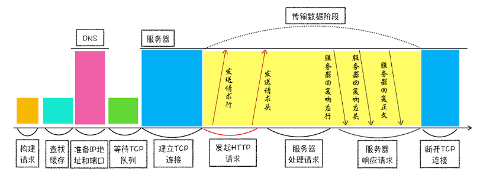
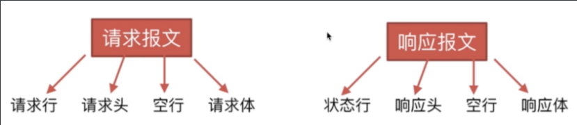
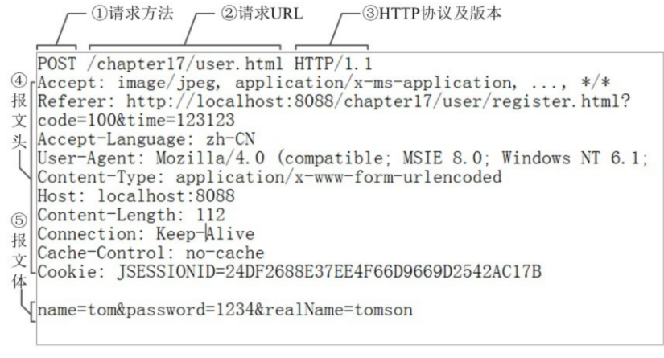
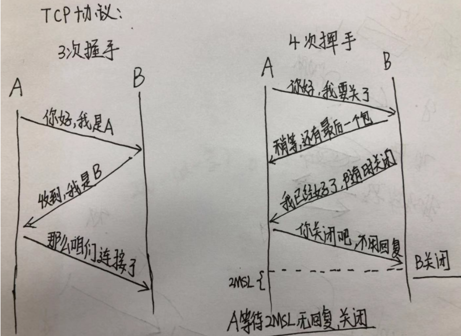
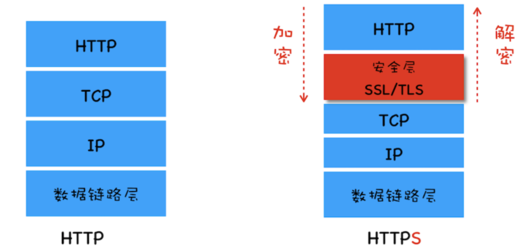

## HTTP请求

**HTTP请求示意图**

> 浏览器中的HTTP请求从发起到结束一共经历了如下八个阶段：构建请求、查找缓存、准备IP和端口、等待TCP队列、建立TCP连接、发起HTTP请求、服务器处理请求、服务器返回请求和断开连接

- 用户输入url并回车
- 浏览器进程检查url，组装协议，构成完整的url
- 浏览器进程通过进程间通信（IPC）把url请求发送给网络进程
- 网络进程接收到url请求后检查本地缓存是否缓存了该请求资源，如果有则将该资源返回给浏览器进程
- 如果没有，网络进程向web服务器发起http请求（网络请求），请求流程如下：
  - 进行DNS解析，获取服务器`ip`地址，端口
  - 利用`ip`地址和服务器建立`tcp`连接
  - 构建请求头信息
  - 发送请求头信息服务器响应后，网络进程接收响应头和响应信息，并解析响应内容
- 网络进程解析响应流程:
  - 检查状态码，如果是301/302，则需要重定向，从Location自动中读取地址，重新进行第4步，如果是200，则继续处理请求
  - 200响应处理：检查响应类型Content-Type，如果是字节流类型，则将该请求提交给下载管理器，该导航流程结束，不再进行后续的渲染，如果是html则通知浏览器进程准备渲染进程准备进行染
- 准备渲染进程
  - 浏览器进程检查当前url是否和之前打开的渲染进程根域名是否相同，如果相同，则复用原来的进程，如果不同，则开启新的渲染进程
- 传输数据、更新状态
  - 渲染进程准备好后，浏览器向渲染进程发起“提交文档”的消息，渲染进程接收到消息和网络进程建立传输数据的“管道”
  - 渲染进程接收完数据后，向浏览器发送“确认提交”
  - 浏览器进程接收到确认消息后更新浏览器界面状态：安全、地址栏url、前进后退的历史状态、更新web页面

### HTTP协议的主要特点

- 简单快速
- 灵活
- **无连接**
- **无状态**

> 通常我们要答出以上四个内容。如果实在记不住，一定要记得后面的两个：**无连接、无状态**。

我们分别来解释一下。

#### 2.1 简单快速

> **简单**：每个资源（比如图片、页面）都通过 url 来定位。这都是固定的，在`http`协议中，处理起来也比较简单，想访问什么资源，直接输入url即可。

#### 2.2 灵活

> `http`协议的头部有一个`数据类型`，通过`http`协议，就可以完成不同数据类型的传输。

#### 2.3 无连接

> 连接一次，就会断开，不会继续保持连接。

#### 2.4 无状态

> 客户端和服务器端是两种身份。第一次请求结束后，就断开了，第二次请求时，**服务器端并没有记住之前的状态**，也就是说，服务器端无法区分客户端是否为同一个人、同一个身份。

> 有的时候，我们访问网站时，网站能记住我们的账号，这个是通过其他的手段（比如 `session`）做到的，并不是`http`协议能做到的。

### HTTP报文的组成部分

> 在回答此问题时，我们要按照顺序回答：

- 先回答的是，`http`报文包括：**请求报文**和**响应报文**。
- 再回答的是，每个报文包含什么部分。
- 最后回答，每个部分的内容是什么

#### 3.1 请求报文包括：

- 请求行：包括请求方法、请求的`url`、`http`协议及版本。
- 请求头：一大堆的键值对。 
- **空行**指的是：当服务器在解析请求头的时候，如果遇到了空行，则表明，后面的内容是请求体
- 请求体：数据部分。

#### 3.2 响应报文包括：

- 状态行：`http`协议及版本、状态码及状态描述。
- 响应头
- 空行
- 响应体

### 4 HTTP方法

包括：

- `GET`：获取资源
- `POST`：传输资源
- `put`：更新资源
- `DELETE`：删除资源
- `HEAD`：获得报文首部

> `HTTP`方法有很多，但是上面这五个方法，要求在面试时全部说出来，不要漏掉。

- `get` `和`post` 比较常见。
- `put` 和 `delete` 在实际应用中用的很少。况且，业务中，一般不删除服务器端的资源。
- `head` 可能偶尔用的到。

### 5 get 和 post的区别

- 区别有很多，如果记不住，面试时，至少要任意答出其中的三四条。
- 有一点要强调，**get是相对不隐私的，而post是相对隐私的**。

> 我们大概要记住以下几点：

1. 浏览器在回退时，`get` **不会重新请求**，但是`post`会重新请求。【重要】
2. `get`请求会被浏览器**主动缓存**，而`post`不会。【重要】
3. `get`请求的参数，会报**保留**在浏览器的**历史记录**里，而`post`不会。做业务时要注意。为了防止`CSRF`攻击，很多公司把`get`统一改成了`post`。
4. `get`请求在`url`中`传递的参数有大小限制，基本是`2kb`，不同的浏览器略有不同。而post没有注意。
5. `get`的参数是直接暴露在`url`上的，相对不安全。而`post`是放在请求体中的。

### 6 http状态码

> `http`状态码分类：

### 7 持久链接/http长连接

> 如果你能答出持久链接，这是面试官很想知道的一个点。

- **轮询**：`http1.0`中，客户端每隔很短的时间，都会对服务器发出请求，查看是否有新的消息，只要轮询速度足够快，例如`1`秒，就能给人造成交互是实时进行的印象。这种做法是无奈之举，实际上对服务器、客户端双方都造成了大量的性能浪费。
- **长连接**：`HTTP1.1`中，通过使用`Connection:keep-alive`进行长连接，。客户端只请求一次，但是服务器会将继续保持连接，当再次请求时，避免了重新建立连接。

> 注意，`HTTP 1.1`默认进行持久连接。在一次 `TCP` 连接中可以完成多个 `HTTP` 请求，但是对**每个请求仍然要单独发 header**，`Keep-Alive`不会永久保持连接，它有一个保持时间，可以在不同的服务器软件（如`Apache`）中设定这个时间。

### 8. HTTP2.0和HTTP1.X相比的新特性

- `新的二进制格式（Binary Format）`，`HTTP1.x`的解析是基于文本，基于文本协议的格式解析存在天然缺陷，文本的表现形式有多样性，要做到健壮性考虑的场景必然很多，二进制则不同，只认`0`和`1`的组合，基于这种考虑`HTTP2.0`的协议解析决定采用二进制格式，实现方便且健壮
- `header压缩`，`HTTP1.x`的`header`带有大量信息，而且每次都要重复发送，`HTTP2.0`使用`encoder`来减少需要传输的`header`大小，通讯双方各自`cache`一份`header fields`表，既避免了重复`header`的传输，又减小了需要传输的大小
- `服务端推送（server push）`，例如我的网页有一个`sytle.css`的请求，在客户端收到`sytle.css`数据的同时，服务端会将sytle.js的文件推送给客户端，当客户端再次尝试获取`sytle.js`时就可以直接从缓存中获取到，不用再发请求了

- 多路复用（MultiPlexing）
  - `HTTP/1.0` 每次请求响应，建立一个`TCP`连接，用完关闭
  - `HTTP/1.1` 「长连接」 若干个请求排队串行化单线程处理，后面的请求等待前面请求的返回才能获得执行机会，一旦有某请求超时等，后续请求只能被阻塞，毫无办法，也就是人们常说的线头阻塞；
  - `HTTP/2.0` 「多路复用」多个请求可同时在一个连接上并行执行，某个请求任务耗时严重，不会影响到其它连接的正常执行；

### 9.TCP三次握手

- `seq`序号，用来标识从`TCP`源端向目的端发送的字节流，发起方发送数据时对此进行标记
- `ack`确认序号，只有`ACK`标志位为`1`时，确认序号字段才有效，`ack=seq+1`
- 标志位
  - `ACK`：确认序号有效
  - `RST`：重置连接
  - `SYN`：发起一个新连接
  - `FIN`：释放一个连接

**三次握手为什么不用两次，或者四次?**

> TCP作为一种可靠传输控制协议，其核心思想：既要保证数据可靠传输，又要提高传输的效率！

### 10.数据传输

- HTTP报文
  - 请求报文
  - 响应报文
- 响应状态码
  - `200 OK`
  - `202 Accepted` ：服务器已接受请求，但尚未处理（异步）
  - `204 No Content`：服务器成功处理了请求，但不需要返回任何实体内容
  - `206 Partial Content`：服务器已经成功处理了部分 `GET` 请求（断点续传 `Range/If-Range/Content-Range/Content-Type:”multipart/byteranges”/Content-Length….`）
  - `301 Moved Permanently`
  - `302 Move Temporarily`
  - `304 Not Modified`
  - `305 Use Proxy`
  - `400 Bad Request` : 请求参数有误
  - `401 Unauthorized`：权限（`Authorization`）
  - `404 Not Found`
  - `405 Method Not Allowed`
  - `408 Request Timeout`
  - `500 Internal Server Error`
  - `503 Service Unavailable`
  - `505 HTTP Version Not Supported`

### 11.TCP四次挥手

**为什么连接的时候是三次握手，关闭的时候却是四次握手？**

- 服务器端收到客户端的`SYN`连接请求报文后，可以直接发送`SYN+ACK`报文
- 但关闭连接时，当服务器端收到FIN报文时，很可能并不会立即关闭链接，所以只能先回复一个ACK报文，告诉客户端：”你发的FIN报文我收到了”，只有等到服务器端所有的报文都发送完了，我才能发送FIN报文，因此不能一起发送，故需要四步握手。

TCP有6种标示:SYN(建立联机) ACK(确认) PSH(传送) FIN(结束) RST(重置) URG(紧急)

## HTTPS请求

### 介绍 HTTPS 握手过程

- 客户端使用`https`的`url`访问`web`服务器,要求与服务器建立`ssl`连接
- `web`服务器收到客户端请求后, 会将网站的证书(包含公钥)传送一份给客户端
- 客户端收到网站证书后会检查证书的颁发机构以及过期时间, 如果没有问题就随机产生一个秘钥
- 客户端利用公钥将会话秘钥加密, 并传送给服务端, 服务端利用自己的私钥解密出会话秘钥
- 之后服务器与客户端使用秘钥加密传输

**HTTPS 握手过程中，客户端如何验证证书的合法性**

- 首先浏览器读取证书中的证书所有者、有效期等信息进行一一校验。
- 浏览器开始查找操作系统中已内置的受信任的证书发布机构 CA，与服务器发来的证书中的颁发者 CA 比对，用于校验证书是否为合法机构颁发。
- 如果找不到，浏览器就会报错，说明服务器发来的证书是不可信任的。如果找到，那么浏览器就会从操作系统中取出颁发者 CA 的公钥，然后对服务器发来的证书里面的签名进行解密。
- 浏览器使用相同的 Hash 算法根据证书内容计算出信息摘要，将这个计算的值与证书解密的值做对比。
- 对比结果一致，则证明服务器发来的证书合法，没有被冒充。此时浏览器就可以读取证书中的公钥，用于后续加密了。

**HTTPS 原理一览图**

### HTTPS加的一层SSL在七层中哪个位置

> 从 HTTP 协议栈层面来看，我们可以在 TCP 和 HTTP 之间插入一个安全层，所有经过安全层的数据都会被加密或者解密，你可以参考下图

### https 协议的优点

- 使用 HTTPS 协议可认证用户和服务器，确保数据发送到正确的客户机和服务器
- HTTPS 协议是由 SSL+HTTP 协议构建的可进行加密传输、身份认证的网络协议，要比 http 协议安全，可防止数据在传输过程中不被窃取、改变，确保数据的完整性
- HTTPS 是现行架构下最安全的解决方案，虽然不是绝对安全，但它大幅增加了中间人攻 击的成本

### 6.3 https 协议的缺点

- `https`握手阶段比较费时，会使页面加载时间延长 `50%`，增加 `10%~20%` 的耗电
- `https` 缓存不如 `http` 高效，会增加数据开销
- `SSL` 证书也需要钱，功能越强大的证书费用越高
- `SSL` 证书需要绑定 `IP`，不能再同一个 ip 上绑定多个域名，`ipv4` 资源支持不了这种消耗

### 6.4 http与https区别

> 在回答这个问题之前，我们先看下http请求存在哪些不足：

- 通信使用明文（不加密），内容可能会被窃听
- 不会验证通信方的身份，因此可能会遭遇伪装
- 无法保证报文的完整性，请求或响应的内容被篡改也无法知道

> https就是对上面三点不足的解决，可以认为

**https == http + 加密 + 身份验证 + 数据完整性保护**

**他们的区别就明显了**

- http使用明文传输，https则是具有安全性的ssl加密传输协议
- http不会验证通信放的身份，https会通过数字证书来验证身份
- https可以保证数据的完整性，防止传输内容被中间人冒充或篡改
- HTTP 页面响应速度比 HTTPS 快，主要是因为 HTTP 使用 TCP 三次握手建立连接，客户端和服务器需要交换 3 个包，而 HTTPS除了 TCP 的三个包，还要加上 ssl 握手需要的 9 个包，所共12 个包。
- 除以上外，http和https使用的端口也不同，前者使用80端口，后者使用443端口

### 介绍下https中间人攻击的过程

这个问题也可以问成 为什么需要CA认证机构颁发证书？ 我们假设如果不存在认证机构，则人人都可以制造证书，这就带来了"中间人攻击"问题。

**中间人攻击的过程如下**

- 客户端请求被劫持，将所有的请求发送到中间人的服务器
- 中间人服务器返回自己的证书
- 客户端创建随机数，使用中间人证书中的公钥进行加密发送给中间人服务器，中间人使用私钥对随机数解密并构造对称加密，对之后传输的内容进行加密传输
- 中间人通过客户端的随机数对客户端的数据进行解密
- 中间人与服务端建立合法的https连接（https握手过程），与服务端之间使用对称加密进行数据传输，拿到服务端的响应数据，并通过与服务端建立的对称加密的秘钥进行解密
- 中间人再通过与客户端建立的对称加密对响应数据进行加密后传输给客户端
- 客户端通过与中间人建立的对称加密的秘钥对数据进行解密

> 简单来说，中间人攻击中，中间人首先伪装成服务端和客户端通信，然后又伪装成客户端和服务端进行通信（如图）。 整个过程中，由于缺少了证书的验证过程，虽然使用了https，但是传输的数据已经被监听，客户端却无法得知

**防范方法：**

> 服务端在发送浏览器的公钥中加入`CA证书`，浏览器可以验证`CA证书`的有效性