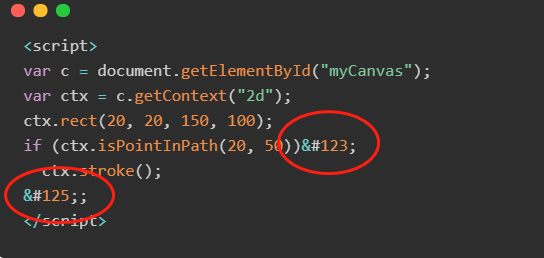

## 问题1：Git Page部署问题

The value {} was passed to a date-related filter that expects valid dates in /_layouts/default.html or one of its layouts. For more information, see https://docs.github.com/github/working-with-github-pages/troubleshooting-jekyll-build-errors-for-github-pages-sites#date-is-not-a-valid-datetime.

**Solution：**

没有用jekyll时，在github.io仓库根目录建立名为.nojekyll的空文件，以跳过jekyll检查。

## 问题2：Git Page部署问题-404

404 not found：找不到index.html

**Solution：**
问题就出在hexo的deploy了。

hexo gitpage 部署命令注意格式

_config.yml中

deploy:  
type: git  
repo: https://github.com/<username>/<project>  # example, https://github.com/hexojs/hexojs.github.io  
branch: master

## 问题3：编译错误

今天使用hexo发布文章，输入指令hexo g的时候出现了如题的错误：
can not read a block mapping entry; a multiline key may not be an implicit key at line 2, column 5:

**Solution：**
实际上是文章开头的配置，注意冒号之后的空格
title: Hexo Building Issue
date: 2020-11-07 21:28:54
tags: Hexo

## 问题4：编译错误

当提交hexo文件代码到git，重新clone的时候，编译的时候会出现错误：
"Cannot find module './build/Release/DTraceProviderBindings'"
ERROR Local hexo not found in ~/Documents/（文件地址）
ERROR Try running: 'npm install hexo --save'

**Solution：**
npm install hexo --no-optional
或者
$ npm uninstall hexo-cli -g
$ npm install hexo-cli -g
（实际上是没有办法上传node modules）

## 问题5：右侧目录

hexo yilia主题配置中的确实模块- 右侧的文章列表
按照官方指引，但是没有实现列表

**Solution：**
1.有没有安装在blog的根目录
2.在config中的配置，复制粘贴时，注意缩进距离（此处文件，格式很重要）

## 问题6：[TOC]

[TOC] 不能成功出目录（typora文件显示成功，但是hexo运行时，没有显示目录）

**Solution：**

看清楚config中的toc 等级设置，由于不同主题，设置会不一样！


## 问题7：代码高亮

代码高亮显示不好看，所以主题中使用到了 [hexo-prism-plugin](https://github.com/ele828/hexo-prism-plugin) 的 Hexo 插件来做代码高亮，安装命令如下：

```haskell
npm i -S hexo-prism-plugin
```

然后，修改 Hexo 根目录下 `_config.yml` 文件中 `highlight.enable` 的值为 `false`，并新增 `prism` 插件相关的配置，主要配置如下：

```yaml
highlight:
  enable: false

prism_plugin:
  mode: "preprocess" # realtime/preprocess
  theme: "tomorrow"
  line_number: false # default false
  custom_css:
```


## 问题7：大括号的编译问题

左右花括号（left/right curly brace）都不显示，在typora软件中代码块中显示无碍，但是hexo post中无法正常显示

| 名称     | 字符 | ASCII | 16进制 | URL编码 | HTML编码 |
| -------- | ---- | ----- | ------ | ------- | :------: |
| 左花括号 | {    | 123   | \x7b   | %7b     |  &#123   |
| 管道符   | \|   | 124   | \x7c   | %7c     |  &#124   |
| 右花括号 | }    | 125   | \x7d   | %7d     |  &#125   |



解决办法：

没找到