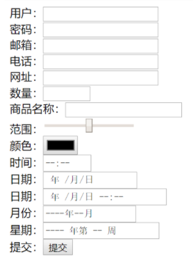
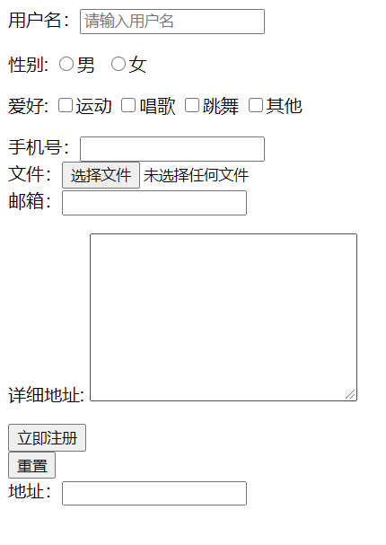
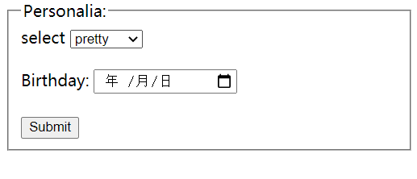
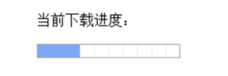
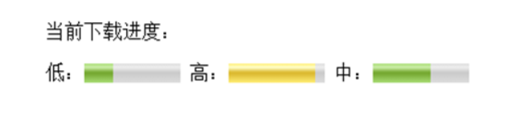
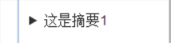
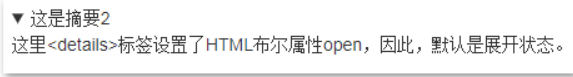
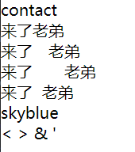

## Input

### 基本属性：

Input type：text / password / checkbox / radio / submit

 ```html
<body>
<form action="">
    用户：<input type="text" id="userName"><br>
    密码：<input type="password" id="userPaw"><br>
    <!--输入合法的邮箱，@-->
    邮箱：<input type="email"><br>
    电话：<input type="tel" min="0" max="10"><br>
    <!--输入合法网址-->
    网址：<input type="url"><br>
    <!--无法输入字母-->
    <Label for="number" id="number-label">ID：</label>
            <input type="number" id="number" placeholder="请填写id号码" required min="1" max="4567890"><br>
    <!--max最大值
    min最小值
    value默认值-->
    数量：<input type="number" max="100" min="0"><br>
    商品名称：<input type="search"><br>
    范围：<input type="range" max="1000" min="1"><br>
    颜色：<input type="color"><br>
    时间：<input type="time"><br>
    日期：<input type="date"><br>
    日期：<input type="datetime-local"><br>
    月份：<input type="month"><br>
    星期：<input type="week"><br>
    提交：<input type="submit" ><br>
</form>
 
</body>
 ```



### 其他属性

```html
<body>
<form action="" id="myForm">
    <!--placeholder:提示文本-->
    <!--autofocus:自动获取焦点-->
    <!--autocomplete：自动完成，on:打开，off:关闭-->
    用户名：<input type="text" name="userName" placeholder="请输入用户名"  autofocus autocomplete="on"><br>
    <!--required：必须输入-->
    <!--pattern：正则表达式
    *：任意个
    ？：表示0个或者1个
    +：表示一个或多个-->
    <p>性别: <input type="radio" name="sex">男&nbsp;&nbsp;<input type="radio" name="sex">女</p>
<fieldset>
    <legend>请选一个</legend>
    <input type="radio" name="action" id="track" value="track" /><label for="track">Track Submission</label><br />
    <input type="radio" name="action" id="event" value="event"  /><label for="event">Events and Artist booking</label><br />
    <input type="radio" name="action" id="message" value="message" /><label for="message">Message us</label><br />
</fieldset>
    手机号：<input type="tel" required pattern="^(\+86)?1\d{10}$" name="phone"><br>
    <!--multiple:选择多个文件-->
    文件：<input type="file" name="photo" multiple><br>
    <!--email有默认的验证，在email中，multiple允许输入多个邮箱地址，以逗号分隔-->
    邮箱：<input type="email" name="email" multiple><br>
     <p>详细地址: <textarea cols="30" rows="10"></textarea></p>
    <input type="submit" value="立即注册"> <br>
     <input type="reset">
</form>
<!--不会进行提交-->
<!--from:指定表单 ID，那么将来指定ID号的表单进行数据提交的时候，也会将当前表单一起提交-->
地址：<input type="text" name="address" form="myForm">
<!--F12-控制台，点击network,显示出请求-->
</body>
```



## Select

- 表单中 action提交服务器的地址 method 提交方式

- select中optgroup组中option 选项 

- Fieldset加表框 里面的legend表边框左上名字（边上）表内label 显示文字

  ```html
  <form action="/action_page.php">
   <fieldset>
    <legend>Personalia:</legend>
    <label>select</label>
      <select name="" id="">
      <optgroup>
          <!--value:具体的值  label:提示信息，辅助值-->
      <option value="1" label="pretty">1</option>
      <option value="2" label="pretty">2</option>
      <option value="3" label="pretty">3</option>
      </optgroup>
      </select><br><br>
    <label for="birthday">Birthday:</label>
    <input type="date" id="birthday" name="birthday"><br><br>
    <input type="submit" value="Submit">
   </fieldset>
  </form>
  ```


  

## enctype和formenctype

enctype属性规定在发送到服务器之前应该如何对表单数据进行编码。

- application/x-www-form-urlencoded：表单数据被编码为名称/值对。这是默认的编码方式（空格转换为 "+" 加号，特殊符号转换为 ASCII HEX 值）。
- multipart/form-data：不对字符编码。在使用包含文件上传控件的表单时，必须使用该值。
- text/plain：空格转换为 "+" 加号，但不对特殊字符编码。

同上，enctype也可以针对每个提交按钮进行指定，使用formenctype即可。

## action && method

1. 一个表单只能填写一个action及一个method

## progress

progress元素的属性：

- max属性：规定当前进度的最大值。

- value属性设定进度条当前默认显示值

- form属性：规定进度条所属的一个或多个表单

  ```html
  <p>当前下载进度：</p>
     <form action=""method="" id="form">
       <progress max="100"  value="30"  title="haha">
     </form>
  ```

  

## meter(**度量**条!!)

- value属性设定进度条当前默认显示值

- max属性：规定范围的最大值，默认值为1.

- min属性：规定范围的最小值，默认值为0.

- low属性：规定被视作低的标准。

- high属性：规定被视作高标准。

- form属性：规定所属的一个或多个表单。

- optimum属性：定义度量条的最佳标准值。**low值< 标准值 <high值**

  ```html
  
  <form action=""method="" id="form">
       <!--<progress max="100"value="30" title="haha">-->
        低：<meter max="100"min="0" value="30" high="80"low="30"></meter>
        高：<meter max="100"min="0" value="90" high="80"low="30"></meter>
        中：<meter max="100"min="0" value="60" high="80"low="30"></meter>
     </form>
  ```

  

## Other Attri:

### maxlength:输入的最大字数

  用户名：<input type="text" name="user"value="请输入用户名"maxlength="6">

### disabled属性：

设置为不可用（不可操作）不会提交到服务器

### tabindex属性：

指定按Tab键时，项目间的移动顺序

### keygen属性：

密钥生成器

- 当提交表单时，私钥存储在本地，公钥发送到服务器。主要作用是提供一种用户验证身份的方法
- name/form/autofocus/disabled
- challenge属性:将 keygen 的值设置为在提交时询问。
- keytype属性：定义密钥类型，如设置为rsa（一种密码的算法），则生成 RSA 密钥。

```html
  <form action=""method="get">
    账号：<input type="text"name="user">
     加密：<keygen name="mykey">
     <p><inputtype="submit"></p>
   </form>
```

## details,summary

```html
<details>
    <summary>这是摘要1</summary>
    <p>这里具体描述，标签相对随意，例如这里使用的&lt;p&gt;标签。</p>
</details>
```



```html
<details open>
    <!--如果<summary>缺省，则会自动补上，文案是“详细信息”。-->
    <summary>这是摘要2</summary>
    <content>这里&lt;details&gt;标签设置了HTML布尔属性open，因此，默认是展开状态。</content>
</details>
```



## 特殊转符 -decode 

```vue
<view>
  <!-- 长按文本是否可选 -->
  <text selectable='true'>来了老弟</text>
</view>

<view>
  <!-- 显示连续空格的方式 -->
  <view>
    <text space='ensp'>来了  老弟</text>
  </view>
  <view>
    <text space='emsp'>来了  老弟</text>
  </view>
  <view>
    <text space='nbsp'>来了  老弟</text>
  </view>
</view>

<view>
  <text>skyblue</text>
</view>

<view>
  <!-- 是否解码 -->
  <text decode='true'>&nbsp; &lt; &gt; &amp; &apos; &ensp; &emsp;</text>
</view>
```

