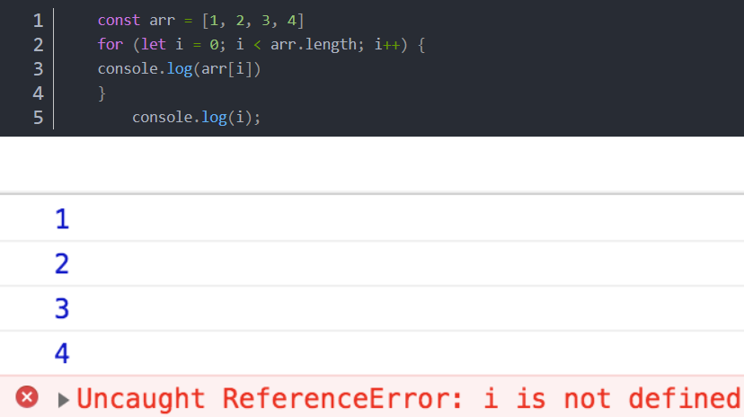
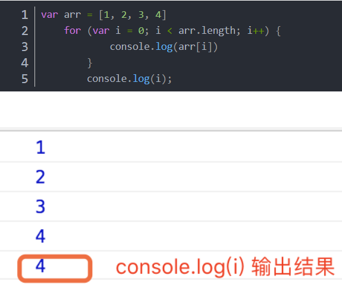
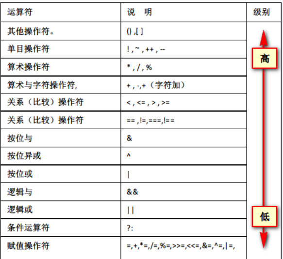

## 定义变量

### let/const 一起和 var 的区别

| var                                       | let/const                                                    |
| ----------------------------------------- | ------------------------------------------------------------ |
| 会进行预解析                              | 不会进行预解析, 必须先定义后使用                             |
| 声明重复变量名                            | 不能声明重复的变量名, 不能重新赋值（不同作用域可以重新定义，但不可以重新赋值） |
| 没有块级作用域,声明全局变量（函数内除外） | 有块级作用域                                                 |




**以上报错i未定义，说明let定义变量i，只在所在的块作用域内起作用**



**var 定义变量没有块级作用域，i在块级作用域照样可以输出结果**

var在函数内命名的变量是只在整个函数作用域内起作用，出了这个函数作用域就不能用了

### let vs const

| let          | const          |
| ------------ | -------------- |
| 变量         | 常量           |
| 可以先不赋值 | 必须声明时赋值 |
| 变量可以改   | 不能改         |

```js
var a=[];
for(var i=0;1<10;i++){
	a[i]=function(){
		console.log(i);
	}
}
console.log(a[6]());//10


var a=[];
for(let=0;1<10;i++){
	a[i]=function(){
		console.log(i);
	}
}
console.log(a[6]());//6
```


## 对象属性访问

```js
var o = {x:1,y:{z:3}}; //对象字面量
var a = [o,4,[5,6]]; // 包含对象的数组字面量
o.x;//表达式o的x属性
o.y.z;//表达式o.y的z属性
o['x'];//对象o的x属性
a[1];//表达式a中索引为1的元素
```

## 运算符

  https://developer.mozilla.org/en-US/docs/Web/JavaScript/Reference/Operators/Left_shift

https://www.w3schools.com/js/js_operators.asp

https://wangdoc.com/javascript/operators/index.html

###  increment（i++ & ++i）

### Postfix increment

```js
let x = 3;
y = x++;
// y = 3; x = 4
```

### Prefix increment

```js
let a = 2;
b = ++a;
// a = 3; b = 3
```

```js
var data = [0,1,2],i=0;
data[++i]+=10;
console.log(data);//[0,11,12]
```

难点：

```js
 var data = [7,8,9]; var i = 0; data[i++] *= 2;
```

数组data和i的值

```js
 var data = [7,8,9];var i = 0; data[i++] = data[i++] * 2; 
```

数组data和i的值又是多少

第一个表达式结果

```js
 data[0]=14  data[1]=8  data[2]=9  i=1
```

第二个结果

```js
 data[0]=16 data[1]=8 data[2]=9   i=2
```


## 结合性 - 数运算符





- 优先级越高的优先运算，不用死记该图片，可以使用（）提升优先级 
  赋值优先级最低

- 先乘除后加减

- 优先级相同情况下,从左到右依次计算

数运算符都具有从左向右的结合性，只有一元运算符、条件运算符和赋值运算符具有从右向左的结合性

```js
w = x + y + z;
//等价于:
w = ((x + y)+ z);
w = x = y = z;
//等价于:
w = (x = (y = z));
q = a ? b : c ? d : e ? f : g;
//等价于:
q = a ? b : (c ? d : (e ? f : g));    
```

```js
a = 1;
b = a++ + a-- * a++;
```

　　先分析该表达式中，根据优先级的顺序，分别运算递增运算符、乘法运算符、加法运算符和赋值运算符

　　先计算第一个a++;//结果为1，a为2

```js
//表达式变成
b = 1 + a-- * a++;//计算a--;结果为2，a为1
```

```js
//表达式变成
b = 1 + 2 * a++;//计算第二个a++;//结果为1，a为2
```

```js
//表达式变成
b = 1 + 2 * 1;
```

　　所以，最终a = 2; b = 3;

##  数据类型转换

https://www.runoob.com/js/js-type-conversion.html

https://www.w3school.com.cn/js/js_type_conversion.asp

## Error

https://www.cnblogs.com/xiaohuochai/p/5677490.html

## javascript语句——条件语句、循环语句和跳转语句

### switch

```js
switch (expression)
  case value1: statement1;
    break;
  case value2: statement2;
    break;
  case value3: statement3;
    break;
  default: statement4;
```

### for in

```js
for(variable in object){
    statement
}
```

### 三元运算符 ?:
JavaScript还有一个三元运算符（即该运算符需要三个运算子）?:，也可以用于逻辑判断。
```js
(条件) ? 表达式1 : 表达式2
```
上面代码中，如果“条件”为true，则返回“表达式1”的值，否则返回“表达式2”的值。
```js
var even = (n % 2 === 0) ? true : false;
```
上面代码中，如果n可以被2整除，则even等于true，否则等于false。它等同于下面的形式。
```js
var even;
if (n % 2 === 0) {
 even = true;
} else {
 even = false;
}
```
这个三元运算符可以被视为if...else...的简写形式，因此可以用于多种场合。
```js
var myVar;
console.log(
 myVar ?
 'myVar has a value' :
 'myVar do not has a value'
)
// myVar do not has a value
```
上面代码利用三元运算符，输出相应的提示。
```js
var msg = '数字' + n + '是' + (n % 2 === 0 ? '偶数' : '奇数');
```
上面代码利用三元运算符，在字符串之中插入不同的值。

## 函数显式参数(Parameters)与隐式参数(Arguments)

### 设置默认参数

```js
functionName(parameter1, parameter2, parameter3) {
    // 要执行的代码……
}
```

```js
function myFunction(x, y) {
    y = y || 0;
    console.log(y);
}
myFunction(5);//0
myFunction(5,9);//9

//新写法
function myFunction(x, y = 10) {
    // y is 10 if not passed or undefined
    return x + y;
}
 
myFunction(0, 2) // 输出 2
myFunction(5); // 输出 15, y 参数的默认值
```

### 参数是array - 不确定长度

```js
function f1(m,n){
    console.log(m,n)
	return m+n;
}
console.log(f1(2,3))//一般参数

var arr=[1,2,3]
console.log(f1(...arr));//输入的参数只有前两位 1 2

var arr=[1,2,3];  
f1([a,b,c]){}//自动解构

var arr=[1,2,3,4,5,6];   
f1([a,b,c]){}//前三个

var arr=[1,2,3,4,5,6];   
f1([a,b,c,,e]){}//跳过一个
console.log(a,b,c)

var arr=[1,2,3,4,5,6];   
const [,,,,a,b,c=10] = arr;
console.log(a,b,c)//5 6 10
```

### 参数是object

```js
var {age,sex,say} =obj;//对应属性名字一定要对
console.log(age,sex,say);
say();

var {age,sex,say : speak} =obj;//对应属性换名字
console.log(age,sex,speak);//say不存在 speak在 

var {age,sex,say = "speak"} =obj;//重新赋值
console.log(age,sex,say);//say本身的值不在，sa的值已经是"speak"


const book ={
  title: "titleName",
  author : "author",
  publisher:{
    name: "jenny",
    age:26
  }
}
//取出
const {name :publisherName= "self"}=book.publisher;
console.log(publisherName)//jenny 如果name不存在，打印self
```


### 不定参数个数 

```js
//写法一
function f2(...x){
    console.log(x);
}
f2(2,3,5,4);

//写法2
function f2(m,n...x){
    console.log(m,n,x);//单独前两个拿出来
}
f2(2,3,5,4);

```


## Argument object

```js
function viewArgs() {
    return arguments;
}
console.log(viewArgs([3, 5, 1, 2, 2], 2, 3, 5));    
console.log(viewArgs([2, 3, 2, 3, 2, 3]));   
console.log(viewArgs(3,2,1,"life the universe and all"));
console.log(viewArgs("Douglas","Adams"));
console.log(viewArgs(["hello", "World!", 'and', 'thanks', 'for','all','the', 'fish'], "dolphines", 42));    
```

```js
{ '0': [ 3, 5, 1, 2, 2 ], '1': 2, '2': 3, '3': 5 }
{ '0': [ 2, 3, 2, 3, 2, 3 ] }
{ '0': 3, '1': 2, '2': 1, '3': 'life the universe and all' }
{ '0': 'Douglas', '1': 'Adams' }
{ '0': [ 'hello', 'World!', 'and', 'thanks', 'for', 'all', 'the', 'fish' ],   '1': 'dolphins',   '2': 42 }
```

```js
//treat it as array
destroyer([3, 5, 1, 2, 2], 2, 3, 5);

function destroyer(arr) {
var arr1= arr.slice();//[3, 5, 1, 2, 2]
var arr2 = Array.from(arguments).slice(1);//[2,3,5]
}
```

