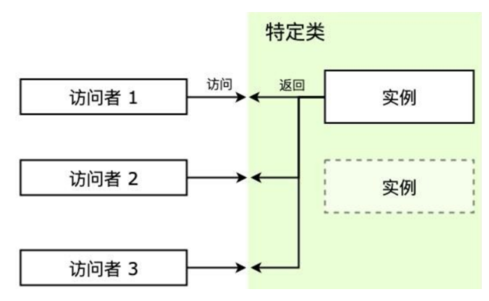
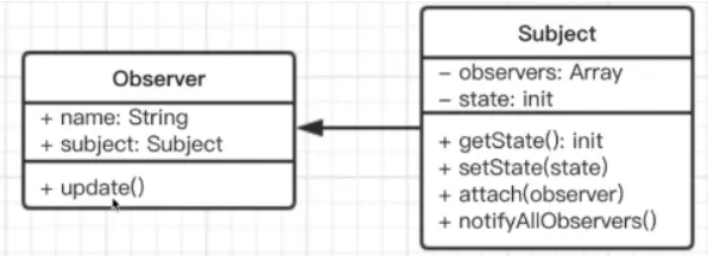
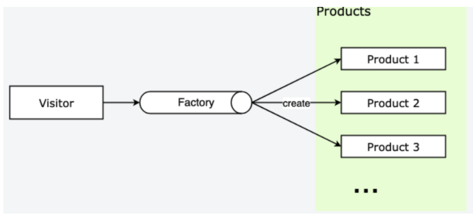
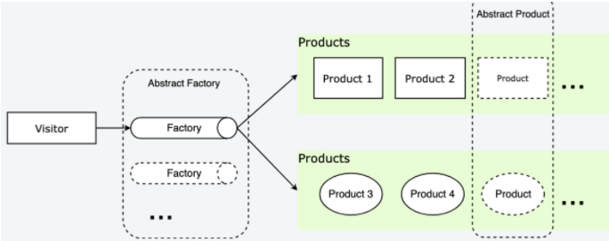
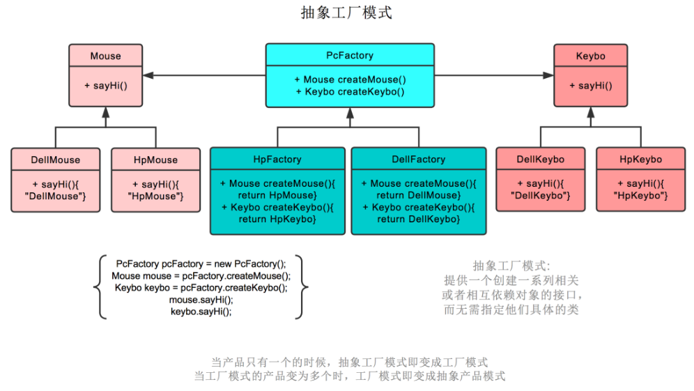
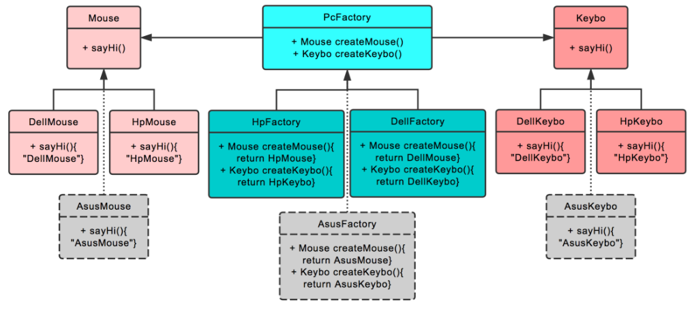
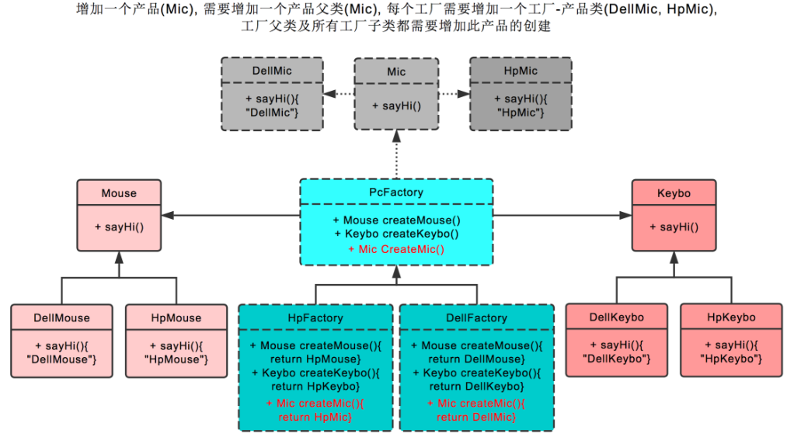
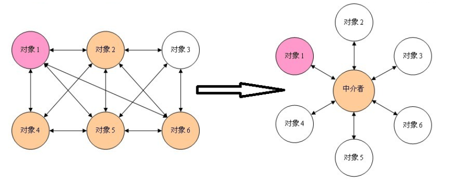
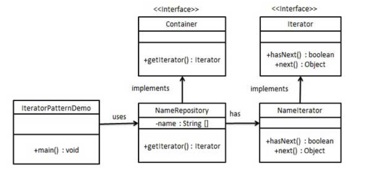

## 设计模式定义

设计模式是解决某个特定场景下对某种问题的解决方案。因此，当我们遇到合适的场景时，我们可能会条件反射一样自然而然想到符合这种场景的设计模式。

### 设计模式原则

- S – Single Responsibility Principle 单一职责原则
  - 一个程序只做好一件事
  - 如果功能过于复杂就拆分开，每个部分保持独立
- O – OpenClosed Principle 开放/封闭原则
  - 对扩展开放，对修改封闭
  - 增加需求时，扩展新代码，而非修改已有代码
- L – Liskov Substitution Principle 里氏替换原则
  - 子类能覆盖父类
  - 父类能出现的地方子类就能出现
- I – Interface Segregation Principle 接口隔离原则
  - 保持接口的单一独立
  - 类似单一职责原则，这里更关注接口
- D – Dependency Inversion Principle 依赖倒转原则
  - 面向接口编程，依赖于抽象而不依赖于具体
  - 使用方只关注接口而不关注具体类的实现

### 单例模式（Singleton Pattern）---  一定要会写



一个类只有一个实例，并提供一个访问它的全局访问点。

#### 代码例子

重点： 闭包！！！

```js
 class LoginForm {
    constructor() {
        this.state = 'hide'
    }
    show() {
        if (this.state === 'show') {
            alert('已经显示')
            return
        }
        this.state = 'show'
        console.log('登录框显示成功')
    }
    hide() {
        if (this.state === 'hide') {
            alert('已经隐藏')
            return
        }
        this.state = 'hide'
        console.log('登录框隐藏成功')
    }
 }
 LoginForm.getInstance = (function () {
     let instance = null;
     return function () {
        if (!instance) {
            instance = new LoginForm()
        }
        return instance
     }
 })()
//测试单例模式实例
let obj1 = LoginForm.getInstance()
obj1.show()
let obj2 = LoginForm.getInstance()
obj2.hide()
// 因为单体模式是只实例化一次，所以下面的实例是相等的
console.log(obj1 === obj2)//true

//闭包包装实例：
const SingletonP = (function() {
  let instance
  return class Singleton {
    constructor(name) {
      if (instance) {
        return instance
      } else {
        this.init(name)
        instance = this
        return this
      }
    }

    init(name) {
      this.name = name
      console.log('已初始化')
    }
  }
})()
```

#### 优点

- 划分命名空间，减少全局变量
- 增强模块性，把自己的代码组织在一个全局变量名下，放在单一位置，便于维护
- 且只会实例化一次。简化了代码的调试和维护

#### 缺点

- 由于单例模式提供的是一种单点访问，所以它有可能导致模块间的强耦合 从而不利于单元测试。无法单独测试一个调用了来自单例的方法的类，而只能把它与那个单例作为一个单元一起测试。

#### 场景例子

- 定义命名空间和实现分支型方法
- 登录框
- vuex 和 redux中的store
- 当我们在电脑上玩经营类的游戏，经过一番眼花缭乱的骚操作好不容易走上正轨，夜深了我们去休息，第二天打开电脑，发现要从头玩，立马就把电脑扔窗外了，所以一般希望从前一天的进度接着打，这里就用到了存档。每次玩这游戏的时候，我们都希望拿到同一个存档接着玩，这就是属于单例模式的一个实例。
- 编程中也有很多对象我们只需要唯一一个，比如数据库连接、线程池、配置文件缓存、浏览器中的 window/document 等，如果创建多个实例，会带来资源耗费严重，或访问行为不一致等情况。
- 类似于数据库连接实例，我们可能频繁使用，但是创建它所需要的开销又比较大，这时只使用一个数据库连接就可以节约很多开销。一些文件的读取场景也类似，如果文件比较大，那么文件读取就是一个比较重的操作。比如这个文件是一个配置文件，那么完全可以将读取到的文件内容缓存一份，每次来读取的时候访问缓存即可，这样也可以达到节约开销的目的。
- [创建唯一灰色背景例子](http://www.alloyteam.com/2012/10/common-javascript-design-patterns/)

[拓展内容](http://interview.poetries.top/docs/design-pattern.html#%E5%8D%95%E4%BE%8B%E6%A8%A1%E5%BC%8F)

### [观察者模式 - 发布订阅 ](https://juejin.cn/post/6844903737002033165) ---  一定要会写

定义了一种一对多的关系，让多个观察者对象同时监听某一个主题对象，这个主题对象的状态发生变化时就会通知所有的观察者对象，使它们能够自动更新自己，当一个对象的改变需要同时改变其它对象，并且它不知道具体有多少对象需要改变的时候，就应该考虑使用观察者模式。

- 发布 & 订阅
- 一对多

#### **主要的作用(优点)**

1. 广泛应用于异步编程中(替代了传递回调函数)
2. 对象之间松散耦合的编写代码

#### **缺点**

- 创建订阅者本身要消耗一定的时间和内存
- 多个发布者和订阅者嵌套一起的时候，程序难以跟踪维护

> 发布订阅的核心:： 每次`event. emit`（发布），就会触发一次`event.on`（注册）

#### 代码例子
```js
class EventEmitter {
  constructor() {
      //事件对象，存放订阅的名字和事件
    this.cache = {}//这里是多个eventname的数组
  }
 // 订阅事件的方法
  on(name, fn) {
    if (this.cache[name]) {
      this.cache[name].push(fn)// 存在则push到指定数组的尾部保存
    } else {
      this.cache[name] = [fn]// 注意数据，一个名字可以订阅多个事件函数
    }
  }

  off(name, fn) {
    const tasks = this.cache[name]
    if (tasks) {
      const index = tasks.findIndex((f) => f === fn || f.callback === fn)
      if (index >= 0) {
        tasks.splice(index, 1)
      }
    }
  }
  // 触发事件的方法
  emit(name) {
    if (this.cache[name]) {
      // 创建副本，如果回调函数内继续注册相同事件，会造成死循环
      const tasks = this.cache[name].slice()
      for (let fn of tasks) {
        fn();
      }
    }
  }
//once
  emit(name, once = false) {
    if (this.cache[name]) {
      // 创建副本，如果回调函数内继续注册相同事件，会造成死循环
      const tasks = this.cache[name].slice()//遍历
      for (let fn of tasks) {
        fn();
      }
      if (once) {
        delete this.cache[name]
      }
    }
  }
}

// 测试
const eventBus = new EventEmitter()
const task1 = () => { console.log('task1'); }
const task2 = () => { console.log('task2'); }
eventBus.on('task', task1)
eventBus.on('task', task2)

setTimeout(() => {
  eventBus.emit('task')
}, 1000)
```

**测试用例**

```js
let em = new EventEmitter();

function workDay() {
  console.log("每天工作");
}
function makeMoney() {
  console.log("赚100万");
}
function sayLove() {
  console.log("向喜欢的人示爱");
}
em.on("money",makeMoney);
em.on("love",sayLove);
em.on("work", workDay);

em.emit("money");
em.emit("love");  
em.emit("work");  
```
#### 场景

- DOM事件

- vue 响应式

> 下面这个应用场景感觉更加值得看 [来源](https://juejin.cn/post/6844903737002033165)

网站登录 假如我们正在开发一个商城网站，网站里有 header 头部、nav 导航、消息列表、购物车等模块。这几个模块的渲染有一个共同的前提条件，就是必须先用 ajax 异步请求获取用户的登录信息。 这是很正常的，比如用户的名字和头像要显示在 header 模块里，而这两个字段都来自用户登录后 返回的信息。 至于 ajax 请求什么时候能成功返回用户信息，这点我们没有办法确定。现在的情节看起来像 极了售楼处的例子，小明不知道什么时候开发商的售楼手续能够成功办下来。

```js
$.ajax( 'http:// xxx.com?login', function(data){ // 登录成功 
  login.trigger('loginSucc', data); // 发布登录成功的消息
});
var header = (function(){ // header 模块 
  login.listen( 'loginSucc', function( data){
      header.setAvatar( data.avatar );
  }); 
  return {
      setAvatar: function( data ){
          console.log( '设置 header 模块的头像' );
      } 
  }
})();

var nav = (function(){
  login.listen( 'loginSucc', function( data ){// nav 模块 
      nav.setAvatar( data.avatar );
  }); 
  return {
      setAvatar: function( avatar ){ 
          console.log( '设置 nav 模块的头像' );
      } 
  }
  })();
```

### 手动实现观察者模式（基于发布订阅模式） 

> 观察者模式（基于发布订阅模式） 有观察者，也有被观察者



类图解析：

- 每一个观察者（Observer）都有一个update 方法，并且观察者的状态就是等待被触发；
- 每一个主题（subject）都可以通过attach方法接纳N个观察者所观察，即观察者们存储在主题的observers数组里，；
- 主题有初始化状态（init）、获取状态（getState）和设置状态（setState）三个通用型方法；
- 当主题的状态发生变化时，通过特定的notifyAllObervers方法通知所有观察者。

**观察者需要放到被观察者中，被观察者的状态变化需要通知观察者** 我变化了 内部也是基于发布订阅模式，收集观察者，状态变化后要主动通知观察者

```js
class Subject { // 被观察者 学生
  constructor(name) {
    this.state = '开心的'
    this.observers = []; // 存储所有的观察者
  }
  // 收集所有的观察者
  attach(o){ // Subject. prototype. attch
    this.observers.push(o)
  }
  // 更新被观察者 状态的方法
  setState(newState) {
    this.state = newState; // 更新状态
    // this 指被观察者 学生
    this.observers.forEach(o => o.update(this)) // 通知观察者 更新它们的状态
  }
}

class Observer{ // 观察者 父母和老师
  constructor(name) {
    this.name = name
  }
  update(student) {
    console.log('当前' + this.name + '被通知了', '当前学生的状态是' + student.state)
  }
}

let student = new Subject('学生'); 

let parent = new Observer('父母'); 
let teacher = new Observer('老师'); 

// 被观察者存储观察者的前提，需要先接纳观察者
student. attach(parent); 
student. attach(teacher); 
student. setState('被欺负了');
```

## 工厂模式



### 基本特征

工厂模式有三种形式：简单工厂模式（Simple Factory）、工厂方法模式（Factory Method）和抽象工厂模式（Abstract Factory）。在js中我们最常见的当属简单工厂模式。工厂模式的设计思想即：

- 将 new 操作单独封装，只对外提供相应接口；
- 遇到new 时，就要考虑是否应该使用工厂模式；

###  核心作用

- 主要用于隐藏创建实例的复杂度，只需对外提供一个接口；
- 实现构造函数和创建者的分离，满足开放封闭的原则；

###  分类

- 简单工厂模式：一个工厂对象创建一种产品对象实例。即用来创建同一类对象；
- 工厂方法模式：建立抽象核心类，将创建实例的实际重心放在核心抽象大类的子类中；
- 抽象工厂模式：对类的工厂抽象用来创建产品类簇，不负责创建某一类产品的实例。 由于在JS中基本不会使用抽象工厂模式，因此本文探究前两类模式。

### 优点

- 良好的封装，代码结构清晰，访问者无需知道对象的创建流程，特别是创建比较复杂的情况下；

- 扩展性优良，通过工厂方法隔离了用户和创建流程隔离，符合开放封闭原则；

- 解耦了高层逻辑和底层产品类，符合最少知识原则，不需要的就不要去交流；

### 缺点

- 带来了额外的系统复杂度，增加了抽象性；

### 实例演示

先通过一个简单例子最直观感受什么是工厂：

```js
/* 工厂类 */
class Factory {
    static getInstance(type) {
        switch (type) {
            case 'Product1':
                return new Product1()
            case 'Product2':
                return new Product2()
            default:
                throw new Error('当前没有这个产品')
        }
    }
}

/* 产品类1 */
class Product1 {
    constructor() { this.type = 'Product1' }
    operate() { console.log(this.type) }
}

/* 产品类2 */
class Product2 {
    constructor() { this.type = 'Product2' }  
    operate() { console.log(this.type) }
}

const prod1 = Factory.getInstance('Product1')
prod1.operate()	// 输出: Product1
const prod2 = Factory.getInstance('Product3')// 输出: Error 当前没有这个产品
```

工厂模式最直观的地方在于，创建产品对象不是通过直接new 产品类实现，而是通过工厂方法实现。现在再用一个稍微有些好看的例子描述一下简单工厂：

```js
//User类
class User {
  //构造器
  constructor(opt) {
    this.name = opt.name;
    this.viewPage = opt.viewPage;
  }

  static getInstance(role) {
    switch (role) {
      case 'superAdmin':
        return new User({ name: '超级管理员', viewPage: ['首页', '通讯录', '发现页', '应用数据', '权限管理'] });
        break;
      case 'admin':
        return new User({ name: '管理员', viewPage: ['首页', '通讯录'] });
        break;
      default:
        throw new Error('params error')
    }
  }
}

//调用
let superAdmin = User.getInstance('superAdmin');
let admin = User.getInstance('admin'); 
```

通过上例，我们可以看到，每次创建新的对象实例时，只需要传入相应的参数，就可以得到指定的对象实例。最直观的例子是如果不用工厂模式，那代码中是不是就会多出好多个new，这样看着也不太舒服。

其实简单工厂模式已经能满足我们前端大部分业务场景了，如果非要说其一个缺陷，那就是每次有新实例时，我们需要重写这个User大类，总归感觉和后面所述的装饰器模式有一些冲突。此时，**工厂方法模式**就出来了，其核心思想就是独立出一个大的User类，将创建实例对象的过程用其子类来实现：

```js
class User {
  constructor(name = '', viewPage = []) {
    this.name = name;
    this.viewPage = viewPage;
  }
}

class UserFactory extends User {
  constructor(name, viewPage) {
    super(name, viewPage)
  }
  create(role) {
    switch (role) {
      case 'superAdmin': 
        return new UserFactory( '超级管理员', ['首页', '通讯录', '发现页', '应用数据', '权限管理'] );
        break;
      case 'admin':
        return new UserFactory( '管理员', ['首页', '通讯录'] );
        break;
      default:
        throw new Error('params error');
    }
  }
}
let userFactory = new UserFactory();
let superAdmin = userFactory.create('superAdmin');
let admin = userFactory.create('admin');
let user = userFactory.create('user');
```

这样，虽然也得通过 new 一个实例，但至少我们可以无需修改User类里面的东西，虽说代码量上感觉和简单模式差不了多少，但思想主体确实就是这样。

### 应用场景

#### (1) jQuery的选择器$(selector)

`$('div')` 和 `new $('div')` 有何区别？ 为什么 `$('div')` 就能直接实现 `new`的效果，同时去除了 `new $('div')` 这种`$('div')` 去除了 `new` 书写繁杂的弊端，还能实现完美的链式操作代码简介，就是因为`$`内置的实现机制是工厂模式。其底层代码如下：

```js
class jQuery {
    constructor(selector) {
        super(selector)
    }
    // ...
}

window.$ = function(selector) {
    return new jQuery(selector)
}
```

#### (2) Vue 异步组件

```js
Vue.component('async-example' , (resolve , reject) => {
    setTimeout(function() {
        resolve({
            template: `<div>I am async!</div>`
        })
    }, 1000)
})
```

除了上述两个常见的实例场景，还有`React.createElement()` 也是工厂原理。所以，当我们平时遇到要创建实例的时候，就可以想想能否用工厂模式实现了。

## 抽象工厂模式

抽象工厂 （Abstract Factory）：通过对类的工厂抽象使其业务用于对产品类簇的创建，而不是负责创建某一类产品的实例。关键在于使用抽象类制定了实例的结构，调用者直接面向实例的结构编程，从实例的具体实现中解耦。

我们可以先看看例子 然后在讨论具体比较

### 实例演示

```js
//使用 class 语法
/* 饭店方法 */
class Restaurant {
    static orderDish(type) {
        switch (type) {
            case '鱼香肉丝':
                return new YuXiangRouSi()
            case '宫保鸡丁':
                return new GongBaoJiDin()
            default:
                throw new Error('本店没有这个 -。-')
        }
    }
}

/* 菜品抽象类 */
class Dish {
    constructor() {
        if (new.target === Dish) {
            throw new Error('抽象类不能直接实例化!')
        }
        this.kind = '菜'
    }
    
    /* 抽象方法 */
    eat() { throw new Error('抽象方法不能调用!') }
}

/* 鱼香肉丝类 */
class YuXiangRouSi extends Dish {
    constructor() {
        super()
        this.type = '鱼香肉丝'
    }
    
    eat() { console.log(this.kind + ' - ' + this.type + ' 真香~') }
}

/* 宫保鸡丁类 */
class GongBaoJiDin extends Dish {
    constructor() {
        super()
        this.type = '宫保鸡丁'
    }
    
    eat() { console.log(this.kind + ' - ' + this.type + ' 让我想起了外婆做的菜~') }
}

const dish0 = new Dish()  // 输出: Error 抽象方法不能调用!
const dish1 = Restaurant.orderDish('鱼香肉丝')
dish1.eat()	// 输出: 菜 - 鱼香肉丝 真香~
const dish2 = Restaurant.orderDish('红烧排骨') // 输出: Error 本店没有这个 -。-
```

- 这里的 Dish 类就是抽象产品类，继承该类的子类需要实现它的方法 eat。
- 上面的实现将产品的功能结构抽象出来成为抽象产品类。事实上我们还可以更进一步，将工厂类也使用抽象类约束一下，也就是抽象工厂类，比如这个饭店可以做菜和汤，另一个饭店也可以做菜和汤，存在共同的功能结构，就可以将共同结构作为抽象类抽象出来

```js
/* 饭店 抽象类，饭店都可以做菜和汤 */
class AbstractRestaurant {
    constructor() {
        if (new.target === AbstractRestaurant)
            throw new Error('抽象类不能直接实例化!')
        this.signborad = '饭店'
    }
    
    /* 抽象方法：创建菜 */
    createDish() { throw new Error('抽象方法不能调用!') }
    
    /* 抽象方法：创建汤 */
    createSoup() { throw new Error('抽象方法不能调用!') }
}

/* 具体饭店类 */
class Restaurant extends AbstractRestaurant {
    constructor() { super() }
    
    createDish(type) {
        switch (type) {
            case '鱼香肉丝':
                return new YuXiangRouSi()
            case '宫保鸡丁':
                return new GongBaoJiDing()
            default:
                throw new Error('本店没这个菜')
        }
    }
    
    createSoup(type) {
        switch (type) {
            case '紫菜蛋汤':
                return new ZiCaiDanTang()
            default:
                throw new Error('本店没这个汤')
        }
    }
}

/* 菜 抽象类，菜都有吃的功能 eat */
class AbstractDish {
    constructor() {
        if (new.target === AbstractDish) {
            throw new Error('抽象类不能直接实例化!')
        }
        this.kind = '菜'
    }
    
    /* 抽象方法 */
    eat() { throw new Error('抽象方法不能调用!') }
}

/* 菜 鱼香肉丝类 */
class YuXiangRouSi extends AbstractDish {
    constructor() {
        super()
        this.type = '鱼香肉丝'
    }
    
    eat() { console.log(this.kind + ' - ' + this.type + ' 真香~') }
}

/* 菜 宫保鸡丁类 */
class GongBaoJiDing extends AbstractDish {
    constructor() {
        super()
        this.type = '宫保鸡丁'
    }
    
    eat() { console.log(this.kind + ' - ' + this.type + ' 让我想起了外婆做的菜~') }
}

/* 汤 抽象类，汤都有喝的功能 drink */
class AbstractSoup {
    constructor() {
        if (new.target === AbstractDish) {
            throw new Error('抽象类不能直接实例化!')
        }
        this.kind = '汤'
    }
    
    /* 抽象方法 */
    drink() { throw new Error('抽象方法不能调用!') }
}

/* 汤 紫菜蛋汤类 */
class ZiCaiDanTang extends AbstractSoup {
    constructor() {
        super()
        this.type = '紫菜蛋汤'
    }
    
    drink() { console.log(this.kind + ' - ' + this.type + ' 我从小喝到大~') }
}

const restaurant = new Restaurant()

const soup1 = restaurant.createSoup('紫菜蛋汤')
soup1.drink()// 输出: 汤 - 紫菜蛋汤 我从小喝到大~
const dish1 = restaurant.createDish('鱼香肉丝')
dish1.eat()	// 输出: 菜 - 鱼香肉丝 真香~
const dish2 = restaurant.createDish('红烧排骨')  // 输出: Error 本店没有这个 -。-
```

### 抽象工厂模式 特点

- Factory ：工厂，负责返回产品实例；
- AbstractFactory ：虚拟工厂，制定工厂实例的结构；
- Product ：产品，访问者从工厂中拿到的产品实例，实现抽象类；
- AbstractProduct ：产品抽象类，由具体产品实现，制定产品实例的结构；



### 优点

> 抽象产品类将产品的结构抽象出来，访问者不需要知道产品的具体实现，只需要面向产品的结构编程即可，从产品的具体实现中解耦；

### 缺点

- 扩展新类簇的产品类比较困难，因为需要创建新的抽象产品类，并且还要修改工厂类，违反开闭原则；
- 带来了系统复杂度，增加了新的类，和新的继承关系；

### 抽象工厂模式的使用场景

> 如果一组实例都有相同的结构，那么就可以使用抽象工厂模式。

### 抽象工厂模式与工厂模式区别

- 工厂模式 主要关注单独的产品实例的创建；
- 抽象工厂模式 主要关注产品类簇实例的创建，如果产品类簇只有一个产品，那么这时的抽象工厂模式就退化为工厂模式了；根据场景灵活使用即可。

## 对于三种工厂模式的实例解读

简单工厂模式不是 23 种里的一种，简而言之，就是有一个专门生产某个产品的类。

比如下图中的鼠标工厂，专业生产鼠标，给参数 0，生产戴尔鼠标，给参数 1，生产惠普鼠标。


### 工厂模式

工厂模式也就是鼠标工厂是个父类，有生产鼠标这个接口。

戴尔鼠标工厂，惠普鼠标工厂继承它，可以分别生产戴尔鼠标，惠普鼠标。

生产哪种鼠标不再由参数决定，而是创建鼠标工厂时，由戴尔鼠标工厂创建。

后续直接调用**factory.createMouse()**即可


### 抽象工厂模式

抽象工厂模式也就是不仅生产鼠标，同时生产键盘。

也就是 PC 厂商是个父类，有生产鼠标，生产键盘两个接口。

戴尔工厂，惠普工厂继承它，可以分别生产戴尔鼠标+戴尔键盘，和惠普鼠标+惠普键盘。

创建工厂时，由戴尔工厂创建。

后续**factory.createMouse()**则生产戴尔鼠标，**factory.createKeybo()**则生产戴尔键盘。



> 在抽象工厂模式中，假设我们需要增加一个工厂

假设我们增加华硕工厂，则我们需要增加华硕工厂，和戴尔工厂一样，继承 PC 厂商。

之后创建华硕鼠标，继承鼠标类。创建华硕键盘，继承键盘类即可。



> 在抽象工厂模式中，假设我们需要增加一个产品

假设我们增加耳麦这个产品，则首先我们需要增加耳麦这个父类，再加上戴尔耳麦，惠普耳麦这两个子类。

之后在PC厂商这个父类中，增加生产耳麦的接口。最后在戴尔工厂，惠普工厂这两个类中，分别实现生产戴尔耳麦，惠普耳麦的功能。 以上。



# 下面是拓展（面试很少问，了解即可）

 ### [中介者模式 Mediator Pattern](https://juejin.cn/post/6844903745570996238#heading-0)

中介者模式的作用就是解除对象与对象之间的紧耦合关系。增加一个中介者对象后，所有的 相关对象都通过中介者对象来通信，而不是互相引用，所以当一个对象发生改变时，只需要通知 中介者对象即可。中介者使各对象之间耦合松散，而且可以独立地改变它们之间的交互。中介者模式使网状的多对多关系变成了相对简单的一对多关系

- Colleague： 同事对象，只知道中介者而不知道其他同事对象，通过中介者来与其他同事对象通信；
- Mediator： 中介者，负责与各同事对象的通信；



#### 代码例子

以现实生活中打牌的例子来实现下中介者模式。打牌总有输赢，对应的则是货币的变化，如果不用中介者模式的话，实现如下：

```java
/// <summary>
/// 抽象牌友类
/// </summary>
public abstract class AbstractCardPartner
{
    public int Money { get; set; }
 
    public abstract void ChangeMoney(int money, AbstractCardPartner other);
}
 
/// <summary>
/// 牌友A
/// </summary>
public class PartnerA : AbstractCardPartner
{
    public override void ChangeMoney(int money, AbstractCardPartner other)
    {
        Money += money;
        other.Money -= money;
    }
}
 
/// <summary>
/// 牌友B
/// </summary>
public class PartnerB : AbstractCardPartner
{
    public override void ChangeMoney(int money, AbstractCardPartner other)
    {
        Money += money;
        other.Money -= money;
    }
}
 
/// <summary>
/// 调用
/// </summary>
/// <param name="args"></param>
static void Main(string[] args)
{
    AbstractCardPartner A = new PartnerA();
    A.Money = 20;
    AbstractCardPartner B = new PartnerB();
    B.Money = 20;
 
    // A赢了B的钱减少
    A.ChangeMoney(5, B);
    Console.WriteLine("A 现在的钱是：{0}", A.Money); // 应该是25
    Console.WriteLine("B 现在的钱是：{0}", B.Money); // 应该是15
 
    // B赢了A的钱减少
    B.ChangeMoney(10, A);
    Console.WriteLine("A 现在的钱是：{0}", A.Money); // 应该是15
    Console.WriteLine("B 现在的钱是：{0}", B.Money); // 应该是25
 
    Console.ReadLine();
}
```

这样的实现确实解决了上面场景中的问题，并且使用了抽象类使具体牌友A和牌友B都依赖于抽象类，从而降低了同事类之间的耦合度。但是如果其中牌友A发生变化时，此时就会影响到牌友B的状态，如果涉及的对象变多的话，这时候某一个牌友的变化将会影响到其他所有相关联的牌友状态。例如牌友A算错了钱，这时候牌友A和牌友B的钱数都不正确了，如果是多个人打牌的话，影响的对象就会更多。这时候就会思考——能不能把算钱的任务交给程序或者算数好的人去计算呢，这时候就有了我们QQ游戏中的欢乐斗地主等牌类游戏了。

进一步完善的方案，即加入一个中介者对象来协调各个对象之间的关联，这也就是中介者模式的应用了，具体完善后的实现代码如下所示：

```java
/// <summary>
/// 抽象牌友类
/// </summary>
public abstract class AbstractCardPartner
{
    public int Money { get; set; }
 
    public abstract void ChangeMoney(int money, AbstractMediator mediator);
}
 
/// <summary>
/// 牌友A
/// </summary>
public class PartnerA : AbstractCardPartner
{
    public override void ChangeMoney(int money, AbstractMediator mediator)
    {
        mediator.AWin(money);
    }
}
 
/// <summary>
/// 牌友B
/// </summary>
public class PartnerB : AbstractCardPartner
{
    public override void ChangeMoney(int money, AbstractMediator mediator)
    {
        mediator.BWin(money);
    }
}
 
/// <summary>
/// 抽象中介者类
/// </summary>
public abstract class AbstractMediator
{
    protected AbstractCardPartner A;
    protected AbstractCardPartner B;
 
    public AbstractMediator(AbstractCardPartner a, AbstractCardPartner b)
    {
        A = a;
        B = b;
    }
 
    public abstract void AWin(int money);
    public abstract void BWin(int money);
}
 
/// <summary>
/// 调用
/// </summary>
/// <param name="args"></param>
static void Main(string[] args)
{
    AbstractCardPartner A = new PartnerA();
    AbstractCardPartner B = new PartnerB();
    A.Money = 20;
    B.Money = 20;
 
    AbstractMediator mediator = new MediatorPater(A, B);
 
    // A赢了
    A.ChangeMoney(5, mediator);
    Console.WriteLine("A 现在的钱是：{0}", A.Money); // 应该是25
    Console.WriteLine("B 现在的钱是：{0}", B.Money); // 应该是15
 
    // B赢了
    B.ChangeMoney(10, mediator);
    Console.WriteLine("A 现在的钱是：{0}", A.Money); // 应该是15
    Console.WriteLine("B 现在的钱是：{0}", B.Money); // 应该是25
 
    Console.ReadLine();
}
```

在上面的实现代码中，抽象中介者类保存了两个抽象牌友类，如果新添加一个牌友类似时，此时就不得不去更改这个抽象中介者类。

**中介者模式的优缺点**

#### **优点**

- 松散耦合，降低了同事对象之间的相互依赖和耦合，不会像之前那样牵一发动全身；
- 将同事对象间的一对多关联转变为一对一的关联，符合最少知识原则，提高系统的灵活性，使得系统易于维护和扩展；
- 中介者在同事对象间起到了控制和协调的作用，因此可以结合代理模式那样，进行同事对象间的访问控制、功能扩展；
- 因为同事对象间不需要相互引用，因此也可以简化同事对象的设计和实现；

#### **缺点**

- 逻辑过度集中化，当同事对象太多时，中介者的职责将很重，逻辑变得复杂而庞大，以至于难以维护。

> 当出现中介者可维护性变差的情况时，考虑是否在系统设计上不合理，从而简化系统设计，优化并重构，避免中介者出现职责过重的情况。

#### **适用场景**

- 在现实生活中，有很多中介者模式的身影，例如QQ游戏平台，聊天室、QQ群、短信平台和房产中介。不论是QQ游戏还是QQ群，它们都是充当一个中间平台，QQ用户可以登录这个中间平台与其他QQ用户进行交流，如果没有这些中间平台，我们如果想与朋友进行聊天的话，可能就需要当面才可以了。电话、短信也同样是一个中间平台，有了这个中间平台，每个用户都不要直接依赖与其他用户，只需要依赖这个中间平台就可以了，一切操作都由中间平台去分发。
- 中介者模式，定义了一个中介对象来封装一系列对象之间的交互关系。中介者使各个对象之间不需要显式地相互引用，从而使耦合性降低，而且可以独立地改变它们之间的交互行为。
- 但是，如果对象之间的关系耦合并不紧密，或者之间的关系本就一目了然，那么引入中介者模式就是多此一举、画蛇添足。
- 实际上，我们通常使用的 `MVC/MVVM` 框架，就含有中介者模式的思想，`Controller/ViewModel` 层作为中介者协调 `View/Model` 进行工作，减少 `View/Model` 之间的直接耦合依赖，从而做到视图层和数据层的最大分离。可以关注后面有单独一章分析 `MVC/MVVM` 模式，深入了解

> **中介者模式与发布-订阅模式**
>
> - 中介者模式和发布-订阅模式都可以用来进行对象间的解耦，比如发布-订阅模式的发布者/订阅者和中介者模式里面的中介者/同事对象功能上就比较类似。
> - 这两个模式也可以组合使用，比如中介者模式就可以使用发布-订阅模式，对相关同事对象进行消息的广播通知。
> - 比如上面相亲的例子中，注册各方和通知信息就使用了发布-订阅模式。

### 策略模式（Strategy Pattern）

略模式 （Strategy Pattern）又称政策模式，其定义一系列的算法，把它们一个个封装起来，并且使它们可以互相替换。封装的策略算法一般是独立的，策略模式根据输入来调整采用哪个算法。关键是策略的实现和使用分离

#### 例子

这里的例子比如 对于不同的价格折扣，一般我们直接想到的就是利用if-else。 但是这样后期随着折扣变多，会变得臃肿。

计算折扣的算法部分提取出来保存为一个对象，折扣的类型作为 `key`，这样索引的时候通过对象的键值索引调用具体的算法：

```js
const DiscountMap = {
    minus100_30: function(price) {
        return price - Math.floor(price / 100) * 30
    },
    minus200_80: function(price) {
        return price - Math.floor(price / 200) * 80
    },
    percent80: function(price) {
        return price * 0.8
    }
}

/* 计算总售价*/
function priceCalculate(discountType, price) {
    return DiscountMap[discountType] && DiscountMap[discountType](price)
}

priceCalculate('minus100_30', 270)
priceCalculate('percent80', 250)

// 输出: 210
// 输出: 200
```

这样算法的实现和算法的使用就被分开了，想添加新的算法也变得十分简单：

```js
DiscountMap.minus150_40 = function(price) {
    return price - Math.floor(price / 150) * 40
}
```

如果你希望计算算法隐藏起来，那么可以借助 IIFE 使用闭包的方式，这时需要添加增加策略的入口，以方便扩展：

```js
const PriceCalculate = (function() {
    /* 售价计算方式 */
    const DiscountMap = {
        minus100_30: function(price) {      // 满100减30
            return price - Math.floor(price / 100) * 30
        },
        minus200_80: function(price) {      // 满200减80
            return price - Math.floor(price / 200) * 80
        },
        percent80: function(price) {        // 8折
            return price * 0.8
        }
    }
    
    return {
        priceClac: function(discountType, price) {
            return DiscountMap[discountType] && DiscountMap[discountType](price)
        },
        addStrategy: function(discountType, fn) {		// 注册新计算方式
            if (DiscountMap[discountType]) return
            DiscountMap[discountType] = fn
        }
    }
})()

PriceCalculate.priceClac('minus100_30', 270)	// 输出: 210

PriceCalculate.addStrategy('minus150_40', function(price) {
    return price - Math.floor(price / 150) * 40
})
PriceCalculate.priceClac('minus150_40', 270)	// 输出: 230
```

#### 内部结构详解

- Context ：封装上下文，根据需要调用需要的策略，屏蔽外界对策略的直接调用，只对外提供一个接口，根据需要调用对应的策略；
- Strategy ：策略，含有具体的算法，其方法的外观相同，因此可以互相代替；
- StrategyMap ：所有策略的合集，供封装上下文调用；


#### 实例

- `Element` 的表格控件的 `Column` 接受一个 `formatter` 参数，用来格式化内容，其类型为函数，并且还可以接受几个特定参数，像这样： `Function(row, column, cellValue, index)`。
- 以文件大小转化为例，后端经常会直接传 `bit` 单位的文件大小，那么前端需要根据后端的数据，根据需求转化为自己需要的单位的文件大小，比如 `KB/MB`。

首先实现文件计算的算法：

```js
export const StrategyMap = {
    /* Strategy 1: 将文件大小（bit）转化为 KB */
    bitToKB: val => {
        const num = Number(val)
        return isNaN(num) ? val : (num / 1024).toFixed(0) + 'KB'
    },
    /* Strategy 2: 将文件大小（bit）转化为 MB */
    bitToMB: val => {
        const num = Number(val)
        return isNaN(num) ? val : (num / 1024 / 1024).toFixed(1) + 'MB'
    }
}

/* Context: 生成el表单 formatter */
const strategyContext = function(type, rowKey){ 
  return function(row, column, cellValue, index){
  	StrategyMap[type](row[rowKey])
  }
}

export default strategyContext
```

那么在组件中我们可以直接：

```html
<template>
    <el-table :data="tableData">
        <el-table-column prop="date" label="日期"></el-table-column>
        <el-table-column prop="name" label="文件名"></el-table-column>
        <!-- 直接调用 strategyContext -->
        <el-table-column prop="sizeKb" label="文件大小(KB)"
                         :formatter='strategyContext("bitToKB", "sizeKb")'>
        </el-table-column>
        <el-table-column prop="sizeMb" label="附件大小(MB)"
                         :formatter='strategyContext("bitToMB", "sizeMb")'>
        </el-table-column>
    </el-table>
</template>

<script type='text/javascript'>
    import strategyContext from './strategyContext.js'
    
    export default {
        name: 'ElTableDemo',
        data() {
            return {
                strategyContext,
                tableData: [
                    { date: '2019-05-02', name: '文件1', sizeKb: 1234, sizeMb: 1234426 },
                    { date: '2019-05-04', name: '文件2', sizeKb: 4213, sizeMb: 8636152 }]
            }
        }
    }
</script>

<style scoped></style>
```


#### 优点

- 策略之间相互独立，但策略可以自由切换，这个策略模式的特点给策略模式带来很多灵活性，也提高了策略的复用率；
- 如果不采用策略模式，那么在选策略时一般会采用多重的条件判断，采用策略模式可以避免多重条件判断，增加可维护性；
- 可扩展性好，策略可以很方便的进行扩展；

#### 缺点

- 策略相互独立，因此一些复杂的算法逻辑无法共享，造成一些资源浪费；
- 如果用户想采用什么策略，必须了解策略的实现，因此所有策略都需向外暴露，这是违背迪米特法则/最少知识原则的，也增加了用户对策略对象的使用成本。

### 代理模式

代理模式 （Proxy Pattern）又称委托模式，它为目标对象创造了一个代理对象，以控制对目标对象的访问。

```js
/* 明星 */
const SuperStar = {
    name: '小鲜肉',
    playAdvertisement(ad) {
        console.log(ad)
    }
}

/* 经纪人 */
const ProxyAssistant = {
    name: '经纪人张某',
    scheduleTime() {
        return new Promise((resolve, reject) => {
            setTimeout(() => {
                console.log('小鲜鲜有空了')
                resolve()
            }, 2000)                        // 发现明星有空了
        })
    },
    playAdvertisement(reward, ad) {
        if (reward > 1000000) {             // 如果报酬超过100w
            console.log('没问题，我们小鲜鲜最喜欢拍广告了！')
            ProxyAssistant.scheduleTime()   // 安排上了
              .then(() => SuperStar.playAdvertisement(ad))
        } else
            console.log('没空，滚！')
    }
}

ProxyAssistant.playAdvertisement(10000, '纯蒸酸牛奶，味道纯纯，尽享纯蒸')
// 输出： 没空，滚

ProxyAssistant.playAdvertisement(1000001, '纯蒸酸牛奶，味道纯纯，尽享纯蒸')
// 输出： 没问题，我们小鲜鲜最喜欢拍广告了！
// 2秒后
// 输出： 小鲜鲜有空了
// 输出： 纯蒸酸牛奶，味道纯纯，尽享纯蒸
```

#### 概念

- `Target`： 目标对象，也是被代理对象，是具体业务的实际执行者；
- `Proxy`： 代理对象，负责引用目标对象，以及对访问的过滤和预处理；

概略图如下：


#### **ES6 原生提供了 `Proxy` 构造函数**

```js
var proxy = new Proxy(target, handler);
```

- 拦截和监视外部对对象的访问
- 降低函数或类的复杂度
- 在复杂操作前对操作进行校验或对所需资源进行管理

`Proxy(target, handler)` 是一个构造函数，`target` 是被代理的对象，`handlder` 是声明了各类代理操作的对象，最终返回一个代理对象。外界每次通过代理对象访问 `target` 对象的属性时，就会经过 `handler` 对象，从这个流程来看，代理对象很类似 middleware（中间件）。 

这里使用 `Proxy` 来实现一下上面的经纪人例子：

```js
//在 ES6 之前，一般是使用 Object.defineProperty 来完成相同的功能，我们可以使用这个 API 改造一下：

/* 明星 */
const SuperStar = {
    name: '小鲜肉',
    scheduleFlagActually: false,// 档期标识位，false-没空（默认值），true-有空
    playAdvertisement(ad) {
        console.log(ad)
    }
}

/* 经纪人 */
const ProxyAssistant = {
    name: '经纪人张某',
    scheduleTime(ad) {
        Object.defineProperty(SuperStar, 'scheduleFlag', { // 在这里监听 scheduleFlag 值的变化
            get() {
                return SuperStar.scheduleFlagActually
            },
            set(val) {
                if (SuperStar.scheduleFlagActually === false &&
                  val === true) {// 小鲜肉现在有空了
                    SuperStar.scheduleFlagActually = true
                    SuperStar.playAdvertisement(ad)// 安排上了
                }
            }
        })
        
        setTimeout(() => {
            console.log('小鲜鲜有空了')
            SuperStar.scheduleFlag = true
        }, 2000)// 明星有空了
    },
    playAdvertisement(reward, ad) {
        if (reward > 1000000) {// 如果报酬超过100w
            console.log('没问题，我们小鲜鲜最喜欢拍广告了！')
            ProxyAssistant.scheduleTime(ad)
        } else
            console.log('没空，滚！')
    }
}

ProxyAssistant.playAdvertisement(10000, '纯蒸酸牛奶，味道纯纯，尽享纯蒸')
// 输出： 没空，滚

ProxyAssistant.playAdvertisement(1000001, '纯蒸酸牛奶，味道纯纯，尽享纯蒸')
// 输出： 没问题，我们小鲜鲜最喜欢拍广告了！
// 2秒后
// 输出： 小鲜鲜有空了
// 输出： 纯蒸酸牛奶，味道纯纯，尽享纯蒸
```

或者[参考例子](https://blog.csdn.net/qq_43955202/article/details/104271193)

### 迭代器模式 （Iterator Pattern）

迭代器模式（Iterator Pattern）是 Java 和 .Net 编程环境中非常常用的设计模式。这种模式用于顺序访问集合对象的元素，不需要知道集合对象的底层表示。

迭代器模式属于行为型模式。（**主要解决：**不同的方式来遍历整个整合对象）

#### **ES6 中的迭代器**

- `ES6` 规定，默认的迭代器部署在对应数据结构的 `Symbol.iterator` 属性上，如果一个数据结构具有 `Symbol.iterator` 属性，就被视为可遍历的，就可以用 `for...of` 循环遍历它的成员。也就是说，`for...of`循环内部调用的是数据结构的`Symbol.iterator` 方法。
- `for-of` 循环可以使用的范围包括 `Array`、`Set`、`Map` 结构、上文提到的类数组结构、`Generator` 对象，以及字符串。

> 注意： `ES6` 的 `Iterator` 相关内容与本节主题无关，所以不做更详细的介绍，如果读者希望更深入，推介先阅读阮一峰的 `<Iterator 和 for...of 循环>` 相关内容。

- 通过 `for-of` 可以使用 `Symbol.iterator` 这个属性提供的迭代器可以遍历对应数据结构，如果对没有提供 `Symbol.iterator` 的目标使用 `for-of` 则会抛错

#### 例子

```js
var bar = {
    a: 1,
    [Symbol.iterator]: function() {
        var valArr = [
            { value: 'hello', done: false },
            { value: 'world', done: false },
            { value: '!', done: false },
            { value: undefined, done: true }
        ]
        return {
            next: function() {
                return valArr.shift()
            }
        }
    }
}

for (var key of bar) {
    console.log(key)
}

// 输出： hello
// 输出： world
// 输出： !
```

#### 模式结构



**关键代码：**定义接口：hasNext, next。

**应用实例：**JAVA 中的 iterator。

#### 优点

1、它支持以不同的方式遍历一个聚合对象。 2、迭代器简化了聚合类。 3、在同一个聚合上可以有多个遍历。 4、在迭代器模式中，增加新的聚合类和迭代器类都很方便，无须修改原有代码。

#### 缺点

由于迭代器模式将存储数据和遍历数据的职责分离，增加新的聚合类需要对应增加新的迭代器类，类的个数成对增加，这在一定程度上增加了系统的复杂性。

**使用场景：** 1、访问一个聚合对象的内容而无须暴露它的内部表示。 2、需要为聚合对象提供多种遍历方式。 3、为遍历不同的聚合结构提供一个统一的接口。

### 适配器模式

- 适配器模式（Adapter Pattern）又称包装器模式，将一个类（对象）的接口（方法、属性）转化为用户需要的另一个接口，解决类（对象）之间接口不兼容的问题。
- 主要功能是进**行转换匹配，目的是复用已有的功能**，而不是来实现新的接口。也就是说，访问者需要的功能应该是已经实现好了的，不需要适配器模式来实现，适配器模式主要是负责把不兼容的接口转换成访问者期望的格式而已。

#### 基本实现原理

```js
chinaPlug.chinaInPlug()
// 输出：开始供电
```

> 但是我们出国旅游了，到了日本，需要增加一个日本插头到中国插头的电源适配器，来将我们原来的电源线用起来：

```js
var chinaPlug = {
    type: '中国插头',
    chinaInPlug() {
        console.log('开始供电')
    }
}

var japanPlug = {
    type: '日本插头',
    japanInPlug() {
        console.log('开始供电')
    }
}

/* 日本插头电源适配器 */
function japanPlugAdapter(plug) {
    return {
        chinaInPlug() {
            return plug.japanInPlug()
        }
    }
}

japanPlugAdapter(japanPlug).chinaInPlug()
// 输出：开始供电
```

#### 原理


#### 实际例子

##### ajax 与axios

> 有的使用 `jQuery` 的老项目使用 `$.ajax` 来发送请求，现在的新项目一般使用 `Axios`，那么现在有个老项目的代码中全是 `$.ajax`，如果你挨个修改，那么 `bug` 可能就跟地鼠一样到处冒出来让你焦头烂额，这时可以采用适配器模式来将老的使用形式适配到新的技术栈上：

```js
/* 适配器 */
function ajax2AxiosAdapter(ajaxOptions) {
    return axios({
        url: ajaxOptions.url,
        method: ajaxOptions.type,
        responseType: ajaxOptions.dataType,
        data: ajaxOptions.data
    })
      .then(ajaxOptions.success)
      .catch(ajaxOptions.error)
}

/* 经过适配器包装 */
$.ajax = function(options) {
    return ajax2AxiosAdapter(options)
}

$.ajax({
    url: '/demo-url',
    type: 'POST',
    dataType: 'json',
    data: {
        name: '张三',
        id: '2345'
    },
    success: function(data) {
        console.log('访问成功！')
    },
    error: function(err) {
        console.err('访问失败～')
    }
})
```

##### 业务数据平铺

```js
/* 原来的树形结构 */
const oldTreeData = [
    {
        name: '总部',
        place: '一楼',
        children: [
            { name: '财务部', place: '二楼' },
            { name: '生产部', place: '三楼' },
            {
                name: '开发部', place: '三楼', children: [
                    {
                        name: '软件部', place: '四楼', children: [
                            { name: '后端部', place: '五楼' },
                            { name: '前端部', place: '七楼' },
                            { name: '技术支持部', place: '六楼' }]
                    }, {
                        name: '硬件部', place: '四楼', children: [
                            { name: 'DSP部', place: '八楼' },
                            { name: 'ARM部', place: '二楼' },
                            { name: '调试部', place: '三楼' }]
                    }]
            }
        ]
    }
]

/* 树形结构平铺 */
function treeDataAdapter(treeData, lastArrayData = []) {
    treeData.forEach(item => {
        if (item.children) {
            treeDataAdapter(item.children, lastArrayData)
        }
        const { name, place } = item
        lastArrayData.push({ name, place })
    })
    return lastArrayData
}

treeDataAdapter(oldTreeData)

// 返回平铺的组织结构
```

##### Vue 计算属性

> `Vue` 中的计算属性也是一个适配器模式的实例，以官网的例子为例，我们可以一起来理解一下：

```html
<template>
    <div id="example">
        <p>Original message: "{{ message }}"</p>  <!-- Hello -->
        <p>Computed reversed message: "{{ reversedMessage }}"</p>  <!-- olleH -->
    </div>
</template>

<script type='text/javascript'>
    export default {
        name: 'demo',
        data() {
            return {
                message: 'Hello'
            }
        },
        computed: {
            reversedMessage: function() {
                return this.message.split('').reverse().join('')
            }
        }
    }
</script>
```

> 旧有 `data` 中的数据不满足当前的要求，通过计算属性的规则来适配成我们需要的格式，对原有数据并没有改变，只改变了原有数据的表现形式。

[`Axios` 是比较热门的网络请求库，在浏览器中使用的时候，`Axios` 的用来发送请求的 `adapter` 本质上是封装浏览器提供的 `API XMLHttpRequest`，我们可以看看源码中是如何封装这个 `API` 的](http://interview.poetries.top/docs/design-pattern.html#%E9%80%82%E9%85%8D%E5%99%A8%E6%A8%A1%E5%BC%8F)

#### 优点 

- 已有的功能如果只是接口不兼容，使用适配器适配已有功能，可以使原有逻辑得到更好的复用，有助于避免大规模改写现有代码；

- 可扩展性良好，在实现适配器功能的时候，可以调用自己开发的功能，从而方便地扩展系统的功能；

- 灵活性好，因为适配器并没有对原有对象的功能有所影响，如果不想使用适配器了，那么直接删掉即可，不会对使用原有对象的代码有影响；

#### 缺点
会让系统变得零乱，明明调用 A，却被适配到了 B，如果系统中这样的情况很多，那么对可阅读性不太友好。如果没必要使用适配器模式的话，可以考虑重构，如果使用的话，可以考虑尽量把文档完善。

## 推荐阅读

[腾讯前端AlloyTeam 解读设计者模式](http://www.alloyteam.com/2012/10/common-javascript-design-patterns/)

[《JavaScript设计模式与开发实践》最全知识点汇总大全](https://juejin.cn/post/6844903751870840839)

[菜鸟教程-设计模式](https://www.runoob.com/design-pattern/design-pattern-tutorial.html)

[设计模式总结-付费版本](http://interview.poetries.top/docs/design-pattern.html#%E4%BA%8C%E3%80%81%E5%88%9B%E5%BB%BA%E5%9E%8B%E6%A8%A1%E5%BC%8F)