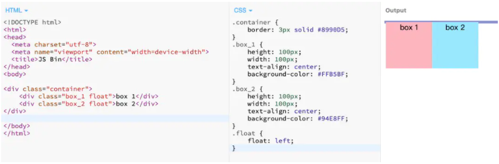

## display

display 是 css 布局中很重要的一个属性，它定义了元素生成的显示框类型，常见的几个属性值有：`grid`、`block`、`inline`、`inline-block`、`inherit`、`none`、`flex`。

每个元素都有默认的 display 属性，比如 div 标签的默认 display 属性是 block；span 标签的默认 display 属性是 inline

> div：
>  没有设置宽度时，它的宽度是其容器的 100%；
>  可以给块级元素设置宽高、内边距、外边距等盒模型属性；
>  块级元素可以包含块级元素和行内元素；
>  常见的块级元素：`
`、`<h1>` ~ `<h6>`、`
`、`<ul>`、`<ol>`、`<dl>`、`<table>`、`<address>` `<form>` 等。

> Span：
>  行内元素不会独占一行，只会占领自身宽高所需要的空间；
>  给行内元素设置宽高不会起作用，margin 值只对左右起作用，padding 值也只对左右起作用；
>  行内元素一般不可以包含块级元素，只能包含行内元素和文本；
>  常见的行内元素 `<a>`、`<b>`、`<label>`、``、``、`<em>`、`<strong>`、`<i>`、`<input>` 等。

> Grid布局常用套路：容器定义布局方式为**网格布局**,按照项目需求去划分网格

## position(定位)

 relative：相对定位，相对于元素的正常位置进行定位；
		absolute：绝对定位，相对于除 static 定位以外的元素进行定位；
		fixed：固定定位，相对于浏览器窗口进行定位，网站中的固定 		header 和 footer 就是用固定定位来实现的；
		static：默认值，没有定位属性，元素正常出现在文档流中；
		inherit：继承父元素的 position 属性值。 

视图讲解; https://developer.mozilla.org/en-US/docs/Web/CSS/position

### Relative

 position 为 relative，但是不添加额外属性（left，right，top，bottom 等），它表现的如同 static 一样。但是注意红色框部分，由于特殊设置，偏离普通流（normal flow）

> 注意下面的图中， box2本身的地方并不会被下面的box3占掉，但是box2会偏离

### Aboslute

absolute 会相对于最近的除 static 定位以外的元素进行定位，在使用时要注意设置父元素（或祖先元素）的 position 属性，若父元素（或祖先元素）都没有设置定位属性，absolute 会找到最上层即浏览器窗口，相对于它进行定位了。

absolute中，组件的位置与父元素息息相关，**父元素移动它也会跟着动**。

**absolute的位置注意**

### Fixed

fixed 是相对于浏览器窗口的定位，一旦位置确定， 元素位置也不会改变

## Float

float 属性定义元素在哪个方向浮动，常用属性值有 left、right，即向左浮动和向右浮动。设置了 float 的元素，会脱离文档流，然后向左或向右移动，直到碰到父容器的边界或者碰到另一个浮动元素。块级元素会忽略 float 元素，文本和行内元素却会环绕它，所以 float 最开始是用来实现文字环绕效果的。
 

当子元素设置浮动属性后，子元素会溢出到父元素外，父元素的宽高也不会被撑开了，称之为“**高度塌陷**”。

### 清除浮动方案：

#### 1.clear

`clear` 属性用来定义哪一侧不允许其他元素浮动，常见的值有 left 、right、both， 比如表示左侧不允许浮动元素

#### 2.使用br标签

br 自带 clear 属性，clear 属性有 left、right 和 all 三个属性值可选。

#### 3.给父元素设置 overflow

添加 overflow 能解决问题，但是也可能因为内容增加导致超出尺寸的内容被隐藏

#### 4.使用after伪元素

基本layout demo：

https://1linelayouts.glitch.me/

## 布局易错点

### 页面长度过长 - 有用relative

乍一眼，好像挺正常，但是实际上看具体的

Page 是最外面的布局，哎 居然比最外面标签还长，这里出现的话，就是不管你再怎么调整最外面的page 或者 wapper 标签页是不管用的

我这里练习的问题是： 

这个磁盘的img这个外层div 是relative的  & 上面的指针也是relative 这里就会造成布局问题