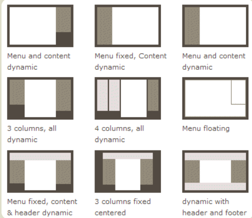
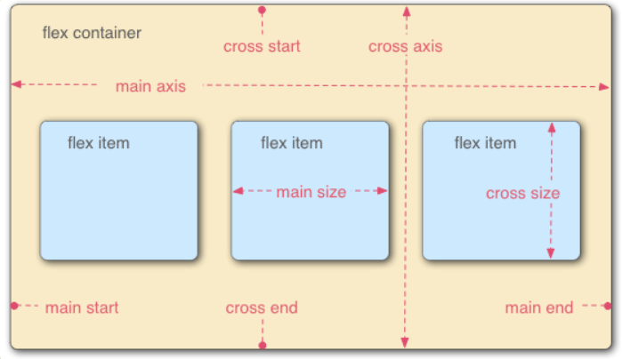
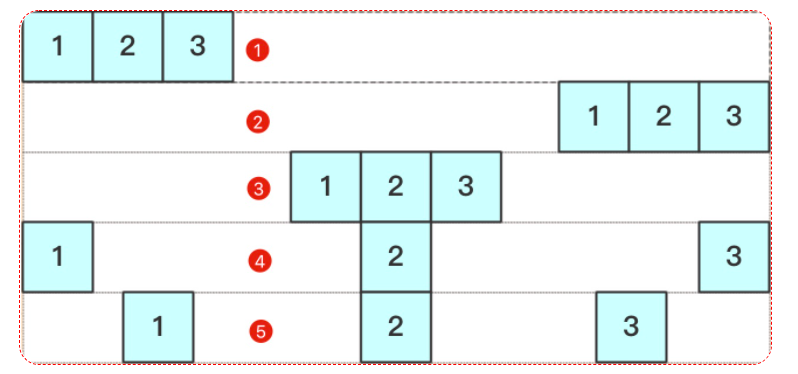
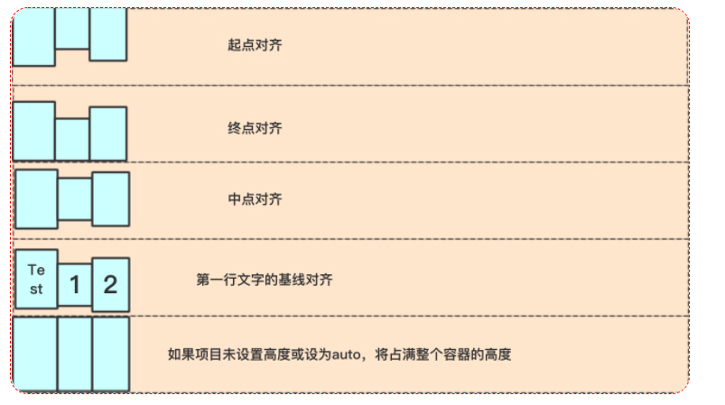
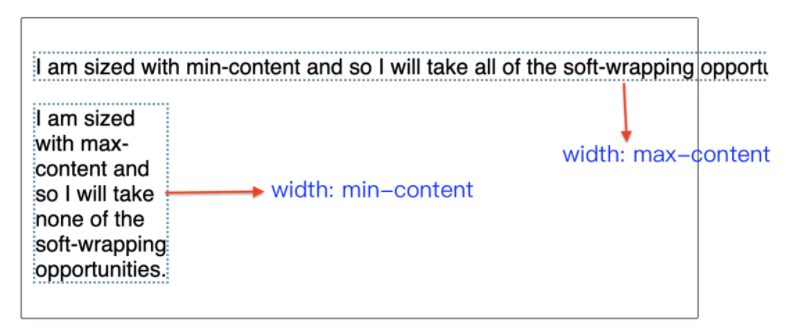

**盒子模型**   ---   依赖 [`display`](https://developer.mozilla.org/en-US/docs/Web/CSS/display) 属性 + [`position`](https://developer.mozilla.org/en-US/docs/Web/CSS/position)属性 + [`float`](https://developer.mozilla.org/en-US/docs/Web/CSS/float)属性

**Flex 布局**   ---   flex属性是`flex-grow`, `flex-shrink` 和 `flex-basis` 的简写 

**Flex 布局以后，子元素的`float`、`clear`和`vertical-align`属性将失效**



```css
.div {
  -webkit-box-orient:horizontal | vertical;/*-webkit-box-orient控制主轴和侧轴分别是哪一根 Safari 6.1 (及更新浏览器) 通过 -webkit-flex 属性支持*/
  flex-direction: row | row-reverse | column | column-reverse; /*主轴的方向*/
  flex-wrap: nowrap | wrap | wrap-reverse;/* 挤一行 换行 反向走*/
  flex-flow: <flex-direction> || <flex-wrap>;/*flex-direction属性和flex-wrap*/
  align-content: flex-start | flex-end | center | space-between | space-around | stretch;
    /*align-content属性定义了多根轴线的对齐方式。如果项目只有一根轴线，该属性不起作用。
    align-content  https://developer.mozilla.org/en-US/docs/Web/CSS/align-content  */
}
```

```css
  justify-content: flex-start | flex-end | center | space-between | space-around;/*项目在主轴上的对齐方式   左 右 中 两端&间隔对等 每个两侧间隔相等*/
```



```css
  align-items: flex-start | flex-end | center | baseline | stretch;/*项目对其方式 上下中 第一行文字的基线对齐 拉伸（默认）*/
```




```css
.item {
  order: <integer>;/*项目的排列顺序。数值越小，排列越靠前，默认为0。*/
  flex-grow: number|initial|inherit;/*弹性盒子的扩展比率*/
  flex-shrink: <number>; /* default 1 在所有因子相加之后计算比率来进行空间收缩*/
  flex-basis / flex-grow: <width> | sizing keywords | content | auto; /* default auto */
  align-self: auto | flex-start | flex-end | center | baseline | stretch;
  /*align-self属性允许单个项目有与其他项目不一样的对齐方式，可覆盖align-items属性*/
}
```

`max-content`: 尺寸值会变得尽可能大, 没有自动换行的机会. 如果`flex`容器**太窄**， 它就会**溢出**其自身的盒子。

`min-content`: 文本已尽可能抓住机会来自动换行, 变得尽可能小且没有溢出。



注意：

当元素的排列方向为**横**向：

​	元素的总宽度小于容器的宽度，使用flex-grow属性；

​	元素的总宽度大于容器的宽度，使用flex-shrink属性；

当元素排列的方向为**纵**向：

​	元素的总高度小于容器的高度，使用flex-grow属性；

​	元素的总高度小于容器的高度，使用flex-shrink属性；

## Flex Layout Reference

https://css-tricks.com/snippets/css/a-guide-to-flexbox/

https://developer.mozilla.org/en-US/docs/Web/CSS/CSS_Flexible_Box_Layout

#  Flexbox  demo

DEMO地址:
https://lincenying.github.io/vue2-flex/

仓库地址:
https://github.com/lincenying/vue2-flex

# Flexbox 布局demo

仓库地址:
https://github.com/philipwalton/solved-by-flexbox

DEMO地址:
https://philipwalton.github.io/solved-by-flexbox/

该实例列举 6 中常见的布局方式, 包括:

1. 网格系统
   https://philipwalton.github.io/solved-by-flexbox/demos/grids/
2. 圣杯布局
   https://philipwalton.github.io/solved-by-flexbox/demos/holy-grail/
3. input 拓展
   https://philipwalton.github.io/solved-by-flexbox/demos/input-add-ons/
4. 图文排版
   https://philipwalton.github.io/solved-by-flexbox/demos/media-object/
5. 固定底部
   https://philipwalton.github.io/solved-by-flexbox/demos/sticky-footer/
6. 绝对居中
   https://philipwalton.github.io/solved-by-flexbox/demos/vertical-centering/