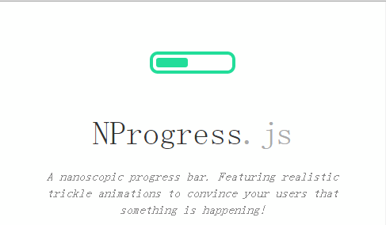

[NProgress官方地址](http://ricostacruz.com/nprogress/)



## 引入办法

### Add [nprogress.js](http://ricostacruz.com/nprogress/nprogress.js) and [nprogress.css](http://ricostacruz.com/nprogress/nprogress.css) to your project.

```
<script src='nprogress.js'></script>
<link rel='stylesheet' href='nprogress.css'/>
```

### NProgress is available via [bower](http://bower.io/search/?q=nprogress) and [npm](https://www.npmjs.org/package/nprogress).

```sh
npm install --save nprogress
```
```js
import NProgress from "nprogress";
```

## 用法

### 基本用法

NProgress最重要两个API就是start()和done()，基本一般用这两个就足够了。

```js
NProgress.start(); //显示进度条
NProgress.done(); //完成进度条
```

```html
<body>
  <button id="btn">请求</button>
  <script src="nprogress.js"></script>
  <script src="jquery.js"></script>
  <script>
    $(document)
      .ajaxStart(function () {
      	//请求开始了
		NProgress.start();
      })
      .ajaxStop(function () {
		//请求结束了
		NProgress.done();
      })
    $('#btn').on('click', function () {
      $.get('time.php')
    })
  </script>
</body> 
```

### 高级用法

（1）百分比：通过设置progress的百分比，调用 .set(n)来控制进度，其中n的取值范围为0-1。
```js
NProgress.set(0.0);    
NProgress.set(0.4);
NProgress.set(1.0);    
```
（2）递增：要让进度条增加，只要调用 .inc()。这会产生一个随机增量，但不会让进度条达到100%。此函数适用于图片加载或其他类似的文件加载。
```js
NProgress.inc();
NProgress.inc(0.2);    // This will get the current status value and adds 0.2 until status is 0.994
```
（3）强制完成：通过传递 true 参数给done()，使进度条满格，即使它没有被显示。
```js
NProgress.done(true);
```
### NProgress 其他配置

（1）minimum：设置最低百分比
```js
NProgress.configure({minimum:0.1});
```
（2）template：改变进度条的HTML结构。为保证进度条能正常工作，需要元素拥有role=’bar’属性。
```js
NProgress.configure({
	template:"<div class='....'>...</div>"
});
```
（3）ease：调整动画设置，ease可传递CSS3缓冲动画字符串（如ease、linear、ease-in、ease-out、ease-in-out、cubic-bezier）。speed为动画速度（单位ms）。
```js
NProgress.configure({ease:'ease',speed:500});
```

## vue 中使用例子

别问为啥写 ，问就是怕忘

在main.js中引入,设置

```js
import NProgress from 'nprogress'
import 'nprogress/nprogress.css'
 
//页面打开时显示
router.beforeEach((to,from,next) => {
  NProgress.start() 
  next()
})
 
//页面加载完成
router.afterEach(() => {
  NProgress.done()
})
 
//进度条速度，一般不用控制自行加载
NProgress.inc(0.2);
NProgress.configure({
  easing: 'ease',  // 动画方式
  speed: 500,  // 递增进度条的速度
  showSpinner: false, // 是否显示加载ico
  trickleSpeed: 200, // 自动递增间隔
  minimum: 0.3 // 初始化时的最小百分比
})
```

样式修改（尽量在APP.VUE中添加）
```css
  /*进度条*/
  #nprogress .bar {
    height: 3px;
    background: #fe9600;
    z-index: 1000;
  }

  #nprogress .peg {
    box-shadow: 0 0 10px #fe9600, 0 0 5px #fe9600;
}
```