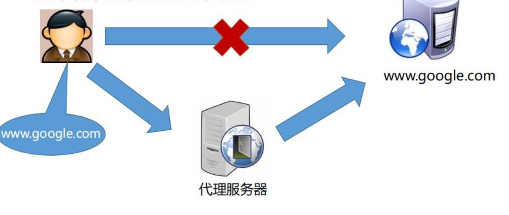
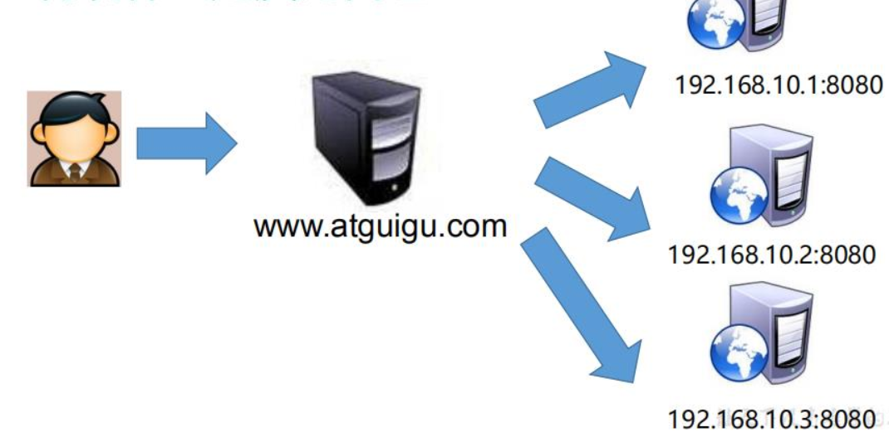
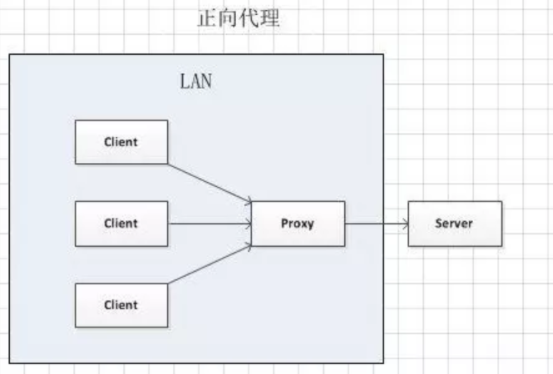
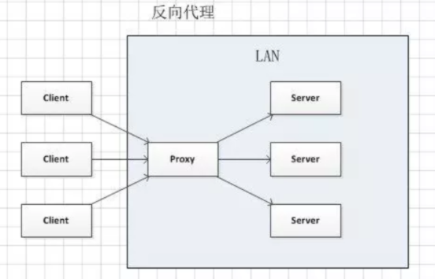
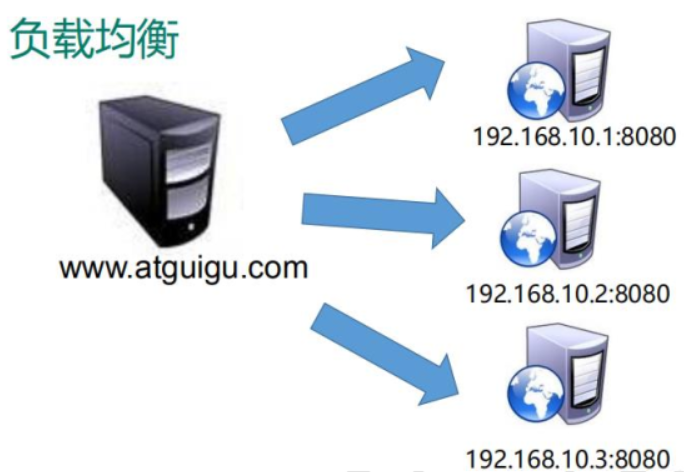
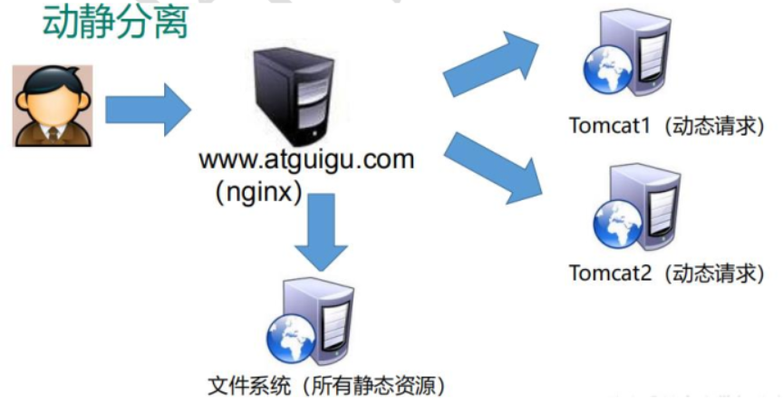

## Nginx的简介

Nginx 是高性能的 HTTP 和反向代理的服务器，处理高并发能力是十分强大的，能经受高负载的考验，有报告表明能支持高达 50000 个并发连接数。

> Nginx ("engine x")是一个高性能的HTTP和反向代理服务器，特点是占有内存少，并发能
> 力强，事实上nginx的并发能力确实在同类型的网页服务器中表现较好
>
> Nginx专为性能优化而开发，性能是其最重要的考量，实现上非常注重效率，能经受高负载
> 的考验，有报告表明能支持高达50000个并发连接数。

Nginx能做什么？

- 正向代理
- 反向代理
- 动静分离

## Nginx用处1：正向和反向代理

### 正向代理

正向代理 是一个位于客户端和原始服务器(origin server)之间的服务器，为了从原始服务器取得内容，客户端向代理发送一个请求并指定目标(原始服务器)，然后代理向原始服务器转交请求并将获得的内容返回给客户端。

**客户端必须要进行一些特别的设置才能使用正向代理**

正向代理的用途：

- 访问原来无法访问的资源，如 Google （利用VPN）

- 可以做缓存，加速访问资源

### 反向代理 reverse proxy

反向代理对外都是透明的，访问者者并不知道自己访问的是一个代理。因为客户端不需要任何配置就可以访问。

**反向代理是一种可以集中地调用内部服务，并提供统一接口给公共客户的 Web 服务器。客户端不用干任何事情！！**

反向代理实际运行方式是指以代理服务器来接受连接请求，然后将请求转发给内部网络上的服务器，并将从服务器上得到的结果返回给请求连接的客户端，此时**代理服务器对外就表现为一个服务器**。

反向代理的作用：

- 保证内网的安全。隐藏后端服务器的信息，屏蔽黑名单中的 IP，限制每个客户端的连接数。
- 提高可扩展性和灵活性。客户端只能看到反向代理服务器的 IP，这使你可以增减服务器或者修改它们的配置。
- 缓存。直接返回命中的缓存结果
- 静态内容直接返回：

​     HTML/CSS/JS
​     图片
​     视频
​     等等

- 负载均衡，通过反向代理服务器来优化网站的负载

## 正向和反向代理 对比

**正向代理中，proxy和client同属一个LAN，对server透明（server不知道谁访问了你）**

**反向代理中，proxy和server同属一个LAN，对client透明（client不知道访问的具体是谁）**

实际上proxy在两种代理中做的事都是代为收发请求和响应，不过从结构上来看正好左右互换了下，所以把后出现的那种代理方式叫成了反向代理。

## Nginx用处2：负载均衡

### 出现原因

随着信息数量的不断增长，访问量和数据量的飞速增长，以及系统业务的复杂度增加，这种架构会造成服务器相应客户端的请求日益缓慢，并发量特别大的时候，还容易造成服务器直接崩溃

### 解决方法

**升级服务器的配置**，**集群**（增加服务器数量- 也就有了负载均衡这个办法）

**将请求分发到各个服务器上，将原先请求集中到单个服务器上的情况改为将请求分发到多个服务器上，将负载分发到不同的服务器**，也就是我们所说的**负载均衡**

## Nginx用处3：动静分离

为了加快网站的解析速度，可以把动态页面和静态页面由不同的服务器来解析，加快解析速度。降低原来单个服务器的压力。

## 拓展：**IMAP/POP3/SMTP 代理服务器含义**

1. POP3
POP3是Post Office Protocol 3的简称，即邮局协议的第3个版本，是TCP/IP协议族中的一员（默认端口是110）。本协议主要用于支持使用客户端远程管理在服务器上的电子邮件。

2. IMAP
IMAP全称是Internet Mail Access Protocol，即交互式邮件访问协议，是一个应用层协议（端口是143）。用来从本地邮件客户端（Outlook Express、Foxmail、Mozilla Thunderbird等）访问远程服务器上的邮件。

3. SMTP
    SMTP的全称是“Simple Mail Transfer Protocol”，即简单邮件传输协议（25号端口）。它是一组用于从源地址到目的地址传输邮件的规范，通过它来控制邮件的中转方式。SMTP 协议属于 TCP/IP 协议簇，它帮助每台计算机在发送或中转信件时找到下一个目的地。

  SMTP是一个“推”的协议，它不允许根据需要从远程服务器上“拉”来消息。SMTP服务器就是遵循SMTP协议的发送邮件服务器，SMTP认证就是要求必须在提供了账户名和密码之后才可以登录 SMTP 服务器，这就使得那些垃圾邮件的散播者无可乘之机。