## 基本下载以及安装

（这里一开始百思不得其解 ，以为直接在windows安装就行，然后发现基本所有网上的教程都是在Linux上的，所以这里如果你要安装Linux 看这个文章，如果你只是想了解windows基本安装以及基本操作接着往下）

[Nginx 官方下载](http://nginx.org/en/download.html)

[Nginx官方文档](http://nginx.org/en/docs/beginners_guide.html)

下载后，解压并启动Nginxzhesh
```sh
cd c:\
unzip nginx-1.18.0.zip
cd nginx-1.18.0
start nginx
```
查询是否启动Nginx
```sh
tasklist /fi "imagename eq nginx.exe"
```
|映像名称|PID 会话名|会话#|内存使用|
|---|---|---|----|
|nginx.exe|7824 Console|1|8,860 K|
|nginx.exe|7472 Console|1| 9,200 |
注意，配置文件中的文件路径分隔符要用“/”，而不是“\”。

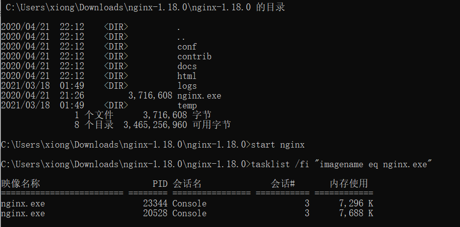

Nginx/Windows 作为一个标准后台应用（非服务）在运行，可以用以下命令行管理已运行Nginx。
```sh
nginx -s stop	#fast shutdown
nginx -s quit	#graceful shutdown
nginx -s reload	#changing configuration, starting new worker processes with a new configuration, graceful shutdown of old worker processes
nginx -s reopen	#re-opening log files
```
```sh
start nginx  #启动
nginx -v  #查看ngnix版本
nginx -h #ngnix命令更多细节 
```

## Nginx的配置文件

### **第一部分：全局快**

 从配置文件开始到 events 块之间的内容，主要会设置一些影响 nginx 服务器整体运行的配置指令，主要包括配

置运行 Nginx 服务器的用户（组）、允许生成的 worker process 数， 进程 PID 存放路径、日志存放路径和类型以

及配置文件的引入等。

```
events {
    worker_connections  1024;
}
```

 比如：worker_processes 1;

 这是 Nginx 服务器并发处理服务的关键配置， worker_processes 值越大，可以支持的并发处理量也越多，但是

会受到硬件、软件等设备的制约

### **第二部分：events块**

events 块涉及的指令主要影响 Nginx 服务器与用户的网络连接，常用的设置包括是否开启对多 work process

下的网络连接进行序列化，是否允许同时接收多个网络连接，选取哪种事件驱动模型来处理连接请求，每个 word

process 可以同时支持的最大连接数等。


上述例子就表示每个 work process 支持的最大连接数为 1024.

这部分的配置对 Nginx 的性能影响较大，在实际中应该灵活配置。

### **第三部分：http块**

```config
http {
    include       mime.types;
    default_type  application/octet-stream;

    #log_format  main  '$remote_addr - $remote_user [$time_local] "$request" '
    #                  '$status $body_bytes_sent "$http_referer" '
    #                  '"$http_user_agent" "$http_x_forwarded_for"';

    #access_log  logs/access.log  main;

    sendfile        on;
    #tcp_nopush     on;

    #keepalive_timeout  0;
    keepalive_timeout  65;#nginx 作为代理，他的时间是客服端以及服务器的两倍

    #gzip  on;

    server {
        listen       8880;
        server_name  localhost;# 如果要输入其他 需要域名

        #charset koi8-r;

        #access_log  logs/host.access.log  main;

        location / {
            root    C:\Users\x\Documents\GitHub\VUE\admin_library\dist;
            try_files $uri $uri/ /index.html;
            #root   html;
            #root    dist
            index  index.html index.htm;
        }

        #error_page  404              /404.html;

        # redirect server error pages to the static page /50x.html
        #
        error_page   500 502 503 504  /50x.html;
        location = /50x.html {
            root   html;
        }

        # proxy the PHP scripts to Apache listening on 127.0.0.1:80
        #
        #location ~ \.php$ {
        #    proxy_pass   http://127.0.0.1;
        #}

        # pass the PHP scripts to FastCGI server listening on 127.0.0.1:9000
        #
        #location ~ \.php$ {
        #    root           html;
        #    fastcgi_pass   127.0.0.1:9000;
        #    fastcgi_index  index.php;
        #    fastcgi_param  SCRIPT_FILENAME  /scripts$fastcgi_script_name;
        #    include        fastcgi_params;
        #}

        # deny access to .htaccess files, if Apache's document root
        # concurs with nginx's one
        #
        #location ~ /\.ht {
        #    deny  all;
        #}
    }


    # another virtual host using mix of IP-, name-, and port-based configuration
    #
    #server {
    #    listen       8000;
    #    listen       somename:8080;
    #    server_name  somename  alias  another.alias;

    #    location / {
    #        root   html;
    #        index  index.html index.htm;
    #    }
    #}


    # HTTPS server
    #
    #server {
    #    listen       443 ssl;
    #    server_name  localhost;

    #    ssl_certificate      cert.pem;
    #    ssl_certificate_key  cert.key;

    #    ssl_session_cache    shared:SSL:1m;
    #    ssl_session_timeout  5m;

    #    ssl_ciphers  HIGH:!aNULL:!MD5;
    #    ssl_prefer_server_ciphers  on;

    #    location / {
    #        root   html;
    #        index  index.html index.htm;
    #    }
    #}
}
```

这算是 Nginx 服务器配置中最频繁的部分，代理、缓存和日志定义等绝大多数功能和第三方模块的配置都在这里。

需要注意的是： http 块也可以包括 **http 全局块**、 **server 块**。

**http全局块**

 http 全局块配置的指令包括文件引入、 MIME-TYPE 定义、日志自定义、连接超时时间、单链接请求数上限等。

**server块**

 这块和虚拟主机有密切关系，虚拟主机从用户角度看，和一台独立的硬件主机是完全一样的，该技术的产生是为了

节省互联网服务器硬件成本。

每个 http 块可以包括多个 server 块，而每个 server 块就相当于一个虚拟主机。

而每个 server 块也分为全局 server 块，以及可以同时包含多个 locaton 块。

**1、全局 server 块**

最常见的配置是本虚拟机主机的监听配置和本虚拟主机的名称或 IP 配置。

**2、 location 块**

一个 server 块可以配置多个 location 块。

这块的主要作用是基于 Nginx 服务器接收到的请求字符串（例如 server_name/uri-string），对虚拟主机名称

（也可以是 IP 别名）之外的字符串（例如 前面的 /uri-string）进行匹配，对特定的请求进行处理。地址定向、数据缓

存和应答控制等功能，还有许多第三方模块的配置也在这里进行。

## 基础实战1

**将vue项目打包，并在window电脑实现localhost在指定端口运行**

1. 首先将vue项目打包，`npm run build`，此时会得到dist文件夹
2. 设置nginx.config文件

```
server {
        listen       8880;
        server_name  localhost;# 如果要输入其他 需要域名

        #charset koi8-r;

        #access_log  logs/host.access.log  main;

        location / {
        	# 绝对路径
            root    C:\Users\x\Documents\GitHub\VUE\admin_library\dist;
            try_files $uri $uri/ /index.html;
            # 这里是默认本身的html文件
            #root   html; 
            #当你放文件到nginx目录下的时候
            #root    dist
            index  index.html index.htm;
        }
```
3.  启动nginx，并且reload, 确保运行nginx时候，是按照新的配置运行

这时候 你可以直接访问localhost:8880, 直接可以访问到自己项目的主页

## 基础实践2

在**windows的电脑本身**，（模拟）运行windows服务器，然后将项目启动在本地电脑的ip adress下。 当访问windows 服务器的时候可以，直接访问到项目主页

1. 设置好IIS

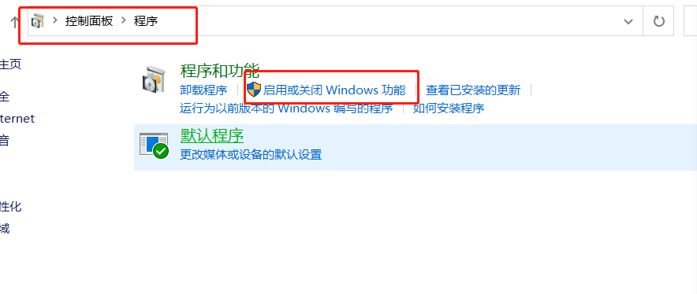

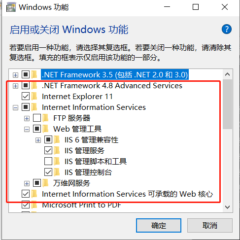


2. 电脑开始进行安装配置~~~ （记得用管理员身份）

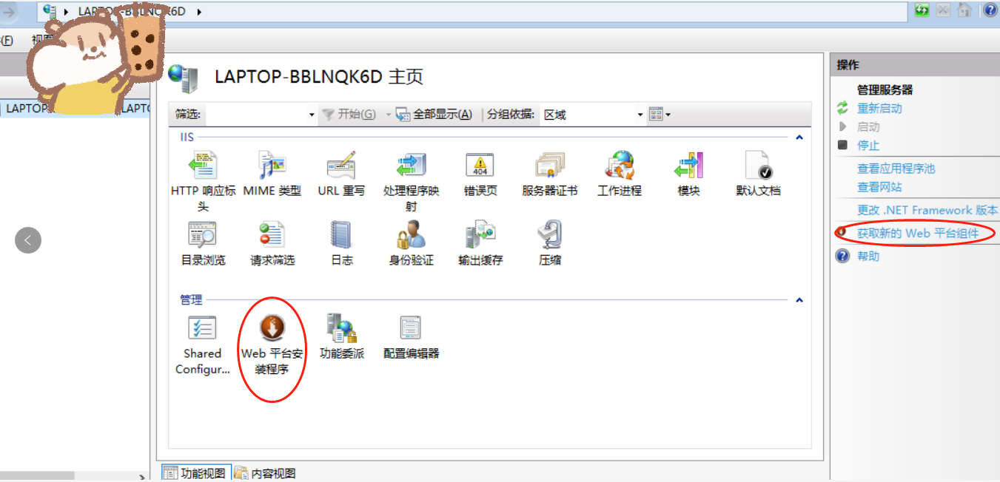

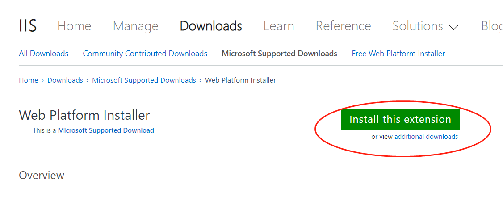

**记得要用在终端输入 `iisreload`**

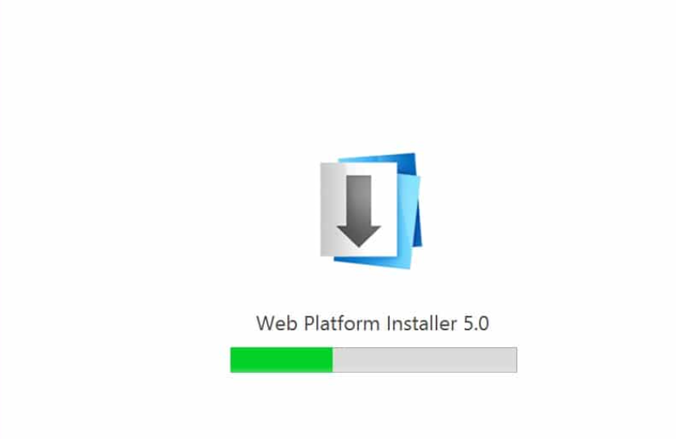

这里之后会有弹窗-web 平台安装软件，请输入**URL**(就是URL这三个字母) 然后**安装 http重定向，重写2.0**

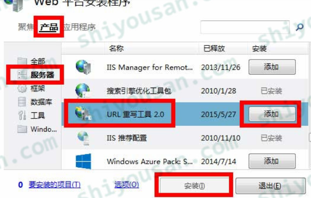

我遇到的错误是：不允许我安装，系统显示错误， 所以到官网安装了

(系统提示是，我的版本低于iis7，但是我明明是10 所以我也不知道为啥，反正官网下面的这个我成功了)

[URL Rewrite](https://www.iis.net/downloads/microsoft/url-rewrite#additionalDownloads)

**记得要用在终端输入 `iisreload`**

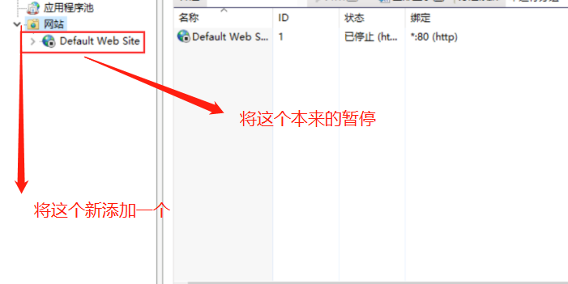

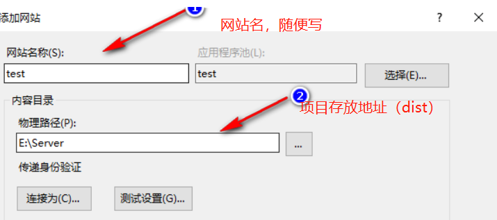

这里的物理地址，建议新创建文件夹，比如新建wwwroot文件，然后将文件的dist文件拉进来，dist文件夹换成项目名字（方便自己查询），然后加上web.config文件

```config
//web.config 文件
<?xml version="1.0" encoding="UTF-8"?>
<configuration>
    <system.webServer>
		<rewrite>
			<rules>
				<rule name="VUE Route" stopProcessing="true">
					<match url=".*" />
					<conditions logicalGrouping="MatchAll">
						<add input="{REQUEST_FILENAME}" matchType="IsFile" negate="true" />
						<add input="{REQUEST_FILENAME}" matchType="IsDirectory" negate="true" />
					</conditions>
					<action type="Rewrite" url="/index.html" />
				</rule>
			</rules>
		</rewrite>
	        <defaultDocument>
	            <files>
	                <clear />
	                <add value="index.html" />
	                <add value="Default.htm" />
	                <add value="Default.asp" />
	                <add value="index.htm" />
	                <add value="iisstart.htm" />
	                <add value="default.aspx" />
	            </files>
	        </defaultDocument>
		    <security >
			    <requestFiltering >
			    	    <requestLimits maxAllowedContentLength="214783648" />
			    </requestFiltering >
		    </security>
    </system.webServer>
</configuration>
```


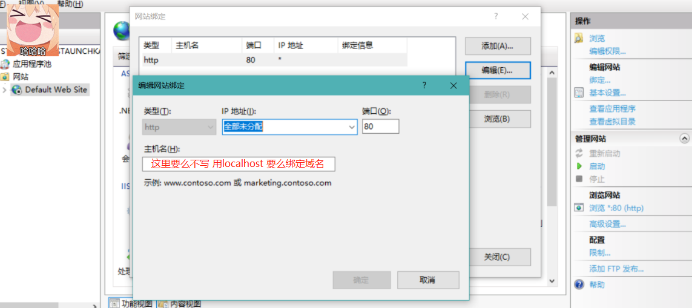

IP地址 —— 一般填写本机的IP地址 

端口 —— 任意端口都可用，不过需要注意不能被别的端口占用，默认为 80 

主机名 —— 这里填写购买的域名，没有则使用上面 IP地址访问

**此时打开localhost：8000可以直接访问到项目首页**

这里一个小实验，如果你们是同属于同样的一个wifi环境下，那么用手机平板都可以通过api进行访问到项目首页

为了查看电脑IP,打开`cmd`命令窗口，输入`ipconfig`,回车，一般来说，在使用ipconfig命令时；显示的IPV4地址就是本机的IP地址

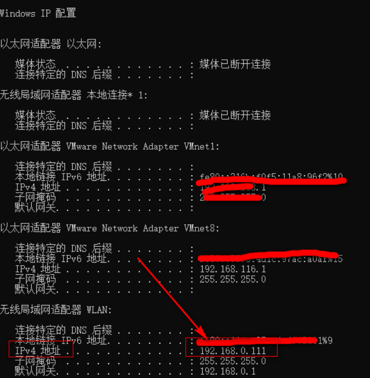

这里用手机平板输入192.168.0.11：8000 可以同样进入项目主页！~~

此时，你的电脑就是一个服务器了， 注意这里的操作就跟基本的windows服务器一样了，搭配环境，连接项目，只是购买的windows服务器不断电，会一直运行，但是你的电脑，估计还是要休息的哦~


## 参考

[Nginx最新教程通俗易懂](https://www.bilibili.com/video/BV1F5411J7vK?p=7)（稍微捋一下大体的思路）

