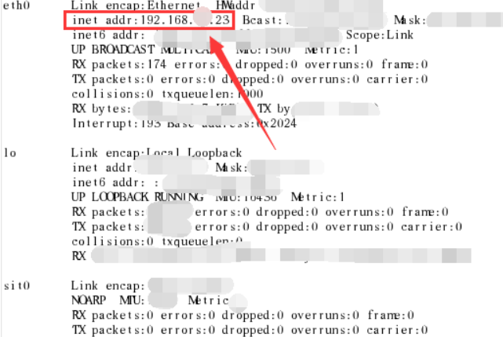
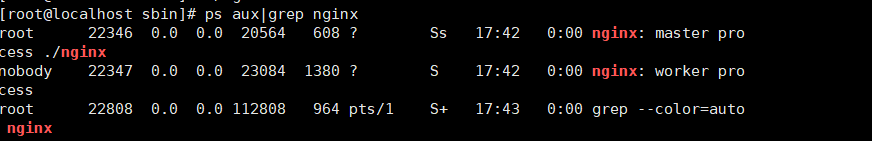
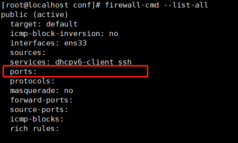
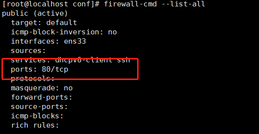
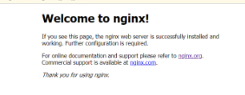

在Linux使用nginx 需要安装的是xshell 以及xftp （直接到[官网申请个人免费版本]( https://www.netsarang.com/zh/xshell-download/)即可 ）

> 网上流传有很多的 Xshell 的破解版、绿色版。但是 Xshell 很多版本存在后门,或上传用户服务器账号密码。这是很可怕的 , 服务器的账号、密码有可能泄露。
> 大家千万千万不要图方便去下载破解、绿色版。一旦公司服务器被黑非常麻烦。同样的公司数据库地址千万不要暴露到公网，如果要暴露公网，一定要设置白名单。
> 实际上官方针对个人账户是有提供免费版本来下载。  

[Linux虚拟机安装看这里]()

## 安装xshell以及xfty

## 设置链接Xshell

查找Linux IP地址

进入到Linux终端后，在里面输入“ifconfig -a” 

点击“Enter”后，查看输出结果，“inet addr：”后面一连串数字就是Linux系统的ip地址。



[xshell链接步骤](https://blog.csdn.net/drf91519/article/details/78607775)

[Xftp链接方法](https://blog.csdn.net/Smile_Luckly/article/details/72639387)

## Linux 安装以及运行nginx

> 如果`yum install gcc-c++`，需要root 管理者身份 使用su - root 切换身份，但是看你有没有设置密码哦，因为要你输入root密码 （有一些需要的话）
>
> 基本最新的系统都帮你安装好了的
>
> **如果作为root，想进入某些文件夹，要在文件路径前面加上/root，因为root用户跟普通用户不一样**

### 1. 打开xshell 以及虚拟机
### 2. 安装nginx相关依赖

```
gcc
pcre
openssl
zlib
```

① 安装 nginx 需要先将官网下载的源码进行编译，编译依赖 gcc 环境，如果没有 gcc 环境，则需要安装：

```
$ yum install gcc-c++
```

② PCRE(Perl Compatible Regular Expressions) 是一个Perl库，包括 perl 兼容的正则表达式库。nginx 的 http 模块使用 pcre 来解析正则表达式，所以需要在 linux 上安装 pcre 库，pcre-devel 是使用 pcre 开发的一个二次开发库。nginx也需要此库。命令：

```
$ yum install -y pcre pcre-devel
```

③ zlib 库提供了很多种压缩和解压缩的方式， nginx 使用 zlib 对 http 包的内容进行 gzip ，所以需要在 Centos 上安装 zlib 库。

```
$ yum install -y zlib zlib-devel
```

④ OpenSSL 是一个强大的安全套接字层密码库，囊括主要的密码算法、常用的密钥和证书封装管理功能及 SSL 协议，并提供丰富的应用程序供测试或其它目的使用。
nginx 不仅支持 http 协议，还支持 https（即在ssl协议上传输http），所以需要在 Centos 安装 OpenSSL 库。

```
$ yum install -y openssl openssl-devel
```

### 3. 安装Nginx

① 下载nginx，两种方式

> a. 直接下载`.tar.gz`安装包，地址：https://nginx.org/en/download.html
>
> b. **使用`wget`命令下载（推荐）**。确保系统已经安装了wget，如果没有安装，执行 yum install wget 安装。

```
$ wget -c https://nginx.org/download/nginx-1.19.0.tar.gz
```

② 依然是直接命令：

```
$ tar -zxvf nginx-1.19.0.tar.gz
$ cd nginx-1.19.0
```

③ 配置：

其实在 nginx-1.12.0 版本中你就不需要去配置相关东西，默认就可以了。当然，如果你要自己配置目录也是可以的。
1.使用默认配置

```
$ ./configure
```

④ 编辑安装

```
$ make && make install
```

查看版本号(`使用nginx操作命令前提条件:必须进入nginx的目录/usr/local/nginx/sbin`.)

```
$ ./nginx -v
```

查找安装路径：

```
$ whereis nginx
```

⑤ 启动，停止nginx

```
$ cd /usr/local/nginx/sbin/
$ ./nginx  # 运行nginx命令
$ ./nginx -s stop
$ ./nginx -s quit
$ ./nginx -s reload
```

查询nginx进程（Linux）：

```
$ ps aux|grep nginx
```

如果你看到下面的界面，欧克 ，你的nginx已经可以跑了



这时候你试试从自己的windows电脑使用ip地址访问 Linux的地址，看看能不能得到nginx启动界面？

如果不行，这里就是防火墙的问题了 我们来检查一下

### 4. 设置防火墙

1. 查看开放的端口号

```
firewall-cmd --list-all
```



 这里的ports中可以看到是没有开放对外接口的，所以怎么可以访问得到，下来我们设置一下


2. 设置开放的端口号

```
firewall-cmd --add-service=http -–permanent

sudo firewall-cmd --add-port=80/tcp --permanent
```
这里就是设置了80 作为开放接口给外面访问

3. 重启防火墙

```
firewall-cmd --reload
```

执行完重启之后 ，再次查看，可以看到下面的结果



这样好了!  就在外面的浏览器可以访问一下了~

**这里有的人会直接把防火墙关掉，个人觉得没必要哦~ 毕竟也就一个口令的事情**

### 5. 完成访问ip地址

这时候输入Linux机器的ip地址就可以访问；得到的就是nginx的运行页面



## 接下来注意了！！！

这里足足卡了我一整天

作为小白的我很痛心，上面虽然是安装了，但是可以看到你访问的是通过local/sbin  ，也就是说 你这个只是本地的，并没有在Linux全局注册。

所以但你尝试将root换成正确的路径的时候，你会发现500错误❌

此时你需要查看error.log

## 开启error以及access log

在conf文件夹中，看到config文件，里面

将comment中的error 以及access log开启

建议将error.log的开启 放入server 里面，更加清晰

**这时候你将会看到 permission deny的错误，无法从定向到指定的root文件**

```
start() "地址" failed Premission denied ......
```


## 将nginx加入全局注册

这里请各位自己找办法 因为我重新安装了~~~ 没有尝试

## 建议全局安装的正确办法

安装都要尽量使用yum

```
sudo yum install epel-release //安装仓库 因为如果没有这个一开始是找不到nginx的 
sudo yum install nginx //仓库中安装nginx
sudo systemctl enable nginx //开机自启动
```

所以安装正确的时候

当你查询`whereis nginx`

```
你会看到以下目录 （起码）
/usr/sbin/nginx /usr/lib64/nginx /sct/nginx /usr/share/nginx .........(如果你本地的还没删除 你还会看到有一个 /usr/local/nginx)
```

运行命令可以变为

```
sudo systemctl （start/stop/reload/restart） nginx
```

## 正式开始配置路由

这里之后你会发现 conf 文件内里面的配置文件有这样一句

```
 include /etc/nginx/default.d/*.conf;
```

所以你可以单独的命名配置文件， 然后他会自动include进来

这里建议将外部的server内容删除，这样只要看include里的就可以了

这里后面的就只是root路径修改了 ，跟上一篇文章windows的修改root地址一样的咯，指向自己的打包文件就可以了

## 注意文件路径，通过pwd查看，是什么就写什么避免驼峰

我卡了3小时， 因为文件路径 /(ㄒoㄒ)/~~


