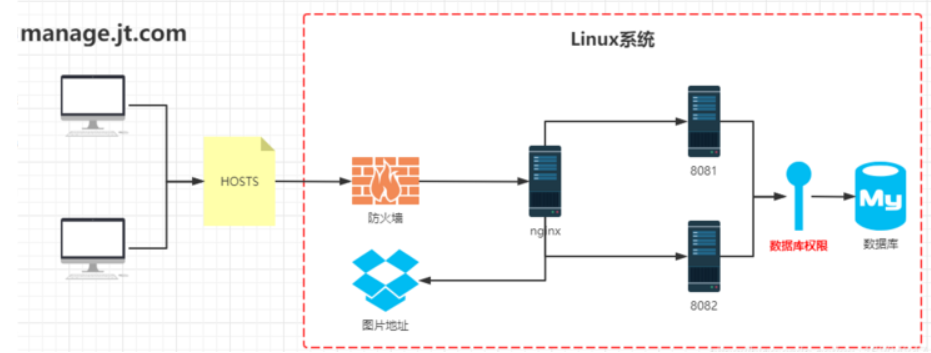
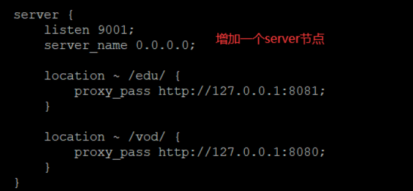
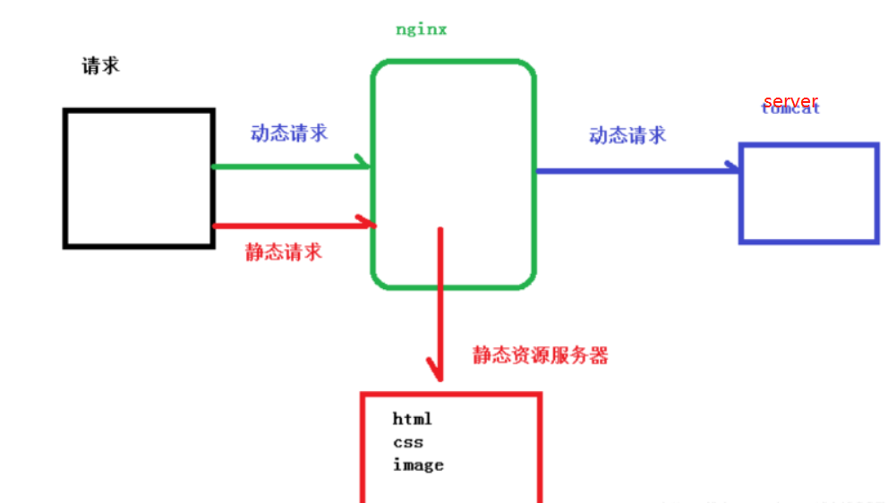
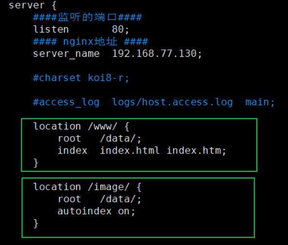
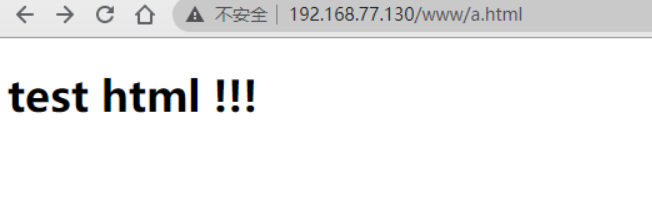
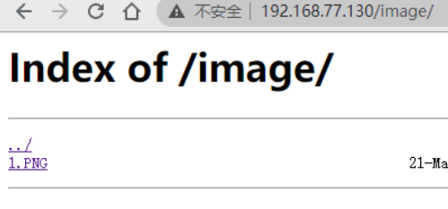

在Linux使用nginx 需要安装的是xshell 以及xftp （直接到[官网申请个人免费版本]( https://www.netsarang.com/zh/xshell-download/)即可 ）

> 网上流传有很多的 Xshell 的破解版、绿色版。但是 Xshell 很多版本存在后门,或上传用户服务器账号密码。这是很可怕的 , 服务器的账号、密码有可能泄露。
> 大家千万千万不要图方便去下载破解、绿色版。一旦公司服务器被黑非常麻烦。同样的公司数据库地址千万不要暴露到公网，如果要暴露公网，一定要设置白名单。
> 实际上官方针对个人账户是有提供免费版本来下载。  

[Linux虚拟机安装看这里]()

## 安装xshell以及xfty

## 设置链接Xshell

查找Linux IP地址

进入到Linux终端后，在里面输入“ifconfig -a” 

点击“Enter”后，查看输出结果，“inet addr：”后面一连串数字就是Linux系统的ip地址。


[xshell链接步骤](https://blog.csdn.net/drf91519/article/details/78607775)

[Xftp链接方法](https://blog.csdn.net/Smile_Luckly/article/details/72639387)

## Linux 安装以及运行nginx  - - - 省时间请直接看选择2

> 如果`yum install gcc-c++`，需要root 管理者身份 使用su - root 切换身份，但是看你有没有设置密码哦，因为要你输入root密码 （有一些需要的话）
>
> 基本最新的系统都帮你安装好了的
>
> **如果作为root，想进入某些文件夹，要在文件路径前面加上/root，因为root用户跟普通用户不一样**

### 1. 打开xshell 以及虚拟机
### 2. 安装nginx相关依赖

```
gcc
pcre
openssl
zlib
```

① 安装 nginx 需要先将官网下载的源码进行编译，编译依赖 gcc 环境，如果没有 gcc 环境，则需要安装：

```
$ yum install gcc-c++
```

② PCRE(Perl Compatible Regular Expressions) 是一个Perl库，包括 perl 兼容的正则表达式库。nginx 的 http 模块使用 pcre 来解析正则表达式，所以需要在 linux 上安装 pcre 库，pcre-devel 是使用 pcre 开发的一个二次开发库。nginx也需要此库。命令：

```
$ yum install -y pcre pcre-devel
```

③ zlib 库提供了很多种压缩和解压缩的方式， nginx 使用 zlib 对 http 包的内容进行 gzip ，所以需要在 Centos 上安装 zlib 库。

```
$ yum install -y zlib zlib-devel
```

④ OpenSSL 是一个强大的安全套接字层密码库，囊括主要的密码算法、常用的密钥和证书封装管理功能及 SSL 协议，并提供丰富的应用程序供测试或其它目的使用。
nginx 不仅支持 http 协议，还支持 https（即在ssl协议上传输http），所以需要在 Centos 安装 OpenSSL 库。

```
$ yum install -y openssl openssl-devel
```

### 3. 安装Nginx

① 下载nginx，两种方式

> a. 直接下载`.tar.gz`安装包，地址：https://nginx.org/en/download.html
>
> b. **使用`wget`命令下载（推荐）**。确保系统已经安装了wget，如果没有安装，执行 yum install wget 安装。

```
$ wget -c https://nginx.org/download/nginx-1.19.0.tar.gz
```

② 依然是直接命令：

```
$ tar -zxvf nginx-1.19.0.tar.gz
$ cd nginx-1.19.0
```

③ 配置：

其实在 nginx-1.12.0 版本中你就不需要去配置相关东西，默认就可以了。当然，如果你要自己配置目录也是可以的。
1.使用默认配置

```
$ ./configure
```

④ 编辑安装

```
$ make && make install
```

查看版本号(`使用nginx操作命令前提条件:必须进入nginx的目录/usr/local/nginx/sbin`.)

```
$ ./nginx -v
```

查找安装路径：

```
$ whereis nginx
```

⑤ 启动，停止nginx

```
$ cd /usr/local/nginx/sbin/
$ ./nginx  # 运行nginx命令
$ ./nginx -s stop
$ ./nginx -s quit
$ ./nginx -s reload
```

查询nginx进程（Linux）：

```
$ ps aux|grep nginx
```

如果你看到下面的界面，欧克 ，你的nginx已经可以跑了


这时候你试试从自己的windows电脑使用ip地址访问 Linux的地址，看看能不能得到nginx启动界面？

如果不行，这里就是防火墙的问题了 我们来检查一下

### 4. 设置防火墙

1. 查看开放的端口号

```
firewall-cmd --list-all
```


 这里的ports中可以看到是没有开放对外接口的，所以怎么可以访问得到，下来我们设置一下


2. 设置开放的端口号

```
firewall-cmd --add-service=http -–permanent

sudo firewall-cmd --add-port=80/tcp --permanent
```
这里就是设置了80 作为开放接口给外面访问

3. 重启防火墙

```
firewall-cmd --reload
```

执行完重启之后 ，再次查看，可以看到下面的结果


这样好了!  就在外面的浏览器可以访问一下了~

**这里有的人会直接把防火墙关掉，个人觉得没必要哦~ 毕竟也就一个口令的事情**

### 5. 完成访问ip地址

这时候输入Linux机器的ip地址就可以访问；得到的就是nginx的运行页面


## 接下来注意了！！！

这里足足卡了我一整天

作为小白的我很痛心，上面虽然是安装了，但是可以看到你访问的是通过local/sbin  ，也就是说 你这个只是本地的，并没有在Linux全局注册。当然 如果你用它来直接proxy pass 可能可以。 但是我的前辈告诉我这样是不对的

所以但你尝试将root换成正确的路径的时候，你会发现500错误❌

此时你需要查看error.log

## 开启error以及access log

在conf文件夹中，看到config文件，里面

将comment中的error 以及access log开启
```
#error_log  logs/error.log;
```

建议将error.log的开启 放入server 里面，更加清晰

**这时候你将会看到 permission deny的错误，无法从定向到指定的root文件**

```
start() "地址" failed Premission denied ......
```


## 将nginx加入全局注册

这里请各位自己找办法 因为我重新安装了~~~ 没有尝试

##  选择2： 建议全局安装的正确办法

linux的软件安装大致可以分为下面三种

> 通过yum安装
> 通过源码安装
> 通过rpm安装

三种安装方式各有差异，yum形式类似于npm安装，简单快捷，自动安装相关依赖；源码安装需要下载源码然后本机编译，可以实现个性化定制，适用于对linux了解较多的进阶用户使用；rpm安装与yum类似，只不过安装的模块来源不是yum官方镜像，而是本地资源；

**安装都要尽量使用yum**

```
sudo yum install epel-release //安装仓库 因为如果没有这个一开始是找不到nginx的 
sudo yum install nginx //仓库中安装nginx
sudo systemctl enable nginx //开机自启动
```

所以安装正确的时候

当你查询`whereis nginx`

```
你会看到以下目录 （起码）
/usr/sbin/nginx /usr/lib64/nginx /sct/nginx /usr/share/nginx .........(如果你本地的还没删除 你还会看到有一个 /usr/local/nginx)
```

**运行命令**可以变为

```sh
sudo systemctl （start/stop/reload/restart） nginx
systemctl reload nginx 
systemctl status nginx #查看nginx 启动状态
ss -tnl | grep 80 #（默认端口） 查看是否监听
LISTEN 0 128 :80:
LISTEN 0 128 :::80 :::

# 备注：如果不能正常访问，关闭防火墙重试
systemctl stop firewalld.service #关闭防火墙
systemctl disable firewalld.service #禁止防火墙开机启动动
firewall-cmd --state #查看默认防火墙状态（关闭为notrunning，开启为running）
systemctl start firewalld.service #重新开启防火墙
```

## 正式开始配置路由

这里之后你会发现 conf 文件内里面的配置文件有这样一句

```
 include /etc/nginx/default.d/*.conf;
```

所以你可以单独的命名配置文件， 然后他会自动include进来

这里建议将外部的server内容删除，这样只要看include里的就可以了

这里后面的就只是root路径修改了 ，跟上一篇文章windows的修改root地址一样的咯，指向自己的打包文件就可以了

## 注意文件路径，通过pwd查看，是什么就写什么避免驼峰

我卡了3小时， 因为文件路径 /(ㄒoㄒ)/~~

## 域名配置

本地如何设置域名绑定IP：

1.修改hosts文件（位置在我的电脑`C:\Windows\System32\drivers\etc`），**右键点击属性，关掉只读用编辑器打开之后才能修改**。
2.在文件末尾添加`<IP><空格><自定义域名>`，保存，IP为Linux的IP。
**3.改完记得在CMD里面刷新C:\Users\Administrator>`ipconfig /flushdns`，之后才会生效。**

## 常见错误

### Nginx配置中更改root目录出现「403 Forbidden」问题排查

- 修改root目录后权限问题：没有读写权限，或用户组不匹配
- 修改root目录后非权限问题：SELinux开启状态

#### 解决办法：

1.修改目录的读写权限为755或修改Nginx用户
命令：`/etc/nginx/nginx.conf`
修改：`user：root root；`

2.关闭SELinux：
命令：`vim /etc/sysconfig/selinux`
添加：`SELINUX=disabled`
###  404错误
解决方法一：修改nginx配置文件---location
解决方法二：在站点目录中创建相应目录或文件数据信息

### 403错误
解决方法一：不要禁止访问
解决方法二：因为没有首页文件

## 对某文件进行修改 permission denied

有管理员权限，最好为sudo

```bash
sudo chmod -R 777 某一目录
```

## 路径的正则

location指令说明。
该指令用于匹配URL。。
语法如下:
```
location [ = | ~ | ~* | ^~] uri {

}
```

- 1、=: 用于不含正则表达式的uri前，要求请求字符串与uri严格匹配，如果匹配成功，就停止继续向下搜索并立即处理该请求
- 2、~: 用于表示uri包含正则表达式，并且区分大小写
- 3、~*: 用于表示uri包含正则表达式，并且不区分大小写
- 4、^~: 用于不含正则表达式的uri前，要求Nginx服务器找到标识uri和请求字

符串匹配度最高的location后，立即使用此location处理请求，而不再使用location块中的正则uri和请求字符串做匹配
**注意: 如果uri包含正则表达式，则必须要有~或者~*标识。**

## 总体的实践大局



## 例1（反向代理）



**效果** 这里就是像开放对外访问的端口号9001，但是这里实际导向的是8080 或者8081的端口

## 例2 负载均衡

**效果** 浏览器地址栏输入地址http://192.168.xxx.xxx/edu/index.html, 负载均衡效果，平均到8080
和8081端口中，

**在http模块中配置**

```
upstream myserver{
server  192.168.0.105:8001 weight=1;
server  192.168.0.105:8002 weight=2;
}
```
**在server模块配置**

```
listen       80;
server_name  192.168.0.105;
location / {
    proxy_pass http://myserver;
    root   html;
    index  index.html index.htm;
}
```

### 负载分配策略

在linux下有Nginx、LVS、 Haproxy 等等服务可以提供负载均衡服务，而且Nginx提供了几种分配方式(策略):。

- **1、轮询(默认)**

  每个请求按时间顺序逐一分配到不 同的后端服务器，如果后端服务器down掉，能自动剔除

- **2、weight**
  weight代表权重默认为1,权重越高被分配的客户端越多。
  指定轮询几率，weight和访问比率成正比，用于后端服务器性能不均的情况。例如: 。

- **3、ip hash**

  每个请求按访问ip的hash结果分配, 这样每个访客固定访问一个后端服务器,可以解诀session的问题。例如:

```
  upstream server pool{
    ip_ hash
    server 192.168.5.21:80
    server 192.168.5.22:80
  }
```

- **4、fair (第三方)**
  按后端服务器的响应时间来分配请求，响应时间短的优先分配

```
  upstream server_pool 
  	server 192.168.5.21:80;
  	server 192.168.5.22:80;
  	fair;
  }
```

## 例3 动静分离



Nginx 动静分离简单来说就是把动态跟静态请求分开，不能理解成只是单纯的把动态页面和静态页面物理分离。严格意义上说应该是动态请求跟静态请求分开，可以理解成使用 Nginx 处理静态页面，Tomcat （server）处理动态页面。动静分离从目前实现角度来讲大致分为两种，

一种是纯粹把静态文件独立成单独的域名，放在独立的服务器上，也是目前主流推崇的方案；

另外一种方法就是动态跟静态文件混合在一起发布，通过 nginx 来分开。 

>通过 location 指定不同的后缀名实现不同的请求转发。通过expires参数设置，可以使浏览器缓存过期时间，减少与服务器之前的请求和流量。具体 Expires 定义：是给一个资源设定一个过期时间，也就是说无需去服务端验证，直接通过浏览器自身确认是否过期即可，所以不会产生额外的流量。此种方法非常适合不经常变动的资源。（如果经常更新的文件，不建议使用 Expires 来缓存），我这里设置 3d，表示在这 3 天之内访问这个 URL，发送一个请求，比对服务器该文件最后更新时间没有变化，则不会从服务器抓取，返回状态码304，如果有修改，则直接从服务器重新下载，返回状态码 200。 

### 具体设置

在 nginx 配置文件中进行配置

添加监听端口、Nginx 地址 、访问名字

重点是添加 location

**autoindex on：目的是为了在访问 /image 时，能够显示目录里面的内容，当然这里也可以通过expire设置缓存过期时间 **



测试结果就是

http://192.168.77.130/www/a.html 



http://192.168.77.130/image/



这里点击图片，是可以访问进去的哦~~~ 

## 教程文档
[NGINX 官方入门指南](https://link.zhihu.com/?target=https%3A//nginx.org/en/docs/)
[NGINX 官方推荐实例](https://link.zhihu.com/?target=https%3A//www.nginx.com/resources/wiki/start/)
[CentOS 7下Nginx服务器的安装配置](https://link.zhihu.com/?target=https%3A//www.linuxidc.com/Linux/2017-04/142986.htm)

[Nginx网站部署](https://www.bbsmax.com/A/MAzAmMG1z9/)