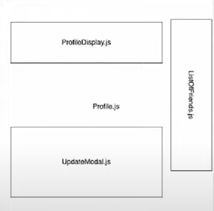
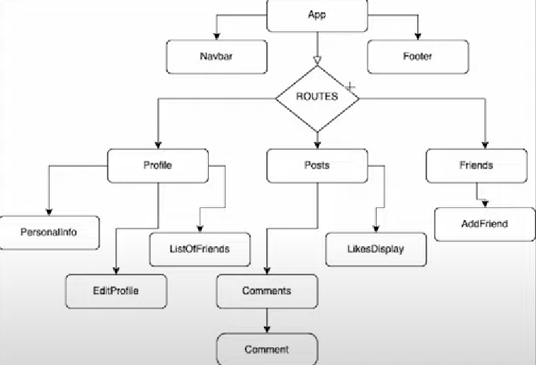

# contrxt API

## 作用: 父 子 孙子 组件多层传递的一个共享通道

```jsx
import React, { useState, createContext, useContext } from "react";

const AppContext = createContext(null);

export const Parent = () => {
  const [userName, setUserName] = useState("PedroTech");

  return (
    <AppContext.Provider value={{ userName, setUserName }}>
      <Child1 />
      <Child2 />
    </AppContext.Provider>
  );
};

export const Child1 = () => {
  const { userName } = useContext(AppContext);

  return <h1> {userName} </h1>;
};

export const Child2 = () => {
  const { setUserName } = useContext(AppContext);
  return (
    <div>
      <button
        onClick={() => {
          setUserName("PedroTechnologies");
        }}
      >
        Change Username
      </button>
    </div>
  );
};
```


## 实际场景

当然下面就包裹app.tsx 或者作为父组件包住对应的部分

### ProfileContextProvider

由于这个hooks 主要服务于需要包括多个组件**共有状态的state**。 比如下面的例子

```jsx
import React, { createContext, useState } from "react";

export const ProfileContext = createContext(null);

export const ProfileContextProvider = ({ children }) => {
  const [userProfileInfo, setUserProfileInfo] = useState(null);
  const [listOfFriends, setListOfFriends] = useState([]);
  const [isOpenUpdateModal, setIsOpenUpdateModal] = useState(null); //这里实际上应该移除，由于会导致多次渲染
  const [newProfileInfo, setNewProfileInfo] = useState(null);//这里实际上应该移除，由于会导致多次渲染

  const value = {
    userProfileInfo,
    setUserProfileInfo,
    isOpenUpdateModal,
    setIsOpenUpdateModal,
    listOfFriends,
    setListOfFriends,
    newProfileInfo,
    setNewProfileInfo,
  };

  return (
    <ProfileContext.Provider value={value}>{children}</ProfileContext.Provider>
  );
};
```

根据我们实际场景，这种共有的比如朋友列表，用户状态其实是很多时间共有的。 可以通过利用context去进行使用。

### ThemeContextProvider

```jsx
import React, { createContext, useState } from "react";

export const ThemeContext = createContext(null);

export const Themes = {
  Light: "light",
  Dark: "dark",
  Ultraviolet: "ultraviolet",
  Colorful: "colorful",
};

export const ThemeContextProvider = ({ children }) => {
  const [currentTheme, setCurrentTheme] = useState(Themes.Light);

  const value = {
    currentTheme,
    setCurrentTheme,
  };

  return (
    <ThemeContext.Provider value={value}>{children}</ThemeContext.Provider>
  );
};
```

### UserContect

```jsx
import React, { createContext, useState } from "react";

export const UserContext = createContext(null);

export const UserContextProvider = ({ children }) => {
  const [userInfo, setUserInfo] = useState(null);
  const [isAuth, setIsAuth] = useState(false);

  const login = () => {
    fetch("/login").then((res) => {
      setIsAuth(true);
      setUserInfo(res.user);
    });
  };

  const logout = () => {
    fetch("/logout").then((res) => {
      setIsAuth(false);
      setUserInfo(null);
    });
  };

  const value = {
    userInfo,
    setUserInfo,
    isAuth,
    setIsAuth,
    login,
    logout,
  };

  return (
    <UserContext.Provider value={value}> {children} </UserContext.Provider>
  );
};

export default UserContext;
```

## 缺点

这里其实可以看到有4个兄弟组件，如果这里username 变化，我们以为child1变化，其他其实不应该rerender

实际上不是的，是整个所有的子都会重新渲染 

```jsx
import React, { useState, createContext, useContext } from "react";

const AppContext = createContext(null);

export const Parent = () => {
  const [userName, setUserName] = useState("PedroTech");
  const [count, setCount] = useState(0);

  return (
    <AppContext.Provider value={{ userName, setUserName, count, setCount }}>
      <Child1 />
      <Child2 />
      <Child3 />
      <Child4 />
    </AppContext.Provider>
  );
};

export const Child1 = () => {
  const { userName } = useContext(AppContext);

  return <h1> {userName} </h1>;
};

export const Child2 = () => {
  const { setUserName } = useContext(AppContext);
  return (
    <div>
      <button
        onClick={() => {
          setUserName("PedroTechnologies");
        }}
      >
        Change Username
      </button>
    </div>
  );
};

export const Child3 = () => {
  const { count } = useContext(AppContext);
  return <h1>{count}</h1>;
};

export const Child4 = () => {
  const { setCount } = useContext(AppContext);
  return (
    <div>
      <button
        onClick={() => {
          setCount((c) => c + 1);
        }}
      >
        Change Count
      </button>
    </div>
  );
};
```

比如上面的ProfileContextProvider，其实缺点很明显



这里会导致多次没必要的重复渲染，并且会有很多麻烦。

实际上应该的做法是

```jsx
  const [isOpenUpdateModal, setIsOpenUpdateModal] = useState(null); //这里实际上应该移除，由于会导致多次渲染
  const [newProfileInfo, setNewProfileInfo] = useState(null);//这里实际上应该移除，由于会导致多次渲染
```

这两个其实很明显会经常变化的，也是可能造成冲突的，应该被关掉。

这里我们再看看正确的例子

```jsx
import React, { createContext, useState } from "react";

export const UserContext = createContext(null);

export const UserContextProvider = ({ children }) => {
  const [user, setUser] = useState(null);
  const [isAuth, setIsAuth] = useState(false);
  const [isPremiumUser, setIsPremiumUser] = useState(false);

  const value = {
    user,
    setUser,
    isAuth,
    setIsAuth,
    isPremiumUser,
    setIsPremiumUser,
  };

  return (
    <UserContext.Provider value={value}> {children} </UserContext.Provider>
  );
};
```

### 复杂实际场景



针对这种，实际上我们要考虑的很多，比如是否真的要用，要在什么场景下，会影响多少组件。

建议就是对应global Var可以给context

