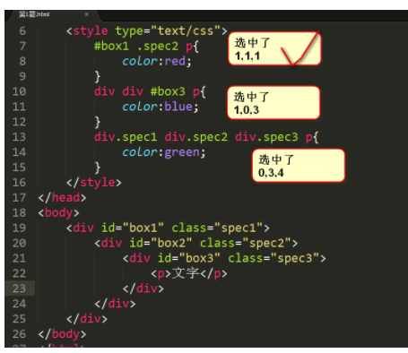
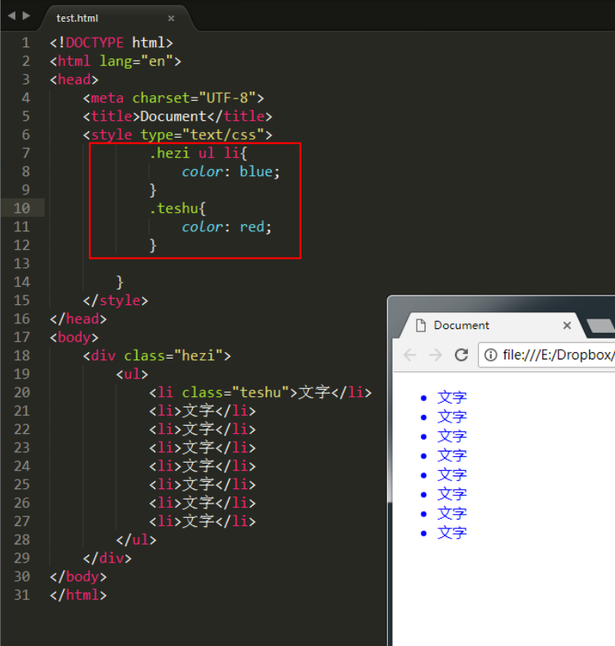
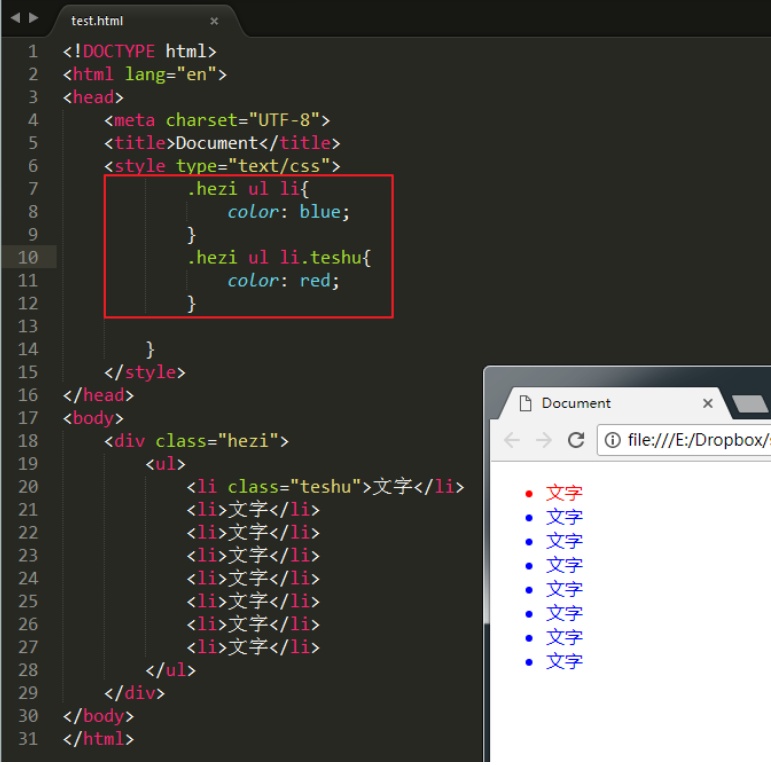
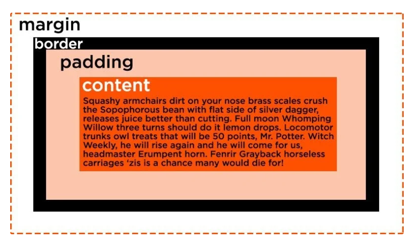
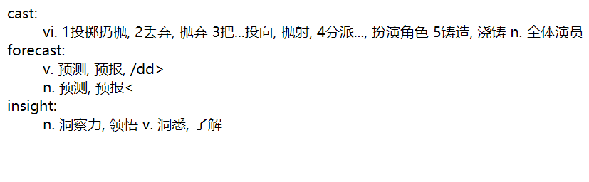
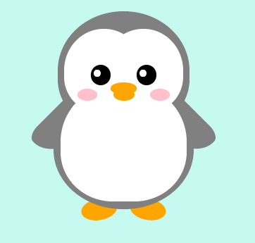

##   普通css（一定要注意继承性）

### 基本选择器 

```css
//基本样式
<h1 style="color: green;">
.className{ }//class      
#id{ }//id	 	
 
h3.class{ } /*并且 选择类名为class的h3标签*/
p#main{ } /*并且 选择ID为main的段落标签*/
p,.hello,#box{}   /*和*/
*{ }
[type='radio/checkbox'] {
  margin: 20px 0px 20px 0px;
}

//兄弟
p~ul	/*选择p元素之后的每一个ul元素 堂的*/
div+p	/*选择所有紧接<div>元素之后的<p>元素 亲的*/

//后代选择器
div .box1{}/*空格 前一个元素所有的后代节点*/
div > .box1{}/*空格 前一个元素直接的后代节点 （不深入）*/

//存在和值属性选择器
[attr]：包含 attr 属性的所有元素
[attr=val]：选择 attr 属性被赋值为 val 的所有元素。
[attr~=val]：以 attr 命名的属性的元素，并且该属性是一个以空格作为分隔的值列表，其中至少一个值为val。
	
```

#### 子串值属性选择器

`[attr|=val]` : 选择attr属性的值是val（包括val）或以val-开头的元素。
		`[attr^=val]` : 选择attr属性的值以val开头（包括val）的元素。
   	`[attr$=val]` : 选择attr属性的值以val结尾（包括val）的元素。
		`[attr*=val]` : 选择attr属性的值中包含字符串val的元素。

#### 伪类选择器：(链接，表单，动态，结构，为元素)

a:link {color: red;} /* 未访问的链接状态 */
   	a:visited {color: green;} /* 已访问的链接状态 */
   	a:hover {color: blue;} /* 鼠标滑过链接状态 */
   	a:active {color: yellow;} /* 鼠标按下去时的状态 */
   	div:first-child last-child root target /*当前活动*/

####    相邻元素选择器

   h1 + p {color:red;} /*选择紧接在 h1 元素后出现的段落，h1 和 p 元素拥有共同的父元素*/

### css 编译实现选择

- 顺序：从上到下（这意味着，如果发生冲突，浏览器将使用最后出现的CSS声明）

   	**但是对于css的冲突, 优先级 **

   **行级样式 > 内嵌样式表 > 外部样式表（就近原则）**

   **ID选择器 > 类选择器 > 标签选择器**

- 层叠

   	1.找出所有相关的规则，这些规则都包含一个选择器
      	   2.计算声明的优先级
      	               先按来源排序
      	               在按选择器的特殊性排序
      	               最终按顺序

####   特殊性计算

 一个选择器的具体特殊性如下确定：

1.  选择器中给定的ID属性值，加0,1,0,0
2.  选择器中给定的各个类属性，属性选择，或伪类，加 0,0,1,0
3. 选择器中的给定的各个元素和伪元素，加0,0,0,1
4.  通配符选择器的特殊性为0,0,0,0
5. 结合符对选择器特殊性没有一点贡献
6. 内联声明的特殊性都是1,0,0,0
7. 继承没有特殊性

   

   

####    冲突例子

   

   由于上面的权重不一致，要么弄成同样的权重 看下面，要么id

   

   **当您绝对需要确保某个元素具有特定的CSS时，可以使用`!important`**

 color: red !important;/*!important不影响就近原则*/

## 基本css复习


- 字体：`<i>,<em>`  斜体        `<strong>,<b>` 加粗

- `<q>`与 `<blockquote>` 的区别

   q标签在本质上与 [blockquote](https://www.w3school.com.cn/tags/tag_blockquote.asp) 是一样的。不同之处在于它们的显示和应用。q 标签用于简短的行内引用。如果需要从周围内容分离出来比较长的部分（通常显示为缩进的块），请使用 blockquote标签。

   也就是 q比blockquote多显示一对双引号 

- `<sup>`和`<sub>` `<sup>`和`<sub>`用于定义上标和下标。例子：

   

- `<del>`刪除文本~~加刪除線~~，`<ins>`為插入<u>文本加下劃線</u>

- 插入代码： `<pre>`行块  `<code>` 块状

- 单位：`px ; % ; em`

   **父子包含的div，width&height会传递影响，要是子 > 父，记得用 px。 % 会受父级width影响**

- 行间距= line-height –font-size

- Spacing : word spacing & word spacing

- Text-align: justify(两边对齐)

- padding / margin : 上，右，下，左

   ```css
   margin: 25px 50px 75px;//上 左右 下
   margin: 25px 50px;// 上下 左右
   margin: 25px//all
   ```

   

- Overflow：内容溢出盒子 visible; scroll; auto; hidden

- Position: static; relative; absolute;fixed

- Z-index

- 自定义css

   ```css
   <style>
     :root { // pseudo-class selector
         --penguin-skin: gray;//全局定义
     }
   
   .penguin {
       --penguin-belly: white; //重新定义，在class内
     }
   </style>
   
   background: var(--penguin-skin);//使用
   //附加一个后备值，如果给定变量无效，则浏览器将还原为该值
   background: var(--penguin-skin, black);
   ```

- 屏幕小于或大于媒体查询断点

  ```css
    @media (max-width: 350px) {
      :root {
      --penguin-size: 200px;
      --penguin-skin: black;
      }
    }
  ```

  

## table

- 不同列表`<ol> ,<li>` vs `<ul>,<li>`       自定义: `<dl>,<dt>(=ul),<dd>(=li)`

- `<tr>`一行`<th>`一头`<td>` 中 & `<Caption>` 标题、`<thead>` 头部、`<tbody>`、`<tfoot>`

- 横向合并–colspan（ colspan="2"） 纵向合并–rowspan

  ```html
  <!--标准列表-->
  <table> 
    <caption>Monthly savings</caption>
    <thead>
    <tr>
      <th>Month</th>
      <th>Savings</th>
    </tr>
    </thead>
    <tr>
      <td rowspan=2 >January</td>
      <td>100</td>
    </tr>
     <tr>
      <td>100</td>
    </tr>
    <tfoot>
    <tr>
      <td colspan=2 >February</td>
    </tr>
    </tfoot>
  </table>
  ```

  

  ```html
  <!--定义自定义列表-->
  <dl>
      <!--定义自定义项目-->
      <dt>cast:</dt>
      <!--定义自定义描述-->
          <dd>vi. 1投掷扔抛, 2丢弃, 抛弃 3把...投向, 抛射, 4分派..., 扮演角色 5铸造, 浇铸 n. 全体演员</dd>
      <dt>forecast:</dt>
          <dd>v. 预测, 预报, /dd>
          <dd>n. 预测, 预报<</dd>
      <dt>insight:</dt>
       <dd>n. 洞察力, 领悟 v. 洞悉, 了解</dd>
  </dl>
  ```

  

- border-collapse & separate (default) 表格的边与内容的边

## Form

- 表单中 action提交服务器的地址 method 提交方式

- select中optgroup组中option 选项 

- Fieldset加表框 里面的legend表边框左上名字（边上）表内label 显示文字

  ```html
  <form action="/action_page.php">
   <fieldset>
    <legend>Personalia:</legend>
    <label>select</label>
      <select>
      <optgroup>
      <option>1</option>
      <option>2</option>
      <option>3</option>
      </optgroup>
      </select><br><br>
    <label for="birthday">Birthday:</label>
    <input type="date" id="birthday" name="birthday"><br><br>
    <input type="submit" value="Submit">
   </fieldset>
  </form>
  ```


penguin

```html
<style>
  .penguin {

    /* Only change code below this line */
    --penguin-skin: gray;
    --penguin-belly: white;
    --penguin-beak: orange;
    /* Only change code above this line */

    position: relative;
    margin: auto;
    display: block;
    margin-top: 5%;
    width: 300px;
    height: 300px;
  }

  .penguin-top {
    top: 10%;
    left: 25%;
    background: var(--penguin-skin, gray);
    width: 50%;
    height: 45%;
    border-radius: 70% 70% 60% 60%;
  }

  .penguin-bottom {
    top: 40%;
    left: 23.5%;
    background: var(--penguin-skin, gray);
    width: 53%;
    height: 45%;
    border-radius: 70% 70% 100% 100%;
  }

  .right-hand {
    top: 0%;
    left: -5%;
    background: var(--penguin-skin, gray);
    width: 30%;
    height: 60%;
    border-radius: 30% 30% 120% 30%;
    transform: rotate(45deg);
    z-index: -1;
  }

  .left-hand {
    top: 0%;
    left: 75%;
    background: var(--penguin-skin, gray);
    width: 30%;
    height: 60%;
    border-radius: 30% 30% 30% 120%;
    transform: rotate(-45deg);
    z-index: -1;
  }

  .right-cheek {
    top: 15%;
    left: 35%;
    background: var(--penguin-belly, white);
    width: 60%;
    height: 70%;
    border-radius: 70% 70% 60% 60%;
  }

  .left-cheek {
    top: 15%;
    left: 5%;
    background: var(--penguin-belly, white);
    width: 60%;
    height: 70%;
    border-radius: 70% 70% 60% 60%;
  }

  .belly {
    top: 60%;
    left: 2.5%;
    background: var(--penguin-belly, white);
    width: 95%;
    height: 100%;
    border-radius: 120% 120% 100% 100%;
  }

  .right-feet {
    top: 85%;
    left: 60%;
    background: var(--penguin-beak, orange);
    width: 15%;
    height: 30%;
    border-radius: 50% 50% 50% 50%;
    transform: rotate(-80deg);
    z-index: -2222;
  }

  .left-feet {
    top: 85%;
    left: 25%;
    background: var(--penguin-beak, orange);
    width: 15%;
    height: 30%;
    border-radius: 50% 50% 50% 50%;
    transform: rotate(80deg);
    z-index: -2222;
  }

  .right-eye {
    top: 45%;
    left: 60%;
    background: black;
    width: 15%;
    height: 17%;
    border-radius: 50%;
  }

  .left-eye {
    top: 45%;
    left: 25%;
    background: black;
    width: 15%;
    height: 17%;
    border-radius: 50%;
  }

  .sparkle {
    top: 25%;
    left: 15%;
    background: white;
    width: 35%;
    height: 35%;
    border-radius: 50%;
  }

  .blush-right {
    top: 65%;
    left: 15%;
    background: pink;
    width: 15%;
    height: 10%;
    border-radius: 50%;
  }

  .blush-left {
    top: 65%;
    left: 70%;
    background: pink;
    width: 15%;
    height: 10%;
    border-radius: 50%;
  }

  .beak-top {
    top: 60%;
    left: 40%;
    background: var(--penguin-beak, orange);
    width: 20%;
    height: 10%;
    border-radius: 50%;
  }

  .beak-bottom {
    top: 65%;
    left: 42%;
    background: var(--penguin-beak, orange);
    width: 16%;
    height: 10%;
    border-radius: 50%;
  }

  body {
    background:#c6faf1;
  }

  .penguin * {
    position: absolute;
  }
</style>
<div class="penguin">
  <div class="penguin-bottom">
    <div class="right-hand"></div>
    <div class="left-hand"></div>
    <div class="right-feet"></div>
    <div class="left-feet"></div>
  </div>
  <div class="penguin-top">
    <div class="right-cheek"></div>
    <div class="left-cheek"></div>
    <div class="belly"></div>
    <div class="right-eye">
      <div class="sparkle"></div>
    </div>
    <div class="left-eye">
      <div class="sparkle"></div>
    </div>
    <div class="blush-right"></div>
    <div class="blush-left"></div>
    <div class="beak-top"></div>
    <div class="beak-bottom"></div>
  </div>
</div>
```

