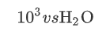

[TOC]


#   普通css

- 选择器 ：.className{ }      #id{ }	 	div.box1{}    p,.hello,#box{}    *{ }

- 字体：`<i>,<em>`  斜体        `<strong>,<b>` 加粗

- `<q>`与 `<blockquote>` 的区别

   q标签在本质上与 [blockquote](https://www.w3school.com.cn/tags/tag_blockquote.asp) 是一样的。不同之处在于它们的显示和应用。q 标签用于简短的行内引用。如果需要从周围内容分离出来比较长的部分（通常显示为缩进的块），请使用 blockquote标签。

   也就是 q比blockquote多显示一对双引号 

- `<sup>`和`<sub>` `<sup>`和`<sub>`用于定义上标和下标。例子：

   

- `<del>`刪除文本~~加刪除線~~，`<ins>`為插入<u>文本加下劃線</u>

- 插入代码： `<pre>`行块  `<code>` 块状

- 不同列表`<ol> ,<li>` vs `<ul>,<li>`       自定义: `<dl>,<dt>(=ul),<dd>(=li)`

- 单位：`px;%;em`

- 行间距= line-height –font-size

- Spacing : word spacing & word spacing

- Text-align: justify(两边对齐)

- padding: 上，右，下，左

- Overflow：内容溢出盒子 visible; scroll; auto; hidden

- Position: static; relative; absolute;fixed

- Z-index

# table

- `<tr>`一行`<th>`一头`<td>` 中 & `<Caption>` 标题、`<thead>` 头部、`<tbody>`、`<tfoot>`

- 横向合并–colspan（ colspan="2"） 纵向合并–rowspan

  ```html
  <table> 
    <caption>Monthly savings</caption>
    <thead>
    <tr>
      <th>Month</th>
      <th>Savings</th>
    </tr>
    </thead>
    <tr>
      <td rowspan=2 >January</td>
      <td>100</td>
    </tr>
     <tr>
      <td>100</td>
    </tr>
    <tfoot>
    <tr>
      <td colspan=2 >February</td>
    </tr>
    </tfoot>
  </table>
  ```

  

- border-collapse & separate (default) 表格的边与内容的边

# Form

- 表单中 action提交服务器的地址 method 提交方式

- Input type：text / password / checkbox / radio / submit

- select中optgroup组中option 选项 

- Fieldset加表框 里面的legend表边框左上名字（边上）表内label 显示文字

  ```html
  <form action="/action_page.php">
   <fieldset>
    <legend>Personalia:</legend>
    <label>select</label>
      <select>
      <optgroup>
      <option>1</option>
      <option>2</option>
      <option>3</option>
      </optgroup>
      </select><br><br>
    <label for="birthday">Birthday:</label>
    <input type="date" id="birthday" name="birthday"><br><br>
    <input type="submit" value="Submit">
   </fieldset>
  </form>
  ```

  