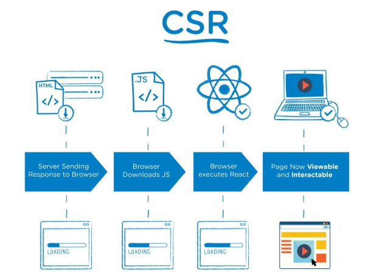
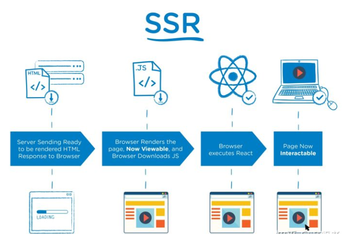
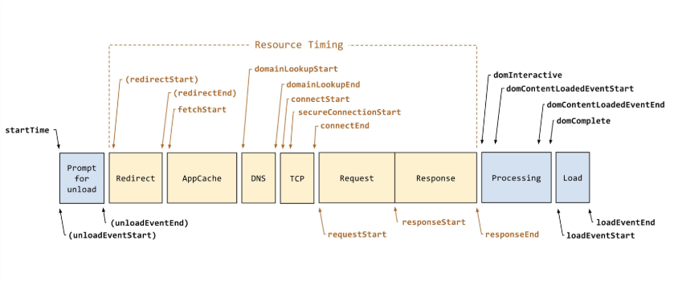

> 关于这部分 之前有笔记[关于optimization的部分](https://savancode.github.io/2021/04/28/Frontend-performance-optimization1-what/)这里重点提及了关于首屏时间的问题，所以接下来只会稍微的带过

## 浏览器端渲染 (CSR)

CSR是Client Side Render简称；页面上的内容是我们加载的js文件渲染出来的，js文件运行在浏览器上面，服务端只返回一个html模板。

## 服务器端渲染 (SSR)

SSR是Server Side Render简称；页面上的内容是通过服务端渲染生成的，浏览器直接显示服务端返回的html就可以了

## 回顾整个URL 到 浏览器解析的过程

- 解析URL
- 浏览器本地缓存
- DNS解析
- 建立TCP/IP连接
- 发送HTTP请求
- 服务器处理请求并返回HTTP报文
- 浏览器根据深度遍历的方式把html节点遍历构建DOM树
- 遇到CSS外链，异步加载解析CSS，构建CSS规则树
- 遇到script标签，如果是普通JS标签则同步加载并执行，阻塞页面渲染，如果标签上有defer / async属性则异步加载JS资源
- 将dom树和CSS DOM树构造成render树
- 渲染render树

对于Performance而言，两个有明显区别：

