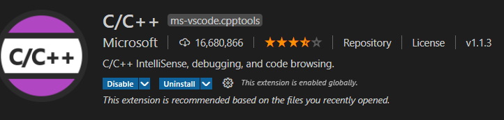

## 使用vscode编译运行和调试C/C++

官方教程： https://code.visualstudio.com/docs/cpp/config-msvc#_cc-configurations
辅助中文教程： https://zhuanlan.zhihu.com/p/77645306

遇到问题可能解法

1. 安装包下载不正确
	官方下载也有可能遇到这样的问题，重新在官方网址找不同入口的下载
2. 替补插件 - 如果有 下面这个也可以的

## Windows命令行中编译运行C/C++程序
https://blog.csdn.net/weixin_45676049/article/details/108018850?utm_medium=distribute.pc_relevant.none-task-blog-BlogCommendFromBaidu-1.control&depth_1-utm_source=distribute.pc_relevant.none-task-blog-BlogCommendFromBaidu-1.control