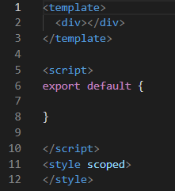
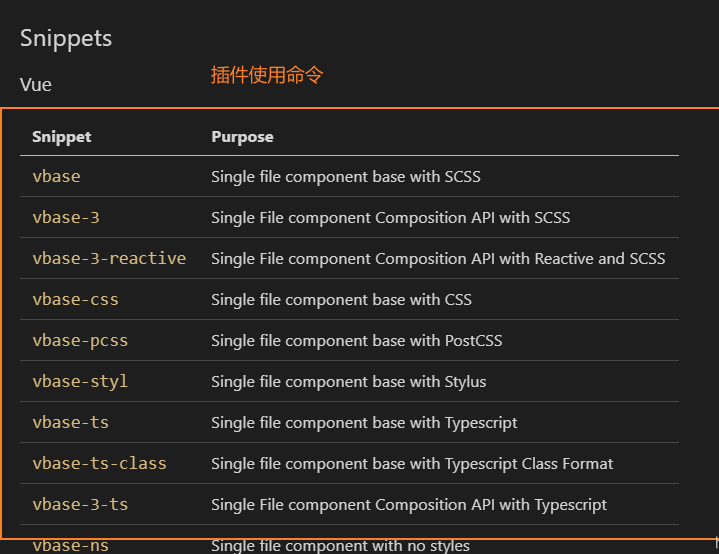

## Vscode 中 Vue的推荐插件

 我还没有找到直接右键直接生成component，并且配置好的插件 /(ㄒoㄒ)/~~ （类似小程序那种不过react也没有 其实~um）


## Vscode快速生成vue组件模板 方法一

第一步: 文件 ----->  首选项  ------>  用户代码片段  -----> 输入vue ------>找到vue.json文件

第二步: 讲下面代码贴进vue.json文件中

```js
"Print to console": {
	"prefix": "vue",
	"body": [
		"<template>",
		"  <div>$0</div>",
		"</template>",
		"",
		"<script>",
		"export default {",
			
		"",
		"}",
		"",
		"</script>",
		"<style scoped>",// 这里scoped的意思是只对当前对象有效
		"</style>"
	],
	"description": "Log output to console"
}
```

第三步 新建vue文件，写上vue之后回车，



## Vscode快速生成vue组件模板 方法2

 安装使用插件Vue VSCode Snippets



新建一个vue组件，输入vb回车后就出来模板内容 

## Reference

https://blog.csdn.net/lanseguhui/article/details/103520190

https://blog.csdn.net/m0_38039437/article/details/113633289?utm_medium=distribute.pc_relevant.none-task-blog-baidujs_baidulandingword-2&spm=1001.2101.3001.4242