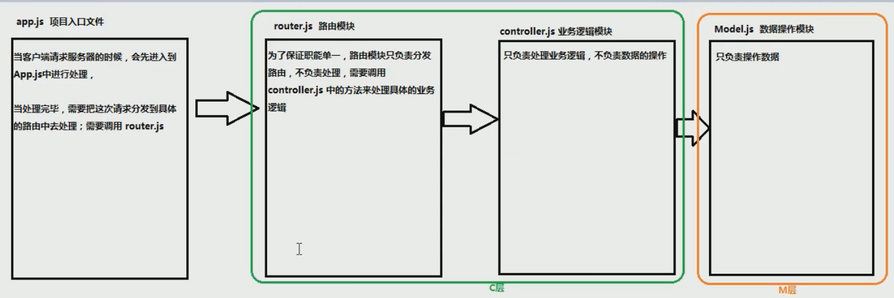
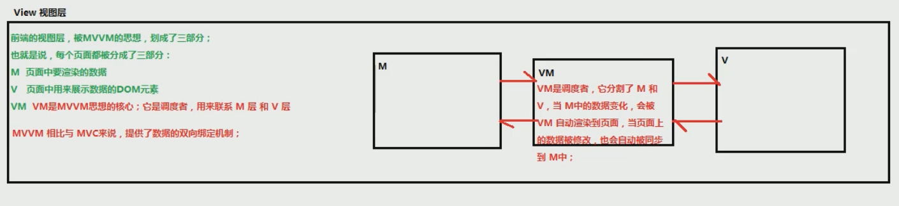
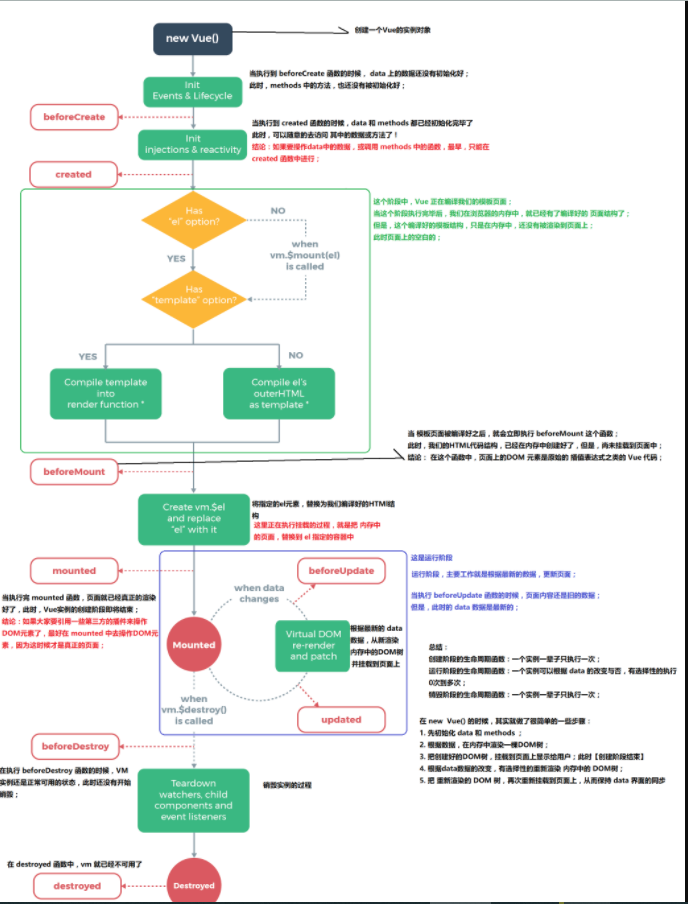

## Vue

vue.js是目前前端web开发最流行的工具库，由尤雨溪在2014年2月发布的。

另外几个常见的工具库：react.js /angular.js/jQuery

官方网站：

 中文：[https://cn.vuejs.org/](https://link.zhihu.com/?target=https%3A//cn.vuejs.org/)

 英文：[https://vuejs.org/](https://link.zhihu.com/?target=https%3A//vuejs.org/)

官方文档：[https://cn.vuejs.org/v2/guide/](https://link.zhihu.com/?target=https%3A//cn.vuejs.org/v2/guide/)

## 框架和库的区别

框架：是一套完整的解决方案；对项目的侵入性较大，项目如果需要更换框架，则需要重新架构整个项目。

- node 中的 express；

库（插件）：提供某一个小功能，对项目的侵入性较小，如果某个库无法完成某些需求，可以很容易切换到其它库实现需求。

- 1. 从Jquery 切换到 Zepto
- 1. 从 EJS 切换到 art-template

## vue.js的M-V-VM思想

MVVM 是Model-View-ViewModel 的缩写，它是一种基于前端开发的架构模式。

`Model` 指代的就是vue对象的data属性里面的数据。这里的数据要显示到页面中。

`View` 指代的就是vue中数据要显示的HTML页面，在vue中，也称之为“视图模板” 。

`ViewModel` 指代的是vue.js中我们编写代码时的vm对象了，它是vue.js的核心，负责连接 View 和 Model，保证视图和数据的一致性，所以前面代码中，data里面的数据被显示中p标签中就是vm对象自动完成的。





## 使用vue

```html
<script src="https://cdn.jsdelivr.net/npm/vue/dist/vue.js"></script>
```

## 简单的暂时Vue

```html
<div id="app">
        <h2>{{message}}</h2>
        <p>{{name}}</p>
</div>
```

```js 
const app1= new Vue({ // 这里的app1 其实就是vm实例，也就是MVVM中的核心VM，提供了核心双向绑定
    el:"#app",
    data:{
        message:"hello vueJs",
        name:"nameing"
    }
}) 
```

> [Vue的书写方式：](https://cn.vuejs.org/v2/style-guide/)
>
> 可以参考官网，推荐使用PascalCase，也就是EmployeeTable`，但在模板中使用时，这将转化为`<employee-table>`
>
> [Vue文档中](https://vuejs.org/v2/guide/components-custom-events.html#sync-Modifier)建议使用`add:employee`语法（相对于`add-employee`其他语法）真的很奇怪~~~ 但是官方建议哦

## vue对象的生命周期



图片来自于 http://doc.cms.liulongbin.top/md/lifecycle.png

```html
 <script>
    window.onload = function(){
        var vm = new Vue({
            el:"#app",
            data:{
                num:0
            },
            beforeCreate:function(){
                console.log("beforeCreate,vm对象尚未创建,num="+ this.num);  //undefined
                this.name=10; // 此时没有this对象呢，所以设置的name无效，被在创建对象的时候被覆盖为0
            },
            created:function(){
                console.log("created,vm对象创建完成,设置好了要控制的元素范围,num="+this.num );  // 0
                this.num = 20;
            },
            beforeMount:function(){
                console.log( this.$el.innerHTML ); // <p>{{num}}</p>
                console.log("beforeMount,vm对象尚未把data数据显示到页面中,num="+this.num ); // 20
                this.num = 30;
            },
            mounted:function(){
                console.log( this.$el.innerHTML ); // <p>30</p>
                console.log("mounted,vm对象已经把data数据显示到页面中,num="+this.num); // 30
            },
            beforeUpdate:function(){
                // this.$el 就是我们上面的el属性了，$el表示当前vue.js所控制的元素#app
                console.log( this.$el.innerHTML );  // <p>30</p>
                console.log("beforeUpdate,vm对象尚未把更新后的data数据显示到页面中,num="+this.num); // beforeUpdate----31
                
            },
            updated:function(){
                console.log( this.$el.innerHTML ); // <p>31</p>
                console.log("updated,vm对象已经把过呢更新后的data数据显示到页面中,num=" + this.num ); // updated----31
            },
        });
    }
    </script>
</head>
<body>
    <div id="app">
        <p>{{num}}</p>
        <button @click="num++">按钮</button>
    </div>
</body> 
```

文字版总结

- 生命周期钩子 = 生命周期函数 = 生命周期事件
- 主要的生命周期函数分类：
  - 创建期间的生命周期函数：
    - beforeCreate：实例刚在内存中被创建出来，此时，还没有初始化好 data 和 methods 属性
    - created：实例已经在内存中创建OK，此时 data 和 methods 已经创建OK，此时还没有开始 编译模板
    - beforeMount：此时已经完成了模板的编译，但是还没有挂载到页面中
    - mounted：此时，已经将编译好的模板，挂载到了页面指定的容器中显示
  - 运行期间的生命周期函数：
    - beforeUpdate：状态更新之前执行此函数， 此时 data 中的状态值是最新的，但是界面上显示的 数据还是旧的，因为此时还没有开始重新渲染DOM节点
    - updated：实例更新完毕之后调用此函数，此时 data 中的状态值 和 界面上显示的数据，都已经完成了更新，界面已经被重新渲染好了！
  - 销毁期间的生命周期函数：
    - beforeDestroy：实例销毁之前调用。在这一步，实例仍然完全可用。
    - destroyed：Vue 实例销毁后调用。调用后，Vue 实例指示的所有东西都会解绑定，所有的事件监听器会被移除，所有的子实例也会被销毁。

> 这里提醒
>
> 当Vue跟nodejs联动的时候，注意created以及mounted函数的区别
>created：表示数据data以及methods都可以用了，所以此处可以直接**call 数据的载入**
> mounted：标识内存中的DOM树已经渲染完成，并且挂载到了真是的页面当中了，所以主要是**第三方的插件的初始化**

## for loop

```html
<div id="forLopp"> 
        <p>{{name}}</p>
        <ul>
            <li v-for="(item, index) in message" :key="index">{{item}}</li>
          </ul>
    </div>
```
```js
    const app2= new Vue({
        el:"#forLopp",
        data:{
            message:["hello vueJs", "hello vueJs","hello vueJs","hello vueJs","hello vueJs"],
            name:"forLopp"
        }
    })
```

> 在vue使用的过程中，如果要初始化操作，把初始化操作的代码放在 mounted 中执行。
> mounted阶段就是在vm对象已经把data数据实现到页面以后。一般页面初始化使用。
>    例如，用户访问页面加载成功以后，就要执行的ajax请求。
> 
> 另一个就是created，这个阶段就是在 vue对象创建以后，把ajax请求后端数据的代码放进 created


## 实现一个简单的计数器 逻辑

```html
 <div id="counter"> 
        <p>{{name}}</p> 
        <p>{{count}}</p>
         <button @click="add">+1</button>
         <button @click="count=0">reset</button>
         <button v-on:click="minus">-1</button> 
```
```js
 const app3= new Vue({
        el:"#counter",
        data:{
            name:"counter",
            count:99, 
        },
        computed: { //立即执行
            newMessage: function () { 
                console.log("calling computed")
                return this.name.split('').reverse().join('')
            }
        },
        methods: {
            add:function(){
                console.log(this,this.count)
                console.log(app3,app3.count)
                this.count++;
            },
            minus(){
                this.count--;
            },
        },
    });
```

## computed methods 以及watch函数 的简单例子

这个例子 不小心跟上面的写一起了 懒得改正了
直接去看页面效果直观

> 在vue解析前，div中有一个属性cloak
> 在vue解析之后，div中没有一个属性v-cloak

这里实际上使用这个timeout,是为了模拟网络延迟，可以清晰看到犹豫链接没有加载出来 而会需要用到cloak

如果不要display为none，则会清晰地看到 连接百度一下的弹出
使用 v-cloak 解決 Vue Instance 完成编译前显示变数的问题。

```html
<div id="counter"> 
        <p>{{name}}</p> 
         <p>use compute</p>
         <p>after computed {{newMessage}}</p>
         <button @click="reverse">点击改变name属性并且调用computed函数</button>
        <p>computed 中getter setter</p>
        <p>{{fullname}}</p>  
    </div>
```
```js
    const app3= new Vue({
        el:"#counter",
        data:{
            name:"counter",
            count:99,
            firstName:"FirstName",
            lastName:"LastName"
        },
        computed: { //立即执行
            newMessage: function () { 
                console.log("calling computed")
                return this.name.split('').reverse().join('')
            },
            //getter
            fullname:function(){
                console.log("getting fullname ing")
                return this.firstName+" "+this.lastName
            },
             // setter
            setName: function (newValue) { 
                var names = newValue.split(' ')
                this.firstName = names[0]
                this.lastName = names[names.length - 1]
            }
        },
        methods: { 
            reverse(){
                this.name="newname"
              console.log(this.newMessage) //这里直接返回结果的哟 不用执行？
            }
        },
    });
```

## html文本内 标签显示 text 

`v-pre`标签 文本不解析
`v-html`直接插入html
`v-text`以文本形式显示,会覆盖

```html
 <div id="html" v-cloak>
        <h2>使用v-html，直接插入html</h2>
        <h2 v-html="href"></h2>
        <h2>使用v-text，以文本形式显示,会覆盖</h2>
        <h2 v-text="message">你看不到我</h2>
        <h2>使用v-pre,不会解析</h2>
        <h2 v-pre>{{message}}</h2> <p>这是解析的我： {{message}}</p>
    </div>
```
```js
   setTimeout(() => {
        const app4=new Vue({
        el:"#html",
        data:{
            href:"<a href='http://www.baidu.com'>百度一下</a>",
            message:"你只能看到我"
        },
    })
    }, 1000); 
```

### V-text 与 插值表达式

- 插值表达式只会插入内容，并不会清楚之前的内容，但是V-text会

- 插值表达式会有闪烁问题，V-text不会

> 闪烁问题：这里指的是在本地运行不会有区别，但实际上在网页版的状态下，插值表达式会在网速慢的情况下，将编译前的显示出来，但是v-text并不会
>
> 但是你想用插值表达式的时候下面这个属性就很重要了

## cloak属性

在vue解析前，div中有一个属性cloak
在vue解析之后，div中没有一个属性v-cloak

这里实际上,这个timeout是为了可以清晰看到链接没有加载出来,而会需要用到cloak的场景模拟
如果不要display为none，则会清晰地看到 连接百度一下的弹出
使用 v-cloak 解決 Vue Instance 完成编译前显示变数的问题。

```html
  <div id="watch-example">
  <p>
    Ask a yes/no question:
    <input v-model="question">
  </p>
  <p>{{ answer }}</p>
</div>
```
下面代码是不能执行的 只能理解(官网直接抄的)
```js 
var watchExampleVM = new Vue({
        el: '#watch-example',
        data: {
            question: '',
            answer: 'I cannot give you an answer until you ask a question!'
        },
        watch: {
            // 如果 `question` 发生改变，这个函数就会运行
            question: function (newQuestion, oldQuestion) {
            this.answer = 'Waiting for you to stop typing...'
            this.debouncedGetAnswer()
            }
        },
        created: function () {
            // `_.debounce` 是一个通过 Lodash 限制操作频率的函数。
            // 在这个例子中，我们希望限制访问 yesno.wtf/api 的频率
            // AJAX 请求直到用户输入完毕才会发出。想要了解更多关于
            // `_.debounce` 函数 (及其近亲 `_.throttle`) 的知识，
            // 请参考：https://lodash.com/docs#debounce
            this.debouncedGetAnswer = _.debounce(this.getAnswer, 500)
        },
        methods: {
            getAnswer: function () {
            if (this.question.indexOf('?') === -1) {
                this.answer = 'Questions usually contain a question mark. ;-)'
                return
            }
            this.answer = 'Thinking...'
            var vm = this
            axios.get('https://yesno.wtf/api')
                .then(function (response) {
                vm.answer = _.capitalize(response.data.answer)
                })
                .catch(function (error) {
                vm.answer = 'Error! Could not reach the API. ' + error
                })
            }
        }0
    }); 
```

> 这里主要是提到Axios,其实后面会讲 day 7
> 可参照
>
>  [Vue笔记：axios](https://www.cnblogs.com/-wenli/p/13813246.html)
>
> [axios教程](https://zhuanlan.zhihu.com/p/149300921)

个人练习code: https://github.com/SavanCode/VUE/tree/main/HelloVue

> 笔记主要写的是2.0 
>
> 3.0可以参照 https://24kcs.github.io/vue3_study

# Reference：

http://doc.cms.liulongbin.top/md/lifecycle.png

https://www.w3cschool.cn/vuejs2/