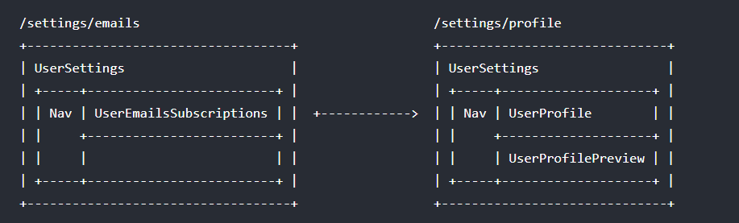
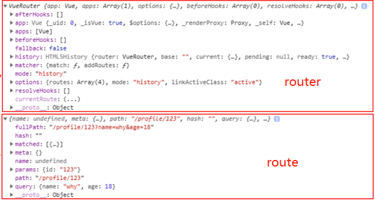
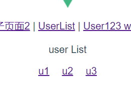
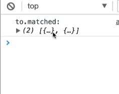

Vue.js 路由允许我们通过不同的 URL 访问不同的内容。

通过 Vue.js 可以实现多视图的单页Web应用（single page web application，SPA）。

Vue.js 路由需要载入 [vue-router 库](https://github.com/vuejs/vue-router)

中文文档地址：[vue-router文档](http://router.vuejs.org/zh-cn/)。

## 安装

### 1、直接下载 / CDN

```sh
https://unpkg.com/vue-router/dist/vue-router.js
```

### NPM

推荐使用淘宝镜像：

```sh
cnpm install vue-router
```

## 简单实例

Vue.js + vue-router 可以很简单的实现单页应用。

`<router-link>` 是一个组件，该组件用于设置一个导航链接，切换不同 HTML 内容。 **to** 属性为目标地址， 即要显示的内容。

以下实例中我们将 vue-router 加进来，然后配置组件和路由映射，再告诉 vue-router 在哪里渲染它们。

其实你可以在创建项目的时候，自动创建，下面是自己重新写的router

### 实现router 

```html
<div id="app">
  <h1>Hello App!</h1>
  <p>
    <!-- 使用 router-link 组件来导航. -->
    <!-- 通过传入 `to` 属性指定链接. -->
    <!-- <router-link> 默认会被渲染成一个 `<a>` 标签 -->
    <router-link to="/foo">Go to Foo</router-link>
    <router-link to="/bar">Go to Bar</router-link>
  </p>
  <!-- 路由出口 -->
  <!-- 路由匹配到的组件将渲染在这里 -->
  <router-view></router-view>
</div>
<script>
// 0. 如果使用模块化机制编程，导入 Vue 和 VueRouter，要调用 Vue.use(VueRouter)
 
// 1. 定义（路由）组件。 
const Foo = { template: '<div>foo</div>' }
const Bar = { template: '<div>bar</div>' }
 
// 2. 定义路由 
const routes = [
  { path: '/foo', component: Foo },
  { path: '/bar', component: Bar }
  //component: () => import('@/components/Bar') //懒加载组件
]
 
// 3. 创建 router 实例，然后传 `routes` 配置
// 你还可以传别的配置参数, 不过先这么简单着吧。
const router = new VueRouter({
  routes // （缩写）相当于 routes: routes
})
 
// 4. 创建和挂载根实例。
// 记得要通过 router 配置参数注入路由，
// 从而让整个应用都有路由功能
//这里有多个写法
//方式一
const app = new Vue({
  router
}).$mount('#app')
//方式二
//new Vue({
//  el: '#app',
// router,
//  components: { App },
//  template: '<App/>'
  // render: h => h(App) 方式三:上面两行不写，写着行
//})
</script>
```
## exact-active-class 和 active-class 的区别

router-link 默认情况下的路由是模糊匹配，例如当前路径是 /article/1 那么也会激活 `<router-link to="/article">`，所以当设置 exact-active-class 以后，这个 router-link 只有在当前路由被全包含匹配时才会被激活 exact-active-class 中的 class，例如：
```html
<router-link to="/article" active-class="router-active"></router-link>
```
当用户访问 /article/1 时会被激活为：
```html
<a href="#/article" class="router-active" rel="nofollow"></a>
```
而当使用：
```html
<router-link to="/article" exact-active-class="router-active"></router-link>
```
当用户访问 /article/1 时，不会激活这个 link 的 class：
```html
<a href="#/article" rel="nofollow"></a>
```
## router-link  相关属性
接下来我们可以了解下更多关于 `<router-link>` 的属性。

### to
表示目标路由的链接。 当被点击后，内部会立刻把 to 的值传到 router.push()，所以这个值可以是一个字符串或者是描述目标位置的对象。
```html
<!-- 字符串 -->
<router-link to="home">Home</router-link>
<!-- 渲染结果 -->
<a href="home">Home</a>

<!-- 使用 v-bind 的 JS 表达式 -->
<router-link v-bind:to="'home'">Home</router-link>

<!-- 不写 v-bind 也可以，就像绑定别的属性一样 -->
<router-link :to="'home'">Home</router-link>

<!-- 同上 -->
<router-link :to="{ path: 'home' }">Home</router-link>

<!-- 命名的路由 -->
<router-link :to="{ name: 'user', params: { userId: 123 }}">User</router-link>

<!-- 带查询参数，下面的结果为 /register?plan=private -->
<router-link :to="{ path: 'register', query: { plan: 'private' }}">Register</router-link>
```
### replace
设置 replace 属性的话，当点击时，会调用 router.replace() 而不是 router.push()，导航后不会留下 history 记录。
```html
<router-link :to="{ path: '/abc'}" replace></router-link>
```
### append
设置 append 属性后，则在当前 (相对) 路径前添加其路径。例如，我们从 /a 导航到一个相对路径 b，如果没有配置 append，则路径为 /b，如果配了，则为 /a/b
```html
<router-link :to="{ path: 'relative/path'}" append></router-link>
```
### tag
有时候想要 `<router-link>`渲染成某种标签，例如 `<li>`。 于是我们使用 tag prop 类指定何种标签，同样它还是会监听点击，触发导航。
```html
<router-link to="/foo" tag="li">foo</router-link>
<!-- 渲染结果 -->
<li>foo</li>
```
### active-class
设置 链接激活时使用的 CSS 类名。可以通过以下代码来替代。
```html
<style>
   ._active{
      background-color : red;
   }
</style>
<p>
   <router-link v-bind:to = "{ path: '/route1'}" active-class = "_active">Router Link 1</router-link>
   <router-link v-bind:to = "{ path: '/route2'}" tag = "span">Router Link 2</router-link>
</p>
```
注意这里 class 使用 active-class="_active"。

### exact-active-class
配置当链接被精确匹配的时候应该激活的 class。可以通过以下代码来替代。
```html
<p>
   <router-link v-bind:to = "{ path: '/route1'}" exact-active-class = "_active">Router Link 1</router-link>
   <router-link v-bind:to = "{ path: '/route2'}" tag = "span">Router Link 2</router-link>
</p>
```
### event
声明可以用来触发导航的事件。可以是一个字符串或是一个包含字符串的数组。
```html
<router-link v-bind:to = "{ path: '/route1'}" event = "mouseover">Router Link 1</router-link>
```
以上代码设置了 event 为 mouseover ，及在鼠标移动到 Router Link 1 上时导航的 HTML 内容会发生改变。

## 路由模式 router mode

  `vue-router` 默认 hash 模式 —— 使用 URL 的 hash 来模拟一个完整的 URL，于是当 URL 改变时，页面不会重新加载

> vue-router其实用的就是这样的机制，改变url地址，这个url地址存在一份路由映射表里面，比如`/user`代表要请求用户页面，只要配置了这个路由表（路由关系），就可以前端跳转而不刷新页面，所有的数据请求都走ajax。

```
http://localhost:8080/#/Hello
```

  如果不想要很丑的 hash，可以用路由的 **history 模式**，这种模式充分利用 `history.pushState` API 来完成 URL 跳转而无须重新加载页面

```js
const router = new VueRouter({
  mode: 'history',
  routes: [...]
})
```

  当使用 history 模式时，URL 就像正常的 url

```
http://localhost:8080/Hello
```

### 拓展 : history mode中的一些命令

#### pushState
同样的使用HTML5的history模式也是不会刷新页面的,history对象栈结构，先进后出，pushState类似压入栈中，back是回退。

```js
hristory.pushState({}, '', '/foo')
history.back()
```
#### replaceState
replaceState模式与pushState模式区别在于replaceState模式浏览器没有返回只是替换，不是压入栈中。
```js
history.replaceState({}, '', 'home')
```
#### go
go只能在pushState模式中使用，go是前进后退到哪个历史页面。
```js
history.go(-1)//回退一个页面
history.go(1)//前进一个页面
history.forward()//等价于go(1)
history.back()//等价于go(-1)
```


## router页面跳转设置

### 根路径 & exact

设置根路径，需要将path设置为'/'

```html
  <p>
    <router-link to="/">index</router-link><!--这里是会有问题的哦 所以要写成下面的-->
	<router-link to="/" exact>index</router-link>
    <router-link to="/foo">Go to Foo</router-link>
    <router-link to="/bar">Go to Bar</router-link>
  </p>
<script>
const routes = [
  { path: '/', component: Home },
  { path: '/foo', component: Foo },
  { path: '/bar', component: Bar },
]
</script>
```


### 重定向和别名

#### 重定向

  重定向通过 `routes` 配置来完成，下面例子是从 `/a` 重定向到 `/b`

```js
const router = new VueRouter({
  routes: [
    { path: '/a', redirect: '/b' }
  ]
})
```

  重定向的目标也可以是一个命名的路由：

```js
const router = new VueRouter({
  routes: [
    { path: '/a', redirect: { name: 'foo' }}
  ]
})
```

  甚至是一个方法，动态返回重定向目标：

```js
const router = new VueRouter({
  routes: [
    { path: '/a', redirect: to => {
      // 方法接收 目标路由 作为参数
      // return 重定向的 字符串路径/路径对象
      return '/home'
    }}
  ]
})
```

#### 别名

 `/a` 的别名是 `/b`，意味着，当用户访问 `/b` 时，URL 会保持为 `/b`，但是路由匹配则为 `/a`，就像用户访问 `/a` 一样

  上面对应的路由配置为

```js
const router = new VueRouter({
  routes: [
    { path: '/a', component: A, alias: '/b' }
  ]
})
```

  别名功能可以自由地将 UI 结构映射到任意的 URL，而不是受限于配置的嵌套路由结构

  处理首页访问时，常常将index设置为别名，比如将'/home'的别名设置为'/index'。但是，要注意的是，`<router-link to="/home">`的样式在URL为/index时并不会显示。因为，router-link只识别出了home，而无法识别index

#### 注意1：redirect和alias的区别

- redirect：直接改变了url的值，把url变成了真实的path路径。\
- alias：url路径没有别改变，这种更友好，让用户知道自己访问的路径，只是改变了<router-view>中的内容。

#### 注意 2：别名请不要用在path为’/’中，如下代码的别名是不起作用的。

```javascript
{
    path: '/',
    component: Hello,
    alias:'/home'
}
```


### JS代码内部跳转 

> 这里一定要注意 不能自己跳到自己

语法：

```javascript
this.$router.push('/xxx')
```

具体的简单用法：

```html
<button @click="goHome">回到首页</button>
```

```js
export default {
    name: 'app',
    methods: {
        goHome(){
            this.$router.push('/home');
        }
    }
}
```

###  编程式的导航- router的js跳转返回以及进一步

```javascript
//  后退一步记录，等同于 history.back()
this.$router.go(-1)
// 在浏览器记录中前进一步，等同于 history.forward()
this.$router.go(1)
```

 

## 父子页面的router配置

```js
import Vue from 'vue'
import Router from 'vue-router'
import Home from '@/components/Home'
import One from '@/components/One' 
import Two from '@/components/Two'

Vue.use(Router)

export default new Router({
    routes: [
    {
        path: '/', // 默认页面重定向到主页
        redirect: '/home'
    },
    {
        path: '/home', // 主页路由
        //name: 'Home',
        component: Home,
        children:[ // 嵌套子路由
            {
                path:'one', // 子页面1
                component:One
            },
            {
                path:'two', // 子页面2
                component:Two
            },
        ]
    }
    ]
})
```

>这里如果vue路由的子路径跳转了，但界面不显示，父路由加上router-view了吗？ 这个东西别忘了哦

## router中的name作用- 命名路由

是在链接一个路由，或者是执行一些跳转时，会方便一些(下面的例子涉及了传参)

```js
const router = new VueRouter({
  routes: [
    {
      path: '/user/:userId',
      name: 'user',
      component: User
    }
  ]
})
```

  要链接到一个命名路由，可以给 `router-link` 的 `to` 属性传一个对象：

```html
<router-link :to="{ name: 'user', params: { userId: 123 }}">User</router-link>
```

  这跟代码调用 `router.push()` 是一回事

```js
router.push({ name: 'user', params: { userId: 123 }})
```

  这两种方式都会把路由导航到 `/user/123` 路径

  **注意：如果设置了默认子路由，则不要在父级路由上设置name属性**

```html
<div id="app">
  <p>
   <router-link :to="{ name: 'user', params: { userId: 123 }}">User</router-link>
  </p>
  <router-view></router-view>
</div>
```

## 命名视图

命名视图就是给router-view 配置一个name区分开

使用场景：同时展示多个视图，而不是都嵌套在一个router-view中，那么使用命名视图可以让页面中存在多个单独命名的视图出口

```html
<router-view></router-view>
<router-view name='a'></router-view>
<router-view name='b'></router-view>
```

```js
const router = new VueRouter({
  routes: [
    {
      path: '/',
      components: {
        default: Foo,
        a: Bar,
        b: Baz
      }
    }, {
      path: '/other',
      components: {
        default: Foo,
        a: Bar,
      }
    }
  ]
})
```
通俗的讲，上边的代码就是：

1. 路径‘ / ’渲染三个视图（匿名视图router-view 默认是default里边渲染Foo组件，名字是a的router-view渲染Bar组件，名字是b的router-view渲染的是Baz组件）
2. 路径' /other '渲染两个视图  （匿名视图router-view 默认是default里边渲染Foo组件，名字是a的router-view渲染Bar组）

## 嵌套命名视图

对于比较复杂的页面结构，可能需要嵌套路由来处理（用嵌套组件也可以实现相同效果）



> 共同点 ： 都存在UserSettingsTit和Nav 组件
> 区别的组件 ： 有UserEmailsSubscriptions 和另一个路由下的UserProfile， UserProfilePreview 
> **相同的路由对应相同的组件，不同的路由对应不同的路由**


```html
<!-- UserSettings.vue -->
<div>
  <h1>User Settings</h1>
  <NavBar/>
  <router-view/>
  <router-view name="helper"/>
</div>
```

```js
{
  path: '/settings',
  // 你也可以在顶级路由就配置命名视图
  component: UserSettings,
  children: [{
    path: 'emails',
    component: UserEmailsSubscriptions
  }, {
    path: 'profile',
    components: {
      default: UserProfile,
      helper: UserProfilePreview
    }
  }]
}
```

## router传递参数的方式

### 方式一  ：params传递参数

**/router/:id**


### 方式二 ：query传递参数

**/router?id=**

### 使用方式

#### 通过`<router-link>` 标签中的to传设置

基本语法：

```html
<router-link :to="{name:xxx, params: {key:value}}">valueString</router-link>
```

上面to前边是带冒号，后边跟的是一个对象形势的字符串

- name：route中的name
- params：要传的参数，它是对象形式，在对象里可以传递多个值。

```
模式                              匹配路径                $route.params
/user/:username           　    /user/evan            { username: 'evan' }
/user/:username/post/:post_id   /user/evan/post/123   { username: 'evan', post_id: 123 }
```

> 注意 `$router`本身也提供了很多信息

#### url中传递参数设置

在路由中以冒号传递

```javascript
{
    path:'/home/two/:id/:name', // 子页面2
    component:Two
},
```

```html
<p>ID：{{ $route.params.id}}</p>
<p>名称：{{ $route.params.name}}</p>
```

PS：to前没有冒号为字符串路由，必须全部匹配。
如果路由参数需要有特定的规则，就需要加入正则表达式了，示例如下：

```js
{
    path:'/home/two/:id(\\d+)/:name', // 子页面2
    component:Two
}
```

### js中使用

#### query

- 配置路由的格式：`/profile`，也就是普通的配置
- 传递的方式：对象中使用query的key作为传递的方式
- 传递形成的路径：`/profile?name=zty&age=24&height=177`（这个传递的是三个键值对），`/profile?profileInfo=%5Bobject%20Object%5D`（这个query传递的是一个对象的键值对，key为profileInfo，value是一个对象）

```js
  this.$router.push({path: '/home/three', query: {id: 3, name: 'user3'}})
```

页面路由显示 /home/three?id=3&name=user3

#### params

params的类型也就是动态路由形式

- 配置路由的格式：`/user/:userId`
- 传递的方式：在path后面跟上对应的userId
- 传递形成的路径：`/user/123`，`/user/xxx`
- 通过`$route.params.userId`获取指定userId

```js
this.$router.push({name: 'three', params: {id: 3, name: 'user3'}})
```

### 注意 `$router`和 `$route`是不一样的！！

router 是VueRouter实例，有push

route 是当前router跳转对象里面的参数，有name, query, path, params



### 拓展 ：[router和route的由来 （深入源码 原型链）](https://github.com/zhangtianyi0110/VueLearnNotes/blob/master/17-vue-router/17-vue-router.md#1756router%E5%92%8Croute%E7%9A%84%E7%94%B1%E6%9D%A5)

## 动态router

场景：一个页面的path路径可能是不确定的，例如可能有`/user/aaaa`或者`/user/bbbb`，除了`/user`之外，后面还跟上了用户ID`/user/123`等

```html
<template>
    <div>
        <p>user List</p>
        <router-link style="margin: 0 10px" :to="'/user/' + item.id" v-for="item in userList" :key="item.id">{{item.userName}}</router-link>  
    </div>
</template>

<script>
export default {
    name:'UserList',
    data(){
        return{userList:[{id:1,userName:'u1'},{id:2,userName:'u2'},{id:3,userName:'u3'}]}
    }
}
</script>
```

参数缺失会导致显示不出来 或者 数据没有刷新

## 路由钩子（导航守卫） 

这里使用场景是：经常需要在路由跳转后，例如从用户页面跳转到首页，页面内容虽然可以自己定义，但是只有一个html文件，也只有一个title标签，我们需要改变标题，虽然说之前可以在Vue声明周期中做这个事情，但是总不能每个写。或者也有验证login，所以最好的是**如果我们能监听路由的变化(了解路由从哪来往哪里跳转)，那我们就能在跳转中修改title标签**。 所以这就是路由钩子做的事情

路由钩子，即导航钩子，其实就是路由拦截器，vue-router一共有三类：

1. 全局钩子：最常用
2. 路由单独钩子
3. 组件内钩子

### 1、全局钩子

在src/router/index.js中使用，代码如下：

```javascript
// 定义路由配置
const router = new VueRouter({ ... })

// 全局路由拦截-进入页面前执行
router.beforeEach((to,from,next) => {
    // 这里可以加入全局登陆判断
    // 继续执行
    next();
});

// 全局后置钩子-常用于结束动画等
router.afterEach((to,from) => {
    //不接受next
});

export default router;
```

**每个钩子方法接收三个参数：**
to: Route : 即将要进入的目标 [路由对象]
from: Route : 当前导航正要离开的路由
next: Function : 继续执行函数

- next()：继续执行
- next(false)：中断当前的导航。
- next(‘/‘) 或 next({ path: ‘/‘ })：跳转新页面，常用于登陆失效跳转登陆

```js
router.beforeEach((to, from, next) => {
  if(to.meta.login==false){
    next('/login');
  }
  next();
});
```

```js
{
      path: '/userList',
      name: 'UserList',
      component: UserList,
      meta: {
        title: '用户列表',
        login: false
      },
    },
```



加入导航守卫之后


**但是 ！！！ 其实这里是有问题的哦~~ 如果你的登录是false，但是你直接输入子路径，你会发现你还是可以打开的，这就很不好**

那怎么办勒， 这里就有一个`to.match`,他是一个数组，这个数组是把所有的路径都收集的

注意 这里使用父子页面这么跳转的时候 会有两个



```js
to.matched.some(function(item){return item.path=='post'})
//some是ES6的，只要数组中有一条为true，就返回true
```

### 2、路由单独钩子

使用：在路由配置中单独加入钩子，在src/router/index.js中使用，代码如下：

```javascript
{
    path:'/home/one', // 子页面1
        component: One,
        // 路由内钩子
        beforeEnter: (to, from, next) => {
        console.log('进入前执行');
            next();
        }
}
```

**回到上个问题 如果不是父子页面跳转怎么办~ 用这个限制咯**

### 3、组件内钩子

使用：在路由组件内定义钩子函数：

- beforeRouteEnter：进入页面前调用
- beforeRouteUpdate (2.2 新增)：页面路由改变时调用，一般需要带参数
- beforeRouteLeave：离开页面调用

任意找一页面，编写如下代码：

```html
<script>
export default {
    name: 'Two',
    data () {
        return {
            msg: 'Hi, I am Two Page!'
        }
    },
    // 进入页面前调用
    beforeRouteEnter(to, from, next) {
        console.log('进入enter路由钩子')
         // 在渲染该组件的对应路由被 confirm 前调用，不能获取组件实例 `this`，因为当钩子执行前，组件实例还没被创建
        next()
    },
    // 离开页面调用
    beforeRouteLeave(to,from, next){
        console.log('进入leave路由钩子')
         // 在当前路由改变，但是该组件被复用时调用。举例来说，对于一个带有动态参数的路径 /foo/:id，在 /foo/1 和 /foo/2 之间跳转时，由于会渲染同样的 Foo 组件，因此组件实例会被复用。而这个钩子就会在这个情况下被调用。可以访问组件实例 `this`
        next()
    },
    // 页面路由改变时调用
    beforeRouteUpdate(to, from, next) {
        console.log('进入update路由钩子')
         // 导航离开该组件的对应路由时调用，可以访问组件实例 `this`
        console.log(to.params.id)
        next()
    }
}
</script>
```

#### 导航守卫的例子

```js
//router的导航守卫的例子 对于login 例子是github中admin-ui
router.beforeEach((to, from, next) => {
    // to and from are both route objects. must call `next`.
    // 登录界面登录成功之后，会把用户信息保存在会话
    // 存在时间为会话生命周期，页面关闭即失效。
    let token = Cookies.get('token')
    let userName = sessionStorage.getItem('user')
    if (to.path === '/login') {
        // 如果是访问登录界面，如果用户会话信息存在，代表已登录过，跳转到主页
        if(token) {
            next({ path: '/' })
        } else {
            next()
        }
    } else {
        if (!token) {
        // 如果访问非登录界面，且户会话信息不存在，代表未登录，则跳转到登录界面
            next({ path: '/login' })
        } else {
        // 加载动态菜单和路由
            addDynamicMenuAndRoutes(userName, to, from)
            next()
        }
    }
})
```

## 懒加载

  当打包构建应用时，JS包会变得非常大，影响页面加载。如果能把不同路由对应的组件分割成不同的代码块，然后当路由被访问的时候才加载对应组件，这样就更加高效了

  结合 Vue 的 异步组件 和 Webpack 的代码分割功能，轻松实现路由组件的懒加载。

大项目中，为了提高初始化页面的效率，路由一般使用懒加载模式，一共三种实现方式。

### 第一种写法 vue异步组件和webpack

```javascript
component: (resolve) => require(['@/components/One'], resolve)
```

### 第二种写法 Es6

```javascript
component: () => import('@/components/Two')
```

### 第三种写法 AMD写法

```javascript
components: r => require.ensure([], () => r(require('@/components/Three')), 'group-home')
```

#### 把组件按组分块详细例子

  有时候想把某个路由下的所有组件都打包在同个异步块(chunk)中。只需要使用 [命名 chunk](https://webpack.js.org/guides/code-splitting-require/#chunkname)，一个特殊的注释语法来提供chunk name(需要webpack > 2.4)

```
const Foo = () => import(/* webpackChunkName: "group-foo" */ './Foo.vue')
const Bar = () => import(/* webpackChunkName: "group-foo" */ './Bar.vue')
const Baz = () => import(/* webpackChunkName: "group-foo" */ './Baz.vue')
```

  webpack 会将任何一个异步模块与相同的块名称组合到相同的异步块中

**PS：**

- 一般常用第二种简写
- 第三种中，’group-home’是把组件按组分块打包, 可以将多个组件放入这个组中，在打包的时候Webpack会将相同 chunk 下的所有异步模块打包到一个异步块里面。

## keep-alive

### 语法

```html
<!-- 范例：缓存about组件 -->
<keep-alive include="about">
    <router-view></router-view>
</keep-alive>
```

### 属性

`include` 和 `exclude` 属性允许组件有条件地缓存。二者都可以用逗号分隔字符串、正则表达式或一个数组来表示

- include - 字符串或正则表达式。只有名称匹配的组件会被缓存。

- exclude - 字符串或正则表达式。任何名称匹配的组件都不会被缓存。

- max - 数字。最多可以缓存多少组件实例。

### 执行规则

  - 首次执行该keep-alive组件
    - 进入：beforeCreate -> created -> beforeMount -> mounted -> activated
    - 离开：deactivated
  - 第二次执行该keep-alive组件
    - 进入：activated
    - 离开：deactivated
  - 没有keep-alive的组件(Vue实例生命周期)
    - 进入：beforeCreate -> created -> beforeMount -> mounted
    - 离开：beforeDestroy -> destroyed

### 一般例子- component

```html
<!-- 逗号分隔字符串 -->
<keep-alive include="a,b">
  <component :is="view"></component>
</keep-alive>

<!-- 正则表达式 (使用 `v-bind`) -->
<keep-alive :include="/a|b/">
  <component :is="view"></component>
</keep-alive>

<!-- 数组 (使用 `v-bind`) -->
<keep-alive :include="['a', 'b']">
  <component :is="view"></component>
</keep-alive>
```

> 匹配首先检查组件自身的 name 选项，如果 name 选项不可用，则匹配它的局部注册名称 (父组件 components 选项的键值)。匿名组件不能被匹配。

### 页面过长的缓存

1、首先在路由中的mate属性中记录keepAlive，如果需要缓存则置为true。

```javascript
path:'/index',
name:''index',
component:()=>import('../../index/index'),
meta:{keepAlive:true} 
```

2、在创建router实例的时候加上scrollBehavior方法（keepAlive才会生效）。

```javascript
let router=new Router({
    mode:"hash",//1、hash哈希：有#号。2、history历史：没有#号
    base:process.env.BASE_URL, //自动获取根目录路径
    scrollBehavior:(to,from,position)=>{
        if(position){
            return position
        }else{
            return {x:0,y:0}
        }
    }, 
```

3、需要缓存的router-view包上keep-alive（要有两个router-view，一个是缓存的时候显示，一个是不缓存的时候显示，有的时候不需要缓存）。

```html
<keep-alive>
	<router-view v-if="$router.meta.keepAlive"></router-view>
</keep-alive>
	<router-view v-if="!$router.meta.keepAlive"></router-view> 
```

**注意**
在keep-alive中的组件会有两个生命周期的钩子函数，activated和deactivated，其中activated是在组件第一次渲染时会被调用，而且之后每次缓存组件被激活都会被调用。所以一般使用时需要里面的代码和created函数中的代码一样即可。

### [input缓存例子](https://www.cnblogs.com/sysuhanyf/p/7454530.html)

## 拓展： 

### 页面跳转的时候，加动画?怎么加有印象吗？
### [导航完成的时候，数据获取？](https://www.xiaohuochai.cc/posts/5b11f8a093b30d62504cb6b1)

## Reference

[动态路由匹配](https://router.vuejs.org/zh/guide/essentials/dynamic-matching.html)

[Vue.js 路由](https://www.runoob.com/vue2/vue-routing.html)

[vue-router命名路由和命名视图](https://www.jianshu.com/p/f3d870cace31)

[路由钩子](http://doc.liangxinghua.com/vue-family/3.8.html)

重点推荐！！[Vue路由vue-router](https://www.xiaohuochai.cc/posts/5b11f8a093b30d62504cb6b1)

[Vue scrollBehavior 滚动行为](https://www.cnblogs.com/sophie_wang/p/7880261.html)

[利用router保留滚动条位置](https://heshiyu1996.github.io/skill/vue/keep-alive/)

重点推荐！！[详细了解Vue router 到源码](https://github.com/zhangtianyi0110/VueLearnNotes/blob/master/17-vue-router/17-vue-router.md#1756router%E5%92%8Croute%E7%9A%84%E7%94%B1%E6%9D%A5)

