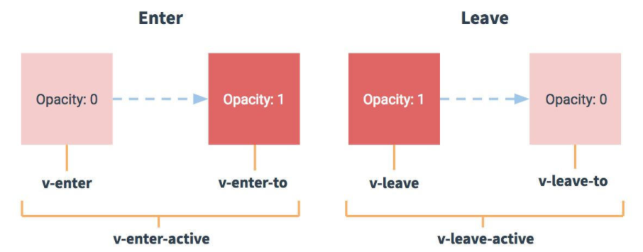

## 过渡&动画

### vue 动画的理解

1. 操作css 的trasition 或animation

2. vue 会给目标元素添加/移除特定的class

3. 过渡的相关类名
   xxx-enter-active: 指定显示的transition
   xxx-leave-active: 指定隐藏的transition
   xxx-enter/xxx-leave-to: 指定隐藏时的样式

### 基本过渡动画的编码

1. 在目标元素外包裹`<transition name="xxx">`
2. 定义class 样式
   指定过渡样式: transition
   指定隐藏时的样式: opacity/其它