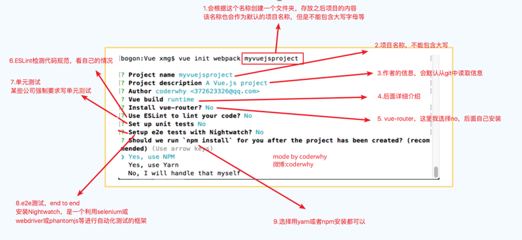
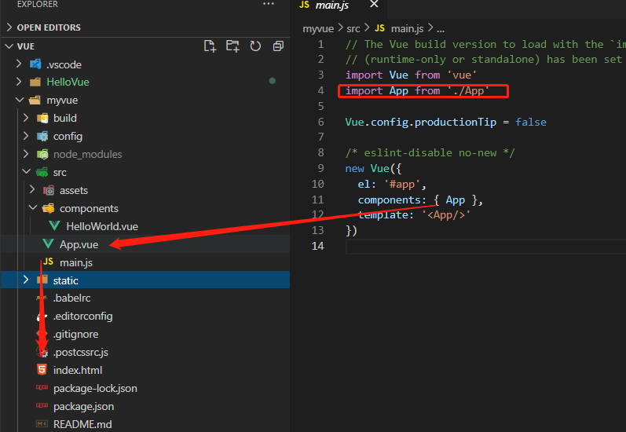
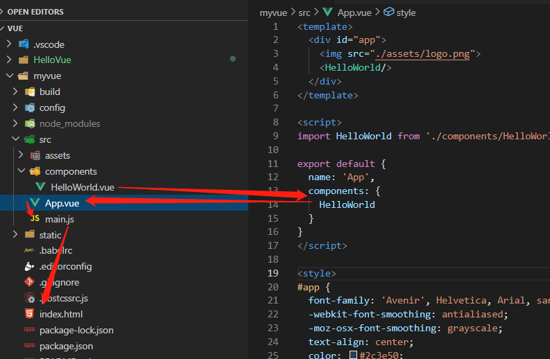
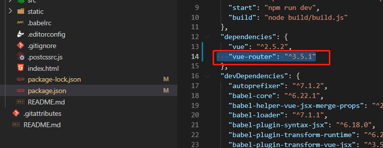

## 使用vue-cli 创建模板项目

###  说明
vue-cli 是vue 官方提供的脚手架工具
github: https://github.com/vuejs/vue-cli
作用: 从 https://github.com/vuejs-templates 下载模板项目

### 创建vue 项目
npm install -g vue-cli
vue init webpack myvue
cd myvue
npm install
npm run dev
访问: http://localhost:8080/

注释：

"vue init webpack vue_demo"中的"webpack"为固定的，即使使用webpack作为模板，提供六套模板。"vue_demo"为自起的项目名称，不可以包含大写字母。
官方文档：https://github.com/vuejs/vue-cli/tree/master

### 创建项目的选择




### 拓展 关于选项中  render函数的使用 & npm run build 详解执行意义  & npm run dev 执行意义 

这里可以参考资料 https://blog.csdn.net/weixin_43342105/article/details/106248521

|-- build : webpack 相关的配置文件夹(基本不需要修改)
|-- dev-server.js : 通过express 启动后台服务器
|-- config: webpack 相关的配置文件夹(基本不需要修改)
|-- index.js: 指定的后台服务的端口号和静态资源文件夹
|-- node_modules
|-- src : 源码文件夹
|-- components: vue 组件及其相关资源文件夹
|-- App.vue: 应用根主组件
|-- main.js: 应用入口js
|-- static: 静态资源文件夹
|-- .babelrc: babel 的配置文件
|-- .eslintignore: eslint 检查忽略的配置
|-- .eslintrc.js: eslint 检查的配置
|-- .gitignore: git 版本管制忽略的配置
|-- index.html: 主页面文件
|-- package.json: 应用包配置文件
|-- [README.md](http://readme.md/): 应用描述说明的readme 文件

## 理解架构的链接运行

> 如果学过react的基本这里就很好理解，因为是一样的组件式开发，然后通过 export import ，main.js内引用好，index.html就可以直接用





所以整个结构是很清晰的， 如果还是蒙，那先滚回去把component看明白

## vue-router

###  简单介绍

vue-router是vue官方的路由解决方案，简单易用，中文官方地址如下：
[vue-router中文手册](https://router.vuejs.org/zh/)

###  安装

vue-router是一个插件包，需要用npm来进行安装的。如果采用vue-cli构建初始化项目会提示安装，也可以自己使用命令安装：

```bash
npm install vue-router --save
```

看到json里面的配置，就是安装好了



其实你可以在创建项目的时候，自动创建，下面是自己重新写的router

### 实现router 

跟react一样 具体就不写了 

详细过程 https://blog.csdn.net/qq_21980517/article/details/103124080 

### router基本属性设置

#### router mode 

mode有两种，默认的是URL的hash，可以改成history，这样页面的url不会出现#标志，并且具有history属性（在router的index.js）

#### JS代码内部跳转

实际项目中，很多时候都是通过在JS代码内部进行导航的跳转，使用方式如下：

```javascript
this.$router.push('/xxx')
```

具体的简单用法：
（1）先编写一个按钮，在按钮上绑定goHome( )方法。

```javascript
<button @click="goHome">回到首页</button>
```

（2）在`<script>`模块里加入goHome方法，并用this.$router.push(‘/’)导航到首页

```javascript
export default {
    name: 'app',
    methods: {
        goHome(){
            this.$router.push('/home');
        }
    }
}
```

#### router的js跳转返回以及进一步

```javascript
//  后退一步记录，等同于 history.back()
this.$router.go(-1)
// 在浏览器记录中前进一步，等同于 history.forward()
this.$router.go(1)
```

#### 父子页面的router配置

```js
import Vue from 'vue'
import Router from 'vue-router'
import Home from '@/components/Home'
import One from '@/components/One' 
import Two from '@/components/Two'

Vue.use(Router)

export default new Router({
    routes: [
    {
        path: '/', // 默认页面重定向到主页
        redirect: '/home'
    },
    {
        path: '/home', // 主页路由
        name: 'Home',
        component: Home,
        children:[ // 嵌套子路由
            {
                path:'one', // 子页面1
                component:One
            },
            {
                path:'two', // 子页面2
                component:Two
            },
        ]
    }
    ]
})
```


### router传递参数的方式

#### 通过`<router-link>` 标签中的to传参

**基本语法：**

```javascript
<router-link :to="{name:xxx, params: {key:value}}">valueString</router-link>
```

上面to前边是带冒号，后边跟的是一个对象形势的字符串

- name：在路由配置文件中起的name值。叫做命名路由，下一节会讲到。
- params：要传的参数，它是对象形式，在对象里可以传递多个值。


#### url中传递参数

#### params传递参数

#### query传递参数


## Reference

 https://blog.csdn.net/weixin_43342105/article/details/106248594