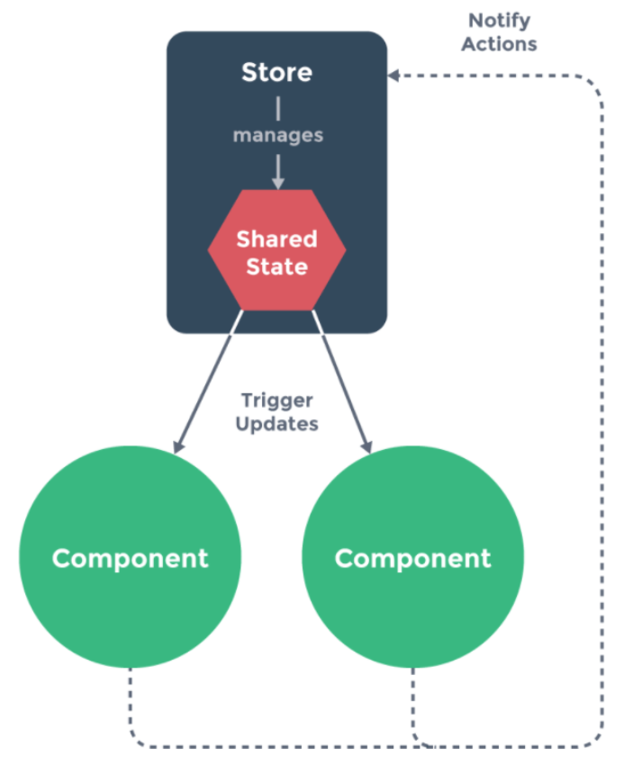
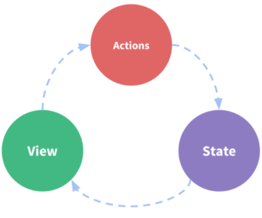
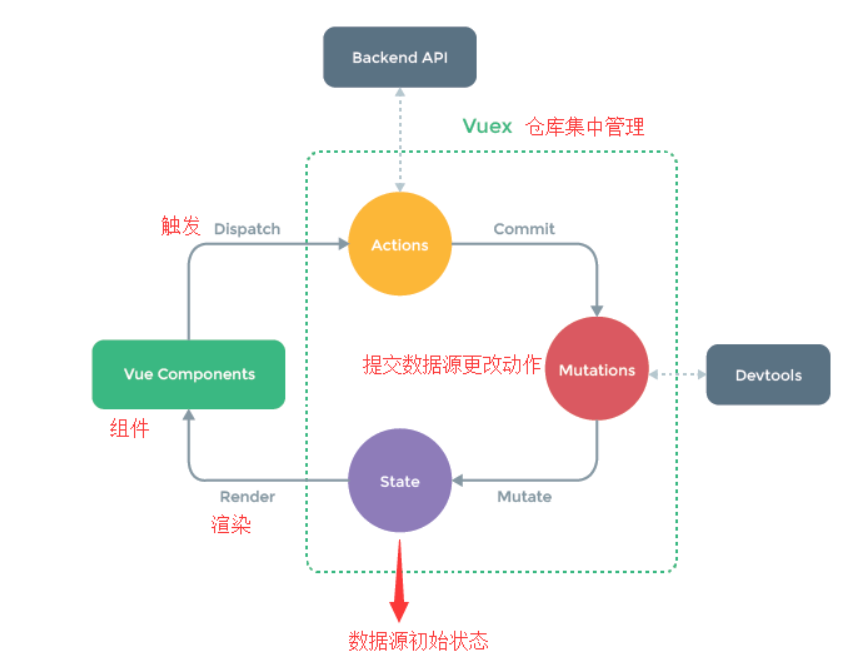

## vuex概念

vuex是一个专为 Vue.js 应用程序开发的状态管理模式。它采用集中式存储管理应用的所有组件的状态，并以相应的规则保证状态以一种可预测的方式发生变化。chrome安装调试工具 devtools extension

### 为什么要vuex

> 如果已经学过React 可以跳过这里，因为这个跟redux基本一样的
>
> 如果有代码基础，Vuex也可以理解为java中的一个map，这个map是static（静态资源）的，每次获取map的值，都需要调用java的api，比如map.get(key)获取对应的值，也可以放入数据map.put(data)，而且这个数据是所有类都可以调用的，只需要导入这个map就能使用里面的共享数据。

　当访问数据对象时，一个 Vue 实例只是简单的代理访问。所以，如果有一处需要被多个实例间共享的状态，可以简单地通过维护一份数据来实现共享

```
const sourceOfTruth = {}
const vmA = new Vue({
  data: sourceOfTruth
})
const vmB = new Vue({
  data: sourceOfTruth
})
```

　　现在当 `sourceOfTruth` 发生变化，`vmA` 和 `vmB` 都将自动的更新引用它们的视图。子组件们的每个实例也会通过 `this.$root.$data` 去访问。现在有了唯一的实际来源，但是，调试将会变为噩梦。任何时间，应用中的任何部分，在任何数据改变后，都不会留下变更过的记录。

　　为了解决这个问题，采用一个简单的 **store 模式**：

```
var store = {
  debug: true,
  state: {
    message: 'Hello!'
  },
  setMessageAction (newValue) {
    if (this.debug) console.log('setMessageAction triggered with', newValue)
    this.state.message = newValue
  },
  clearMessageAction () {
    if (this.debug) console.log('clearMessageAction triggered')
    this.state.message = ''
  }
}
```

　　所有 store 中 state 的改变，都放置在 store 自身的 action 中去管理。这种集中式状态管理能够被更容易地理解哪种类型的 mutation 将会发生，以及它们是如何被触发。当错误出现时，现在也会有一个 log 记录 bug 之前发生了什么

　　此外，每个实例/组件仍然可以拥有和管理自己的私有状态：

```
var vmA = new Vue({
  data: {
    privateState: {},
    sharedState: store.state
  }
})
var vmB = new Vue({
  data: {
    privateState: {},
    sharedState: store.state
  }
})
```



> 组件不允许直接修改属于 store 实例的 state，而应执行 action 来分发 (dispatch) 事件通知 store 去改变，最终达成了 Flux 架构。这样约定的好处是，能够记录所有 store 中发生的 state 改变，同时实现能做到记录变更 (mutation)、保存状态快照、历史回滚/时光旅行的先进的调试工具

所以这里就可以基本理解为什么要store，为什么要Vuex了吧

### 什么状态需要Vuex去管理？

- 比如用户的登录的状态（token）、用户的信息（头像、名称、地理位置信息）等等
- 比如商品的收藏，购物车的商品等等
- 这些状态应该是响应式的，用户昵称、头像修改了需要响应

## Vue的单向数据流



**示意图说明：**

- State：驱动应用的数据源（单向数据流）
- View：以声明方式将 state 映射到视图（静态显示出来的数据源）
- Actions：处理用户在view上面操作而导致的状态变化（数据源变化追踪）

## vuex与全局变量的区别

- 响应式：vuex的状态存储是响应式的，当Vue组件从store中读取状态的时候，若store中的状态发生变化，那么相应的组件也会得到高效更新
- 不能直接改变store：不能直接改变store的变化，改变store中状态的唯一途径是commit mutation，方便于跟踪每一个状态的变化

> 这就是 Vuex 背后的基本思想，借鉴了 Flux、Redux、和 The Elm Architecture。与其他模式不同的是，Vuex 是专门为 Vue.js 设计的状态管理库，以利用 Vue.js 的细粒度数据响应机制来进行高效的状态更新

## vuex核心流程



**示意图说明：**

1. Vue Components：Vue组件。HTML页面上，负责接收用户操作等交互行为，执行dispatch方法触发对应action进行回应
2. Dispatch：操作行为触发方法，是唯一能执行action的方法
3. Actions：操作行为处理模块。负责处理Vue Components接收到的所有交互行为。包含同步/异步操作，支持多个同名方法，按照注册的顺序依次触发。向后台API请求的操作就在这个模块中进行，包括触发其他action以及提交mutation的操作。该模块提供了Promise的封装，以支持action的链式触发
4. Commit：状态改变提交操作方法。对mutation进行提交，是唯一能执行mutation的方法
5. Mutations：状态改变操作方法。是Vuex修改state的唯一推荐方法，其他修改方式在严格模式下将会报错。该方法只能进行同步操作，且方法名只能全局唯一。操作之中会有一些hook暴露出来，以进行state的监控等
6. State：页面状态管理容器对象。集中存储Vue components中data对象的零散数据，全局唯一，以进行统一的状态管理。页面显示所需的数据从该对象中进行读取，利用Vue的细粒度数据响应机制来进行高效的状态更新
7. Getters：state对象读取方法。图中没有单独列出该模块，应该被包含在了render中，Vue Components通过该方法读取全局state对象

## 安装

```sh
npm install vuex --save
```

## 项目结构

Vuex 并不限制代码结构。但是，它规定了一些需要遵守的规则：

　　1、应用层级的状态应该集中到单个 store 对象中

　　2、提交 mutation 是更改状态的唯一方法，并且这个过程是同步的

　　3、异步逻辑都应该封装到 action 里面

　　只要遵守以上规则，可以随意组织代码。如果store文件太大，只需将 action、mutation 和 getter 分割到单独的文件

　　对于大型应用，希望把 Vuex 相关代码分割到模块中。下面是项目结构示例：

```
├── index.html
├── main.js
├── api
│   └── ... # 抽取出API请求
├── components
│   ├── App.vue
│   └── ...
└── store
    ├── index.js          # 组装模块并导出 store 的地方
    ├── actions.js        # 根级别的 action
    ├── mutations.js      # 根级别的 mutation
    └── modules
        ├── cart.js       # 购物车模块
        └── products.js   # 产品模块
```

## 实例操作

看下面之前，先想想计数器要是使用Vue怎么实现

然后看下面的基本语法，实现一个[Vue的计数器](https://github.com/SavanCode/VUE/tree/main/vuex01)

## 1.state-状态对象的获取方法（组件内）

### 在组件的template中直接使用

```html
<h2>{{ $store.state.count }}</h2>
```

由于 Vuex 的状态存储是响应式的，从 store 实例中读取状态最简单的方法就是在**计算属性**中返回某个状态

### 1、在计算属性computed中直接赋值

```javascript
computed: {
    count() {
        // this指的是main.js中的vue实例对象
        return this.$store.state.count;
    }
}
```

### 2、通过mapState的对象来赋值

**`mapState` 函数返回的是一个对象**

```javascript
import { mapState } from 'vuex'
computed: mapState({
    // es5写法
    count: function (state) {
         return state.count;
     },
    // es6写法
    count: state => state.count
})
```

### 3、通过mapState的数组来赋值- 常用

```javascript
import { mapState } from 'vuex'
// 映射 this.count 为 store.state.count
computed: mapState(['count'])
```

### 4、通过mapState的JSON来赋值- 常用

```javascript
import { mapState } from 'vuex'
computed: mapState({
    count: 'count'
})
```

## 2.store中的Getter函数 - store从state取数据 

```js
const store = new Vuex.Store({
  state: {
    todos: [
      { id: 1, text: '...', done: true },
      { id: 2, text: '...', done: false }
    ]
  },
  getters: {
    doneTodos: state => {
      return state.todos.filter(todo => todo.done)
    }
  }
})
```

### **Getter 也可以接受其他 getter 作为第二个参数**

```js
getters: {
  // ...
  doneTodosCount: (state, getters) => {
    return getters.doneTodos.length
  }
}
store.getters.doneTodosCount // -> 1
```

## 3.mutations-getters-actions异步

### mutations（修改状态）

#### 无参数的基本版本

```js
const store = new Vuex.Store({
  state: {
    count: 1
  },
  mutations: {
    increment (state) {
      // 变更状态
      state.count++
    }
  }
})
```

```js
store.commit('increment')//调用
```

#### 提交载荷(Payload) - 有参数

```js
mutations: {
  increment (state, n) {
    state.count += n
  }
}
store.commit('increment', 10)
```

　**在大多数情况下，载荷应该是一个对象**

#### 提交载荷(Payload) 带type

　提交 mutation 的另一种方式是直接使用包含 `type` 属性的对象

```js
store.commit({
  type: 'increment',
  amount: 10
})
```

　　当使用对象风格的提交方式，整个对象都作为载荷传给 mutation 函数 

```js
mutations: {
  increment (state, payload) {
    state.count += payload.amount
  }
}
```

### Mutation必须是同步函数

> actions和mutations功能基本一样，不同点是，actions是异步的改变state状态，而mutations是同步改变状态。不过实际项目中一般都是通过actions改变mutations中的值。

### 在组件中提交Mutation - mapMutations

```js
import { mapMutations } from 'vuex'

export default {
  // ...
  methods: {
    ...mapMutations([
      'increment', // 将 `this.increment()` 映射为 `this.$store.commit('increment')`

      // `mapMutations` 也支持载荷：
      'incrementBy' // 将 `this.incrementBy(amount)` 映射为 `this.$store.commit('incrementBy', amount)`
    ]),
    ...mapMutations({
      add: 'increment' // 将 `this.add()` 映射为 `this.$store.commit('increment')`
    })
  }
}
```

## 严格模式

严格模式下，无论何时发生了状态变更且不是由 mutation 函数引起的，将会抛出错误。这能保证所有

的状态变更都能被调试工具跟踪到。开启严格模式 strict: true


## 4.action

### 基本特点

　　Action类似于mutation，不同之处在于：

　　1、Action 提交的是 mutation，而不是直接变更状态

　　2、Action 可以包含任意异步操作

### 基本的action写法

```js
actions: {
  increment ({ commit }) {
    commit('increment')
  }
}
store.dispatch('increment')
```

> 乍一眼看上去感觉多此一举，直接分发 mutation 岂不更方便？实际上并非如此，mutation必须同步执行这个限制，而Action 就不受约束，可以在 action 内部执行异步操作

```js
//实际上还是不一样哦
actions: {
  incrementAsync ({ commit }) {
    setTimeout(() => {
      commit('increment')
    }, 1000)
  }
}
```

### 载荷方式和对象方式进行分发

```js
// 以载荷形式分发
store.dispatch('incrementAsync', {
  amount: 10
})

// 以对象形式分发
store.dispatch({
  type: 'incrementAsync',
  amount: 10
})
```

来看一个更加实际的购物车示例，涉及到调用异步 API 和分发多重 mutation

```js
actions: {
  checkout ({ commit, state }, products) {
    // 把当前购物车的物品备份起来
    const savedCartItems = [...state.cart.added]
    // 发出结账请求，然后乐观地清空购物车
    commit(types.CHECKOUT_REQUEST)
    // 购物 API 接受一个成功回调和一个失败回调
    shop.buyProducts(
      products,
      // 成功操作
      () => commit(types.CHECKOUT_SUCCESS),
      // 失败操作
      () => commit(types.CHECKOUT_FAILURE, savedCartItems)
    )
  }
}
```

### 在组件中分发Action

```js
import { mapActions } from 'vuex'

export default {
  // ...
  methods: {
    ...mapActions([
      'increment', // 将 `this.increment()` 映射为 `this.$store.dispatch('increment')`

      // `mapActions` 也支持载荷：
      'incrementBy' // 将 `this.incrementBy(amount)` 映射为 `this.$store.dispatch('incrementBy', amount)`
    ]),
    ...mapActions({
      add: 'increment' // 将 `this.add()` 映射为 `this.$store.dispatch('increment')`
    })
  }
}
```

### 组合多个Action

Action 通常是异步的，那么多个action的时候怎么样才能保证action已经执行了呢

首先，需要明白 `store.dispatch` 可以处理被触发的 action 的处理函数返回的 Promise，并且 `store.dispatch` 仍旧返回 Promise

```js
actions: {
  actionA ({ commit }) {
    return new Promise((resolve, reject) => {
      setTimeout(() => {
        commit('someMutation')
        resolve()
      }, 1000)
    })
  }
}
```

现在可以

```js
store.dispatch('actionA').then(() => {
  // ...
})
```

在另外一个 action 中也可以：

```js
actions: {
  // ...
  actionB ({ dispatch, commit }) {
    return dispatch('actionA').then(() => {
      commit('someOtherMutation')
    })
  }
}
```

最后，如果利用 async / await 这个 JavaScript 新特性，可以像这样组合 action

```js
// 假设 getData() 和 getOtherData() 返回的是 Promise

actions: {
  async actionA ({ commit }) {
    commit('gotData', await getData())
  },
  async actionB ({ dispatch, commit }) {
    await dispatch('actionA') // 等待 actionA 完成
    commit('gotOtherData', await getOtherData())
  }
}
```

> 一个 `store.dispatch` 在不同模块中可以触发多个 action 函数。在这种情况下，只有当所有触发函数完成后，返回的 Promise 才会执行

## 5.module-模块组

### 基本结构

```javascript
// 模块A
const moduleA = {
  state: { ... },
  mutations: { ... },
  actions: { ... },
  getters: { ... }
}

// 模块B
const moduleB = {
  state: { ... },
  mutations: { ... },
  actions: { ... }
}

// 组装
const store = new Vuex.Store({
  modules: {
    a: moduleA,
    b: moduleB
  }
})

// 取值
store.state.a // -> moduleA 的状态
store.state.b // -> moduleB 的状态
```

### 模块的局部状态

​	对于模块内部的 mutation 和 getter，接收的第一个参数是模块的局部状态对象

```js
const moduleA = {
  state: { count: 0 },
  mutations: {
    increment (state) {
      // 这里的 `state` 对象是模块的局部状态
      state.count++
    }
  },

  getters: {
    doubleCount (state) {
      return state.count * 2
    }
  }
}
```
同样，对于模块内部的 action，局部状态通过 `context.state` 暴露出来，根节点状态则为 `context.rootState`：

```js
const moduleA = {
  // ...
  actions: {
    incrementIfOddOnRootSum ({ state, commit, rootState }) {
      if ((state.count + rootState.count) % 2 === 1) {
        commit('increment')
      }
    }
  }
}
```
对于模块内部的 getter，根节点状态会作为第三个参数暴露出来：

```js
const moduleA = {
  // ...
  getters: {
    sumWithRootCount (state, getters, rootState) {
      return state.count + rootState.count
    }
  }
}
```

这里的练习在[github](https://github.com/SavanCode/VUE/tree/main/Vuex-module)

## 6.命名空间&测试Mutation

这里我没做练习弄明白 嘿嘿 所以想了解请看[命名空间](https://www.cnblogs.com/xiaohuochai/p/7554127.html)

## Vuex的API

### 辅助函数

#### mapState 

```js
mapState(namespace?: string, map: Array<string> | Object): Object
```

　　为组件创建计算属性以返回 Vuex store 中的状态。第一个参数是可选的，可以是一个命名空间字符串

#### mapGetters

```js
mapGetters(namespace?: string, map: Array<string> | Object): Object
```

　　为组件创建计算属性以返回 getter 的返回值。第一个参数是可选的，可以是一个命名空间字符串

#### mapActions

```js
mapActions(namespace?: string, map: Array<string> | Object): Object
```

　　创建组件方法分发 action。第一个参数是可选的，可以是一个命名空间字符串

####  mapMutations

```js
mapMutations(namespace?: string, map: Array<string> | Object): Object
```

　　创建组件方法提交 mutation。第一个参数是可选的，可以是一个命名空间字符串

#### createNamespacedHelpers

```js
createNamespacedHelpers(namespace: string): Object
```

　　创建基于命名空间的组件绑定辅助函数。其返回一个包含 `mapState`、`mapGetters`、`mapActions` 和 `mapMutations` 的对象。它们都已经绑定在了给定的命名空间上

### 实例方法

```
commit(type: string, payload?: any, options?: Object) | commit(mutation: Object, options?: Object)
```

　　提交 mutation。`options` 里可以有 `root: true`，它允许在命名空间模块里提交根的 mutation

```
dispatch(type: string, payload?: any, options?: Object) | dispatch(action: Object, options?: Object)
```

　　分发 action。`options` 里可以有 `root: true`，它允许在命名空间模块里分发根的 action。返回一个解析所有被触发的 action 处理器的 Promise

```
replaceState(state: Object)
```

　　替换 store 的根状态，仅用状态合并或时光旅行调试

```
watch(getter: Function, cb: Function, options?: Object)
```

　　响应式地监测一个 getter 方法的返回值，当值改变时调用回调函数。getter 接收 store 的状态作为唯一参数。接收一个可选的对象参数表示 Vue 的 `vm.$watch` 方法的参数。

　　要停止监测，直接调用返回的处理函数

```
subscribe(handler: Function)
```

　　注册监听 store 的 mutation。`handler` 会在每个 mutation 完成后调用，接收 mutation 和经过 mutation 后的状态作为参数

```
store.subscribe((mutation, state) => {
  console.log(mutation.type)
  console.log(mutation.payload)
})
```

　　通常用于插件

```
registerModule(path: string | Array<string>, module: Module)
```

　　注册一个动态模块

```
unregisterModule(path: string | Array<string>)
```

　　卸载一个动态模块

```
hotUpdate(newOptions: Object)
```

　　热替换新的 action 和 mutation

## Reference

https://blog.csdn.net/weixin_43342105/article/details/105703491

http://doc.liangxinghua.com/vue-family/4.1.html