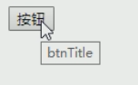
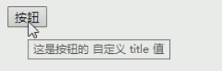

## 灵活理解V-bind的使用
```html
<div id="app">  
     <input type="button" value="摁纽" title="btnTitle">
</div>
<script>
const app=new Vue({
    el:'#app',
    data:{
        btnTitle:"这是自定义的摁纽title"
    }
})
</script>
```


```html
<div id="app">  
     <input type="button" value="摁纽" v-bind:title="btnTitle">
</div>
<script>
const app=new Vue({
    el:'#app',
    data:{
        btnTitle:"这是按钮自定义title的值"
    }
})
</script>
```


这里电脑解析的时候，会将title里面的值理解为变量，然后到app里面的data去找
**拼接绑定内容：:title="btnTitle + ', 这是追加的内容'"**


## 动态绑定img 属性

```html
<div id="img">  
    
    <a v-bind:href="aHerf"></a>

    
    <a :href="aHerf"></a>
</div>
```
```js
    const app5 = new Vue({
      el:"#img",
      data:{
        message:"img动态用法",
        imgURL:"https://cn.bing.com/th?id=OIP.NaSKiHPRcquisK2EehUI3gHaE8&pid=Api&rs=1",
        aHerf:"http://www.baidu.com"
      }
    })  
```
## 动态绑定style
### 普通style对象
```html
  <div id="app3">
    <!-- <h2 :style="{key(属性名):value(属性值)}">{{message}}</h2> -->
    <!-- 加单引号，当成字符串解析 -->
    <h2 :style="{backgroundColor:'blue'}">{{message}}</h2>
    <!-- 不加单引号，变量解析 -->
    <h2 :style="{backgroundColor: blue}"> 失败的{{message}}</h2>
    <h2 :style="getStyle()">成功的{{message}}</h2>
  </div>
```
```js
    const app3 = new Vue({
      el:"#app3",
      data:{
        message:"hello vue style",
        style:{backgroundColor:'red'}
      },
      methods: {
        getStyle(){
          return [this.style]
        }
      }
    })
```
### 数组style
```html
 <div id="app">
    <h2 :style="[baseStyle]">{{message}}</h2>
    <h2 :style="getStyle()">{{message}}</h2>
  </div>
```
```js
 const app = new Vue({
      el:"#app",
      data:{
        message:"hello vue style",
        baseStyle:{backgroundColor:'red'}
      },
      methods: {
        getStyle(){
          return [this.baseStyle]
        }
      },
    })
```
## 动态绑定class - 普通class
```html
  <style>
    .active{
      color:red;
    } 
  </style>
 <div id="app">

    <h3>v-bind动态绑定class</h3>
    <!-- <h2 class="active">{{message}}</h2>
    <h2 :class="active">{{message}}</h2> -->

    <!-- 动态绑定class对象用法  -->
    <!-- <h2 :class="{key1:value1,key2:value2}">{{message}}</h2>
    <h2 :class="{类名1:true,类名2:boolean}">{{message}}</h2> -->
    <h2 class="title" :class="{active:isActive}">{{message}}</h2>
    <h2 class="title" :class="getClasses()">{{message}}</h2>
    <button @click="change">点击变色</button>
  </div>
  
```
```js
    const app = new Vue({
      el:"#app",
      data:{
        message:"VUE",
        active:"active",//可以comment
        isActive:true
      },
      methods: {
        change(){
          this.isActive = !this.isActive
        },
        getClasses(){
          return {active:this.isActive}
        }
      },
    })
```

## 动态绑定class(数组用法)

```html
  <style>
    .active{
      color:red;
    }
    .fontStyle{
        font-style: italic;
    }
    .newStyle{
      background-color: blueviolet;
    }
  .oldStyle{
    background-color: brown;
  }
  </style>
 <div id="app1">
      <h3> v-bind动态绑定class(数组用法)</h3> 
        <!-- 加上单引号当成字符串 -->
        <h2 class="title" :class="getClass()">{{message}}</h2>
        <h2 class="title" :class="['active','fontStyle']">{{message}}</h2>
        <h2 class="title" :class="getClassesArray()">{{message}}</h2>
        <!-- 不加会被当成变量 -->
        <h2 class="title" :class="[active,fontStyle]">失败的 {{message}}</h2>
        <h2 class="title" :class="getClasses()"> 失败的 {{message}}</h2> 
  </div>
```
```js
   const app1 = new Vue({ 
      el:"#app1",
      data:{
        message:"hello vue style",
        active:"aaaa",
        fontStyle:'bbbb',
        newStyle: 'newStyle',
      },
      methods: {
        getClass(){
          return this.newStyle
        },
        getClasses(){
          return [this.active,this.fontStyle]
        },
        getClassesArray(){
          return ['active','fontStyle']
        }
      },
    })
```
> 这里更加实用的是，利用数组进行结合性的动态 比如下面这个例子
```
v-bind:class="['fixStyle',styleNew ? {newStyle:currentIndex===index} : {oldStyle:currentIndex===index}]"
```

## v-for和v-bind结合练习 

想实现一个动态的绑定列表的触发事件 （￣︶￣）↗　
但是这个写法真的让我有点难受，感觉vue是另外一套体系似的， 本来是想做hover的但是还没找到hover事件要怎么写 就写了click

```html
  <style>
    .active{
      color:red;
    }
    .fontStyle{
        font-style: italic;
    }
    .newStyle{
      background-color: blueviolet;
    }
  .oldStyle{
    background-color: brown;
  }
  </style>
<div id="app2">
    <h3> v-for和v-bind结合</h3> 
    <p>{{name}}</p>
    <ul>
        <li v-for="(item, index) in message" :key="index" v-bind:class="[styleNew ? {newStyle:currentIndex===index} : {oldStyle:currentIndex===index}]" @click="changeStyle(index)" >{{index}} -- {{ item}}</li>
    </ul>
  </div>
```

```js
 const app2 = new Vue({
      el:"#app2",
      data:{
        message:["hello vueJs", "hello vueJs","hello vueJs","hello vueJs","hello vueJs"],
        name:"forLopp with events",
        currentIndex:-1,
        styleNew:false,
        newStyle: 'newStyle',
        oldStyle: "oldStyle" 
      },
      methods: { 
        changeStyle(index){
          //console.log(index,this.currentIndex)
          this.styleNew=true
          this.currentIndex=index
        }
      },
```

个人练习code: https://github.com/SavanCode/VUE/tree/main/HelloVue

