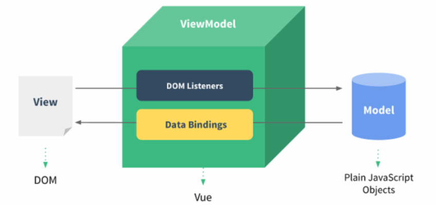

v-model 指令在表单控件元素上创建双向数据绑定




## v-model简单双向绑定

```html
<div id="app">
       <p>v-model简单例子</p>
    <input type="text" v-model="message"/>
    <p>{{message}}</p>
</div>

 <div id="app2">
    <p>v-model 实现</p>
    <p>
        实现双向绑定需要是用v-bind(数据的联系)和v-on(事件触发)
    </p>
    <input type="text" :value="message" @input="valueChange($event)">
    <p>{{message}}</p>
</div>
```
```js
var app= new Vue({
        el:"#app",
        data:{
            message:""
        }
    })
var app2 = new Vue({
      el:"#app2",
      data:{
        message:""
      },
      methods:{
        valueChange(event){
          console.log(event);
          this.message = event.target.value
        }
      }
    })
```

## v-model radio 

```html
<div id="radio">
    <!-- name属性radio互斥 使用v-model可以不用name就可以互斥 -->
    <label for="male">
      <input type="radio" id="male" name="sex" value="男" v-model="sex">男
    </label>
    <label for="female">
        <input type="radio" id="female" name="sex" value="女" v-model="sex">女
    </label>
    <div>你选择的性别是：{{sex}}</div> 
</div>

```
```js
var radio = new Vue({
  el:"#radio",
  data:{
    message:"zzz",
    sex:"男"
  }
})
```

## v-model checkbox 

```html
<div id="checkbox">
    <!-- checkbox单选框 -->
    <h2>单选框</h2>
    <label for="agree">
      <input type="checkbox" id="agree" v-model="isAgree">同意协议
    </label>

    <div>你选择的结果是：{{isAgree}}</div>

    <button :disabled="!isAgree">下一步</button>
    <!-- checkbox多选框 -->
    <h2>多选框</h2>

      <label :for="item" v-for="(item, index) in oriHobbies" :key="index">
        <input type="checkbox" name="hobby" :value="item" :id="item" v-model="hobbies">{{item}}
      </label>
      <!-- <input type="checkbox" name="hobby" value="篮球" v-model="hobbies">篮球
      <input type="checkbox" name="hobby" value="足球" v-model="hobbies">足球
      <input type="checkbox" name="hobby" value="羽毛球"  v-model="hobbies">羽毛球
      <input type="checkbox" name="hobby" value="乒乓球"  v-model="hobbies">乒乓球 -->
    <div>你的爱好是：{{hobbies}}</div>
</div>
```
```js
var checkbox = new Vue({
  el:"#checkbox",
  data:{
    message:"zzz",
    isAgree:false,
    hobbies:[],
    oriHobbies:["篮球","足球","羽毛球","乒乓球"]
  },
})
```

## v-model select

```html
<div id="select">
    <!-- select单选 -->
    <select name="fruit" v-model="fruit">
      <option value="苹果">苹果</option>
      <option value="香蕉">香蕉</option>
      <option value="西瓜">西瓜</option>
    </select>
    <h2>你选择的水果是：{{fruit}}</h2>

    <!-- select多选 -->
    <select name="fruits" v-model="fruits" multiple>
      <option value="苹果">苹果</option>
      <option value="香蕉">香蕉</option>
      <option value="西瓜">西瓜</option>
    </select>
    <h2>你选择的水果是：{{fruits}}</h2>
  </div>
```
```js
var select = new Vue({
  el:"#select",
  data:{
    fruit:"苹果",
    fruits:[]
  }
})    
```

## v-model修饰符

1. `lazy`默认情况下是实时更新数据，加上`lazy`，从输入框失去焦点，按下enter都会更新数据。
2. `number`,默认是string类型，使用`number`复制为number类型。
3. `trim`用于 自动过滤用户输入的首尾空白字符

```html
 <div id="app3">
    <h2>v-model修饰符</h2>
    <h3>lazy,默认情况是实时更新数据，加上lazy，从输入框失去焦点，按下enter都会更新数据</h3>
    <input type="text" v-model.lazy="message">
    <div>{{message}}</div>
    <h3>修饰符number,默认是string类型，使用number赋值为number类型</h3>
    <input type="number" v-model.number="age">
    <div>{{age}}--{{typeof age}}</div>
    <h3>修饰符trim:去空格</h3>
    <input type="text" v-model.trim="name">

  </div>
```
```js
var app3 = new Vue({
  el:"#app3",
  data:{
    message:"zzz",
    age:18,
    name:"ttt"
  }
})
```