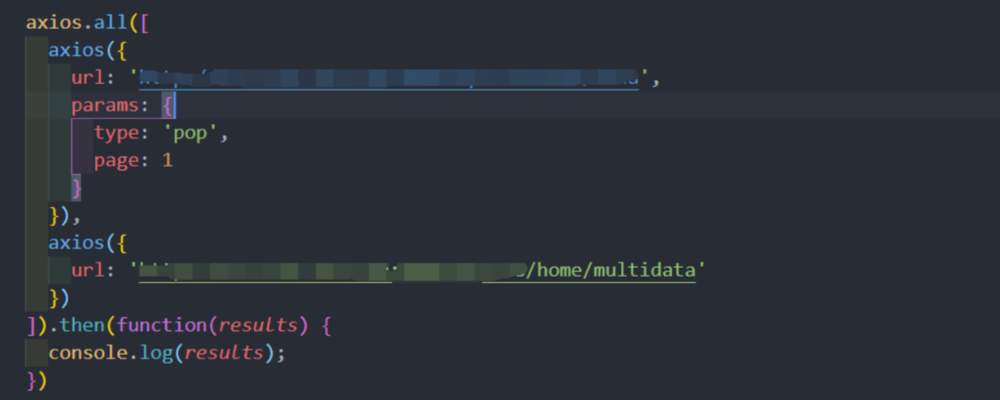
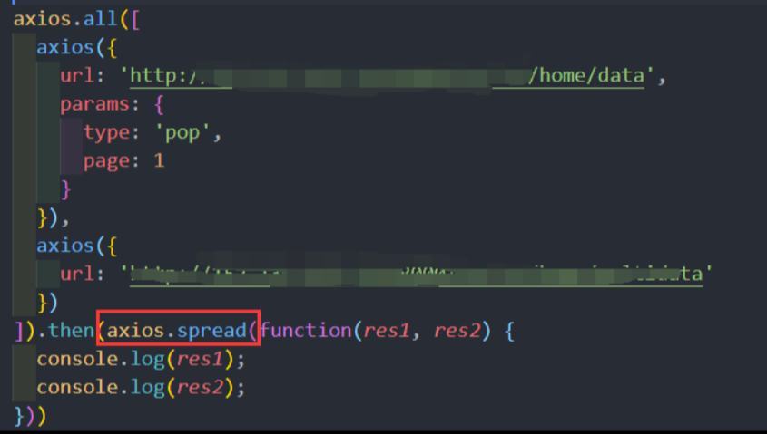
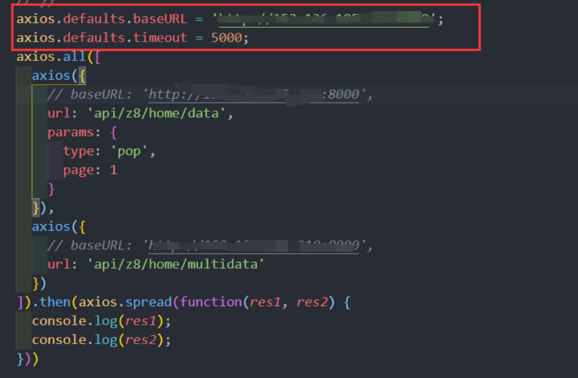

## Axios

### 前期解释

其实读取的方法是由两个： ajax以及axios
但是犹豫ajax对于dom操作过于频繁，Vue作者并不建议
另外有一个叫做早期的 vue-resource,但是2.0之后没有维护了，所以建议就只看axios

### 安装方式

Vue.js 2.0 版本推荐使用 axios 来完成 ajax 请求。

Axios 是一个基于 Promise 的 HTTP 库，可以用在浏览器和 node.js 中。

Github开源地址： https://github.com/axios/axios

**使用 cdn:**

```html
<script src="https://unpkg.com/axios/dist/axios.min.js"></script>
```

或

```html
<script src="https://cdn.staticfile.org/axios/0.18.0/axios.min.js"></script>
```

**使用 npm:**

```sh
$ npm install axios
```

**使用 bower:**

```
$ bower install axios
```

**使用 yarn:**

```sh
$ yarn add axios
```

**使用axios插件**

```js
import axios from "axios"
```

### 通过axios实现数据请求

#### GET 方法

我们可以简单的读取 JSON 数据

```html
<div id="app">
  {{ info }}
</div>
<script type = "text/javascript">
new Vue({
  el: '#app',
  data () {
    return {
      info: null
    }
  },
    /*例子
    axios.get('/user?ID=12345')
    .get('https://www.runoob.com/try/ajax/json_demo.json')
    */
  mounted () {//response.data读取数据
   // 发送get请求
    // 参数1: 必填，字符串，请求的数据接口的url地址，例如请求地址：http://www.baidu.com?id=200
    // 参数2：可选，请求参数和请求头内容，json对象，要提供给数据接口的参数
    axios.get('服务器的资源地址',{ // http://www.baidu.com
        params:{
            参数名:'参数值key' ： 'value', // id: 200,
        },
        headers:{
            选项名:'选项值', // 请求头
        }

    }).then(response=>{ // 请求成功以后的回调函数
            console.log("请求成功");
            console.log(response.data); // 获取服务端提供的数据

    }).catch(error=>{   // 请求失败以后的回调函数
            console.log("请求失败");
            console.log(error.response);  // 获取错误信息
    });
  }
})
</script>
```

#### POST 方法

```html
<div id="app">
  {{ info }}
</div>
<script type = "text/javascript">
new Vue({
  el: '#app',
  data () {
    return {
      info: null
    }
  },
  mounted () {
    axios
      .post('https://www.runoob.com/try/ajax/demo_axios_post.php')
      .then(response => (this.info = response))
      .catch(function (error) { // 请求失败处理
        console.log(error);
      });
  }
})
</script>
```

```js
// 发送post请求，参数和使用和axios.get()类似。
    // 参数1: 必填，字符串，请求的数据接口的url地址
    // 参数2：必填，json对象，要提供给数据接口的参数,如果没有参数，则必须使用{}
    // 参数3：可选，json对象，请求头信息
    axios.put('服务器的资源地址',{
        username: 'xiaoming',
        password: '123456'
    },{
        headers:{
            选项名:"选项值",
        }
    })
    .then(response=>{ // 请求成功以后的回调函数
      console.log(response);
    })
    .catch(error=>{   // 请求失败以后的回调函数
      console.log(error);
    });
```
>在vue使用的过程中，如果要初始化操作，把初始化操作的代码放在 mounted 中执行。
>mounted阶段就是在vm对象已经把data数据实现到页面以后。一般页面初始化使用。
>例如，用户访问页面加载成功以后，就要执行的ajax请求。
>另一个就是created，这个阶段就是在 vue对象创建以后，把ajax请求后端数据的代码放进 created

###  利用Vue.prototype.$http = axios 以及 同异步

```js
 async anotherGet(){ 
      const {data}= await this.$http.get(' http://www.liulongbin.top:3005/api/getprodlist')
      console.log(data)
    },
    async anotherPost(){ 
      const {data}= await this.$http.post(' http://www.liulongbin.top:3005/api/addproduct',{name:'aa'})
      console.log(data)
    }
```

### 执行多个并发请求

```js
function getUserAccount() {
  return axios.get('/user/12345');
}
 
function getUserPermissions() {
  return axios.get('/user/12345/permissions');
}
axios.all([getUserAccount(), getUserPermissions()])
  .then(axios.spread(function (acct, perms) {
    // 两个请求现在都执行完成
  }));
```

### axios API

可以通过向 axios 传递相关配置来创建请求。

config是一个对象，它默认是采用 GET 请求的，当然如果想要使用POST请求，可以添加 `method：“POST”`

axios 它返回的是一个Promise对象，可以直接在后面使用then catch等方法。

#### 实例
```js
axios(config)
// 发送 POST 请求
axios({
  method: 'post',
  url: '/user/12345',
  data: {
    firstName: 'Fred',
    lastName: 'Flintstone'
  }
});
//  GET 请求远程图片
axios({
  method:'get',
  url:'http://bit.ly/2mTM3nY',
  responseType:'stream'
})
  .then(function(response) {
  response.data.pipe(fs.createWriteStream('ada_lovelace.jpg'))
});
axios(url[, config])
// 发送 GET 请求（默认的方法）
axios('/user/12345');
```
### 请求方法的别名

为方便使用，官方为所有支持的请求方法提供了别名，可以直接使用别名来发起请求：

```js
axios.request(config)
axios.get(url[, config])
axios.delete(url[, config])
axios.head(url[, config])
axios.post(url[, data[, config]])
axios.put(url[, data[, config]])
axios.patch(url[, data[, config]])
```

**注意：**在使用别名方法时， url、method、data 这些属性都不必在配置中指定。

### 并发

处理并发请求的助手函数：

```js
axios.all(iterable)
//格式：axios.all([axios(config),axios(config)])
```



```js
axios.spread(callback)
//使用格式： axios.all([axios(config),axios(config)]).then(axios.spread())
```

使用 axios.spread 可将数组 [res1,res2] 展开为 res1, res2



### 全局配置创建

可以使用自定义配置新建一个 axios 实例：

```
axios.create([config])
const instance = axios.create({
  baseURL: 'https://some-domain.com/api/',
  timeout: 1000,
  headers: {'X-Custom-Header': 'foobar'}
});
```



### 实例方法

以下是可用的实例方法。指定的配置将与实例的配置合并：

```
axios#request(config)
axios#get(url[, config])
axios#delete(url[, config])
axios#head(url[, config])
axios#post(url[, data[, config]])
axios#put(url[, data[, config]])
axios#patch(url[, data[, config]])
```

### 请求配置项

下面是创建请求时可用的配置选项，注意只有 url 是必需的。如果没有指定 method，请求将默认使用 get 方法。

```js
{
  // `url` 是用于请求的服务器 URL
  url: "/user",

  // `method` 是创建请求时使用的方法
  method: "get", // 默认是 get

  // `baseURL` 将自动加在 `url` 前面，除非 `url` 是一个绝对 URL。
  // 它可以通过设置一个 `baseURL` 便于为 axios 实例的方法传递相对 URL
  baseURL: "https://some-domain.com/api/",

  // `transformRequest` 允许在向服务器发送前，修改请求数据
  // 只能用在 "PUT", "POST" 和 "PATCH" 这几个请求方法
  // 后面数组中的函数必须返回一个字符串，或 ArrayBuffer，或 Stream
  transformRequest: [function (data) {
    // 对 data 进行任意转换处理

    return data;
  }],

  // `transformResponse` 在传递给 then/catch 前，允许修改响应数据
  transformResponse: [function (data) {
    // 对 data 进行任意转换处理

    return data;
  }],

  // `headers` 是即将被发送的自定义请求头
  headers: {"X-Requested-With": "XMLHttpRequest"},

  // `params` 是即将与请求一起发送的 URL 参数
  // 必须是一个无格式对象(plain object)或 URLSearchParams 对象
  params: {
    ID: 12345
  },

  // `paramsSerializer` 是一个负责 `params` 序列化的函数
  // (e.g. https://www.npmjs.com/package/qs, http://api.jquery.com/jquery.param/)
  paramsSerializer: function(params) {
    return Qs.stringify(params, {arrayFormat: "brackets"})
  },

  // `data` 是作为请求主体被发送的数据
  // 只适用于这些请求方法 "PUT", "POST", 和 "PATCH"
  // 在没有设置 `transformRequest` 时，必须是以下类型之一：
  // - string, plain object, ArrayBuffer, ArrayBufferView, URLSearchParams
  // - 浏览器专属：FormData, File, Blob
  // - Node 专属： Stream
  data: {
    firstName: "Fred"
  },

  // `timeout` 指定请求超时的毫秒数(0 表示无超时时间)
  // 如果请求花费了超过 `timeout` 的时间，请求将被中断
  timeout: 1000,

  // `withCredentials` 表示跨域请求时是否需要使用凭证
  withCredentials: false, // 默认的

  // `adapter` 允许自定义处理请求，以使测试更轻松
  // 返回一个 promise 并应用一个有效的响应 (查阅 [response docs](#response-api)).
  adapter: function (config) {
    /* ... */
  },

  // `auth` 表示应该使用 HTTP 基础验证，并提供凭据
  // 这将设置一个 `Authorization` 头，覆写掉现有的任意使用 `headers` 设置的自定义 `Authorization`头
  auth: {
    username: "janedoe",
    password: "s00pers3cret"
  },

  // `responseType` 表示服务器响应的数据类型，可以是 "arraybuffer", "blob", "document", "json", "text", "stream"
  responseType: "json", // 默认的

  // `xsrfCookieName` 是用作 xsrf token 的值的cookie的名称
  xsrfCookieName: "XSRF-TOKEN", // default

  // `xsrfHeaderName` 是承载 xsrf token 的值的 HTTP 头的名称
  xsrfHeaderName: "X-XSRF-TOKEN", // 默认的

  // `onUploadProgress` 允许为上传处理进度事件
  onUploadProgress: function (progressEvent) {
    // 对原生进度事件的处理
  },

  // `onDownloadProgress` 允许为下载处理进度事件
  onDownloadProgress: function (progressEvent) {
    // 对原生进度事件的处理
  },

  // `maxContentLength` 定义允许的响应内容的最大尺寸
  maxContentLength: 2000,

  // `validateStatus` 定义对于给定的HTTP 响应状态码是 resolve 或 reject  promise 。如果 `validateStatus` 返回 `true` (或者设置为 `null` 或 `undefined`)，promise 将被 resolve; 否则，promise 将被 rejecte
  validateStatus: function (status) {
    return status &gt;= 200 &amp;&amp; status &lt; 300; // 默认的
  },

  // `maxRedirects` 定义在 node.js 中 follow 的最大重定向数目
  // 如果设置为0，将不会 follow 任何重定向
  maxRedirects: 5, // 默认的

  // `httpAgent` 和 `httpsAgent` 分别在 node.js 中用于定义在执行 http 和 https 时使用的自定义代理。允许像这样配置选项：
  // `keepAlive` 默认没有启用
  httpAgent: new http.Agent({ keepAlive: true }),
  httpsAgent: new https.Agent({ keepAlive: true }),

  // "proxy" 定义代理服务器的主机名称和端口
  // `auth` 表示 HTTP 基础验证应当用于连接代理，并提供凭据
  // 这将会设置一个 `Proxy-Authorization` 头，覆写掉已有的通过使用 `header` 设置的自定义 `Proxy-Authorization` 头。
  proxy: {
    host: "127.0.0.1",
    port: 9000,
    auth: : {
      username: "mikeymike",
      password: "rapunz3l"
    }
  },

  // `cancelToken` 指定用于取消请求的 cancel token
  // （查看后面的 Cancellation 这节了解更多）
  cancelToken: new CancelToken(function (cancel) {
  })
}
```

### 响应结构

axios请求的响应包含以下信息：

```js
{
  // `data` 由服务器提供的响应
  data: {},

  // `status`  HTTP 状态码
  status: 200,

  // `statusText` 来自服务器响应的 HTTP 状态信息
  statusText: "OK",

  // `headers` 服务器响应的头
  headers: {},

  // `config` 是为请求提供的配置信息
  config: {}
}
```

使用 then 时，会接收下面这样的响应：

```js
axios.get("/user/12345")
  .then(function(response) {
    console.log(response.data);
    console.log(response.status);
    console.log(response.statusText);
    console.log(response.headers);
    console.log(response.config);
  });
```

在使用 `catch` 时，或传递 [rejection callback](https://developer.mozilla.org/en-US/docs/Web/JavaScript/Reference/Global_Objects/Promise/then) 作为 `then` 的第二个参数时，响应可以通过 `error` 对象可被使用。

#### 配置的默认值

你可以指定将被用在各个请求的配置默认值。

全局的 axios 默认值：

```js
axios.defaults.baseURL = 'https://api.example.com';
axios.defaults.headers.common['Authorization'] = AUTH_TOKEN;
axios.defaults.headers.post['Content-Type'] = 'application/x-www-form-urlencoded';
```

#### 自定义实例默认值：

```js
// 创建实例时设置配置的默认值
var instance = axios.create({
  baseURL: 'https://api.example.com'
});

// 在实例已创建后修改默认值
instance.defaults.headers.common['Authorization'] = AUTH_TOKEN;
```

### 配置的优先顺序

配置会以一个优先顺序进行合并。这个顺序是：在 lib/defaults.js 找到的库的默认值，然后是实例的 defaults 属性，最后是请求的 config 参数。后者将优先于前者。这里是一个例子：

```js
// 使用由库提供的配置的默认值来创建实例
// 此时超时配置的默认值是 `0`
var instance = axios.create();

// 覆写库的超时默认值
// 现在，在超时前，所有请求都会等待 2.5 秒
instance.defaults.timeout = 2500;

// 为已知需要花费很长时间的请求覆写超时设置
instance.get('/longRequest', {
  timeout: 5000
});
```

### 拦截器

为什么要拦截请求呐？

  - 我们对请求的config进行一些修改。

  - 比如config中的一些信息不符合服务器的要求。

  - 比如每次发送网络请求的时候，都希望在界面中显示一个请求的图标。

  - 比如某些网络请求（比如 登陆（携带token）），必须携带一些特殊的信息。

`instance.interceptors.request.use(参数一，参数二)` 传入两个参数，拦截请求成功函数，和拦截请求失败函数。

注意：我们拦截之后，对请求做完一系列修改，我们要返回请求，不然后面我们请求不到数据。

### 在请求或响应被 then 或 catch 处理前拦截

```js
// 添加请求拦截器
axios.interceptors.request.use(function (config) {
    // 在发送请求之前做些什么
    return config;
  }, function (error) {
    // 对请求错误做些什么
    return Promise.reject(error);
  });

// 添加响应拦截器
axios.interceptors.response.use(function (response) {
    // 对响应数据做点什么
    return response;
  }, function (error) {
    // 对响应错误做点什么
    return Promise.reject(error);
  });
```

#### 如果你想在稍后移除拦截器

```js
var myInterceptor = axios.interceptors.request.use(function () {/*...*/});
axios.interceptors.request.eject(myInterceptor);
```

#### 可以为自定义 axios 实例添加拦截器

```js
var instance = axios.create();
instance.interceptors.request.use(function () {/*...*/});
```

错误处理：

```js
axios.get('/user/12345')
  .catch(function (error) {
    if (error.response) {
      // 请求已发出，但服务器响应的状态码不在 2xx 范围内
      console.log(error.response.data);
      console.log(error.response.status);
      console.log(error.response.headers);
    } else {
      // Something happened in setting up the request that triggered an Error
      console.log('Error', error.message);
    }
    console.log(error.config);
  });
```

可以使用 validateStatus 配置选项定义一个自定义 HTTP 状态码的错误范围。

```js
axios.get('/user/12345', {
  validateStatus: function (status) {
    return status < 500; // 状态码在大于或等于500时才会 reject
  }
})
```

### 取消

使用 cancel token 取消请求。

Axios 的 cancel token API 基于[cancelable promises proposal](https://github.com/tc39/proposal-cancelable-promises)

可以使用 CancelToken.source 工厂方法创建 cancel token，像这样：

```js
var CancelToken = axios.CancelToken;
var source = CancelToken.source();

axios.get('/user/12345', {
  cancelToken: source.token
}).catch(function(thrown) {
  if (axios.isCancel(thrown)) {
    console.log('Request canceled', thrown.message);
  } else {
    // 处理错误
  }
});

// 取消请求（message 参数是可选的）
source.cancel('Operation canceled by the user.');
```

还可以通过传递一个 executor 函数到 CancelToken 的构造函数来创建 cancel token：

```js
var CancelToken = axios.CancelToken;
var cancel;

axios.get('/user/12345', {
  cancelToken: new CancelToken(function executor(c) {
    // executor 函数接收一个 cancel 函数作为参数
    cancel = c;
  })
});

// 取消请求
cancel();
```

**注意**：可以使用同一个 cancel token 取消多个请求。

### 请求时使用 application/x-www-form-urlencoded

axios 会默认序列化 JavaScript 对象为 JSON。 如果想使用 application/x-www-form-urlencoded 格式，你可以使用下面的配置。

**浏览器**

在浏览器环境，你可以使用 URLSearchParams API：

```js
const params = new URLSearchParams();
params.append('param1', 'value1');
params.append('param2', 'value2');
axios.post('/foo', params);
```

URLSearchParams 不是所有的浏览器均支持。

除此之外，你可以使用 qs 库来编码数据:

```js
const qs = require('qs');
axios.post('/foo', qs.stringify({ 'bar': 123 }));

// Or in another way (ES6),

import qs from 'qs';
const data = { 'bar': 123 };
const options = {
  method: 'POST',
  headers: { 'content-type': 'application/x-www-form-urlencoded' },
  data: qs.stringify(data),
  url,
};
axios(options);
```

## 总结！！网络请求模块的封装 方法

如果我们使用的 axios 有一天不进行了维护，或者出现重大的bug ，我们需要换其他的第三方网络请求框架。那么我们需要在每一个组件中都需要修改，很是不好。所以我们对网络请求模块进行封装，即使有一个我们需要改换其他的第三方网络请求框架，就只对我们的网络请求模块进去修改即可。

创建一个network文件夹。这里面放对网络封装相关的文件。

创建request.js

### 封装一：使用回调函数。

request.js

```js
import axios from 'axios'

export function request(config, success, failure) {
  // 1.创建实例
  const instance = axios.create({
      baseURL: 'http://111.111.111.111:8000',
      timeout: 5000
    })
    // 2、发送网络请求请求
  instance(config)
    .then(res => {
      success(res)
    })
    .catch(rej => {
      failure(rej)
    })
}
```

使用模块：

```js
import { request } from "./newwork/request"

request({
  url: 'home/multidata'
}, function(res) {
  console.log(res);
})
request({
  url: "api/z8/home/data",
  params: { type: 'pop', page: 1 }
}, function(res) {
  console.log(res);
})
```

### 封装二：使用回调函数。

request.js

```js
import axios from 'axios'

export function request(config) {
  // 1.创建实例
  const instance = axios.create({
      baseURL: 'http://111.111.111.111:8000',
      timeout: 5000
    })

    // 2、发送网络请求请求
  instance(config.baseConfig)
    .then(res => {
      config.success(res)
    })
    .catch(rej => {
      fonfig.failure(rej)
    })
}
```

使用模块：

```js
import axios from 'axios'

request({
  baseConfig: {
    url: '/home/multidata'
  },
  success(res) {
    console.log(res);
  },
  failure(rej) {
    console.log(rej);
  }
})
```

### 封装三：使用Promise。

request.js

```js
import axios from 'axios'

export function request(config) {
  return new Promise((resolve, reject) => {
    // 1.创建实例
    const instance = axios.create({
      baseURL: 'http://111.111.111.111:8000',
      timeout: 5000
    })

    // 2、发送网络请求请求
    instance(config)
      .then(res => {
        resolve(res)
      })
      .catch(rej => {
        reject(rej)
      })
  })
}
```

使用模块：

```js
import { request } from "./newwork/request"

request({
  url: 'home/multidata'

}).then(res => {
  console.log(res);
}).catch(rej => {
  console.log(rej);
})
```

### 封装四：（最终方案）使用Promise。

request.js

```js
复制import axios from 'axios'

export function request(config) {

  // 1.创建实例
  const instance = axios.create({
      baseURL: 'http://111.111.111.111:8000',
      timeout: 5000
    })
    // 2、发送网络请求请求

  // axios 实例本身返回是一个Promise对象
  return instance(config)

}
```

使用模块：

```js
复制import { request } from "./newwork/request"

request({
  url: 'home/multidata'

}).then(res => {
  console.log(res);
}).catch(rej => {
  console.log(rej);
})
```

## Node.js 环境

在 node.js里, 可以使用 querystring 模块:

```js
const querystring = require('querystring');
axios.post('http://something.com/', querystring.stringify({ foo: 'bar' }));
```

当然，同浏览器一样，你还可以使用 qs 库。

## Promises

axios 依赖原生的 ES6 Promise 实现而[被支持](http://caniuse.com/promises)。

如果你的环境不支持 ES6 Promise，你可以使用 [polyfill](https://github.com/jakearchibald/es6-promise)。

## TypeScript支持

axios 包含 TypeScript 的定义。

```
import axios from "axios";
axios.get("/user?ID=12345");
```

## JSONP

### JSONP的实现原理

由于浏览器的安全性限制，不允许AJAX访问 协议不同、域名不同、端口号不同的 数据接口，浏览器认为这种访问不安全；

可以通过动态创建script标签的形式，把script标签的src属性，指向数据接口的地址，因为script标签不存在跨域限制，这种数据获取方式，称作JSONP（注意：根据JSONP的实现原理，知晓，JSONP只支持Get请求）；

### 具体实现过程

先在客户端定义一个回调方法，预定义对数据的操作；
再把这个回调方法的名称，通过URL传参的形式，提交到服务器的数据接口；
服务器数据接口组织好要发送给客户端的数据，再拿着客户端传递过来的回调方法名称，拼接出一个调用这个方法的字符串，发送给客户端去解析执行；
客户端拿到服务器返回的字符串之后，当作Script脚本去解析执行，这样就能够拿到JSONP的数据了；

可以通过vscode中安装live sever的插件，从而更好的运行本地服务器

# 练习可用接口

## axios练习中使用的接口
天气接口 ： http://wthrcdn.etouch.cn/weather_mini?city=城市名称 
音乐接口搜索 ： http://tingapi.ting.baidu.com/v1/restserver/ting?method=baidu.ting.search.catalogSug&query= 歌曲标题 
音乐信息接口 ： http://tingapi.ting.baidu.com/v1/restserver/ting?method=baidu.ting.song.play&songid= 音乐ID 

## axios练习中使用的接口
测试接口1: https://api.github.com/search/repositories?q=v&sort=stars
测试接口2: https://api.github.com/search/users?q=aa

## JSONP的接口
get请求地址： http://www.liulongbin.top:3005/api/getlunbo
post请求地址：http://www.liulongbin.top:3005/api/post
jsonp请求地址：http://www.liulongbin.top:3005/api/jsonp

## 品牌管理改造

展示品牌列表
GET 接口地址 http://www.liulongbin.top:3005/api/getprodlist

添加品牌数据
POST 接口地址 http://www.liulongbin.top:3005/api/addproduct 

# Reference

https://zhuanlan.zhihu.com/p/149300921

https://www.npmjs.com/package/axios

https://www.runoob.com/vue2/vuejs-ajax-axios.html

https://aqingya.cn/articl/5dae9880.html