## Vue.js 组件

组件（Component）是 Vue.js 最强大的功能之一。

组件可以扩展 HTML 元素，封装可重用的代码。

组件系统让我们可以用独立可复用的小组件来构建大型应用，几乎任意类型的应用的界面都可以抽象为一个组件树

## 全局组件

### 方式一

```html
  <div id="app">
        <!-- 这里是不能够 直接用大写的哦 如果命名用了大写 编译要用横杠链接 -->
        <simple-vue></simple-vue>
    </div> 
    <script src="https://cdn.jsdelivr.net/npm/vue@2.6.10/dist/vue.js"></script>
    <script>
    //这里可以理解为构造函数
    const com1 = Vue.extend({
       template: '<h1>一个全局组件</h1>' // template 属性，表示这个组件的 UI 代码解构
     })
    // 向Vue全局注册组件，Vue.component(组建的名字, 组建的构造函数)
    Vue.component('simpleVue', com1)
    // 创建根实例
    new Vue({
      el: '#app'
    })
    </script>
```

### 方式二

```js
const com2Obj = {
   // 1. template 属性中，不能单独放一段文本，必须用标签包裹起来；
   // 2. 如果在 template 属性中，想要放多个元素了，那么，在这些元素外，必须有唯一的一个根元素进行包裹；
   template: '<div><h2>这是直接使用 Vue.component 创建出来的组件</h2><h3>红红火火</h3></div>'
 }

 // 定义全局的组件
 // Vue.component 的第二个参数，既接收 一个 组件的构造函数， 同时，也接受 一个对象
 Vue.component('mycom2', com2Obj)
```

### 方式三

```html
<!-- 定义一个 template 标签元素  -->
<!-- 使用 Vue 提供的 template 标签，可以定义组件的UI模板解构 -->
<div id="app">
    <mycom3></mycom3>
    <!-- 因为上面的call所以下面的template 才会显示-->
</div>
<!--注意这里实在下面的vue实例的控制之外的区域，如果放在里面就会多一个 -->
<template id="tmpl">
 <div>
   <h3>哈哈，这是在外界定义的组件UI解构，我不会本身在页面显示</h3>
   <h3>我是来捣乱的</h3>
 </div>
</template> 
<script>
 // 这是定义的全局组件
 Vue.component('mycom3', {
   template: '#tmpl'
 })
</script>
```


## 局部组件

我们也可以在实例选项中注册局部组件，这样组件只能在这个实例中使用

```html
<div id="app">
	<component></component>
</div>
<script src="https://cdn.jsdelivr.net/npm/vue@2.6.10/dist/vue.js"></script>
<script>
var Child = {
  template: '<h1>自定义 组件!</h1>'
}

// 创建根实例
new Vue({
  el: '#app',
  components: {
    // <component> 将只在父模板可用
    'component': Child
  }
})
</script>
```

### 拓展1： 调用分离的模板，使用`template`标签

这里的区别其实是在html上用id 表明不同的component，实际上template的内容不写入js

```html
  <template id="cpn2">
    <div>
      <h2>组件模板的分离写法</h2>
      <p>template标签</p>
    </div>
  </template>
<script>
     const app = new Vue({
      el: "#app",
      components: { //局部组件创建 
        cpn2: {
          template: '#cpn2'
        }
      }
    })
</script>
```

### 拓展2：组件的data为什么必须要是函数

 组件的思想是复用，定义组件当然是把通用的公共的东西抽出来复用。

```html
<div id="app">
    <h2>data不使用函数</h2>
    <cpn1></cpn1>
    <cpn1></cpn1>
    <hr>
    <h2>data使用函数</h2>
    <cpn2></cpn2>
    <cpn2></cpn2>
    <hr>
  </div>
  <script src="https://cdn.jsdelivr.net/npm/vue@2.6.10/dist/vue.js"></script>
  <template id="cpn1">
    <div>
      <button @click="count--">-</button>
      当前计数：{{count}}
      <button @click="count++">+</button>
    </div>
  </template>
  <template id="cpn2">
    <div>
      <button @click="count--">-</button>
      当前计数：{{count}}
      <button @click="count++">+</button>
    </div>
  </template>
  <script>
    const obj = {
      count:0
    };
    const app = new Vue({
      el: "#app",
      components: { //局部组件创建
        cpn1: {
          template: '#cpn1',
          data() {
            return obj;
          }
        },
        cpn2: {
          template: '#cpn2',
          data() {
            return {
              count: 0
            }
          }
        }
      }
    })
  </script>
```


## 组件中展示数据和响应事件

```js
Vue.component('mycom', {
      template: '<h3 @click="show">这是自定义的全局组件：{{ msg }}</h3>',
      data: function () { // 在组件中，可以有自己的私有数据，但是，组件的 data 必须是一个 function，并且内部 return 一个 数据对象，这样才能确保每次渲染的时候拿到的是最新的私有数据
        return {
          msg: '哈哈哈'
        }
      },
      methods: { // 尝试定义组件的私有方法
        show() {
          console.log('触发了组件的私有show方法！')
        }
      }
    })
```

## 组件切换

### 利用 if else

下面的例子有点我有点体会到了Vue的遍历，学过angular以及react的可以回想一下对比

```html
  <div id="app">  
   <input type="button" value="change mode" @click="flag=!flag"></input>
   <login v-if="flag"></login>
   <register v-else="flag"></register> 
  </div> 
<script>
Vue.component('login', {
  template:'<h3>login</h3>'
})
Vue.component('register', {
  template:'<h3>register</h3>'
})
const app = new Vue({
  el: '#app',
   data:{
     flag:false
  }
})
```

### 利用component的 ：is属性

```html
<div>
<component :is="'register'"></component>
</div>
<script>
Vue.component('mysimpleVue', componentContent)

Vue.component('login', {
  template:'<h3>login</h3>'
})
Vue.component('register', {
  template:'<h3>register</h3>'
})
</script>
```


## 带有Prop的组件

prop 是子组件用来接受父组件传递过来的数据的一个自定义属性。

父组件的数据需要通过 props 把数据传给子组件，子组件需要显式地用 props 选项声明 "prop"
```html
<div id="app">
	<child message="hello!"></child>
</div>

<script>
// 注册
Vue.component('child', {
  // 声明 props
  props: ['message'],
  // 同样也可以在 vm 实例中像 “this.message” 这样使用
  template: '<span>{{ message }}</span>'
})
// 创建根实例
new Vue({
  el: '#app'
})
</script>
```

### props属性使用

#### 数组写法

```
props: ['cmovies', 'cmessage']
```

#### 对象写法

```js
  props: { 
          cmessage: {
          type: String,
          default: 'zzzzz',
          required: true //在使用组件必传值
          }
  }
```
#### props属性的类型限制
```js
//1.类型限制(多个类使用数组)
cmovies:Array,//限制为数组类型
cmessage:String,//限制为Strin类型
cmessage:['String','Number']//限制为String或Number类型
```
####  props属性的默认值

```js
// 2.提供一些默认值，以及必传值
        cmessage: {
          type: String,
          default: 'zzzzz',//默认值
        }
```
#### props属性的必传值

```js
cmessage: {
          type: String,
          default: 'zzzzz',
          required: true //在使用组件必传值
        }
```
#### 类型是Object/Array，默认值必须是一个函数

```js
//类型是Object/Array，默认值必须是一个函数
cmovies: {
	type: Array,
	default () {
		return [1, 2, 3, 4]
	}
},
```
#### 自定义验证函数

```js
vaildator: function (value) {
	//这个传递的值必须匹配下列字符串中的一个
	return ['zzzzz', 'ttttt', 'yyy'].indexOf(value) !== -1
}
```
#### 自定义类型

```js
    function Person(firstName,lastName) {
      this.firstName = firstName
      this.lastName = lastName
    }
	cmessage:Person//限定了cmeessage必须是Person类型
```

## 传值图解

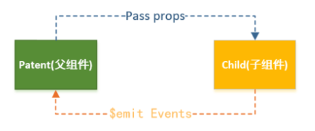

## 动态 Prop 父->子

类似于用 v-bind 绑定 HTML 特性到一个表达式，也可以用 v-bind 动态绑定 props 的值到父组件的数据中。每当父组件的数据变化时，该变化也会传导给子组件

### 例子1 - string

```html
<!--上下两种写法都可以 这里的父子跟全局没有关系 -->
<div id="app">
	<div>
	  <input v-model="parentMsg">
	  <br>
        <!-- 这里变量要换写的方式 -->
	  <child v-bind:props-message="parentMsg"></child>
	</div>
</div>

<script>
// 创建根实例
new Vue({
  el: '#app',
  data: {
	parentMsg: '父组件内容'
  },
    methods:{},
    components:{
        'child': {
          // 声明 props
          props: ['propsMessage'],
          // 同样也可以在 vm 实例中像 “this.message” 这样使用
          template: '<span>{{ propsMessage }}</span>'
        }
    }
})
</script>
```

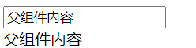

### 例子2 - 对象

```html
  <div id="app2">
          <!-- 这里变量要换写的方式 -->
      <child2 v-bind:msgobj="msgObj"></child2>
  </div>
<script>
const app3=new Vue({
  el: '#app2',
  data:{
    msgObj:{
        number:'1',
        rank:'1'
    }
  },
    components:{
      'child2':{
        // 声明 props
        props: ['msgobj'],
        // 同样也可以在 vm 实例中像 "this.message" 这样使用
        template:'<span>{{ JSON.stringify(msgobj) }}</span>'
      }
    }
})
</script>
```

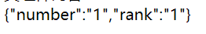

### 例子3 - 方法

```html
  <div id="app3">
    <hr>
    父组件
    <!-- 父组件向子组件传递方法v-on 传递数据v-bind-->
     <com1 @func="show"></com1>
  </div>
  <script>
  const app4=new Vue({
  el:"#app3",
  data:{},
  methods: {
    show(){
      console.log("父组件的button")
    }
  },
  components:{
    'com1':{
      template:'<div><button @click="btnClick">这是子元素</button><button @click="btnClick2">这是子元素</button></div>',
      methods:{
        btnClick(){
          console.log("子组件的button")
        },
        btnClick2(){
          this.$emit('func')
        }
      },
    }
  }
})
</script>
```


### 更加复杂的 v-ind v-for 以及component一起结合的例子

```html
<div id="app">
	<ol>
    <todo-item v-for="item in sites" v-bind:propstodo="item" @click.native="alert(item.text)"></todo-item>
  	</ol>
</div>

<script>
Vue.component('todo-item', {
  props: ['propstodo'],
  template: '<li>{{ propstodo.text }}</li>'
})
new Vue({
  el: '#app',
  data: {
    sites: [
      { text: 'Runoob' },
      { text: 'Google' },
      { text: 'Taobao' }
    ]
  }
})
</script>
```

> prop 是单向绑定的：当父组件的属性变化时，将传导给子组件，但是不会反过来

## Prop 验证
组件可以为 props 指定验证要求。

为了定制 prop 的验证方式，你可以为 props 中的值提供一个带有验证需求的对象，而不是一个字符串数组

```html 
<div id="app">
  <example
   :propa="'asda'"
   :propb = "'aasasa'"
   :propc="'sdf'"
   :prope="{a:'a'}"
   :propf="100"
  ></example>
</div>
<script type="text/javascript">
Vue.component('example', {
 props: {
  // 基础类型检测 (`null` 意思是任何类型都可以)
  propa: Number,
  // 多种类型
  propb: [String, Number],
  // 必传且是字符串
  propc: {
   type: String,
   required: true
  },
  // 数字，有默认值
  propd: {
   type: Number,
   default: 1000
  },
  // 数组/对象的默认值应当由一个工厂函数返回
  prope: {
   type: Object,
   default: function () {
   return { message: 'hello' }
   }
  },
  // 自定义验证函数
  propf: {
   type: Number,
    validator: function (value) {
      // 这个值必须匹配下列字符串中的一个
      return value>0? -1:1
    },
    defalut:12
  }
 },
 template:'
  <table border="1px">
    <tr>
             <th>propA</th>
             <th>propB</th>
             <th>propC</th>
             <th>propD</th>
        <th>propE</th>
             <th>propF</th>
    </tr>
    <tr>
             <td>{{ propa }}</td>
             <td>{{ propb }}</td>
             <td>{{ propc }}</td>
             <td>{{ propd }}</td>
        <td>{{ prope }}</td>
             <td>{{ propf }}</td>
    </tr>
  </table>'
})
new Vue({
 el: "#app"
});
</script>
```

## Vue.js 组件 - 自定义事件  传递参数  子->父

父组件是使用 props 以及函数绑定的方式传递数据以及方法给子组件，但如果子组件要把数据传递回去，就需要使用自定义事件！

我们可以使用 v-on 绑定自定义事件, 每个 Vue 实例都实现了事件接口(Events interface)，即：

- 使用 `$on(eventName)` 监听事件
- 使用 `$emit(eventName)` 触发事件

另外，父组件可以在使用子组件的地方直接用 v-on 来监听子组件触发的事件。

### Vue $emit 

这里涉及了自定义事件

```html
<div id="app">
    <div id="counter-event-example">
      <p>{{ total }}</p>
        <!--这里传递了increment-->
      <button-counter v-on:increment="incrementTotal"></button-counter><br/>
      <button-counter v-on:increment="incrementTotal"></button-counter>
    </div>
</div>
<script>
Vue.component('button-counter', {
  template: '<div><button v-on:click="incrementHandler(1)">-</button>{{ counter }}<button v-on:click="incrementHandler(2)">+</button></div>',
  data: function () { //这里一定要是函数
    return {
      counter: 0
    }
  },
  methods: {
    incrementHandler: function (v) {
        if(v==1){
            this.counter -= 1
            //通过$emit call了父组件传过来的increment
            //后面的值就传回去incrementTotal的值
              this.$emit('increment',1)
        }else{ 
            this.counter += 1
              this.$emit('increment',2)
        }
      
    }
  },
})
new Vue({
  el: '#counter-event-example',
  data: {
    total: 0
  },
  methods: {
    incrementTotal: function (d) {
        if(d==1){
            this.total -= 1
        }else{
            this.total += 1
        }
      
    }
  }
})
</script>
```

如果你想在某个组件的根元素上监听一个原生事件。可以使用 .native 修饰 v-on 。例如：

```html
<my-component v-on:click.native="doTheThing"></my-component>
```

## 自定义组件的 v-model

组件上的 v-model 默认会利用名为 value 的 prop 和名为 input 的事件。

```html
<input v-model="parentData">
```

等价于：

```html
<input 
    :value="parentData"
    @input="parentData = $event.target.value"
>
```

### 例子 checkbox

```html
<div id="app">
    <runoob-input v-model="num"></runoob-input>
    <p>输入的数字为:{{num}}</p>
</div>
<script>
Vue.component('runoob-input', {
    template: `
    <p>   <!-- 包含了名为 input 的事件 -->
      <input
       ref="input"
       :value="value" 
       @input="$emit('input', $event.target.value)"
      >
    </p>
    `,
    props: ['value'], // 名为 value 的 prop
})
   
new Vue({
    el: '#app',
    data: {
        num: 100,
    }
})
</script>
```


### 例子 input
```html
<div id="app">
    <base-checkbox v-model="lovingVue"></base-checkbox> 
     <div v-show="lovingVue"> 
        如果选择框打勾我就会显示。 
    </div>
</div> 
<script>
// 注册
Vue.component('base-checkbox', {
 
  model: {
    prop: 'checked',
    event: 'change'  // onchange 事件
  },
  props: {
    checked: Boolean
  },
   
  template: `
    <input
      type="checkbox"
      v-bind:checked="checked"
      v-on:change="$emit('change', $event.target.checked)"
    >
  `
})
// 创建根实例
new Vue({
  el: '#app',
  data: {
    lovingVue: true
  }
})
</script>
```

### 父子通信的例子练习

git上

## 获取页面上的DOM ref属性

ref属性，类似于document.getElementById(); 这里的`$refs`可以看做是`ref`的选择器，这个`$ref`是一个对象，通过key可以获取到其中存放的对象。

当然了，既然是对象，也可以使用方括号运算符去访问，具体是this.$refs[input1]。

```html
<div id="refSample">
    <button @click="getInfo" ref="btn">点击获取元素内容</button>
    <h3 ref="myh3">这是myh3{{msg}}</h3>
  </div>
<script>
const refsample= new Vue({
  el:'#refSample',
  data:{
      msg:"sample"
  },
  methods: {
    getInfo(){
      console.log(this.$refs)
      console.log(this.$refs.myh3.innerHTML)
      this.$refs.myh3.msg="123321"//改变本身的属性也可以直接call DOM的属性
    }
  },
})
</script>
```

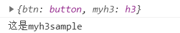


## 获取页面上的DOM `$parent` `$root` `$root`属性

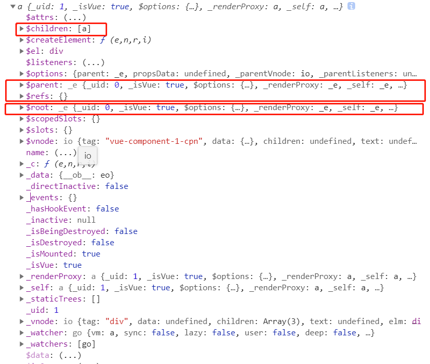

```js
components: {
                ccpn: {
                    template: "#ccpn",
                    methods: {
                        btnClick() {
                            //1.访问父组件 $parent
                            console.log(this.$parent);

                            // 2.访问根组件
                            console.log(this.$root);
                        }
                    }
                }
            }
```

个人练习完整例子： https://github.com/SavanCode/VUE/tree/main/HelloVue

## slot插槽

slot要灵活跟template， template是属于相对于不灵活的 但是slot是更加方便更好的在页面显示内容的 图理解：

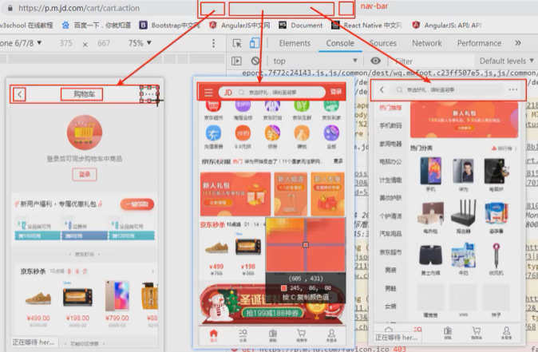

>template 的区别在于 template是基本同样的内容格式，slot是基本构架类似（个人理解）

### slot插槽的基本使用 - 替换单个位置的slot

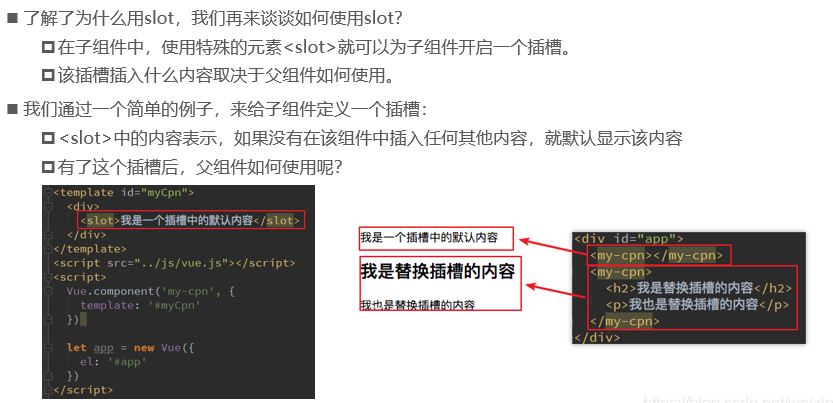

```html
<body> 
    <div id="app">
        <!--这里第一个就是组件的展示 -->
        <cpn></cpn>
        <cpn><input type="text"></cpn>
        <!--这里就应用了slot 进行了替换 我用组件 但是slot的地方会用现在给的替换掉-->
    </div>
    <template id="cpn">
        <div>
            <h2>我是template定义的组件</h2>
            <p>我是一个组件中的p</p>
            <slot><button>默认为按钮</button></slot>
        </div>
    </template>
    <script>

        const cpn = {
            template:'#cpn'
        }
        var vm = new Vue({
            el: '#app',
            data: {},
            methods: {},
            components:{
                cpn
            }
        });
    </script>
</body>
```

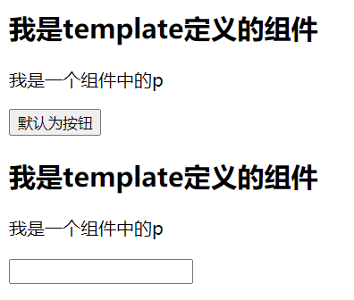

### 具名插槽 - 替换多个位置的slot

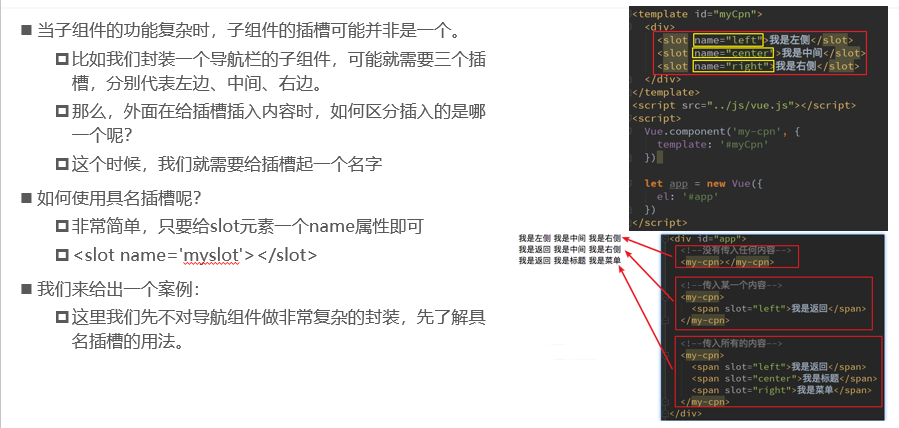

```html
<div id="app">
    <!-- 这里的指定slot替换name为center的 其他的不变-->
    <cpn><span slot="center">标题</span></cpn>
</div>
<template id="cpn">
    <div>
        <slot><span>左边</span></slot>
        <!-- 这里命名了name 目的是更有针对性的替换-->
        <slot name="center"><span>中间</span></slot>
        <slot><span>右边</span></slot>
    </div>
</template>
```

### 拓展思考： 如果打乱顺序呢？ 页面渲染是按照template里面的 还是你写在主页面的顺序？

例子：https://github.com/SavanCode/VUE/tree/main/HelloVue

>这里的实际写的时候顺序打乱，但是渲染过程中，还是按照组件内部的布局渲染架构，只是会对内容进行改变

### 作用域插槽

这里先要理解一个重点就是 变量作用域，Vue页面的component肯定是先找Vue的实例上面的data

**官方文档写明： 父组件模板的所有东西都在父级作用域内编译；子组件模板内的东西都会在自己作用域内编译**

也就是vue实例管自己的，组件管自己的

```html
  <!-- 父组件 -->
  <div id="app">
    <!-- 使用的vue实例作用域的isShow 这个组件是要显示的-->
    <cpn v-show="isShow"></cpn>
  </div>
  <!-- 子组件 -->
  <template id="cpn">
    <div>
      <h2>我是一个子组件</h2>
      <p>下面的按钮能显示嘛</p>
      <!-- 组件作用域，使用的子组件的作用域 所以button是不显示的 -->
      <button v-show="isShow"></button>
    </div>
  </template>
<script>
    const cpn = {
      template: "#cpn",
      data() {
        return {
          isShwo:false
        }
      },
    }
    const app = new Vue({
      el: "#app",
      data() {
        return {
          message: "我是父组件消息",
          isShow:true
        }
      },
      components: {
        cpn
      },
    })
  </script>
```


### 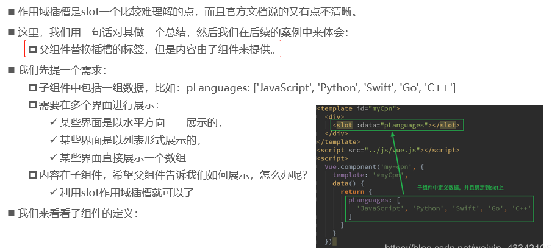

```html
    <div id="app">
        <cpn></cpn>
        <cpn> 
           <!-- 利用template的目的是获取子组件的pLanguage  slot-scope是给slot的整个对象命名  slot.data就是取到自组建的data-->
          <template slot-scope="slot">
              <span v-for="item in slot.data">{{item}} - </span>
              <br>
            <!-- <span>{{slot.data.join(' - ')}}</span> -->
          </template>
        </cpn>
    </div>
    <template id="cpn">
        <div>
            <!-- data绑定本身template里面的data -->
           <slot :data="pLanguages"><li v-for="item in pLanguages">{{item}}</li></slot>
        </div>
    </template>
    <script>
        const cpn = {
            template:'#cpn',
            data(){
                return{
                   pLanguages: ['javascript','c++','go','java']
                }
            }
        }
        var vm = new Vue({
            el: '#app',
            data: {
                isShow:false
            },
            methods: {},
            components:{
                cpn
            }
        });
    </script>
```

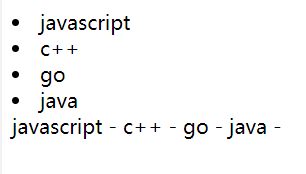

### Slot补充资料

https://segmentfault.com/a/1190000012996217

## 个人练习的完整代码

https://github.com/SavanCode/VUE/tree/main/HelloVue

## Reference

https://www.runoob.com/vue2/vue-component-custom-event.html

https://www.bilibili.com/video/BV15741177Eh?p=72

https://blog.csdn.net/weixin_43342105/article/details/106153672

