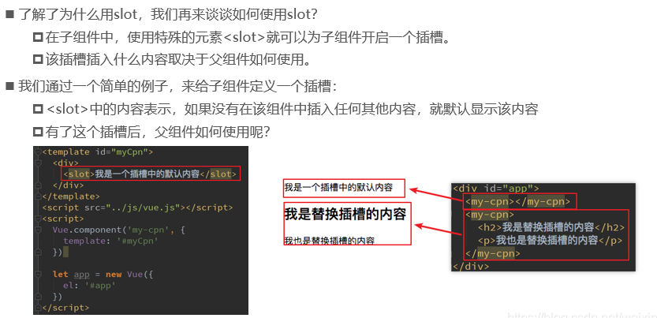

自定义的指令 官方 https://cn.vuejs.org/v2/guide/custom-directive.html

除了默认设置的核心指令( v-model 和 v-show ), Vue 也允许注册自定义指令。

## 自定义指令两种方式

-  通过 Vue.directive() 函数注册一个全局的指令。
-  通过组件的 directives 属性，对该组件添加一个局部的指令。

### 创建全局指令

需要传入指令名称以及一个包含指令钩子函数的对象，该对象的键即钩子函数的函数名，值即函数体，钩子函数可以有多个。

创造的时候不用加v- ， 之后使用的时候用v-

```js
Vue.directive('self_defined_name',{
  bind:function(el,binding){  
  //do someting 
  },
  inserted: function(el,binding){ 
  //do something
  },
}
```
### 创建局部指令

直接向创建的 Vue 实例的 directives 字典属性添加键值对，键值对即需要添加的自定义指令及对应钩子函数字典对象。键值对可以有多个，对应多个自定义指令。

```js
new Vue({
  el:'#app',
  directives:{
    self_defined_name1:{
        bind:function(el,binding){
          //do something
        }
        inserted:function(el,binding){
                  //do something
        },
     }

    self_defined_name2:{
        bind:function(el,binding){
          //do something
        }
        inserted:function(el,binding){
                  //do something
        },
     }
  }

})  
```

下面我们注册一个全局指令 v-focus, 该指令的功能是在页面加载时，元素获得焦点

## 通过全局指令 v-focus 例子
```html
<div id="app">
	<p>页面载入时，input 元素自动获取焦点：</p>
	<input v-focus>
</div>

<script>
// 注册一个全局自定义指令 v-focus
Vue.directive('focus', {
  // 当绑定元素插入到 DOM 中。
  inserted: function (el) {
    // 聚焦元素
    el.focus()
    //el.style.color='red',DOM会变色
  }
})
// 创建根实例
new Vue({
  el: '#app'
})
</script>
```
## 通过局部指令 v-focus  例子
```html
<div id="app">
  <p>页面载入时，input 元素自动获取焦点：</p>
  <input v-focus>
</div>
 
<script>
// 创建根实例
new Vue({
  el: '#app',
  directives: {
    // 注册一个局部的自定义指令 v-focus
    focus: {
      // 指令的定义
      inserted: function (el) {
        // 聚焦元素
        el.focus()
      }
    }
  }
})
</script>
```

## 钩子

### 钩子函数
指令定义函数提供了几个钩子函数（可选）：

- bind: 只调用一次，指令第一次绑定到元素时调用，用这个钩子函数可以定义一个在绑定时执行一次的初始化动作。
- inserted: 被绑定元素插入父节点时调用（父节点存在即可调用，不必存在于 document 中）。
- update: 被绑定元素所在的模板更新时调用，而不论绑定值是否变化。通过比较更新前后的绑定值，可以忽略不必要的模板更新（详细的钩子函数参数见下）。
- componentUpdated: 被绑定元素所在模板完成一次更新周期时调用。
- unbind: 只调用一次， 指令与元素解绑时调用。

### 钩子函数参数
钩子函数的参数有：

- el: 指令所绑定的元素，可以用来直接操作 DOM 。
- binding: 一个对象，包含以下属性：
- name: 指令名，不包括 v- 前缀。
- value: 指令的绑定值， 例如： v-my-directive="1 + 1", value 的值是 2。
- oldValue: 指令绑定的前一个值，仅在 update 和 componentUpdated 钩子中可用。无论值是否改变都可用。
- expression: 绑定值的表达式或变量名。 例如 v-my-directive="1 + 1" ， expression 的值是 "1 + 1"。
- arg: 传给指令的参数。例如 v-my-directive:foo， arg 的值是 "foo"。
- modifiers: 一个包含修饰符的对象。 例如： v-my-directive.foo.bar, 修饰符对象 modifiers 的值是 { foo: true, bar: true }。
- vnode: Vue 编译生成的虚拟节点。
- oldVnode: 上一个虚拟节点，仅在 update 和 componentUpdated 钩子中可用。


```html
<div id="app"  v-runoob:hello.a.b="message">
</div>
<script>
Vue.directive('runoob', {
  bind: function (el, binding, vnode) {
    var s = JSON.stringify
    el.innerHTML =
      'name: '       + s(binding.name) + '<br>' +
      'value: '      + s(binding.value) + '<br>' +
      'expression: ' + s(binding.expression) + '<br>' +
      'argument: '   + s(binding.arg) + '<br>' +
      'modifiers: '  + s(binding.modifiers) + '<br>' +
      'vnode keys: ' + Object.keys(vnode).join(', ')
  }
})
new Vue({
  el: '#app',
  data: {
    message: '菜鸟教程!'
  }
})
</script>
```

有时候我们不需要其他钩子函数，我们可以简写函数，如下格式：

```js
Vue.directive('runoob', function (el, binding) {
  // 设置指令的背景颜色
  el.style.backgroundColor = binding.value.color
})
```
指令函数可接受所有合法的 JavaScript 表达式，以下实例传入了 JavaScript 对象

```html
<div id="app">
    <div v-runoob="{ color: 'green', text: '菜鸟教程!' }"></div>
</div>
 
<script>
Vue.directive('runoob', function (el, binding) {
    // 简写方式设置文本及背景颜色
    el.innerHTML = binding.value.text
    el.style.backgroundColor = binding.value.color
})
new Vue({
  el: '#app'
})
</script>
```

## 自定义插件

### 说明

1. Vue 插件是一个包含install 方法的对象
2. 通过install 方法给Vue 或Vue 实例添加方法, 定义全局指令等

### 编码
```js
/**
* 自定义Vue 插件
*/
(function () {
	const MyPlugin = {}
	MyPlugin.install = function (Vue, options) {
		// 1. 添加全局方法或属性
		Vue.myGlobalMethod = function () {
			alert('Vue 函数对象方法执行')
		}
		// 2. 添加全局资源
		Vue.directive('my-directive', function (el, binding) {
			el.innerHTML = "MyPlugin my-directive " + binding.value
		})
		// 3. 添加实例方法
		Vue.prototype.$myMethod = function () {
			alert('vue 实例对象方法执行')
		}
	}
	window.MyPlugin = MyPlugin
})() 
```
页面使用插件

```html
<div id="demo">
<!--使用自定义指令-->
<p v-my-directive="msg"></p>
</div>
<script type="text/javascript" src="../js/vue.js"></script>
<script type="text/javascript" src="vue-myPlugin.js"></script>
<script type="text/javascript">
	//使用自定义插件
	Vue.use(MyPlugin)
	var vm = new Vue({
		el: '#demo',
		data: {
			msg: 'atguigu'
		}
	})
	//调用自定义的静态方法
	Vue.myGlobalMethod()
	//调用自定义的对象方法
	vm.$myMethod()
</script> 
```
注意：
1.匿名函数自调用。
2.实例方法放原型上面，一般函数名前面有个$。
3.插件库应该在Vuejs下面引入。

## slot插槽

### slot的基本使用



```html
<body> 
    <div id="app">
        <cpn></cpn>
        <cpn><input type="text"></cpn>
    </div>
    <template id="cpn">
        <div>
            <h2>我是组件</h2>
            <p>我是组件，哈哈哈</p>
            <slot><button>按钮</button></slot>
        </div>
    </template>
    <script>

        const cpn = {
            template:'#cpn'
        }
        var vm = new Vue({
            el: '#app',
            data: {},
            methods: {},
            components:{
                cpn
            }
        });
    </script>
</body>
```

## 具名插槽


# Reference

https://www.runoob.com/vue2/vue-custom-directive.html