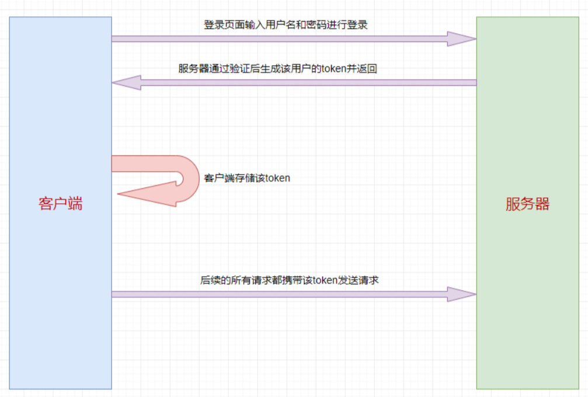
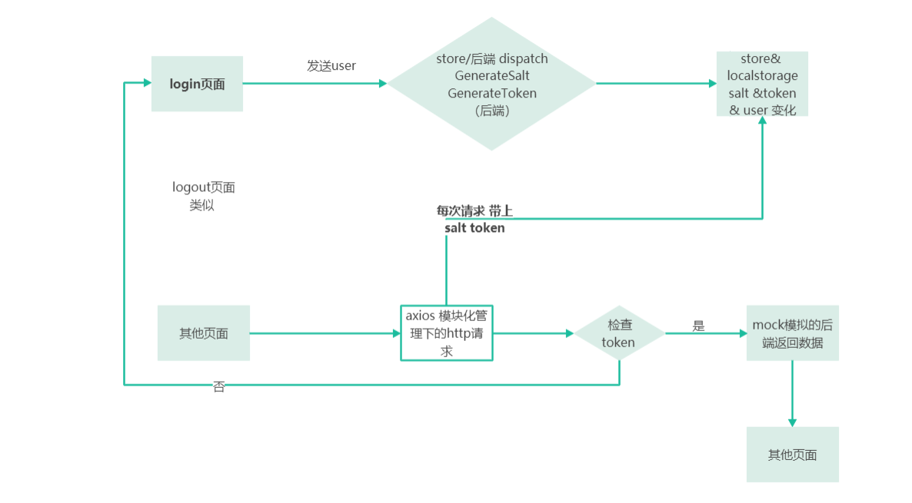
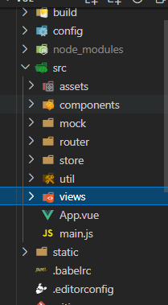

这里主要是讲解一下 vue中使用session Storage和vuex保存用户登录状态

之前写的练习admin_ui 只是主要简单练习axios传输，那篇文章主要是通过模拟正式前后端的交互

## 基础概念

首先我们先脑子里要能清晰的了解什么是真正实现token验证

1. **第一次登录的时候，前端调后端的登陆接口，发送用户名和密码**
2. **后端收到请求，验证用户名和密码，验证成功，就给前端返回一个token**
3. **前端拿到token，将token存储到localStorage和vuex中，并跳转路由页面**
4. **前端每次跳转路由，就判断 localStroage 中有无 token ，没有就跳转到登录页面，有则跳转到对应路由页面**
5. **每次调后端接口，都要在请求头中加token**
6. **后端判断请求头中有无token，有token，就拿到token并验证token，验证成功就返回数据，验证失败（例如：token过期）就返回401，请求头中没有token也返回401**
7. **如果前端拿到状态码为401，就清除token信息并跳转到登录页面**

以上都我们需要去实现的

## 理解图

下面这个题是大概的流程



（上面最后漏了一个 服务器要验证token是否通过呀）

下面图自己画的  实际中的代码操作 如果发现有误，请大家指正



>通过cookie在客户端记录状态
>通过sesion在服务器端记录状态
>通过token维持状态(不允许跨域使用)


## 文件基本目录

所以我们先自己做到 搭建项目，路由，axios,js cookie 匹配好login的接口 （不会的话，自行去补基础）




axios - http
mock - 模拟返回
router - 路由设置
store - 存贮状态 token user

## 重点 store部分代码

实现调登录接口成功，在回调函数中将token存储到localStorage和vuex中

这是 store中的login module 

```js
import { getStore, removeStore, setStore } from "@/util/store";
import { cancelToken, generateToken } from "@/api/user";

const user = {
    state: { 
      user: getStore({ name: "user" }) || "",
      token: getStore({ name: "token" }) || ""
    },
    actions: { 
       //这里开始生成
      GenerateToken({ commit }, form) {
        let user = {
          name: form.user.name, 
        };
        return new Promise((resolve, reject) => {
          generateToken(user)
            .then(res => {
              console.log("generateToken res.data::", res.data);
              const data = res.data;
              commit("SET_TOKEN", data);
              resolve();
            })
            .catch(error => {
              reject(error);
            });
        });
      },
        //退出的动作
      ClearToken({ commit }) {
        //console.log('ClearToken');
        return new Promise((resolve, reject) => {
          cancelToken(getStore({ name: "user" }))
            .then(res => {
              //console.log('ClearToken',res);
              commit("REMOVE_USER");
              commit("REMOVE_TOKEN");
              resolve(res);
            })
            .catch(error => {
              reject(error);
            });
        });
      }
    },
    mutations: {
      SET_USER: (state, user) => {
        state.user = user;
        setStore({ name: "user", content: state.user });
      },
      REMOVE_USER: state => {
        state.user = "";
        removeStore({ name: "user" });
      },
      SET_TOKEN: (state, token) => {
        state.token = token;
        setStore({ name: "token", content: state.token });
      },
      REMOVE_TOKEN: state => {
        state.token = "";
        removeStore({ name: "token" });
      }
    }
  };
  
  export default user;
```

## api 接口

这个是前端接口

```js
import request from '@/config/axios'

export const generateToken = (user) => request({
    url: 'user_api/auth/token/generate',
    method: 'post',
    data: user
});

export const checkTokenValid = (user, token) => request({
    url: 'user_api/auth/token/check',
    method: 'get',
    params: {
        username: user,
        salt,
        token
    }
});

export const cancelToken = (name) => request({
    url: 'user_api/auth/token/cancel',
    method: 'get',
    params: {
        username: name
    }
});

```

## login页面

```js
 handleLogin() { 
      //...省略前面的验证
     //下面生成token操作 这里就是喊store的动作了
          this.$store.dispatch("GenerateToken", {user: this.model}).then(() => {
              this.$router.push({path: '/'}).then(() => loading.close());
          }).catch((errror) => {
            console.log(error)
              loading.close();
          });
          loading.close();
        }
      });
    }
  }
```

这里很清晰的看到整个路线，其实就是上面的步骤，具体的多出来的细节，在练习library里面可以找到

## 关于加密

加密实际上 之前有写过 就是利用md5 以及 加上salt

```js
import md5 from "js-md5";
//store 里的action
GenerateSalt({ commit }, name) {
      return new Promise((resolve, reject) => {
        generateSalt(name)
          .then(res => {
            console.log("generateSalt res.data::", res.data);
            commit("SET_SALT", res.data);
            commit("SET_USER", name);
            resolve(res.data);
          })
          .catch(error => {
            //console.log('generateSalt error::', error);
            reject(error);
          });
      });
    },
 GenerateToken({ commit }, form) {
      let user = {
        name: form.user.name,
        password: md5(md5(form.user.password) + form.salt)
      };
	//跟前面一样 请求token
 },
   //后面的 remove salt以及 set salt 记得写哦
```


## Reference

[vue用户登录状态判断](https://www.cnblogs.com/Grewer/p/8440726.html)

[Vue | 在vue中使用session Storage和vuex保存用户登录状态](https://blog.csdn.net/hellojoy/article/details/105426536)