## 小程序架构分析

主要部分构成：**主体部分 + 各个页面**

**1.1，app - 主体部分 - 小程序框架**

1. app.js：小程序逻辑，初始化APP
2. app.json ：小程序配置，比如导航、窗口、页面http请求跳转等

3. app.wxss：公共样式配置

**1.2，page - 逻辑层调用 数据处理**

1. js：页面逻辑，相当于控制层（C）；也包括部分的数据（M）
2. wxml：页面结构展示，相当于视图层（V）
3. wxss：页面样式表，纯前端，用于辅助wxml展示
4. json：页面配置，配置一些页面展示的数据，充当部分的模型（M）

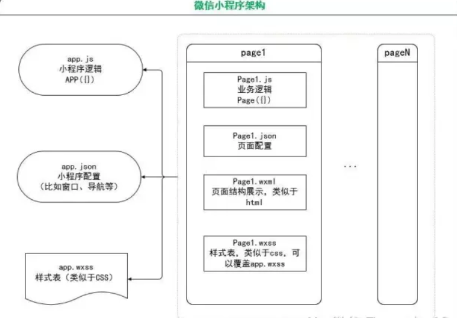

[拓展阅读： App()和Page()](http://www.wxapp-union.com/article-466-1.html)

## 文件默认函数 - App & Page

**App()**

用来注册一个小程序;在整个小程序的生命周期过程中，它都是存在的,它是单例的，全局的。 

1）只能在app.js中注册一次。

2）在代码的任何地方都可以通过 getApp() 获取这个唯一的小程序单例，

比如 var appInstance = getApp();


App()的参数是 object 类型 {} ，指定了小程序的声明周期函数。

**onLaunch 函数**
监听小程序初始化。
当小程序初始化完成时，会触发 onLaunch（全局只触发一次）。

**onShow 函数**
监听小程序显示。
当小程序启动，或从后台进入前台显示，会触发。

**onHide 函数 **
监听小程序隐藏。
当小程序从前台进入后台，会触发。
所谓前后台的定义，类似于手机上的app，比如当不在使用微信时，就进入了后台。

**globalData 对象**
全局数据

**Page()**

> 通过App()注册完成小程序之后，框架就开始注册页面。所以不要在App()的 onLaunch 中调用 getCurrentPage() 方法，因为此时页面还没有注册完成。
> 同样的Page()也是有生命周期的。当页面注册完成之后，可以在 page.js 文件中调用 getCurrentPage() 方法，获取当前页面对象。

**Page()的参数也是Object类型。**
**onLoad**  
监听页面加载
页面刚开始加载的时候触发。只会调用一次。

**onReady** 
监听页面初次渲染完成
类似于html的 onReady。只会调用一次。

**onShow**  
监听页面显示
页面显示的时候触发，比如页面切换

**onHide**  
监听页面隐藏

**onUnload**   
监听页面卸载
在 redirectTo 或 navigateBack 的时候调用

**onPullDownRefresh**  
监听用户下拉动

*1）需要在config的window选项中开启enablePullDownRefresh。*
*2）当处理完数据刷新后，wx.stopPullDownRefresh 可以停止当前页面的下拉刷新。*

单个页面 - 页面的json -"enablePullDownRefresh": true

**onReachBottom** 
页面上拉触底事件的处理函数

**data**
页面的初始数据

**Page.prototype.setData()**
Page的函数 setData() 用于页面初始数据data的修改。如果该数据绑定到了视图层wxml中展示，那么无须刷新，视图层就会反映出修改。

对于data的修改，只能使用 setData() ，不能直接通过 this.data 进行修改。数据量限制在 1024 kb以内。

**getCurrentPages()**
,获取当前页面栈的实例，以数组形式按栈的顺序给出，第一个元素为首页，最后一个元素为当前页面

页面运行 - “ 只有 onLoad onShow onReady”

## 微信小程序项目结构

> 小程序由配置代码JSON文件、模板代码 WXML 文件、样式代码 WXSS文件以及逻辑代码 JavaScript文件组成.

### JSON文件

JSON 是**一种数据格式，并不是编程语言，在小程序中，JSON扮演的静态配置的角色**。

比如我们在app中键入window，可快速生成下列代码：

　　

这里对微信小程序进行了基本配置，比如标题、导航栏的样式、刷新情况等等。

> 说明：
>
> 　　1.JSON的**Key必须包裹在一个双引号中**，在实践中，编写 JSON 的时候，忘了给 Key 值加双引号或者是把双引号写成单引号是常见错误。
>
> 　　2.JSON的**值只能是以下几种类型**：
>
> - 数字，包含浮点数和整数
> - 字符串，需要包裹在双引号中
> - Bool值，true 或者 false
> - 数组，需要包裹在方括号中 []
> - 对象，需要包裹在大括号中 {}
> - Null
>
> 　　3.JSON中**无法使用注释**。

### WXWL模板

　　WXML 全称是 WeiXin Markup Language，**是小程序框架设计的一套标签语言，结合小程序的基础组件、事件系统，可以构建出页面的结构**。

### WXSS样式

　　WXSS（WeiXin Style Sheets）**是一套用于小程序的样式语言，用于描述WXML的组件样式，也就是视觉上的效果**。

　　WXSS与Web开发中的CSS类似。为了更适合小程序开发，WXSS对CSS做了一些补充以及修改。

## 小程序架构分析 - mvc结构 图解

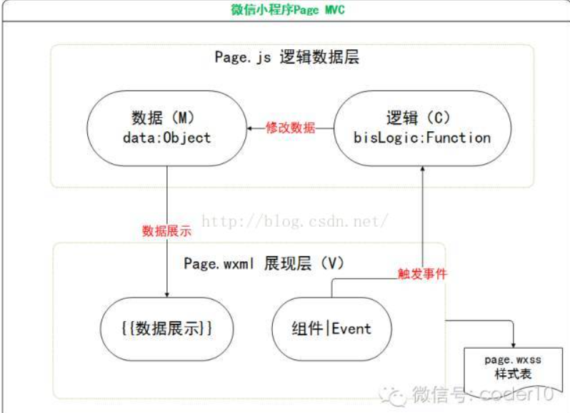

## WXML - 小程序语言

WXML 全称是 WeiXin Markup Language,**文件后缀名是 .wxml**

> `<view>`标签表示一个区块，用于跟其他区块分隔，类似 HTML 语言的`<div>`标签。`<text>`表示一段行内文本，类似于 HTML 语言的`<span>`标签，多个`<text>`标签之间不会产生分行。**<view> 是一个组件，会在页面上做渲染；<block>不是一个组件，它仅仅是一个包装元素，只接受控制属性，不会在页面中做任何渲染**。

## WXML代码的基础操作

### 基本的数据绑定/传输

WXML 通过 `{{变量名}}`来绑定 WXML 文件和对应的 JavaScript 文件中的 data 对象属性

```js
//neu'jwpage.wxml
<text>pages/page2/newpage.wxml</text>
<view>{{msg}}</view>
<view id="{{id}}">绑定属性渲染</view>
```

```js
//newpage.js
Page({
  /**
   * 页面的初始数据
   */
  data: {
    msg:"this is msg",
    id:"view1"
  }
})
```

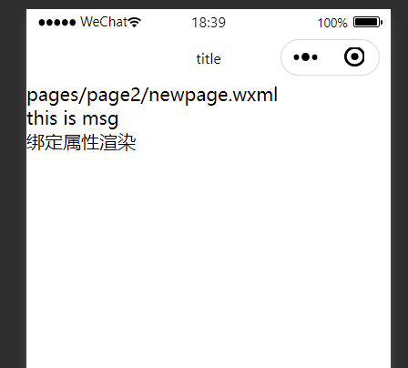


### 逻辑运算

**在 {{ }} 内进行简单的逻辑运算**

```html
<!--pages/page2/newpage.wxml-->
<!-- 逻辑运算 -->
<view>三个数的总和 ： {{a+b+c}}</view>
<view>{{a===1? "a是1":"a不是1"}}</view>
<view>{{[a,b,c,4]}}</view>
```

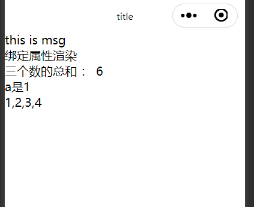

### 条件逻辑  - if

WXML 中，**使用 wx:if="{{condition}}" 来判断是否需要渲染该代码块**

```html
<!-- 条件运算 -->

<view wx:if="{{a==2}}">if的条件成立 你就会看到我</view>
<view wx:if="{{b>1}}">另一个成立的条件</view>

<view wx:if="{{c==4}}">确定c的if条件成立</view>
<view wx:else>C不是4 的else条件</view>

<text wx:if="{{num > 0}}"> 大于0 </text>
<text wx:elif="{{num < 0}}"> 小于0 </text>
<text wx:else> 等于0 </text>
```


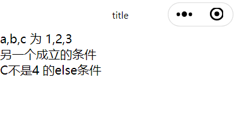

### 列表循环 - for array

```
  // pages/page2/newpage.js
  data: { 
    array:[{message:"message1"},{message:"message2"}]
  },
```

```html
<!-- pages/page2/newpage.wxml-->
<!-- 列表渲染 -->
<!-- 如果想要改变index的名字 wx:for-index="newIndexName" wx:for-item="newItemName" -->
<block wx:for="{{array}}" wx:key="item" wx:for-index="index" wx:for-item="item">
  <item>{{index}}:</item>
  <view>{{item.message}}</view>
</block>
```

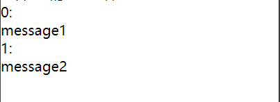

#### 解释一下wx:key

`wx:key`，小程序会以key作为一个查找标准，判断当前已经渲染出来的组件还有没有用，我们仔细看数组变化，它只是重新排了序，内容无变化，所以小程序会将之前已经创建好的组件直接再利用进行重排，而不是直接完全重新渲染一遍，这样就提升了渲染过程。

可以理解为 有key就是在原有基础上新增一个即可，而不用重新遍历五个组件

> `wx:key` 的值以两种形式提供：
>
> 1. 可以是一个字符串，代表在 for 循环的 array 中 item 的某个属性，该属性的值需要是列表中**唯一的字符串或数字**，且不能动态改变。
> 2. 保留关键字 this 代表在 for 循环中的 item 本身，这种表示需要 item 本身是一个**唯一的字符串或者数字**。


### 数据操作拓展

####  array中的数据增加

```js
//newpage.js
//这里注意 setData一定要 才能确保数据重新渲染
addItem(){
this.data.array.push({message:"message3"})
this.setData({
array: this.data.array
})
}
```

#### 跳转页面

```js
//js
  goIndex(){
    wx.navigateTo({
    url:"/pages/page2/newpage"//注意相对位置
    })
},
```

```html
 <!--index.wxml-->
 <button bindtap="goIndex">跳转页面</button>
```

#### hidden属性

```html
<!--下面错的写法！！！！！ -->
<text hidden="false">1</text> 
```

```html
<!--！！这个是对的！！！ -->
<text hidden="{{false}}">1</text>
```

建议写法

```html
<view hidden="{{bool}}">1</view>
/////////js///////
Page({
  data: {
    bool: false
  },
})
```

　### WXML template

定义代码片段，然后在不同的地方调用

```html
<!-- 定义template name：template name-->
<!--wxml-->
<template name="staffName">
  <view>
    FirstName: {{firstName}}, LastName: {{lastName}}
  </view>
</template>

<template is="staffName" data="{{...staffA}}"></template>
<template is="staffName" data="{{...staffB}}"></template>
<template is="staffName" data="{{...staffC}}"></template>
// page.js
Page({
  data: {
    staffA: {firstName: 'Hulk', lastName: 'Hu'},
    staffB: {firstName: 'Shang', lastName: 'You'},
    staffC: {firstName: 'Gideon', lastName: 'Lin'}
  }
})
<!--页面偷懒 只有一个的时候 不建议-->
<template name="odd">
  <view> odd template</view>
</template>
<template name="even">
  <view> even template</view>
</template>
<!-- 使用 -->
<block wx:for="{{[1,2,3,4,5]}}">,
<template is="{{item % 2 ==0 ? 'even': 'odd'}}"  />
</block>

<!--使用模板时候 -->
<template is="templateName"  data="{{input : #@#￥%……&}}" />
```


### WXML export

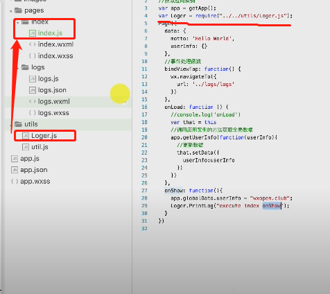

```js
function PrintLog(value)
{
    console.log("Loger module: "+ value);
}

module.exports.PrintLog = PrintLog;
```

```js
var Loger = require("../../utils/Loger.js");
//使用时
 Loger.PrintLog("execute PrintLog in index onShow");
```


### WXML import和include

#### import 

　　import 可以在该文件中使用目标文件定义的 template,**import 有作用域的概念, import 目标文件中定义的 template，而不会 import 目标文件中 import 的 template**，简言之就是 import 不具有递归的特性

在 item.wxml 中定义了一个叫 item的 template ：

```html
<!-- item.wxml -->
<template name="item"> 
<text>{{text}}<text>
</template>
```

在 index.wxml 中引用了 item.wxml，就可以使用 item模板：

```html
<import src="item.wxml"/>
<template is="item" data="{{text: 'forbar'}}"/>
```

#### include

**include 可以将目标文件中除了 `<template/> <wxs/>` 外的整个代码引入，相当于是拷贝到 include 位置**

```html
<!-- index.wxml -->
<include src="header.wxml"/> 
<view> body </view>
<include src="footer.wxml"/>
```

header.wxml

```html
<!-- header.wxml -->
<view> header </view>
```

footer.wxml

```html
<!-- footer.wxml -->
<view> footer </view>
```


## WXSS（WeiXin Style Sheets）

利用reference https://www.w3cschool.cn/weixinapp/gqhd1q96.html

- **项目公共样式：**根目录中的**app.wxss为项目公共样式，它会被注入到小程序的每个页面**。
- **页面样式：**与app.json注册过的页面同名且位置同级的WXSS文件。比如注册了pages/rpx/index页面，那pages/rpx/index.wxss为页面pages/rpx/index.wxml的样式。
- **其它样式：其它样式可以被项目公共样式和页面样式引用**。

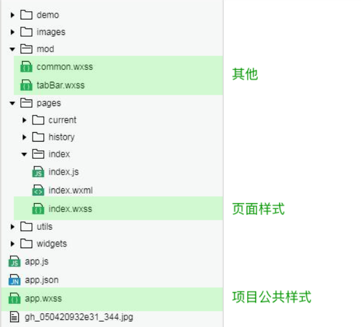

 尺寸单位 responsive pixel rpx

### 引用WXSS文件

```html
@import './test_0.wxss'
```

### 内联样式

```html
<template name="odd">
  <view style='color:red'> odd template</view>
</template>
```

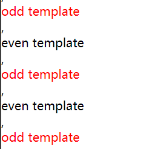

### 动态改变样式 -事件

```
 <!-- pages/page2/newpage.wxml-->
 <view style="color:{{eleColor}}">动态改变样式</view>
 <button bindtap='clickBlue'>变蓝</button>
```

```js
// pages/page2/newpage.js
Page({
  /**
   * 页面的初始数据
   */
  data: { 
    eleColor:'red'
  },
  clickBlue: function(){
    this.setData({ eleColor:'blue'})
  }
  })
```

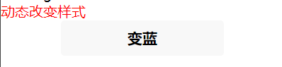

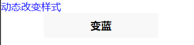

### 选择器

| 项目            | 例子         | 含义                        |
| --------------- | ------------ | --------------------------- |
| #id             | #parent      | 选择id='parent'的组件       |
| .class          | .child       | 选择所有class='child'的组件 |
| element         | view         | 选择所有view组件            |
| element,element | view,text    | 选择所有view组件和text组件  |
| ::after         | text::after  | 在text组件后面插入内容      |
| ::before        | text::before | 在text组件前面插入内容      |

例子（权重）

```css
view{ // 权重为 1
  color: blue
}
 
.ele{ // 权重为 10
  olor: red
}
 
#ele{ // 权重为 100
  color: pink
}
 
view#ele{ // 权重为 1 + 100 = 101，优先级最高，元素颜色为orange
  color: orange
}
 
view.ele{ // 权重为 1 + 10 = 11
  color: green
}
```

例子

```html
<view class="box">
	<text>一往情深深几许，</text>
	<text>深山夕照深秋雨。</text>
	<input placeholder="输入作者名字" />
</view>
.box>text:first-child {
  color: #e4393c;
}

input:active {
  border: 1px solid #ddd;
}
```


## 推荐样式布局 - flex

也可以选择 weui-flex__item 

```html
<view>
  <view class="flex-row" style="display: flex; flex-direction: row;">
    <view class="flex-view-item">1</view>
    <view class="flex-view-item">2</view>
    <view class="flex-view-item">3</view>
  </view>
  <view class="flex-column" style="display: flex; flex-direction: column;" >
    <view class="flex-view-item">c1</view>
    <view class="flex-view-item">c2</view>
    <view class="flex-view-item">c3</view>
  </view>
</view>
```

## [使用weui](https://github.com/Tencent/weui)

在app.wxss 中 @import 'weui.wxss';

其他page就可以使用了


## 项目配置文件 app.json

顶层的`app.json`文件用于整个项目的配置，对于所有页面都有效。

除了前面提到的必需的`pages`属性，`app.json`文件还有一个[`window`属性](https://developers.weixin.qq.com/miniprogram/dev/reference/configuration/app.html#window)，用来设置小程序的窗口。`window`属性的值是一个对象，其中有三个属性很常用。

> `navigationBarBackgroundColor`：导航栏的颜色，默认为`#000000`（黑色）。
>
> `navigationBarTextStyle`：导航栏的文字颜色，只支持`black`（黑色）或`white`（白色），默认为`white`。
>
> `navigationBarTitleText`：导航栏的文字，默认为空。

## networkTimeout

用来设置各种网络请求的超时时间。

如果你不是很清楚这个`networkTimeout`配置有什么作用，那么忽略就好。这对实际开发并没有什么影响。

| 属性          | 类型   | 必填 | 说明                                 |
| :------------ | :----- | :--- | :----------------------------------- |
| request       | Number | 否   | wx.request的超时时间，单位毫秒       |
| connectSocket | Number | 否   | wx.connectSocket的超时时间，单位毫秒 |
| uploadFile    | Number | 否   | wx.uploadFile的超时时间，单位毫秒    |
| downloadFile  | Number | 否   | wx.downloadFile的超时时间，单位毫秒  |


## 推荐的API查询

微信小程序开发文档  https://www.w3cschool.cn/weixinapp/

## WeUI - [小程序组件库 - WeUI](https://developers.weixin.qq.com/miniprogram/dev/extended/weui/)

[github](https://github.com/Tencent/weui-wxss)

[文档](https://developers.weixin.qq.com/miniprogram/dev/extended/weui/)

## Reference

https://www.cnblogs.com/MrSaver/p/8988220.html

[阮一峰的网络日志-小程序](http://www.ruanyifeng.com/blog/2020/10/wechat-miniprogram-tutorial-part-one.html)

[老陈打码的教程](https://www.bilibili.com/video/BV187411c7Bi?p=1)

[微信小程序结构讲解](http://www.wxapp-union.com/portal.php?mod=view&aid=465)


