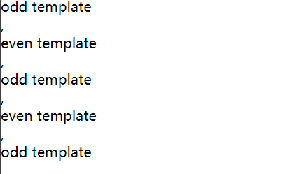

## 微信小程序项目结构

> 小程序由配置代码JSON文件、模板代码 WXML 文件、样式代码 WXSS文件以及逻辑代码 JavaScript文件组成.

### JSON文件

JSON 是**一种数据格式，并不是编程语言，在小程序中，JSON扮演的静态配置的角色**。

比如我们在app中键入window，可快速生成下列代码：

　　

这里对微信小程序进行了基本配置，比如标题、导航栏的样式、刷新情况等等。

> 说明：
>
> 　　1.JSON的**Key必须包裹在一个双引号中**，在实践中，编写 JSON 的时候，忘了给 Key 值加双引号或者是把双引号写成单引号是常见错误。
>
> 　　2.JSON的**值只能是以下几种类型**：
>
> - 数字，包含浮点数和整数
> - 字符串，需要包裹在双引号中
> - Bool值，true 或者 false
> - 数组，需要包裹在方括号中 []
> - 对象，需要包裹在大括号中 {}
> - Null
>
> 　　3.JSON中**无法使用注释**。

### WXWL模板

　　WXML 全称是 WeiXin Markup Language，**是小程序框架设计的一套标签语言，结合小程序的基础组件、事件系统，可以构建出页面的结构**。

### WXSS样式

　　WXSS（WeiXin Style Sheets）**是一套用于小程序的样式语言，用于描述WXML的组件样式，也就是视觉上的效果**。

　　WXSS与Web开发中的CSS类似。为了更适合小程序开发，WXSS对CSS做了一些补充以及修改。

## WXML - 小程序语言

WXML 全称是 WeiXin Markup Language，**是小程序框架设计的一套标签语言**，结合小程序的基础组件、事件系统，可以构建出页面的结构。**文件后缀名是 .wxml**

> `<view>`标签表示一个区块，用于跟其他区块分隔，类似 HTML 语言的`<div>`标签。`<text>`表示一段行内文本，类似于 HTML 语言的`<span>`标签，多个`<text>`标签之间不会产生分行。


## WXML代码的基础操作

### 基本的数据绑定/传输

WXML 通过 `{{变量名}}`来绑定 WXML 文件和对应的 JavaScript 文件中的 data 对象属性

```js
//newpage.wxml
<text>pages/page2/newpage.wxml</text>
<view>{{msg}}</view>
<view id="{{id}}">绑定属性渲染</view>
```

```js
//newpage.js
Page({
  /**
   * 页面的初始数据
   */
  data: {
    msg:"this is msg",
    id:"view1"
  }
})
```


### 逻辑运算

**在 {{ }} 内进行简单的逻辑运算**

```
<!--pages/page2/newpage.wxml-->
<!-- 逻辑运算 -->
<view>三个数的总和 ： {{a+b+c}}</view>
<view>{{a===1? "a是1":"a不是1"}}</view>
<view>{{[a,b,c,4]}}</view>
```


### 条件逻辑 

WXML 中，**使用 wx:if="{{condition}}" 来判断是否需要渲染该代码块**

```
<!-- 条件运算 -->
<view wx:if="{{a==2}}">if的条件成立 你就会看到我</view>
<view wx:if="{{b>1}}">另一个成立的条件</view>
<view wx:if="{{c==4}}">确定c的if条件成立</view>
<view wx:else>C不是4 的else条件</view>
<block wx:if="{{a==2}}">
  <view>显示a</view>
  <view>显示b</view>
</block>
```


### 列表循环 - for array

```
  // pages/page2/newpage.js
  data: { 
    array:[{message:"message1"},{message:"message2"}]
  },
```

```
<!-- pages/page2/newpage.wxml-->
<!-- 列表渲染 -->
<block wx:for="{{array}}" wx:for-index="index" wx:for-item="item">
  <item>{{index}}:</item>
  <view>{{item.message}}</view>
</block>
```


　### WXML template

定义代码片段，然后在不同的地方调用

```
<!-- template -->
<template name="odd">
  <view> odd template</view>
</template>
<template name="even">
  <view> even template</view>
</template>
<block wx:for="{{[1,2,3,4,5]}}">,
<template is="{{item % 2 ==0 ? 'even': 'odd'}}"  />
</block>
```




### WXML 两种文件引用

WXML 提供两种文件引用方式import和include

#### import 

　　import 可以在该文件中使用目标文件定义的 template,**import 有作用域的概念，即只会 import 目标文件中定义的 template，而不会 import 目标文件中 import 的 template**，简言之就是 import 不具有递归的特性

在 item.wxml 中定义了一个叫 item的 template ：

```
<!-- item.wxml -->``<``template` `name="item">`` ``<``text``>{{text}}</``text``>``</``template``>
```

在 index.wxml 中引用了 item.wxml，就可以使用 item模板：

```
<import src="item.wxml"/>
<template is="item" data="{{text: 'forbar'}}"/>
```

#### include

**include 可以将目标文件中除了 `<template/> <wxs/>` 外的整个代码引入，相当于是拷贝到 include 位置**

```
<!-- index.wxml -->
<include src="header.wxml"/> 
<view> body </view>
<include src="footer.wxml"/>
```

header.wxml

```
<!-- header.wxml -->
<view> header </view>
```

footer.wxml

```
<!-- footer.wxml -->
<view> footer </view>
```


## WXSS（WeiXin Style Sheets）

- **项目公共样式：**根目录中的**app.wxss为项目公共样式，它会被注入到小程序的每个页面**。
- **页面样式：**与app.json注册过的页面同名且位置同级的WXSS文件。比如注册了pages/rpx/index页面，那pages/rpx/index.wxss为页面pages/rpx/index.wxml的样式。
- **其它样式：其它样式可以被项目公共样式和页面样式引用**。


 尺寸单位 responsive pixel rpx

### 引用WXSS文件

```
@import './test_0.wxss'
```

### 内联样式

```
<template name="odd">
  <view style='color:red'> odd template</view>
</template>
```


### 动态改变样式

```
 <!-- pages/page2/newpage.wxml-->
 <view style="color:{{eleColor}}">动态改变样式</view>
 <button bindtap='clickBlue'>变蓝</button>
```

```
// pages/page2/newpage.js
Page({
  /**
   * 页面的初始数据
   */
  data: { 
    eleColor:'red'
  },
  clickBlue: function(){
    this.setData({ eleColor:'blue'})
  }
  })
```


### 选择器

例子（权重）

```
view{ // 权重为 1
  color: blue
}
 
.ele{ // 权重为 10
  olor: red
}
 
#ele{ // 权重为 100
  color: pink
}
 
view#ele{ // 权重为 1 + 100 = 101，优先级最高，元素颜色为orange
  color: orange
}
 
view.ele{ // 权重为 1 + 10 = 11
  color: green
}
```


## 项目配置文件 app.json

顶层的`app.json`文件用于整个项目的配置，对于所有页面都有效。

除了前面提到的必需的`pages`属性，`app.json`文件还有一个[`window`属性](https://developers.weixin.qq.com/miniprogram/dev/reference/configuration/app.html#window)，用来设置小程序的窗口。`window`属性的值是一个对象，其中有三个属性很常用。

> `navigationBarBackgroundColor`：导航栏的颜色，默认为`#000000`（黑色）。
>
> `navigationBarTextStyle`：导航栏的文字颜色，只支持`black`（黑色）或`white`（白色），默认为`white`。
>
> `navigationBarTitleText`：导航栏的文字，默认为空。

下面，改一下前面的`app.json`，加入`window`属性。

> ```javascript
> {
>   "pages": [
>     "pages/home/home"
>   ],
>   "window": {
>     "navigationBarBackgroundColor": "#ff0000",
>     "navigationBarTextStyle": "white",
>     "navigationBarTitleText": "小程序 Demo"     
>   }
> }
> ```

## WeUI - [小程序组件库 - WeUI](https://developers.weixin.qq.com/miniprogram/dev/extended/weui/)

[github](https://github.com/Tencent/weui-wxss)


## Reference

https://www.cnblogs.com/MrSaver/p/8988220.html

[阮一峰的网络日志-小程序](http://www.ruanyifeng.com/blog/2020/10/wechat-miniprogram-tutorial-part-one.html)