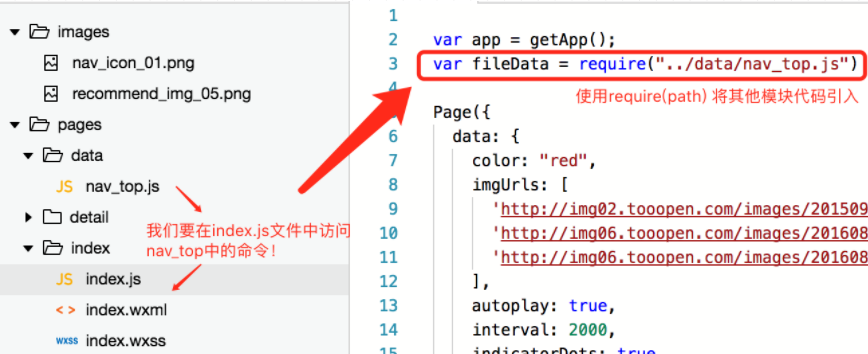
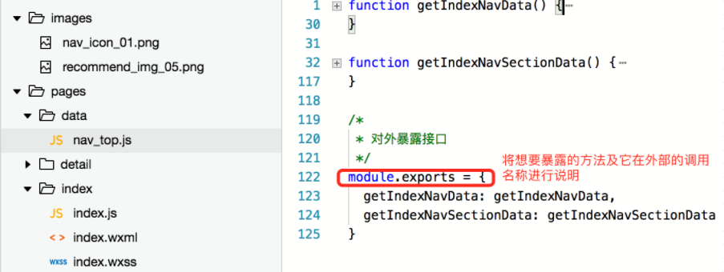
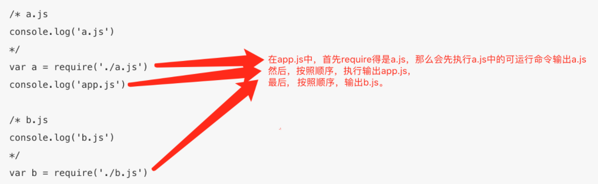
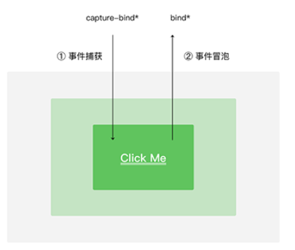
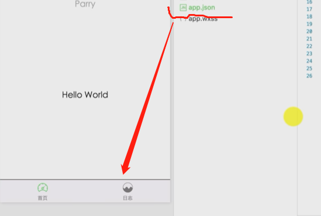

## JavaScript脚本

小程序的中 JavaScript同浏览器中的 JavaScript 以及 NodeJS 中的 JavaScript 是不相同的

### js模块化

**每一个JS文件对应一个模块，这样子的话，每个模块之间的参数或方法互相独立，但也支持特定方式的的调用**

#### 例子：在index.js中访问nav_top.js中的文件



但是我们还是无法直接访问nav_top中的方法，**因为nav_top并没有对外暴露任何接口**，所以我们还需要在nav_top中使用experts命令把我们想暴露的接口说明一下：

　　

## 脚本执行顺序

小程序中的脚本执行顺序与HTML有所不同。小程序的执行的入口文件是 app.js 。并且会根据其中 require 的模块顺序决定文件的运行顺序



当 app.js 执行结束后，小程序会按照开发者在 app.json 中定义的 pages 的顺序，逐一执行

## 全局变量

spp.js中全局变量设置，别的文件先 `const app = getApp()` 再取值

## 小程序事件

| 事件类型           | 触发条件                                                     |
| ------------------ | ------------------------------------------------------------ |
| touchstart         | 手指触摸动作开始触发                                         |
| touchmove          | 手指触摸后移动触发                                           |
| touchcancel        | 手指触摸动作被打断，如来电提醒，弹窗                         |
| touchend           | 手指触摸动作结束                                             |
| tap                | 手指触摸后马上离开                                           |
| longpress          | 手指触摸后，超过350ms再离开，如果指定了事件回调函数并触发了这个事件，tap事件将不被触发（与tap同时定义，优先级更高） |
| longtap            | 手指触摸后，超过350ms再离开（推荐使用longpress事件代替）     |
| transitionend      | 会在 WXSS transition 或 wx.createAnimation 动画结束后触发    |
| animationstart     | 会在一个 WXSS animation 动画开始时触发                       |
| animationiteration | 会在一个 WXSS animation 一次迭代结束时触发                   |
| animationend       | 会在一个 WXSS animation 动画完成时触发                       |

>  事件绑定 用bind或者bind：都可以
>

例子

```html
<button bindtouchstart="alert">bindtap</button>
```

## 事件对象

在事件处理函数中，我们能接受到一个event对象参数，该参数包含了当前事件类型，以及当前组件相关信息，具体属性如下：

| 属性           | 类型    | 说明                                         |
| :------------- | :------ | -------------------------------------------- |
| type           | String  | 当前绑定的事件类型                           |
| timeStamp      | Integer | 页面打开到触发事件所经过的毫秒数             |
| target         | Object  | 触发事件的组件的一些属性值集合               |
| currentTarget  | Object  | 当前组件的一些属性值集合                     |
| detail         | Object  | 额外的信息                                   |
| touches        | Array   | 触摸事件，当前停留在屏幕中的触摸点信息的数组 |
| changedTouches | Array   | 触摸事件，当前变化的触摸点信息的数组         |


```
<button bindtap="alert" id="btn" data-name="dataNames" data-age="27">bindtap</button>
///js
Page({
  data: {},
  alert: function (event) {
    console.log(event);
  }
})
```

## 捕获与冒泡阶段

`bind`前缀就表示事件在冒泡阶段执行，而如果我们想事件在捕获阶段执行，可以在`bind`前面加上`capture`，即`capture-bind`表示捕获阶段执行



**bind不会阻止冒泡，添加capture前缀可以响应捕获阶段。**

### 例子

```html
<view id="parent"
  bind:tap="tap1"
  capture-bind:tap="tap2">
  outer view
  <view id="child"
    bind:tap="tap3"
    capture-bind:tap="tap4">
    inner view
  </view>
</view>
```

```js
///js
Page({
  data: {},
  tap1: function (event) {
    console.log('tap1');
  },
  tap2: function (event) {
    console.log('tap2');
  },
  tap3: function (event) {
    console.log('tap3');
  },
  tap4: function (event) {
    console.log('tap4');
  },
})
```

**结果是 2-4-3-1**

## 阻止冒泡 

将`bind`替换为`catch`事件了，`catch`也支持两种写法`catch与catch:`

### 例子 - 只显示子区域

```html
<view
  id="parent"
  catch:tap="tap1"
>
  outer view
  <view
    id="child"
    catch:tap="tap3"
  >
    inner view
  </view>
</view>
```

结果 - 3


```
<view
  id="parent"
  bind:tap="tap1"
  capture-catch:tap="tap2"
>
  outer view
  <view
    id="child"
    bind:tap="tap3"
    capture-catch:tap="tap4"
  >
    inner view
  </view>
</view>
```

结果： 2

我们将`capture-bind`都改为`capture-catch`，可以发现不管点击父区域还是子区域，都只会输出一个`tap2`，这是因为`capture-catch`会中断捕获阶段和取消冒泡阶段。所以不管点击哪，都是从捕获阶段开始，先捕获到父，然后中断捕获，也不会存在冒泡了

> `bind`不会阻止冒泡，但如果想抓捕获阶段，可以添加前缀`capture`，也就是`capture-bind`。
>
> `catch`会阻止冒泡，如果添加`capture`前缀，捕获阶段会中断的同时，也会阻止冒泡。

tabBar

```json
//app.json sample
"tabBar": {
    "list": [
      { "text": "Tab1", "pagePath": "pageA" },
      { "text": "Tab1", "pagePath": "pageF" },
      { "text": "Tab1", "pagePath": "pageG" }
    ]
  }

//例子
 "tabBar": {
    "list": [{
      "pagePath": "pages/index/index",
      "text": "首页",
      "iconPath": "images/icon_speed.png",
       "selectedIconPath":"images/icon_speed_HL.png"
    }, {
      "pagePath": "pages/logs/logs",
      "text": "日志",
       "iconPath": "images/icon_seo.png",
       "selectedIconPath":"images/icon_seo_HL.png"
    }]
  }
```



## 微信小程序正则

```
验证数字：^[0-9]*$ 
验证n位的数字：^\d{n}$ 
验证至少n位数字：^\d{n,}$ 
验证m-n位的数字：^\d{m,n}$ 
验证零和非零开头的数字：^(0|[1-9][0-9]*)$ 
验证有两位小数的正实数：^[0-9]+(.[0-9]{2})?$ 
验证有1-3位小数的正实数：^[0-9]+(.[0-9]{1,3})?$ 
验证非零的正整数：^+?[1-9][0-9]*$ 
验证非零的负整数：^-[1-9][0-9]*$ 
验证非负整数（正整数 + 0） ^\d+$ 
验证非正整数（负整数 + 0） ^((-\d+)|(0+))$ 
验证长度为3的字符：^.{3}$ 
验证由26个英文字母组成的字符串：^[A-Za-z]+$ 
验证由26个大写英文字母组成的字符串：^[A-Z]+$ 
验证由26个小写英文字母组成的字符串：^[a-z]+$ 
验证由数字和26个英文字母组成的字符串：^[A-Za-z0-9]+$ 
验证由数字、26个英文字母或者下划线组成的字符串：^\w+$ 
验证用户密码:^[a-zA-Z]\w{5,17}$ 正确格式为：以字母开头，长度在6-18之间，只能包含字符、数字和下划线。 
验证是否含有 ^%&',;=?$" 等字符：[^%&',;=?$\x22]+ 
验证汉字：^[\u4e00-\u9fa5],{0,}$ 
验证Email地址：/^([a-zA-Z0-9]+[_|_|.]?)[a-zA-Z0-9]+@([a-zA-Z0-9]+[_|_|.]?)[a-zA-Z0-9]+.[a-zA-Z]{2,3}$/
验证InternetURL：^http://([\w-]+.)+[\w-]+(/[\w-./?%&=])?$ ；^[a-zA-z]+://(w+(-w+))(.(w+(-w+)))(?S*)?$ 
验证电话号码：^(\d3,4\d3,4|\d{3,4}-)?\d{7,8}$：--正确格式为：XXXX-XXXXXXX，XXXX-XXXXXXXX，XXX-XXXXXXX，XXX-XXXXXXXX，XXXXXXX，XXXXXXXX。(貌似有点问题)
验证身份证号（15位或18位数字）：^\d{15}|\d{}18$ 
验证一年的12个月：^(0?[1-9]|1[0-2])$ 正确格式为：“01”-“09”和“1”“12” 
验证一个月的31天：^((0?[1-9])|((1|2)[0-9])|30|31)$ 正确格式为：01、09和1、31。 
整数：^-?\d+$ 
非负浮点数（正浮点数 + 0）：^\d+(.\d+)?$ 
正浮点数 ^(([0-9]+.[0-9][1-9][0-9])|([0-9][1-9][0-9].[0-9]+)|([0-9][1-9][0-9]))$ 
非正浮点数（负浮点数 + 0） ^((-\d+(.\d+)?)|(0+(.0+)?))$ 
负浮点数 ^(-(([0-9]+.[0-9][1-9][0-9])|([0-9][1-9][0-9].[0-9]+)|([0-9][1-9][0-9])))$ 
浮点数 ^(-?\d+)(.\d+)?$
```

```js
if (!(/^[\u4E00-\u9FA5A-Za-z]+$/.test(你要验证的姓名))) {
wx.showToast({
title: '姓名有误',
duration: 2000,
icon: true
});
}
//另外一种
  if(!names.test(username)||!phonetel.test(username)||!emailnums.test(username)){
      wx.showModal({
        title:'错误提示',
        content:'请输入正常的用户名/手机号/邮箱地址',
        showCancel:false
      }) 
    }
```

## 不同的页面不同title

1.首先判断对应的 .json文件是否设置 navigationBarTitleText

2.如果存在请删除对应属性设置，然后进行Title设置

```js
 wx.setNavigationBarTitle({
        title: '你的顶部Title写这里即可'
      })
```


## radio 大小控制

```css
    radio {      transform:scale(0.7);    }
/*<radio color="red">*/
```


# Reference

[小程序学习笔记](https://www.cnblogs.com/MrSaver/p/9005641.html)

[小程序冒泡事件讲解](https://www.cnblogs.com/echolun/p/12817733.html)

