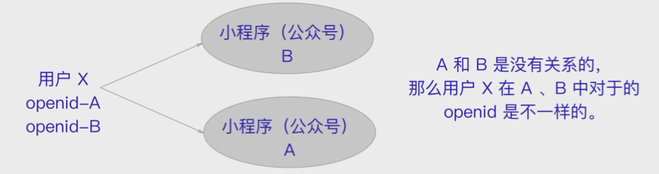
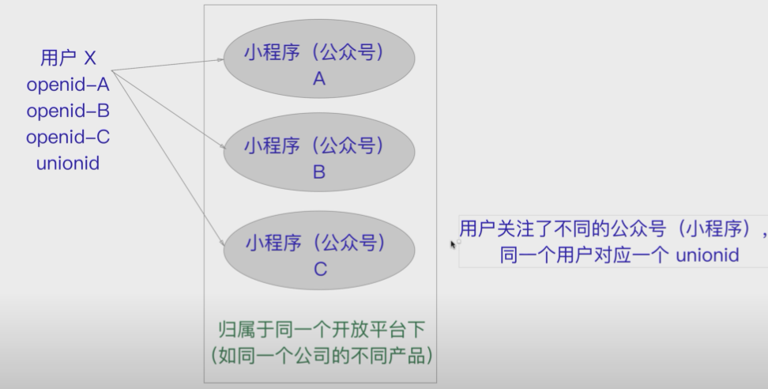
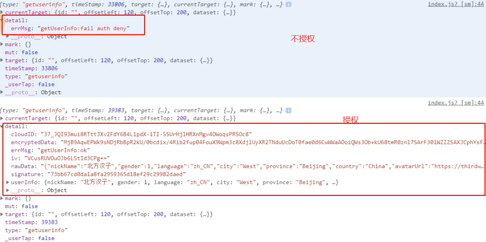

## [网络- 前后端交互](https://developers.weixin.qq.com/miniprogram/dev/api/network/request/wx.request.html)

## 语法 - wx.request()

-  服务器域名请在 「小程序后台-开发-开发设置-服务器域名」 中进行配置
-  默认超时时间和最大超时时间都是 60s
-  超时时间可以在 app.json 中通过 networktimeout 配置
-  小程序为了安全起见只支持 Https 请求
-  wx.request 最大并发限制 10 个

### 请求数据数据

```js
//index.js
//获取应用实例
var app = getApp()
Page({
  data: {
    newsdata: ''
  },

  loadData: function () {
    var that = this;//以防指向丢失
    wx.request({
      url: 'http://newsapi.gugujiankong.com/Handler.ashx?action=getnews&type=top&count=10', //仅为示例，并非真实的接口地址
      header: {
        'content-type': 'application/json'
      }, 
    success: function(res) {
            wx.hideToast();
            if (res.data.LoginStatus == 1) {
                //进行一些用户状态的存储
                console.log(res.data);
                that.setData({
                  newsdata: res.data
                });
            } else {
                wx.showModal({
        title: '登录失败', 
        content: '请检查您填写的用户信息！', 
        showCancel: false, 
        success: function(res) {
                        //回调函数
                    }});
            }
        }
    })
  }
})
```

```html
<!--index.wxml-->
<view class="container">
  <view>
    <button type="primary" bindtap="loadData">点击按钮加载数据</button>

    <view wx:for="{{newsdata}}">
      <image sytle="width:300px;height:200px;" src="{{item.thumbnail_pic_s}}"></image>
      [{{item.realtype}}]{{item.title}}
    </view>

  </view>
</view>
```

详细请看多个api接口请求数据方法 - 封装请求功能函数

## image

 第一种：加载本地图片，只要是路径没问题就会正常显示

```html
<image src="../images/1.jpg" mode="aspectFill">   
</image> 
```

第二种呢就是通过js加载传输或者利用wxss样式修改背景图片

wxml模板代码

```html
<image src="{{imageUrl}}" mode="aspectFill">   
</image>  
```

js代码

```js
data:{  
	imageUrl:"https://res.wx.qq.com/wxdoc/dist/assets/img/0.4cb08bb4.jpg"   
}, 
```

或者直接在src属性上写网络图片地址

```html
<image class="image_frame" src="https://res.wx.qq.com/wxdoc/dist/assets/img/0.4cb08bb4.jpg" mode="aspectFill">   
</image>  
```

如果在wxss样式中用到背景图片就必须用网络图片了，使用本地图片地址会报错的

```css
.main {
  background-image: url(https://res.wx.qq.com/wxdoc/dist/assets/img/0.4cb08bb4.jpg);
}
```

有些格式没写错 但是图片加载不了 可能原因

1. 云梯
2. 链接失效
3. [官方承认的问题](https://developers.weixin.qq.com/community/develop/doc/000ace6189c0c03bc719a781856009) 

## 页面跳转

> 注意：跳转回去tabbar页面 所以只能用switchtabbar 或者relaunch 
>
> 这里注意 跳转中relaunch会重新执行了onload 其他就是onshow

页面两种跳转方式 navigator 和 wxAPI

### navigator

#### redirect

```html
<navigator url="/pages/about/about" open-type="redirect">跳到关于页面(redirect)</navigator>
```

关闭当前页面, 跳到关于页面, **不允许跳转到tabbar页面, 不能反回**, 安卓手机反回直接退出小程序

#### switchTab

switchTab：**跳转到 tabBar 页面，并关闭其他所有非 tabBar 页面**。（需要在tabBar中定义的）

```html
<navigator url="/pages/detail/detail" open-type="switchTab">跳到详情页面(switchTab)</navigator>
```

app.json:

```json
//读取数据之后 跳转
wx.switchTab({
        url:'../../pages/index/index',
        success:function(){
            console.log("called switchtab.");
        }
    });
```

#### reLaunch

关闭所有的页面，打开应用中某个页面。（直接展示某个页面，并且**可以跳转到tabBar页面**） 效果与redirect类似

#### navigateBack

关闭当前页面，返回上一页面或多级页面。可通过 `getCurrentPages` 获取当前的页面栈，决定需要返回几层。 当使用`redirect`和`reLaunch`关闭页面时,  `getCurrentPages`无效

open-type：navigateBack（表示该navigator组件用于返回）

delta：返回的层级（指定返回的层级，open-type必须是navigateBack才生效）

about.wxml

```html
<navigator open-type="navigateBack" delta="2">跳到关于页面</navigator>
```


### wxAPI

- wx.navigateTo
- wx.switchTab
- wx.reLaunch
- wx.redirectTo
- wx.navigateBack

**例子 - navigateTo**

home.wxml

```
<button bind:tap="handlePushAbout">wxAPI跳转</button>
```

home.js

```js
handlePushAbout(){
    wx.navigateTo({
      url: '/pages/about/about?key=value',
    })
  }
```

**例子 -  navigateBack**

about.wxml

```html
<button bind:tap="backHome">返回主页</button>
```

about.js

```
backHome(){
    wx.navigateBack({
      delta: '1'  // 返回的页面数，如果 delta 大于现有页面数，则返回到首页。
    })
  }
```

## 页面跳转数据传输

### 数据传递-传递方式分析

如果在界面跳转过程中我们需要相互传递一些数据，应该如何完成呢？

- 首页 -> 详情页：使用URL中的query字段
- 详情页 -> 首页：在详情页内部拿到首页的页面对象，直接修改数据


### 数据传递过程

#### home页面传递数据给其他待跳转页面

home.wxml

```
<navigator url="/pages/about/about?key=hello"><button>跳到关于页面</button></navigator>
```

url参数后面的查询字符串会被子页面直接接收

about.js

```js
onLoad:function(options){
    console.log(options)
    let key = options.key//获得路由参数
  }
```

控制台会打印出: `{key: "hello"}`

#### 子页面传递数据给home页面

如果是监听按钮或者navigator的点击来返回时, 可以通过bindtap调用函数完成.

但是这种方式不能监听左上角返回按钮的点击.所以我们选择在onUnload中修改数据

小程序并没有提供直接修改数据的方法.

可以通过getCurrentPages来获取所有的页面, 然后使用页面对象的setData({})函数来修改

about页面退出时, home页面message数据会被改变 home.js

```js
data:{
    message: '本身内容'
}
```

about.js

```js
  // 页面退出时调用
  onUnload: function(){
    let pages = getCurrentPages()   // 获取当前所有的页面
    let home = pages[pages.length - 2]  
    home.setData({
      message: '退出内容'
    })
  }
```

## 传递参数方式总结

https://segmentfault.com/a/1190000008895441

## 数据提交

### form 形式

```html
  <form bindsubmit="formSubmit" bindreset="formReset">   
  <input name="phone" placeholder="手机号" />  
  <view class="section__title">密码</view>  
  <input name="pwd" placeholder="密码" password/>  
  <view class="btn-area">  
  <button formType="submit">提交</button>  
  <button formType="reset">重置</button>  
  </view>  
  </form>  
  <view wx:if="{{isSubmit}}">  
  {{warn ? warn : "是否公开信息："+isPub+"，手机号："+phone+"，密码："+pwd+"，性别："+sex}}  
  </view> 
```

```js
  formSubmit: function (e) {  
    console.log('form发生了submit事件，携带数据为：', e.detail.value);  
    let { phone, pwd, isPub, sex } = e.detail.value;  
  if (!phone || !pwd) {  
    this.setData({  
    warn: "手机号或密码为空！",  
    isSubmit: true  
  })  
    return;  
  }  
  },  
  formReset: function () {  
    console.log('form发生了reset事件')  
  }  
```


### 直接用bindtap事件 传递数据


```html
	<view class="input-section">
		<view class="input-item">
			<text class="tit">手机号码</text>
			<input
			 type="text"
			 placeholder="请输入手机号码"
			 data-test="abc"
			 data-type="phone"
			 id="phone"
			 bindinput="handleInput"
			/>
		</view>
		<view class="input-item">
			<text class="tit">密码</text>
			<input
			 type="password"
			 placeholder="请输入密码"
			 data-test="abc"
			 data-type="password"
			 id="password"
			 bindinput="handleInput"
			/>
		</view>
	</view>
<button class="confirm-btn" bindtap="login">登录</button>
```

```js
  handleInput(event){
      console,log(event.currentTarget)//这里 test type都会的得到
    // let type = event.currentTarget.id;// id传值 取值： phone || password 注意这是分别的
    let type = event.currentTarget.dataset.type; // data-key=value //这个是同时
    this.setData({
      [type]: event.detail.value
    })
  },
```


## 页面刷新

### 当前页面刷新

#### onRefresh

```js
/**
 * 刷新页面，页面设置点击刷新事件
 */
onRefresh: function() {
  this.onLoad()
  this.onReady()
}
```

注意：如果onLoad函数中有其他页面传过来的参数，建议放setData中，以免刷新的时候获取不到值的情况出现，一般不会遗失参数的！

#### onPullDownRefresh

```js
/*页面相关事件处理函数--监听用户下拉动作*/
onPullDownRefresh: function() {
	// 在此方法中实现数据加载的逻辑
}

//此方法需要在当前页面的json中设置如下参数，开启下拉刷新
{
  "enablePullDownRefresh": true
} 
```

此种方法刷新，并不会重新加载页面，或者刷新数据，需要手动调用onLoad函数或加载数据函数，重新动态载入数据

### 返回上一页刷新

充分利用页面隐藏和显现的函数

```js
/**
 * 生命周期函数--监听页面显示
 */
onShow: function() {
	// 当返回当前页面的时候，会自动调用这个参数，则实现自动返回刷新
	this.onLoad()
    this.onReady()
},
/**
 * 生命周期函数--监听页面隐藏
 */
onHide: function() {
	// 此函数是当前页面隐藏挑战到其他页面的隐含函数，可以设置全局变量之类
	app.globalData.NetWorkType = true;
},
```

## [地图](https://developers.weixin.qq.com/miniprogram/dev/component/map.html)

基本用法

```html
<map id="map" longitude="113.324520" latitude="23.099994" scale="14" controls="{{controls}}" 
     bindcontroltap="controltap" markers="{{markers}}" 
     bindmarkertap="markertap" polyline="{{polyline}}" bindregionchange="regionchange" 
     show-location style="width: 100%; height: 300px;"></map>
```

```
markers: [{
      iconPath: "/resources/others.png",
      id: 0,
      latitude: 23.099994,
      longitude: 113.324520,
      width: 50,
      height: 50
    }],
```

[map其他使用](https://www.jianshu.com/p/5b2f95a16fce)

## 开放接口 - login

### 登录流程时序


> #### 说明：
>
> 1. 调用 [wx.login()](https://developers.weixin.qq.com/miniprogram/dev/api/open-api/login/wx.login.html) 获取 **临时登录凭证code** ，并回传到开发者服务器。
> 2. 调用 [auth.code2Session](https://developers.weixin.qq.com/miniprogram/dev/api-backend/open-api/login/auth.code2Session.html) 接口，换取 **用户唯一标识 OpenID** 和 **会话密钥 session_key**。
>
> 之后开发者服务器可以根据用户标识来生成自定义登录态，用于后续业务逻辑中前后端交互时识别用户身份。
>
> **注意：**
>
> 1. 会话密钥 `session_key` 是对用户数据进行 [加密签名](https://developers.weixin.qq.com/miniprogram/dev/framework/open-ability/signature.html) 的密钥。为了应用自身的数据安全，开发者服务器**不应该把会话密钥下发到小程序，也不应该对外提供这个密钥**。
> 2. 临时登录凭证 code 只能使用一次






### 授权获取用户信息（头像、昵称）- file: newteo

### [首次登陆获取](https://developers.weixin.qq.com/miniprogram/dev/component/button.html)

1. Button 组件设置 open-type 属性为 getUserInfo
2. `<button open-type='getUserInfo'></button>`
3. 设置后首次登陆点击 button 可以弹出授权窗口
4. 注意： 授权的动作只发生一次，除非清除缓存，点击 butotn 授权一次之后再点击失效，不会弹出授权窗口



### [授权之后获取基本信息 - 再登陆](https://developers.weixin.qq.com/miniprogram/dev/api/open-api/user-info/wx.getUserInfo.html)

 用button事件之后，在onload函数中 `wx.getUserInfo()`，对于已经授权过的，会直接提供

所以这里注意在onload中的wx.getUserInfo()中 对于success的，直接要setdata （官方文档有例子）


### 利用opendata 获取用户info

```html
<view class="userinfo">  
      <view class="userin fo-avatar">
        <open-data type="userAvatarUrl"></open-data>
      </view>
       <open-data type="userNickName"></open-data>
</view>
```

```css
//style
.userinfo {  
  position: relative;  
  width: 750rpx;  
  height: 320rpx;  
  color: #999999;  
  display: flex;  
  flex-direction: column;  
  align-items: center;  
}  
  
.userinfo-avatar {  
  overflow:hidden;  
  display: block;  
  width: 160rpx;  
  height: 160rpx;  
  margin: 20rpx;  
  margin-top: 50rpx;  
  border-radius: 50%;  
  border: 2px solid #fff;  
  box-shadow: 3px 3px 10px rgba(0, 0, 0, 0.2);  
}
```


### 微信用户登录openid 获取

git 练习中有完整demo

思维流程：小程序前台请求后台-> 后台请求微信服务器-> 微信服务器返回后台 -> 后台返回小程序前台

https://developers.weixin.qq.com/community/develop/doc/0004e229464d78c1d557ed5e359404

这里需要 appid 跟 secret

```
//这种获得的不是唯一标识
getOpenId(){
wx.login({
	success:(res)=>{
		console.log(res)
	}
 })
}
```


## 推荐仿练习
https://github.com/justjavac/awesome-wechat-weapp

## Reference

[页面跳转- 小程序](https://juejin.cn/post/6844903960596185102#heading-13)

[小程序登录流程官方解释](https://developers.weixin.qq.com/miniprogram/dev/framework/open-ability/login.html)