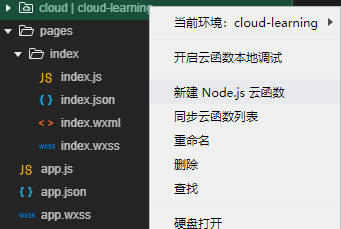

## 全局认识云开发

小程序云开发目前提供三大基础能力支持：

- 云函数：在云端运行的代码，微信私有协议天然鉴权，开发者只需编写业务逻辑代码
- 数据库：一个既可在小程序前端操作，也能在云函数中读写的 JSON 数据库
- 文件存储：在小程序前端直接上传/下载云端文件，在云开发控制台可视化管理


## 云开发+数据库

代码在miniprogram2

### 初始化准备

1. 在创建项目时，填入APPID并选择不使用云函数
2. 进入到开发者页面，点击左上角的云开发并选择开通
3. 设置云开发环境名称，可以任意填写
4. 在`project.config.json`中加入字段`"cloudfunctionRoot":"cloud"`
5. 在打开的云开发控制台中点击设置，新建一个环境ID
6. `app.js`中删除所有代码，只保留`env`即环境ID

```js
App({
  onLaunch: function () {
    //云开发环境初始化
    wx.cloud.init({
      env:"******"//个人环境名称
    })
  }
})
```

```json
//project.config.json
"cloudfunctionRoot": "cloud/"
```

### 云数据库的基本操作(查 增 删 )

本身在创建项目的时候，已经有一些提供的例子，可以操作看看

```html

	<input placeholder="输入名字" bindinput="addName"></input>
	<text>\n</text>
	<input placeholder="输入年龄" bindinput="addAge"></input>
	<text>\n</text>

	<button bindtap="addData">新增数据</button>
	<button bindtap="getData">查询数据</button>

	<input placeholder="要删除数据的ID" bindinput="delDataInput"></input>
	<text>\n</text>
	<button bindtap="delData" type="primary">删除数据</button>

	<input placeholder="输入要删除数据的name的属性的值" bindinput="delDataInputName"></input>
	<text>\n</text>
	<button bindtap="delDataByProperty" type="primary">通过name属性的内容删除</button>

	<input placeholder="输入要更新的数据的ID" bindinput="updateID"></input>
	<input placeholder="输入更新后的name的值" bindinput="updateValue"></input>
	<button bindtap="updateData" type="primary">修改更新数据</button>
```

```js
const app = getApp()
const DB = wx.cloud.database().collection("testlist")
let name='';
let age='';
let id = '';
let nameDelete = ''
let updateID = ''
let updateValue = ''

Page({
  data: {
    avatarUrl: './user-unlogin.png',
    userInfo: {},
    logged: false,
    takeSession: false,
    requestResult: ''
  },
  onLoad: function() {
    if (!wx.cloud) {
      wx.redirectTo({
        url: '../chooseLib/chooseLib',
      })
      return
    }

    // 获取用户信息
    wx.getSetting({
      success: res => {
        if (res.authSetting['scope.userInfo']) {
          // 已经授权，可以直接调用 getUserInfo 获取头像昵称，不会弹框
          wx.getUserInfo({
            success: res => {
              this.setData({
                avatarUrl: res.userInfo.avatarUrl,
                userInfo: res.userInfo
              })
            }
          })
        }
      }
    })
  },

  addName(event){
      //console.log(event.detail.value)
      name = event.detail.value
    },

  addAge(event){
    //console.log(event.detail.value)
    age = event.detail.value
  },

  addData() {
    console.log('调用添加数据的方法')
    DB.add({
      data: {
        name: name,
        age: age
      },
      success(res) {
        console.log("添加数据成功", res)
      },
      fail(res) {
        console.log("添加数据失败", res)
      }
    })
  },

  getData() {
    console.log('调用查询数据的方法')
    DB.get({
      success(res){
        console.log('查询数据成功',res)
      }
    })
  },
  delDataInput(event){
    //console.log(event.detail.value)
    id = event.detail.value
  },

  delData() {
    console.log('调用删除数据的方法')
    DB.doc(id).remove({
      success(res) {
        console.log('删除数据成功', res.data)
      }
    })
  },
  delDataInputName(event){
    //console.log(event.detail.value)
    nameDelete = event.detail.value
  },
  
  delDataByProperty() {
    console.log('调用属性删除数据的方法')
    DB.where({
      name: nameDelete
    }).remove({
      success(res) {
        console.log('删除数据成功', res.data)
      },
      fail(res) {
        console.log("删除数据失败", res)
      }
    })
  },
  updateID(event) {
    console.log(event.detail.value)
    updateID = event.detail.value
  },

  updateValue(event) {
    console.log(event.detail.value)
    updateValue = event.detail.value
  },
  
  updateData() {
    console.log('调用修改更新数据的方法')
    DB.doc(updateID).update({
      data: {
        name: updateValue
      },
      success(res) {
        console.log('修改更新数据成功', res.data)
      },
      fail(res) {
        console.log("修改更新数据失败", res)
      }
    })
  },
})
```


## 使用云函数操作数据库 - 不用云服务 

代码在 miniprogram-1

###  创建项目的时候不使用 云服务

###  删除些无关文件，进行一个简单的函数布置

-  删除logs以及utils文件夹;
- `index.wxml` `index.wxss` 内的代码全部清空，`index.js`保留;

###  配置云函数存储目录

- 在`project.config.json`中新增如下代码

```json
"cloudfunctionRoot":"cloud"
```
- 在根目录下创建同名文件夹 - 自动的匹配环境

### 云开发环境初始化

在根目录的`app.js`中，删除所有代码，并新增如下：

```js
App({
  onLaunch: function () {
    wx.cloud.init({
      env:"******"//你的环境ID
    })
  }
})
```
###  创建并上传一个云函数

   
-  在cloud文件夹中 新建Node.js云函数
- 输入add并且回车 - 自动add文件在cloud下面
- 在add文件夹中index.js 更新所有代码

```js
// 云函数入口文件
const cloud = require('wx-server-sdk')

cloud.init()

// 云函数入口函数
exports.main = async (event, context) => {
  let a = event.a;
  let b = event.b;
  return a+b;
}
```

**写完代码,上传部署！！！！ 选择云端安装依赖（不上传node modules）**


如何确定成功？ 系统提示 上传函数add


###  使用云函数

   `index.wxml`中

   ```html
   <button bindtap="getSum">云函数的求和运算</button> 
   ```

   `index.js`中

   ```js
   Page({
     getSum() {
       wx.cloud.callFunction({
         name:"add",
         data:{
           a:5,
           b:6
         },
         success(res){
           console.log("请求成功！", res)
         },
         fail(res){
           console.log("请求失败！",res)
         }
       })
     }
   })
   ```

可以点击测试，是否成功~~ 操作台会有显示

### 进阶代码 - 自定义add函数

   `index.wxml`中

   ```html
   <input bindinput="handleInput1" placeholder="数字1"></input>
   <input bindinput="handleInput2" placeholder="数字2"></input>
   <button bindtap="getSum">云函数的求和运算</button> 
   ```

   `index.js`中

   ```js
   let a = 0
   let b = 0
   
   Page({
     handleInput1(event) {
       //console.log(event.detail.value)
       a = event.detail.value
     },
   
     handleInput2(event) {
       //console.log(event.detail.value)
       b = event.detail.value
     },
   
     getSum() {
       wx.cloud.callFunction({
         name: "add",
         data: {
           a: a - '',
           b: b - ''
         },
         success(res) {
           console.log("请求成功！", res)
         },
         fail(res) {
           console.log("请求失败！", res)
         }
       })
     }
   })
   ```

## 使用云函数获取用户openid

### 创建一个新的页面`getopenid`

记得page的设置

### 创建云函数`getopenid`

这里注意！

文件夹只有显示这样的时候 才可以新建Node.js云函数


### `getopenid.wxml`

```html
<button bindtap="getopenid">getopenid</button>
```

###  `getopenid.js`

```js
Page({
  onLoad(){
  },
  getopenid:function(){
    wx.cloud.callFunction({
      name:"getopenid",
      data:{ 
      },
      success(res) {
        console.log("获取openid成功！所有返回数据：", res)
        console.log("openid是：", res.result.openid)
        console.log("appid是：", res.result.appid)
      },
      fail(res) {
        console.log("获取openid失败！", res)
      }
    })
  }
})
```

### 数据库获取数据注意

数据库API获取数据的权限是有限制，所以即使数据库有数据，未必都能直接获取全部


但是！ 我练习的时候，好像都可以读到 / ( ╯□╰ ) /

如果函数编写正确或者数据库读取编写正确，但是却读不到数据，可以查看
1.云函数是否上传
2.数据库权限问题

##  云数据库读取数据 vs  云函数获取云数据库数据

### 云数据库读取数据

#### 创建页面cloudfunctionVSdatabaseAPI

`cloudfunctionVSdatabaseAPI.wxml`中

```html
<button bindtap="database">数据库API获取数据</button> 
```

`cloudfunctionVSdatabaseAPI.js`中

```js
Page({
  shujuku(){
    wx.cloud.database().collection("testlist").get({
      success(res) {
        console.log("数据库API获取数据成功！", res)
      },
      fail(res) {
        console.log("数据库API获取数据失败！", res)
      }
    })
  }
})
```


### 云函数获取云数据库数据

#### 创建云函数 cloudfunctionVSdatabaseAPI 

云函数`cloudfunctionVSdatabaseAPI.js`中的代码：

```js
// 云函数入口文件
const cloud = require('wx-server-sdk')

cloud.init()

// 云函数入口函数
exports.main = async (event, context) => {
  return cloud.database().collection("testlist").get();
}
```

> 记得上传并部署，注意这里没有`wx.`
> 云函数调用：`cloud.database().collection("testlist").get();`
> 本地调用：`wx.cloud.database().collection("testlist").get();`

### 创建测试按键

`cloudfunctionVSdatabaseAPI.wxml`中

```html
<button bindtap="databse">数据库API获取数据</button>
<button bindtap="cloudFunction">云函数获取数据</button>
```

`cloudfunctionVSdatabaseAPI.js`中

```js
Page({
  databse:function(){
    wx.cloud.database().collection("testlist").get({
      success(res) {
        console.log("数据库API获取数据成功！", res)
      },
      fail(res) {
        console.log("数据库API获取数据失败！", res)
      }
    })
  },
  cloudFunction:function(){
    wx.cloud.callFunction({
      name:"cloudfunctionVSdatabaseAPI",
      success(res) {
        console.log("云函数获取数据成功！", res)
      },
      fail(res) {
        console.log("云函数获取数据失败！", res)
      }
    })
  }
})
```


## 云函数调用数据库的应用

短信发送，邮件发送，复杂数据运算

# Reference

云开发学习视频：https://www.bilibili.com/video/BV1pE411C7Ca?from=search&seid=14303234966957086491

