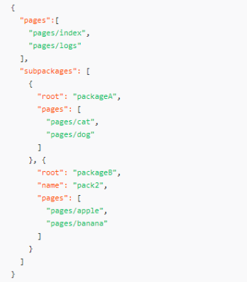
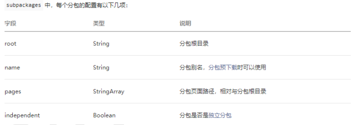
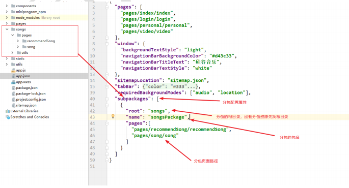
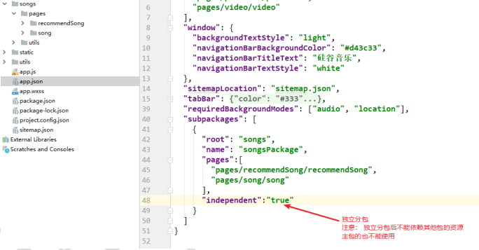
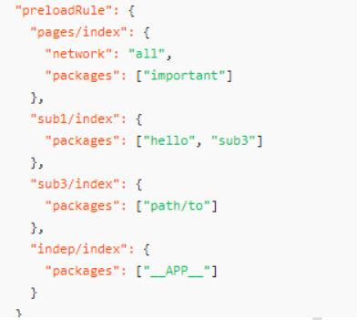
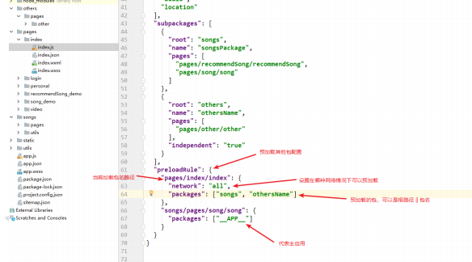
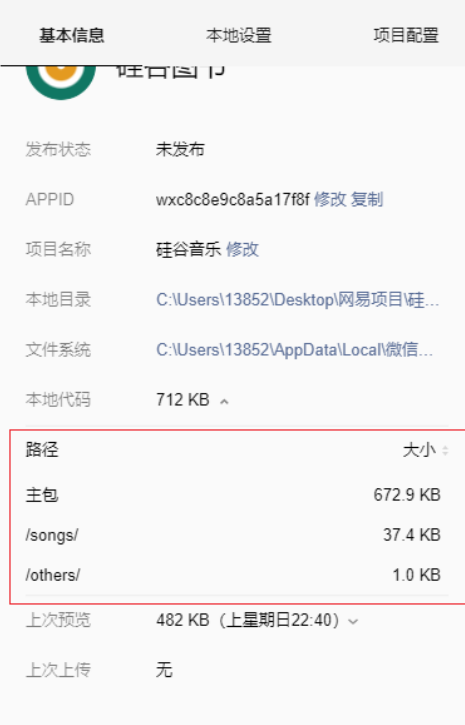
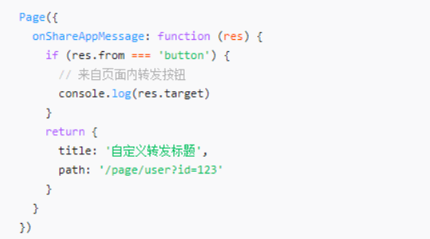
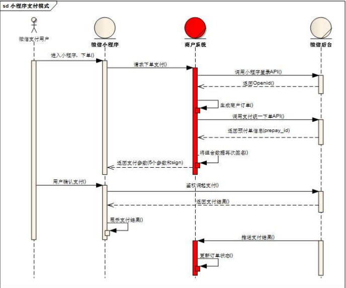

> **这篇笔记主要跟尚硅谷学习的，但是还未实际操作！！！**

## 为什么要分包

1. 小程序要求压缩包体积不能大于 2M，否则无法发布
2. 实际开发中小程序体积如果大于 2M 就需要使用分包机制进行发布上传
3. 分包后可解决 2M 限制，并且能分包加载内容，提高性能
4. 分包后单个包的体积不能大于 2M
5. 分包后所有包的体积不能大于 16M 

## 分包形式
1. 常规分包
2. 独立分包
3. 分包预下载

## 常规分包
1. 开发者通过在 app.json subpackages 字段声明项目分包结构
2. 特点：
    a) 加载小程序的时候先加载主包，当需要访问分包的页面时候才加载分包内容
    b) 分包的页面可以访问主包的文件，数据，图片等资源
    c) 主包：
        i. 主包来源： 除了分包以外的内容都会被打包到主包中
        ii. 通常放置启动页/tabBar 页面

## 独立分包

1. 设置 independent 为 true

2. 特点:

   a) 独立分包可单独访问分包的内容，不需要下载主包

   b) 独立分包不能依赖主包或者其他包的内容

3. 使用场景

   a) 通常某些页面和当前小程序的其他页面关联不大的时候可进行独立分包

   b) 如：临时加的广告页 || 活动页

## 分包预下载
1. 配置

a) app.json 中设置 preloadRule 选项

b) key(页面路径): {packages: [预下载的包名 || 预下载的包的根路径])}
      

2. 特点:

    a) 在加载当前包的时候可以设置预下载其他的包

    b) 缩短用户等待时间，提高用户体验
    
    
    
3. 分包效果演示

    

#  小程序转发分享

## 分享实现

1. Button 组件设置 open-type 为 share

2. `<button open-type='share' ></button>`

## 自定义分享内容

生命周期回调中 onShareAppMessage 回调中 return 对象设置自定义内容

## 设置体验权限

1. 开发阶段分享给微信好友，默认没有体验权限，无法打开分享小程序，需要在开发

页面设置

2. 最多添加 15 个微信好友

# 小程序支付流程

## 支付流程官网图解

## [支付流程详细说明](https://pay.weixin.qq.com/wiki/doc/api/wxa/wxa_api.php?chapter=7_3&index=1)

1. 用户在小程序客服端下单(包含用户及商品信息)

2. 小程序客户端发送下单支付请求给商家服务器

3. 商家服务器同微信服务器对接获取唯一标识 openID

4. 商家服务器根据 openId 生成商户订单(包含商户信息)

5. 商家服务器发送请求调用统一下单 API 获取预支付订单信息

   a) 接口地址: https://api.mch.weixin.qq.com/pay/unifiedorder

6. 商家对预支付信息签名加密后返回给小程序客户端

   a) 签名方式： MD5

   b) 签名字段：小程序 ID, 时间戳， 随机串，数据包，签名方式

   c) 参考地址 :https://pay.weixin.qq.com/wiki/doc/api/wxa/wxa_api.php?chapter=7_7&index=3

7. 用户确认支付（鉴权调起支付）

   a) API: wx.requestPayment()

8. 微信服务器返回支付结果给小程序客户端

9. 微信服务器推送支付结果给商家服务器端

# Reference

[官网对应地址](https://developers.weixin.qq.com/miniprogram/dev/framework/subpackages.html)

[尚硅谷学习视频地址](https://www.bilibili.com/video/BV1hK4y1W77j?p=1)