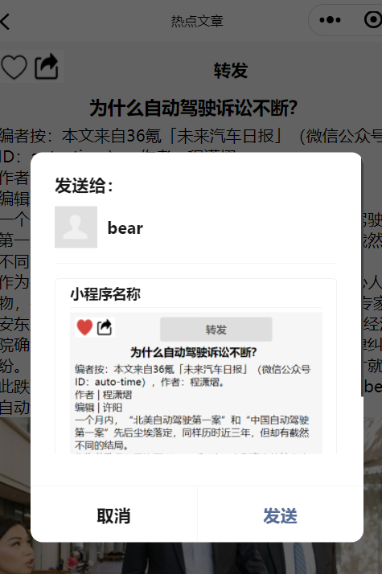
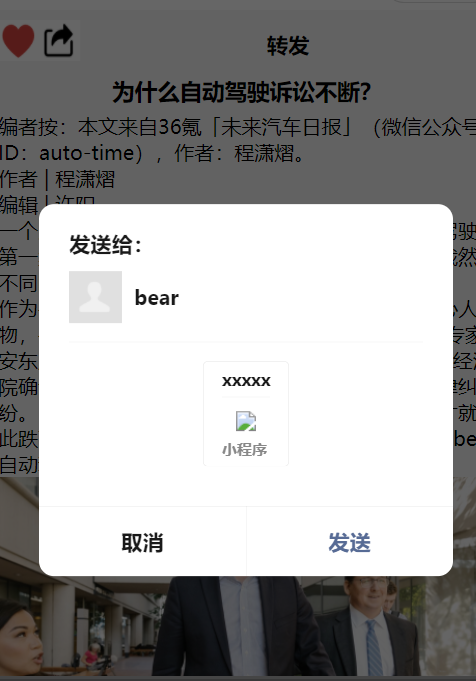
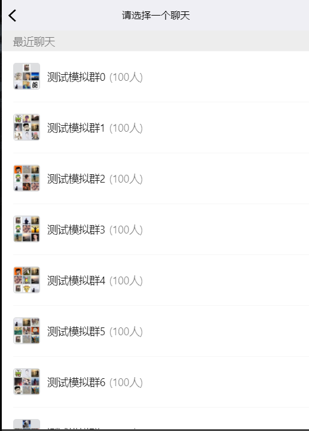

## 分享功能

### 通过点击按钮触发分享好友功能

在设置完上面的小程序JS部分后，有时会需要在按钮上触发分享好友功能，这里涉及到微信小程序按钮自带的open-type 的合法值，可参考微信[官方文档](https://developers.weixin.qq.com/miniprogram/dev/component/button.html)

### 效果1 - 分享当前缩略图

```html
<button  open-type="share">分享好友</button>
```
```js
Page({

  /*页面的初始数据*/
  data: {

  },
  /*生命周期函数--监听页面加载*/
  onLoad: function (options) {
  },
  /*用户点击右上角分享*/
  onShareAppMessage: function () {
    return {
      title: '小程序名称',  //分享时缩略图的名称
      success: (res) => {
        // 分享成功
      },
      fail: (res) => {
        // 分享失败
      }
    }
  }
})
```



### 效果2 - button & onShareAppMessage

> 但是这里一定注意！ 他这里要设置一下catch事件，不然会有冒泡

```html
<button class='share' open-type="share" catchtap="share">
```

```js
onShareAppMessage: function(){
    return {
       title: 'xxxxx', //自定义转发标题
       path: '/page/user?id=123', //分享页面路径
       imageUrl: '/common/images/xxx.png' //分享图片 宽高比 5:4
    }
}
```



### 效果3 - 在onload函数中显示

```js
onLoad: function (options) {
	 //开启分享好友功能
    wx.showShareMenu({
      withShareTicket: true
    });
  },
//测试群是自动就显示的界面
```



### 效果4 - 右上角菜单分享 -自定义

```js
//当你有两个分享的时候 
onShareAppMessage: function ({from}) {
    console.log(from);
    if(from === 'button'){
      return {
        title: '来自button的转发',
        page: '/pages/video/video',
        imageUrl: '/static/images/nvsheng.jpg'
      }
    }else {
      return {
        title: '来自menu的转发',
        page: '/pages/video/video',
        imageUrl: '/static/images/nvsheng.jpg'
      }
    } 
  }
```

