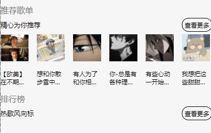

## 微信小程序中自定义组件创建

### 最基本引用

1. 在文件夹components中创建一个自己的组件名的文件夹（或者直接选择新创建组件）
2. 将对应的wxml以及wxss放进去
3. 重点！！ 在使用的页面的index.json中加入components的路径
```js
	{
  "usingComponents": {
    "NavHeader":"/components/NavHeader/index"
  }
}
```

4. 引入的页面直接使用组件 例如 `<NavHeader></NavHeader>`

### 参数传入

这里我们要关于本身自定义组件性能

例子

```css
/*自定义性质*/
properties: {
    title:{
      type:String,
      value:'默认title'
    },
    left:{
      type:String,
      value:'默认left'
    },
    right:{
      type:String,
      value:'默认right'
    }
  },
```

```html
<!-- 自定义 -->
<view
 class="recommend"
 hover-class="none"
 hover-stop-propagation="false"
>
	<view class="recomTitle">
		{{title}}
	</view>
	<view
	 class="recomTop"
	 hover-class="none"
	 hover-stop-propagation="false"
	>
		<view class="recomLeft">
			{{left}}
		</view>
		<view class="recomRight">
			{{right}}
		</view>
	</view>
</view>
```

```html
<!-- html -->
<NavHeader
 title="推荐歌单"
 left="精心为你推荐"
 right="查看更多"
></NavHeader>
```



