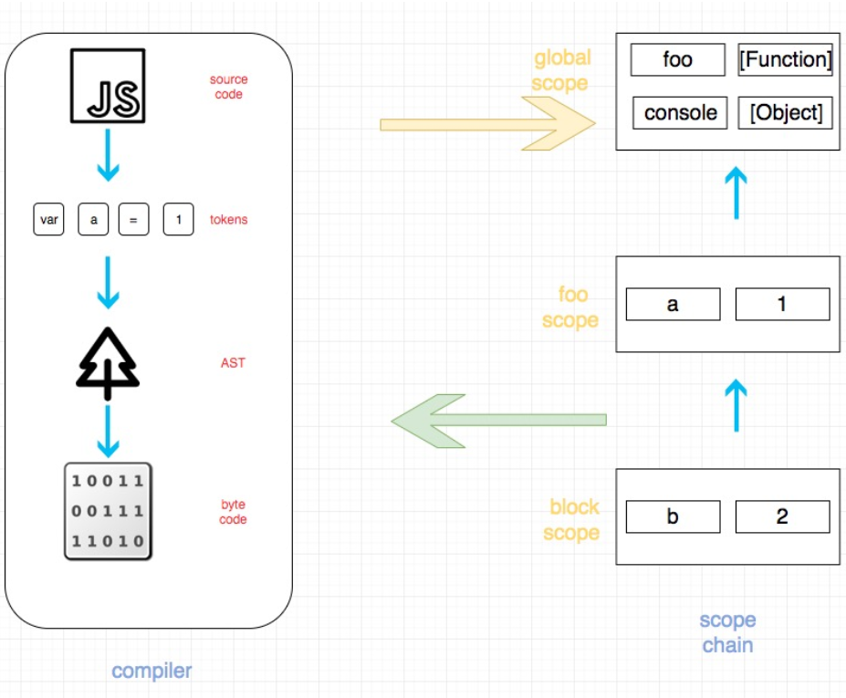

## 第一部分 新手入门

### JavaScript的类型

- `null` 和 `undefined`
- `string`
- `number`
- `boolean`
- `object`
- `symbol` (ES6中新引入)

```
a = null;
typeof a;           // "object" -- weird, bug

var arr = [
    "hello world",
    42,
    true
];

typeof arr;        // "object"
```

### 对象

```js
var obj = {
    a: "hello world",
    b: "a",
};

obj.a;        // "hello world"
obj["a"];    // "hello world"
obj[obj.b];        // "hello world"
```

### Boolean

```js
//false
""//（空字符串）
0, -0, NaN//（无效的number）
null, undefined

//true
"hello"
42
true
[ ], [1,"2",3]
{ }, {a:42}
```

### 等式

>
> `==` 在允许强制类型转换的情况下来检查两个值是否相等，而`===` 不允许强制转换来检查两个值是否相等；因此`===`常称作“严格相等”。
>


根据不同的情况选择用`==`还是`===`，规则如下：

- 如果比较的两个值中有一个可能是true或false值，应用`===`，不用`==`。
- 如果比较的两个值中有一个可能是这些特定值（0, ""或[]——空数组），应用`===`，不用`==`。
- 在其他所有情况下，都可以放心的用`==`。用`==`不仅安全无害，而且在很多情况下都可以简化你的代码，从而提高程序的可读性。 列举的这些规则要求你认真思考你的代码，仔细考虑对变量进行比较时得到的具体是什么类型的值。如果你能够确定值的类型，用`==`就很安全，大胆的用吧！如果你不能确定值的类型，就用`===`

### 不等式

<`,`>`,`<=`和`>= 这里 的对比， 如果两者都是string 对比，那么会字典对比 ， 如果两者有一个或者两个都不是string，强制转换为number 

### 变量（变量提升 作用域 严格模式 条件语句）

### 立即执行函数表达式(IIFEs)

### 闭包

```js
function makeAdder(x) {
    // parameter `x` is an inner variable
    function add(y) {
        return y + x;
    };
    return add;
}

var plusOne = makeAdder( 1 );

var plusTen = makeAdder( 10 );

plusOne( 3 );       // 4  <-- 1 + 3
plusOne( 41 );      // 42 <-- 1 + 41
plusTen( 13 );      // 23 <-- 10 + 13
```

## 第二部分 作用域&闭包

### 作用域

#### 编译器理论

1. **标记化/分词**：拆开字符串。例如，对于程序：`var a=2;`，可能会被拆分成下列标记：`var`, `a`, `=`, `2`和`;`。

   **注：** 标记化（Tokenizing）和分词(Lexing)的区别微乎其微，主要区别是这些标记是以 *无状态* 方式还是以 *有状态* 方式被识别。

2. **解析**：将**Tokenizer**转换为“AST”（Abstract Syntax Tree 抽象语法树）。

   `var a=2;`的AST的顶层节点称为`VariableDeclaration`，它有两个子节点：一个是`Identifier`（值为a）；另一个是`AssignmentExpression`，它又有一个子节点称为`NumbericLiteral`（值为2）。

3. **代码生成**：将AST转换为可执行代码的过程
   
   > “var a=2;”的AST转换成了一组机器指令，这组指令才实际上创建了一个变量a（包括分配内存等），然后在a中保存了一个值。
   >
   > 引擎 =》 编辑器 =》作用域

[以下图解来自作用域与闭包](https://lucifer.ren/fe-interview/#/topics/js/scope&closures?id=作用域与闭包)

```
function foo(a) {  
	if (typeof a === "number" || a instanceof Number) {    
		const b = a + 1;    
		console.log(b);  
		} 
	} 
foo();
```


如上图，左边部分是编译器。 右半部分是作用域链。上述代码执行的具体过程大概是：

- JS 源代码经过语法分析，转化成 tokens
- tokens 经过语义分析，转化为 AST(抽象语法树)
- 抽象语法树会被转化为字节码
- JS 运行时开始运行这段上面生成代码
- 当代码执行到函数声明的时候，引擎会向 scope chain 询问(一个 RHS)foo 是否已经声明 在这里是没有声明，会在当前 scope(也就是 global scope)创建一个 foo

### LHS和RHS

```
console.log(a);
```

- 这里对 a 是一个 RHS 引用，因为 a 并没有赋予任何值，目的是为了***取到 a 的值\***并打印出来。

```
a = 2;
```

- 这里对 a 是一个 LHS 引用，因为实际上我们不关心当前的值是什么，只是想要***把 a 赋值\***为 2。

练习

```js
function foo(a) {
    var b = a;
    return a + b;
}
var c = foo(2);
```

- 试试找出其中的3处 LHS 查询，4处 RHS 查询

**答案**： （这里是一直引擎再问作用域 给我需要的）

1. LHS 查询：

- `c = ..;`
- `a = 2(隐式变量分配）`
- `b = ..`

1. RHS 查询

- `foo(2..`
- `= a;`
- `a ..`
- `.. b`

> 未成功的RHS引用会抛出`ReferenceError`，未成功的LHS引用则会自动隐式的创建一个全局变量（非“严格模式”下），或抛出`ReferenceError`（严格模式下）。
>
> 如果RHS查找找到了某个变量，但是如果你对这个值做一些它不能做的事情，如把一个非函数值作为函数执行，对null或undefined值引用其属性，这时候引擎会抛出另一种类型的错误“TypeError”。
>
> `ReferenceError`是作用域解析失败相关的错误，而`TypeError`表明作用域解析成功，但是尝试对解析结果进行非法/不可能的操作

### [词法作用域](https://hankszhang.gitbooks.io/you-dont-know-js/content/part2/ch2.html)

> 如果使用了eval或with语句，引擎做得这些优化就没有意义了，所以它干脆不做任何优化。因此不管在你的代码的任何位置出现了eval或with语句，你的整个代码都会运行的更慢。


### [函数 VS 块级作用域](https://hankszhang.gitbooks.io/you-dont-know-js/content/part2/ch3.html)

### let vs Var 区别

1. let 声明的范围是块作用域，而var 声明的范围是函数作用域。

2. let 声明的变量不会在作用域中被提升。

   ````js
   // name 会被提升
   console.log(name); // undefined
   var name = 'Matt';
   // age 不会被提升
   console.log(age); // ReferenceError：age 没有定义
   let age = 26;
   //在let 声明之前的执行瞬间被称为“暂时性死区”（temporal dead zone），在此阶段引用任何后面才声明的变量都会抛出ReferenceError。
   ````

### const

const声明变量时必须同时初始化变量，且尝试修改const 声明的变量会导致运行时错误。如果const 变量引用的是一个对象，那么修改这个对象内部的属性并不违反const 的限制

### 变量提升

#### 基本变量提升 （函数声明）

```js
//普通版
function foo() {
    var a;
    console.log( a ); // undefined
    a = 2;
}

foo();
```

需要注意的是，**函数声明会被提升，但是函数表达式不会被提升**。

```js
foo(); // not ReferenceError, but TypeError!

var foo = function bar() {
    // ...
};
```

变量标识符foo被提升，因此foo()被执行时不会导致`ReferenceError`。但是foo还没有值。因此foo()尝试调用undefined值，从而导致非法的操作，抛出`TypeError`。

还需要注意的是，尽管这是一个命名函数表达式，函数名标识符在作用域内也是不可用的：

```js
foo(); // TypeError
bar(); // ReferenceError

var foo = function bar() {
    // ...
};
```

这段代码实际上被解释为：

```js
var foo;

foo(); // TypeError
bar(); // ReferenceError

foo = function() {
    var bar = ...self...
    // ...
}
```

#### 函数vs变量的提升

**函数声明和变量声明都会被提升，但是函数声明会先被提升，其次才是变量**

```js
foo(); // 1

var foo;

function foo() {
    console.log( 1 );
}

foo = function() {
    console.log( 2 );
};
```

输出了1而不是2！引擎将上面的代码解释为：

```js
function foo() {
    console.log( 1 );
}

foo(); // 1

foo = function() {
    console.log( 2 );
};
```

#### 提升变量中变量重复定义

尽管多重的var声明会被有效的忽略，但是后面的函数声明会覆盖之前声明的函数。

```js
foo(); // 3

function foo() {
    console.log( 1 );
}

var foo = function() {
    console.log( 2 );
};

function foo() {
    console.log( 3 );
}
```

#### 多重定义会导致的错误

尽管JS引擎能有效处理多重声明，但是在同一个作用域内多重声明通常会导致意想不到的结果。

普通代码块内的函数声明通常会被提升到外层的作用域，而不是函数所在的条件分支：

```js
foo(); // "b"

var a = true;
if (a) {
   function foo() { console.log( "a" ); }
}
else {
   function foo() { console.log( "b" ); }
}
```

## 作用域闭包

闭包的实质定义：

> 当一个函数在其词法作用域之外执行时仍能记住并访问其词法作用域时，这个函数就是闭包。

### 更好理解的例子 => 模块化闭包

这个是基本版本

```js
function CoolModule() {
    var something = "cool";
    var another = [1, 2, 3];

    function doSomething() {
        console.log( something );
    }

    function doAnother() {
        console.log( another.join( " ! " ) );
    }

    return {
        doSomething: doSomething,
        doAnother: doAnother
    };
}

var foo = CoolModule();

foo.doSomething(); // cool
foo.doAnother(); // 1 ! 2 ! 3
```

这里的例子可以看到更加完整的， 这种类似你可以写出定义 getter setter

[例子](https://hankszhang.gitbooks.io/you-dont-know-js/content/part2/ch5.html)


## 第三部分 关于this

​	**this并不是指向对象也不是只想函数本身作用域（这个说法不严谨）。 实际上过 this 实际上是在函数被调用时发生的绑定，它指向什么完全取决于函数在哪里被调用**

当一个函数被调用时，会创建一个活动记录（有时候也称为执行上下文）。这个记录会包含函数在哪里被调用（调用栈）、函数的调用方法、传入的参数等信息。this 就是记录的 其中一个属性，会在函数执行的过程中用到。 

**从调用栈中分析出真正的调用位置的，因为它决定了 this 的绑定**

### this 绑定规则

#### 默认绑定

有 foo() 运行在非 strict mode 下时，默认绑定才能绑定到全局对象；严格模式下与 foo() 
的调用位置无关

```js
function foo() { 
    "use strict"; 
    console.log( this.a ); 
}
var a = 2; 
foo(); // TypeError: this is undefined
//if not strict mode should be 2
```

#### 隐式绑定

对象属性引用链中只有最顶层或者说最后一层会影响调用位置。举例来说：
```js
function foo() { 
	console.log( this.a ); 
}

var obj2 = { 
    a: 42, 
    foo: foo 
};

var obj1 = { 
    a: 2, 
    obj2: obj2 
};

obj1.obj2.foo(); // 42
```

#### 显式绑定  call & apply& bind

#### new绑定

使用 new 来调用函数，或者说发生构造函数调用时，会自动执行下面的操作。 

1. 创建（或者说构造）一个全新的对象。 

2. 这个新对象会被执行 [[ 原型 ]] 连接。 

3. 这个新对象会绑定到函数调用的 this。 

4. 如果函数没有返回其他对象，那么 new 表达式中的函数调用会自动返回这个新对象。

### 判断this

现在我们可以根据优先级来判断函数在某个调用位置应用的是哪条规则。可以按照下面的顺序来进行判断： 

1. 函数是否在 new 中调用（new 绑定）？如果是的话 this 绑定的是新创建的对象。 
var bar = new foo() 

2. 函数是否通过 call、apply（显式绑定）或者硬绑定调用？如果是的话，this 绑定的是指定的对象。 
var bar = foo.call(obj2) 

3. 函数是否在某个上下文对象中调用（隐式绑定）？如果是的话，this 绑定的是那个上下文对象。 
var bar = obj1.foo() 

4. 如果都不是的话，使用默认绑定。如果在严格模式下，就绑定到 undefined，否则绑定到全局对象。 
var bar = foo() 

### 绑定this难点
```js
function foo(a,b) { 
console.log( "a:" + a + ", b:" + b ); 
}

// 把数组“展开”成参数 
foo.apply( null, [2, 3] ); // a:2, b:3

// 使用 bind(..) 进行柯里化
var bar = foo.bind( null, 2 ); 
bar( 3 ); // a:2, b:3 
```
这两种方法都需要传入一个参数当作 this 的绑定对象。如果函数并不关心 this 的话，你 

仍然需要传入一个占位值，这时 null 可能是一个不错的选择，

### 更加安全使用this - object.create

### this词法

```js
function foo() { // 返回一个箭头函数
    return (a) => { //this 继承自 foo() 
    	console.log( this.a ); 
    }; 
}
var obj1 = { a:2 };
var obj2 = { a:3 };
var bar = foo.call( obj1 ); 
bar.call( obj2 ); // 2, 不是 3 ！
```

**foo() 内部创建的箭头函数会捕获调用时 foo() 的 this。由于 foo() 的 this 绑定到 obj,bar（引用箭头函数）的 this 也会绑定到 obj1，箭头函数的绑定无法被修改。（new 也不行！）** 

## 第四部分 对象

可以稍微看看~~

http://www.brandhuang.com/article/1577319529234


## Reference

https://hankszhang.gitbooks.io/you-dont-know-js/content/part2/ch1.html

https://lucifer.ren/fe-interview/#/?id=javascript-%f0%9f%97%92%ef%b8%8f