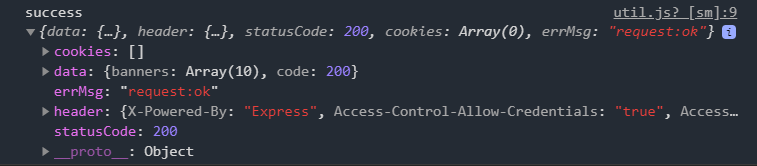

## 封装请求函数

这里主要是讲面对对于同个接口多个请求的时候，该怎么办

一般做法
一个url 我们就会请求一次数据
但是实际上面对一个页面很多内容的时候，这样是非常不利的，所以做法就是要封装请求函数

小程序为例 （网易云音乐的仿写- musicMiniPro）

```js
//config.js - 服务器的接口
export default {
    // host:'https://musicapi.leanapp.cn/' //这个接口真的我不想弄那个502的问题所以
    host:'http://localhost/3000'
}
```

```js
//util.js - 请求的处理函数
import config from './config';
const request = (url, data={},method='GET') => { 
  let _url = API_BASE_URL  + url;
  return new Promise((resolve, reject) => {
    wx.request({
      url: config.host+url,
      method,
      data: data, 
      success(res) {
        console.log("success",res)
        resolve(res.data) 
      },
      fail(err) {
        console.log("fail",res)
        reject(err)
      }
    })
  });
} 
//注意这里其实是异步的，所以如果考虑一般的提取数据方式是不行的，还是要用promise
module.exports = {
  request
}
```

```js
//page.js 发出请求函数
  onLoad: async function (options) {
      let result= await request('/banner',{type:2});
      console.log("结果",result.banners)
      this.setData({
        bannerList:result.banners
      })
  }
//当考虑封装请求函数，一定就要处理异步的问题，一定就会用到async & await
```

```html
<!-- 最后显示 -->
<swiper
 indicator-dots="true"
 autoplay="true"
 interval="2000"
>
	<swiper-item
	 wx:for="{{bannerList}}"
	 wx:key="index"
	 wx:for-index="index"
	>
		<image src="{{item.pic}}"></image>
	</swiper-item>
</swiper>
```


## 网易云的api请求

官网 ： https://binaryify.github.io/NeteaseCloudMusicApi/#/

git clone ----> npm install —> node app.js的方式运行调试

当运行起来会看到 运行在端口3000

比如上面的例子

