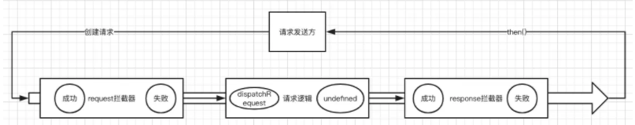

**下面的都是为了Admin-ui的练习 不是完整的**

[基础部分笔记](https://savancode.github.io/2021/02/01/Vue-day7/)

## 封装原因

- 统一 url 配置
- 统一 api 请求 （因为会遇到不同域名 类似 开发域名，测试域名，生产域名）
- request (请求) 拦截器，例如：带上token等，设置请求头
- response (响应) 拦截器，例如：统一错误处理，页面重定向等
- 根据需要，结合 Vuex 做全局的 loading 动画，或者错误处理
- 将 axios 封装成 Vue 插件使用

## axios 封装的路线理解



## 文件结构

```
-http
 -- config.js：axios 默认配置，包含基础路径等信息。
 -- axios.js：二次封装 axios 模块，包含拦截器等信息。
 -- interface.js ：请求接口汇总模块，聚合模块 API。
 -- index.js：将 axios 封装成插件，按插件方式引入。 
```

#### config.js

```js
export default {
  method: 'get',
  // 基础url前缀
  baseURL: 'http://localhost:8080/',
  // 请求头信息
  headers: {
    'Content-Type': 'application/json;charset=UTF-8'
  },
  // 参数
  data: {},
  // 设置超时时间 1s超时
  timeout: 10000,
  // 携带凭证
  withCredentials: true,
  // 返回数据类型
  responseType: 'json'
}
```

#### axios.js

这里添加了js -cookie 主要为了登陆页面

```js
import axios from 'axios';
import config from './config';
import qs from 'qs';
import Cookies from "js-cookie";
import router from '@/router'

// 使用vuex做全局loading时使用
// import store from '@/store'

export default function $axios(options) {
  return new Promise((resolve, reject) => {
    const instance = axios.create({
      baseURL: config.baseURL,
      headers: {},
      transformResponse: [function (data) {
      }]
    })

    // request 拦截器 
    //所有的网络请求都会先走这个方法
    instance.interceptors.request.use(
      config => {
        let token = Cookies.get('token')
        // 1. 请求开始的时候可以结合 vuex 开启全屏 loading 动画
        // console.log(store.state.loading)
        // console.log('准备发送请求...')
        // 2. 带上token
        if (token) {
          config.headers.accessToken = token
        } else {
          // 重定向到登录页面
          router.push('/login')
        }
        // 3. 根据请求方法，序列化传来的参数，根据后端需求是否序列化
        if (config.method === 'post') {
          if (config.data.__proto__ === FormData.prototype
            || config.url.endsWith('path')
            || config.url.endsWith('mark')
            || config.url.endsWith('patchs')
          ) {

          } else {
            config.data = qs.stringify(config.data)
          }
        }
        return config
      },

      error => {
        // 请求错误时
        console.log('request:', error)
        // 1. 判断请求超时
        if (error.code === 'ECONNABORTED' && error.message.indexOf('timeout') !== -1) {
          console.log('timeout请求超时')
          // return service.request(originalRequest);// 再重复请求一次
        }
        // 2. 需要重定向到错误页面
        const errorInfo = error.response
        console.log(errorInfo)
        if (errorInfo) {
          error = errorInfo.data  // 页面那边catch的时候就能拿到详细的错误信息,看最下边的Promise.reject
          const errorStatus = errorInfo.status; // 404 403 500 ...
          router.push({
            path: `/error/${errorStatus}`
          })
        }
        return Promise.reject(error) // 在调用的那边可以拿到(catch)你想返回的错误信息
      }
    )

    // response 拦截器
    // 所有的网络请求返回数据之后会执行这个方法
    instance.interceptors.response.use(
      response => {
        let data;
        // IE9时response.data是undefined，因此需要使用response.request.responseText(Stringify后的字符串)
        if (response.data == undefined) {
          data = JSON.parse(response.request.responseText)
        } else {
          data = response.data
        }

        // 根据返回的code值来做不同的处理
        switch (data.rc) {
          case 1:
            console.log(data.desc)
            break;
          case 0:
            store.commit('changeState')
            // console.log('登录成功')
          default:
        }
        // 若不是正确的返回code，且已经登录，就抛出错误
        // const err = new Error(data.desc)
        // err.data = data
        // err.response = response
        // throw err

        return data
      },
      err => {
        if (err && err.response) {
          switch (err.response.status) {
            case 400:
              err.message = '请求错误'
              break
            case 401:
              err.message = '未授权，请登录'
              break
            case 403:
              err.message = '拒绝访问'
              break
            case 404:
              err.message = `请求地址出错: ${err.response.config.url}`
              break
            case 408:
              err.message = '请求超时'
              break
            case 500:
              err.message = '服务器内部错误'
              break
            case 501:
              err.message = '服务未实现'
              break
            case 502:
              err.message = '网关错误'
              break
            case 503:
              err.message = '服务不可用'
              break
            case 504:
              err.message = '网关超时'
              break
            case 505:
              err.message = 'HTTP版本不受支持'
              break
            default:
          }
        }
        console.error(err)
        return Promise.reject(err) // 返回接口返回的错误信息
      }
    )

    // 请求处理
    instance(options).then(res => {
      resolve(res)
      return false
    }).catch(error => {
      reject(error)
    })
  })
}
```

#### interface.js

```js
import axios from './axios'

/* 
 * 将所有接口统一起来便于维护
 * 如果项目很大可以将 url 独立成文件，接口分成不同的模块
 */

// 单独导出
export const login = () => {
    return axios({
        url: '/login',
        method: 'get'
    })
}

export const getUser = () => {
    return axios({
        url: '/user',
        method: 'get'
    })
}

export const getMenu = data => {
    return axios({
        url: '/menu',
        method: 'post',
        data
    })
}

// 默认全部导出
export default {
    login,
    getUser,
    getMenu
}
```

#### index.js

```js
// 导入所有接口
import apis from './interface'

const install = Vue => {
    if (install.installed)
        return;

    install.installed = true;

    Object.defineProperties(Vue.prototype, {
        // 注意，此处挂载在 Vue 原型的 $api 对象上
        $api: {
            get() {
                return apis
            }
        }
    })
}

export default install
```

## Reference

[Vue + Element UI 实现权限管理系统 前端篇（三）：工具模块封装](https://blog.csdn.net/xifengxiaoma/article/details/92839222?spm=1001.2014.3001.5501)