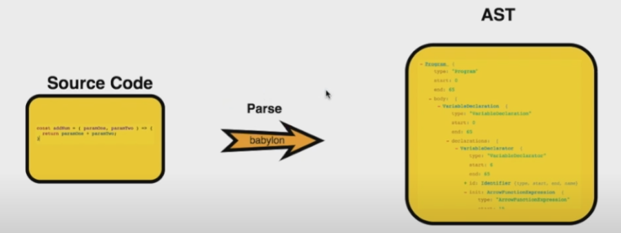
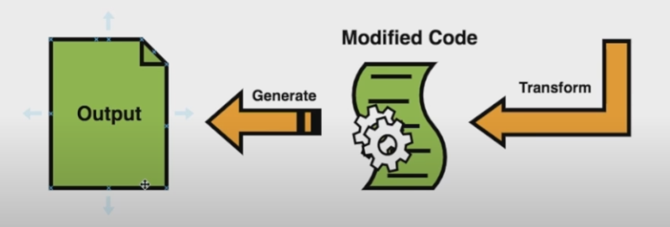
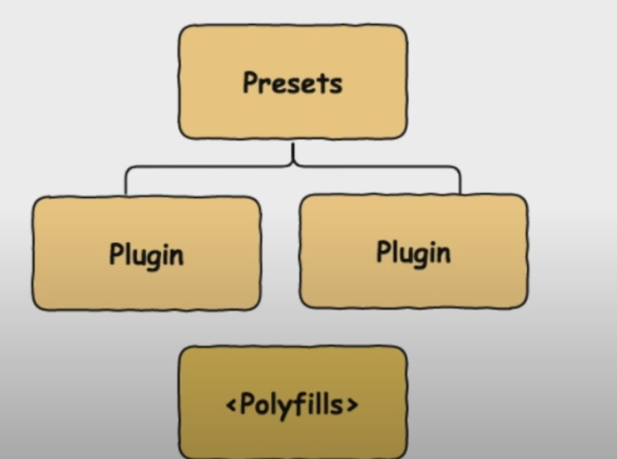

**BabelJS**是一个 JavaScript 转译器，可将新功能转译为旧标准。有了这个，这些功能可以在新旧浏览器上轻松运行。如果新特性是一个方法或对象，我们需要使用 Babel-polyfill 和 transpiling 使其在旧浏览器上工作。

## Babel 学习手册

- [Balbel 官方](https://babeljs.io/docs/en/)
- [Babel 手册](https://github.com/jamiebuilds/babel-handbook/blob/master/translations/zh-Hans/README.md)

Balbel 的学习教程不多，其实建议是直接看这两个官方的就够了

## Babel 基本理解

### Babel的工作过程

Babel的处理过程主要为3个：***解析(parse)\***、***转换(transform)\***、***生成(generate)\***。

- 解析 Parse: 将代码解析生成抽象语法树( 即 AST )，即词法分析与语法分析的过程
- 转换 Transform: 对于 AST 进行变换一系列的操作，babel 接受得到 AST 并通过 babel-traverse 对其进行遍历，在此过程中进行添加、更新 及移除等操作
- 生成 Generate: 将变换后的 AST 再转换为 JS 代码, 使用到的模块是 babel-generator

解析和生成过程，都有Babel都为我们处理得很好了，我们要做的就是在 ***转换\*** 过程中搞事情，进行个性化的定制开发。





### 具体解释

### Babel 插件 plugin

插件和预设是 Babel 转译代码的配置细节。Babel 支持许多插件，如果我们知道代码执行的环境，它们可以单独使用。

### Babel-预设 presets

Babel 预设是一组插件，即 babel-transpiler 的配置细节，指示 Babel 在特定模式下进行转译。我们需要使用预设，它具有我们想要转换代码的环境。例如，*es2015*预设会将代码转换为*es5*。

> - [@babel/preset-env](https://babeljs.io/docs/en/babel-preset-env) for compiling ES2015+ syntax
> - [@babel/preset-typescript](https://babeljs.io/docs/en/babel-preset-typescript) for [TypeScript](https://www.typescriptlang.org/)
> - [@babel/preset-react](https://babeljs.io/docs/en/babel-preset-react) for [React](https://reactjs.org/)
> - [@babel/preset-flow](https://babeljs.io/docs/en/babel-preset-flow) for [Flow](https://flow.org/)

> 对于stage X
>
> The [TC39](https://github.com/tc39) categorizes proposals into the following stages:
>
> - [Stage 0](https://babeljs.io/docs/en/babel-preset-stage-0) - Strawman: just an idea, possible Babel plugin.
> - [Stage 1](https://babeljs.io/docs/en/babel-preset-stage-1) - Proposal: this is worth working on.
> - [Stage 2](https://babeljs.io/docs/en/babel-preset-stage-2) - Draft: initial spec.
> - [Stage 3](https://babeljs.io/docs/en/babel-preset-stage-3) - Candidate: complete spec and initial browser implementations.
> - Stage 4 - Finished: will be added to the next yearly release.

### Babel-Polyfills

有一些特性，如方法和对象，不能被转译。在这种情况下，我们可以使用 babel-polyfill 来促进在任何浏览器中使用功能。让我们考虑 Promise 的例子；为了使该功能在旧浏览器中工作，我们需要使用 polyfills。



## 使用 BabelJS 的优势

- BabelJS 为 JavaScript 的所有新增功能提供向后兼容性，并且可以在任何浏览器中使用。
- BabelJS 有能力转译为 JavaScript 的下一个即将推出的版本——ES6、ES7、ESNext 等。
- BabelJS 可以与 gulp、webpack、flow、react、typescript 等一起使用，使其非常强大，并且可以与大型项目一起使用，使开发人员的生活变得轻松。
- BabelJS 还可以与 react JSX 语法一起使用，并且可以以 JSX 形式编译。
- BabelJS 支持插件、polyfills、babel-cli，可以轻松处理大型项目。

## 使用 BabelJS 的缺点

- BabelJS 代码在转译时改变了语法，这使得代码在生产环境中发布时难以理解。
- 与原始代码相比，转译后的代码规模更大。
- 并非所有 ES6/7/8 或即将推出的新功能都可以转译，我们必须使用 polyfill 才能在旧浏览器上运行。

## 执行例子

我们将执行以下命令安装*babel-cli, babel-core, babel-preset-es2015*。

### babel 6 的包

```
npm install babel-cli babel-core babel-preset-es2015 --save-dev
```

### babel 7 的包

```
npm install @babel/cli @babel/core @babel/preset-env --save-dev
```

[例子](https://www.tutorialspoint.com/babeljs/babeljs_es6_code_execution.htm)

## 了解AST Tree

```js
js: `let a = 2`
ast: {
     "type": "VariableDeclaration",
    "start": 0,
    "end": 9,
    "loc": {
      "start": {
        "line": 1,
        "column": 0
      },
      "end": {
        "line": 1,
        "column": 9
      }
    },
    "declarations": [
      {
        "type": "VariableDeclarator",
        "start": 4,
        "end": 9,
        "loc": {
          "start": {
            "line": 1,
            "column": 4
          },
          "end": {
            "line": 1,
            "column": 9
          }
        },
        "id": {
          "type": "Identifier",
          "start": 4,
          "end": 5,
          "loc": {
            "start": {
              "line": 1,
              "column": 4
            },
            "end": {
              "line": 1,
              "column": 5
            },
            "identifierName": "a"
          },
          "name": "a"
        },
        "init": {
          "type": "NumericLiteral",
          "start": 8,
          "end": 9,
          "loc": {
            "start": {
              "line": 1,
              "column": 8
            },
            "end": {
              "line": 1,
              "column": 9
            }
          },
          "extra": {
            "rawValue": 2,
            "raw": "2"
          },
          "value": 2
        }
      }
    ],
    "kind": "let"
}
```

## 编写preset

[参考](https://babeljs.io/docs/en/presets)

可以直接返回一串plugins

```js
module.exports = function() {
  return {
    plugins: ["pluginA", "pluginB", "pluginC"],
  };
};
```

可以直接返回带有presets &plugins

```js
module.exports = () => ({
  presets: [require("@babel/preset-env")],
  plugins: [
    [require("@babel/plugin-proposal-class-properties"), { loose: true }],
    require("@babel/plugin-proposal-object-rest-spread"),
  ],
});
```

### 运行顺序

```json
{
  "presets": ["a", "b", "c"]
}
//这是直接 从c b a， 保持 backwards compatibility,
```

### 特殊设置

```json
{
  "presets": [
    [
      "@babel/preset-env",
      {
        "loose": true,
        "modules": false
      }
    ]
  ]
}
```


## 编写你的第一个 Babel 插件 [参考来源](https://github.com/jamiebuilds/babel-handbook/blob/master/translations/zh-Hans/plugin-handbook.md#toc-writing-your-first-babel-plugin)

现在你已经熟悉了 Babel 的所有基础知识了，让我们把这些知识和插件的 API融合在一起来编写第一个 Babel 插件吧。

先从一个接收了当前`babel`对象作为参数的 [`function`](https://github.com/babel/babel/tree/master/packages/babel-core) 开始。

```
export default function(babel) {
  // plugin contents
}
```

由于你将会经常这样使用，所以直接取出 `babel.types` 会更方便：（译注：这是 ES2015 语法中的对象解构，即 Destructuring）

```
export default function({ types: t }) {
  // plugin contents
}
```

接着返回一个对象，其 `visitor` 属性是这个插件的主要访问者。

```
export default function({ types: t }) {
  return {
    visitor: {
      // visitor contents
    }
  };
};
```

Visitor 中的每个函数接收2个参数：`path` 和 `state`

```
export default function({ types: t }) {
  return {
    visitor: {
      Identifier(path, state) {},
      ASTNodeTypeHere(path, state) {}
    }
  };
};
```

让我们快速编写一个可用的插件来展示一下它是如何工作的。下面是我们的源代码：

```
foo === bar;
```

其 AST 形式如下：

```json
{
  type: "BinaryExpression",
  operator: "===",
  left: {
    type: "Identifier",
    name: "foo"
  },
  right: {
    type: "Identifier",
    name: "bar"
  }
}
```

我们从添加 `BinaryExpression` 访问者方法开始：

```
export default function({ types: t }) {
  return {
    visitor: {
      BinaryExpression(path) {
        // ...
      }
    }
  };
}
```

然后我们更确切一些，只关注哪些使用了 `===` 的 `BinaryExpression`。

```
visitor: {
  BinaryExpression(path) {
    if (path.node.operator !== "===") {
      return;
    }

    // ...
  }
}
```

现在我们用新的标识符来替换 `left` 属性：

```
BinaryExpression(path) {
  if (path.node.operator !== "===") {
    return;
  }

  path.node.left = t.identifier("sebmck");
  // ...
}
```

于是如果我们运行这个插件我们会得到：

```
sebmck === bar;
```

现在只需要替换 `right` 属性了。

```
BinaryExpression(path) {
  if (path.node.operator !== "===") {
    return;
  }

  path.node.left = t.identifier("sebmck");
  path.node.right = t.identifier("dork");
}
```

这就是我们的最终结果了：

```
sebmck === dork;
```

完美！我们的第一个 Babel 插件。

> ### path
>
> path存储着AST节点信息以及一些节点操作方法，因为AST是一颗树，那么树的查找，和树节点之间的关系就需要工具去处理，就像DOM树一样：
>
> #### path存储的ast属性有:
>
> - node节点(当前遍历到的node节点)
> - parent 节点(父级AST节点)
> - parentPath 父级path
> - scope 作用域
>
> #### path存储的方法:
>
> - get获取子节点
> - findParent向父节点搜寻节点
> - getSibling 获取兄弟路径
> - getFunctionParent 获取包含该节点最近的父函数节点(查找的是function)
> - getStatementParent 向上获取最近的statement类型节点
> - relaceWith：用AST节点替换该节点
> - relaceWithMultiple 用多个AST节点替换节点
> - replaceWidthSourceString 用源码解析后的AST节点替换节点
> - insertBefore在之前插入兄弟节点
> - insertAfter 在之后插入兄弟节点
> - remove 删除节点
> - pushContainer 将ASTpush到节点属性里面
> - stop 停止遍历
> - skip 跳过此次遍历

### Plugin运行顺序

This means if two transforms both visit the "Program" node, the transforms will run in either plugin or preset order.

- Plugins run before Presets.
- **Plugin ordering is first to last.**
- Preset ordering is reversed (last to first).

### 额外例子

```js
//现在我们写一个简单的编译目的是将let a = 5; 编译为 var a = 5;
import template from "babel-template";

const temp = template("var b = 1")

export default function({ types: t }) {
      // 插件内容
      return {
        visitor: {
            // 接收两个参数path, state
            VariableDeclaration(path, state) {
                // 找到AST节点
                const node = path.node;
                // 保险一点还可以判断一下节点类型，强行用一下babel-types做个示例
                // 判断节点类型 是否是变量节点, 申明方式是let
                 if (t.isVariableDeclaration(node, { kind: "let" })) {          
                    // 将let 声明编译为var
                    node.kind = "var";
                    // var b = 1 的AST节点
                    const insertNode = temp();
                    // 插入一行代码var b = 1
                    path.insertBefore(insertNode);
                 }
            }
        }
      }
   }

//接下来使用编写的插件:


// 导入自己写的插件
const myPlugin = require('xxxx')
const babel = require('@babel/core');
const content = 'let a = 5';
// 通过你编写的插件输出的代码
const { code } = babel.transform(content, {
   plugins: [
       myPlugin
   ]
});
```

## WTF are Babel and Webpack 😵 ? Explained in 2 mins.

[来源](https://dev.to/getd/wtf-are-babel-and-webpack-explained-in-2-mins-43be)

### Balbel

we need Babel to translate above into the equivalent not-so-fancy code below, that our browser / Node.js actually understands.

That's why Babel is sometimes called a *transpiler*.

**It's worth noting that Babel is commonly used for both front- and back-end. Why do I mention this? Because Webpack is front-end only (in most cases).**

### Webpack

If Babel is a translator for JS, you can think of Webpack as a mega-multi-translator that works with all kinds of languages (or assets). 

**Why do we need such a monster for front-end, but not back-end?**

Because front-end has many kinds of assets such as CSS, SASS, images, fonts and is way more complex and dynamic than back-end which only has JS. And in the end of day we need to somehow package all variety of assets into a small file that our users' browser can download at page load time. This is also known as minify and uglify. You see, back-end has none of the above requirement.

Another important reason is that front-end doesn't work with modules (again, in most cases). Modules are built-in features of Node.js, not browsers. Nowadays developers are so used to npm install, import and export JS modules in front-end, as it allows us to better organize code and share packages. But in reality they are only syntactic sugars, and it's Webpack's job to figure out all the dependencies among all the modules that we use in the code, and compile them into one big chunk of JS code that the browser actually understands.

### 总结

- Backend: we use Babel so that we can use the fanciest JS syntax (ES6/7) with Node.js.
- Frontend: we use Webpack (which uses Babel and other things) to compile JS code and many other assets into a few small bundle files that our users can download when they first load our webpage. For example, [`create-react-app` uses Webpack and Babel](https://github.com/facebook/create-react-app#get-started-immediately) when creating your app.