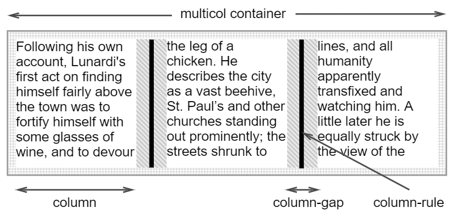

## columns 布局

## multi-columns [布局](https://developer.mozilla.org/en-US/docs/Web/CSS/columns)

允许简单地定义多列文本

### 基本声明

```css
columns: column-width | column-count;
column-gap /*栏之间的间隔*/
column-rule /*分割线 与border的写法几乎一毛一样*/
/*column-rule分开写是这样的：*/
column-rule-width /*分割线宽*/
column-rule-style /*分割线样式*/
column-rule-color /*分割线颜色*/
```



以上的各个属性，在**Firefox**浏览器中要添加前缀 “**-moz-**”;

在**Safair、chrome或Opera**浏览器中需要添加前缀 “**-webkit-**”;