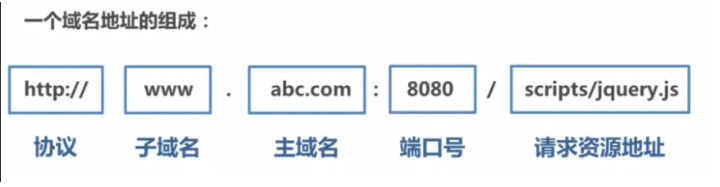

## 同源策略以及限制内容

首先了解下浏览器的同源策略 同源策略`/SOP（Same origin policy）`是一种约定，由Netscape公司1995年引入浏览器，它是浏览器最核心也最基本的安全功能，如果缺少了同源策略，浏览器很容易受到`XSS`、`CSFR`等攻击。所谓同源是指"**协议+域名+端口**"三者相同，即便两个不同的域名指向同一个ip地址，也非同源



### **同源策略限制内容有：**

- Cookie、LocalStorage、IndexedDB 等存储性内容
- DOM 节点
- AJAX 请求发送后，结果被浏览器拦截了

### 允许跨域加载资源

但是有三个标签是允许跨域加载资源：

- ``
- `<link href=XXX>`
- `<script src=XXX>`

### 常见跨域场景

当协议、子域名、主域名、端口号中任意一个不相同时，都算作不同域。

### 特别说明两点：

**第一：如果是协议和端口造成的跨域问题“前台”是无能为力的。**

**第二：在跨域问题上，仅仅是通过“URL的首部”来识别而不会根据域名对应的IP地址是否相同来判断。“URL的首部”可以理解为“协议, 域名和端口必须匹配”**。

这里你或许有个疑问：**请求跨域了，那么请求到底发出去没有？**

**跨域并不是请求发不出去，请求能发出去，服务端能收到请求并正常返回结果，只是结果被浏览器拦截了**。你可能会疑问明明通过表单的方式可以发起跨域请求，为什么 Ajax 就不会?因为归根结底，跨域是为了阻止用户读取到另一个域名下的内容，Ajax 可以获取响应，浏览器认为这不安全，所以拦截了响应。但是表单并不会获取新的内容，所以可以发起跨域请求。同时也说明了跨域并不能完全阻止 CSRF，因为请求毕竟是发出去了。


## **那么怎样解决跨域问题的呢？**

### **通过jsonp跨域**

#### 1) JSONP原理

**利用 `<script>` 标签没有跨域限制的漏洞，网页可以得到从其他来源动态产生的 JSON 数据。JSONP请求一定需要对方的服务器做支持才可以。**

#### 2) JSONP和AJAX对比

JSONP和AJAX相同，都是客户端向服务器端发送请求，从服务器端获取数据的方式。但AJAX属于同源策略，JSONP属于非同源策略（跨域请求）

#### 3) JSONP优缺点

JSONP优点是简单兼容性好，可用于解决主流浏览器的跨域数据访问的问题。**缺点是仅支持get方法具有局限性,不安全可能会遭受XSS攻击。**

#### 4) JSONP的实现流程

- 声明一个回调函数，其函数名(如show)当做参数值，要传递给跨域请求数据的服务器，函数形参为要获取目标数据(服务器返回的data)。
- 创建一个`<script>`标签，把那个跨域的API数据接口地址，赋值给script的src,还要在这个地址中向服务器传递该函数名（可以通过问号传参:?callback=show）。
- 服务器接收到请求后，需要进行特殊的处理：把传递进来的函数名和它需要给你的数据拼接成一个字符串,例如：传递进去的函数名是show，它准备好的数据是`show('我不爱你')`。
- 最后服务器把准备的数据通过HTTP协议返回给客户端，客户端再调用执行之前声明的回调函数（show），对返回的数据进行操作。

在开发中可能会遇到多个 JSONP 请求的回调函数名是相同的，这时候就需要自己封装一个 JSONP函数。

```js
// index.html
function jsonp({ url, params, callback }) {
  return new Promise((resolve, reject) => {
    let script = document.createElement('script')
    window[callback] = function(data) {
      resolve(data)
      document.body.removeChild(script)
    }
    params = { ...params, callback } // wd=b&callback=show
    let arrs = []
    for (let key in params) {
      arrs.push(`${key}=${params[key]}`)
    }
    script.src = `${url}?${arrs.join('&')}`
    document.body.appendChild(script)
  })
}
jsonp({
  url: 'http://localhost:3000/say',
  params: { wd: 'Iloveyou' },
  callback: 'show'
}).then(data => {
  console.log(data)
})
```

上面这段代码相当于向`http://localhost:3000/say?wd=Iloveyou&callback=show`这个地址请求数据，然后后台返回`show('我不爱你')`，最后会运行show()这个函数，打印出'我不爱你'

```js
// server.js
let express = require('express')
let app = express()
app.get('/say', function(req, res) {
  let { wd, callback } = req.query
  console.log(wd) // Iloveyou
  console.log(callback) // show
  res.end(`${callback}('我不爱你')`)
})
app.listen(3000)
```

#### 5) jQuery的jsonp形式

**JSONP都是GET和异步请求的，不存在其他的请求方式和同步请求，且jQuery默认就会给JSONP的请求清除缓存。**

```js
$.ajax({
url:"http://crossdomain.com/jsonServerResponse",
dataType:"jsonp",
type:"get",//可以省略
jsonpCallback:"show",//->自定义传递给服务器的函数名，而不是使用jQuery自动生成的，可省略
jsonp:"callback",//->把传递函数名的那个形参callback，可省略
success:function (data){
console.log(data);}
});
```

- **.domain + iframe跨域**

> 此方案仅限主域相同，子域不同的跨域应用场景

1.）父窗口：(http://www.domain.com/a.html)

```html
<iframe id="iframe" src="http://child.domain.com/b.html"></iframe>
<script>
    document.domain = 'domain.com';
    var user = 'admin';
</script>
```

2.）子窗口：(http://child.domain.com/b.html)

```javascript
document.domain = 'domain.com';
// 获取父窗口中变量
alert('get js data from parent ---> ' + window.parent.user);
```

- **nginx代理跨域**
- **nodejs中间件代理跨域**
- **后端在头部信息里面设置安全域名**

## 面试题

> 在你开发的过程中，什么情况下会遇到跨域问题，你是怎么解决的？

1. API跨域可以通过服务器上nginx反向代理
2. 本地webpack dev server可以设置 proxy，
3. `new Image`, 设src 的时候，图片需要设置Cors

> cors需要后台配合设置HTTP响应头，如果请求不是简单请求（1. method：get，post，2. content-type：三种表单自带的content-type，3. 没有自定义的HTTP header），浏览器会先发送option预检请求，后端需要响应option请求，然后浏览器才会发送正式请求，cors通过白名单的形式允许指定的域发送请求

`jsonp`是浏览器会放过 img script标签引入资源的方式。所以可以通过后端返回一段执行js函数的脚本，将数据作为参数传入。然后在前端执行这段脚本。双方约定一个函数的名称。

> 联调的时候会需要跨域，线上前端站点域和后台接口不一致也需要跨域，开发时跨域可以通过代理服务器来转发请求，因为跨域本身是浏览器对请求的限制，常见的跨域处理还有JSONP和cors，jsonp是利用脚本资源请求本身就可以跨域的特性，通过与请求一起发送回调函数名，后台返回script脚本直接执行回调，但是由于资源请求是get类型，请求参数长度有限制，也不能进行post请求。cors需要后台配合设置HTTP响应头，如果请求不是简单请求（1. method：get，post，2. content-type：三种表单自带的content-type，3. 没有自定义的HTTP header），浏览器会先发送option预检请求，后端需要响应option请求，然后浏览器才会发送正式请求，cors通过白名单的形式允许指定的域发送请求

同源策略只是浏览器客户端的防护机制，当发现非同源HTTP请求时会拦截响应，但服务器依然处理了这个请求。 服务器端不拦截，所以在同源服务器下做代理，可以实现跨域。