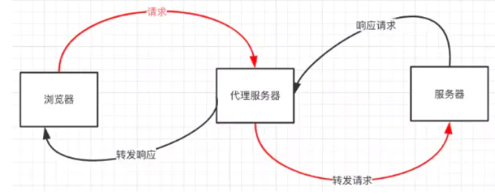
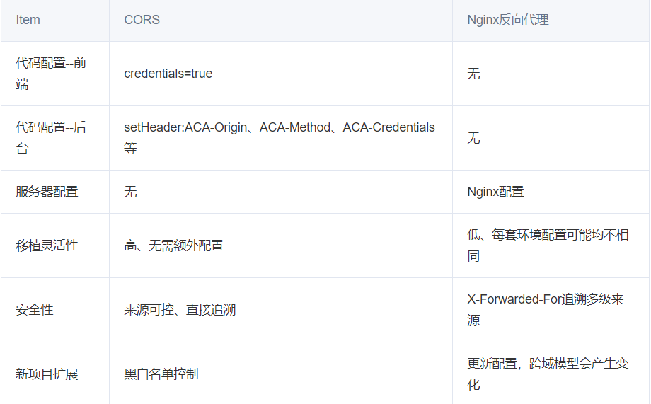

> 这里很建议可以看一下 这篇基础文章 [ajax& cors](https://blog.huli.tw/2017/08/27/ajax-and-cors/)

## 同源策略以及限制内容

首先了解下浏览器的同源策略 同源策略`/SOP（Same origin policy）`是一种约定，由Netscape公司1995年引入浏览器，它是浏览器最核心也最基本的安全功能，如果缺少了同源策略，浏览器很容易受到`XSS`、`CSFR`等攻击。所谓同源是指"**协议+域名+端口**"三者相同，即便两个不同的域名指向同一个ip地址，也非同源


scheme + host + port

### **同源策略限制内容有：**

- Cookie、LocalStorage、IndexedDB 等存储性内容
- DOM 节点
- AJAX 请求发送后，结果被浏览器拦截了

### 同源策略的安全性作用

**同源策略**是一个重要的安全策略，它用于限制一个[origin](https://developer.mozilla.org/zh-CN/docs/Glossary/Origin)的文档或者它加载的脚本如何能与另一个源的资源进行交互。它能帮助阻隔恶意文档，减少可能被攻击的媒介。

> 简单的意思：如果没有同源策略，那么你只要获得一个内部网站或者正在建设的公司网站，欧克，那你不就什么都得到了~~~

### 允许跨域加载资源

但是有三个标签是允许跨域加载资源：

- ``
- `<link href=XXX>`
- `<script src=XXX>`

### 常见跨域场景

当协议、子域名、主域名、端口号中任意一个不相同时，都算作不同域。

### 特别说明两点：

**第一：如果是协议和端口造成的跨域问题“前台”是无能为力的。**

**第二：在跨域问题上，仅仅是通过“URL的首部”来识别而不会根据域名对应的IP地址是否相同来判断。“URL的首部”可以理解为“协议, 域名和端口必须匹配”**。

这里你或许有个疑问：**请求跨域了，那么请求到底发出去没有？**

**你的 Request 還是有發出去的」，而且瀏覽器也「確實有收到 Response」，重點是「瀏覽器因為同源政策，不把結果傳回給你的 JavaScript」。如果沒有瀏覽器的話其實就沒有這些問題，你愛發給誰就發給誰，不管怎樣都拿得到 Response**。你可能会疑问明明通过表单的方式可以发起跨域请求，为什么 Ajax 就不会?因为归根结底，跨域是为了阻止用户读取到另一个域名下的内容，Ajax 可以获取响应，浏览器认为这不安全，所以拦截了响应。但是表单并不会获取新的内容，所以可以发起跨域请求。同时也说明了跨域并不能完全阻止 CSRF，因为请求毕竟是发出去了。


## **那么怎样解决跨域问题的呢？**

### 1.CORS是根本解决方案 - Cross-origin resource sharing

**CORS 需要浏览器和后端同时支持。IE 8 和 9 需要通过 XDomainRequest 来实现**。

浏览器会自动进行 CORS 通信，实现 CORS 通信的关键是后端。只要后端实现了 CORS，就实现了跨域

虽然设置 CORS 和前端没什么关系，但是通过这种方式解决跨域问题的话，会在发送请求时出现两种情况，分别为**简单请求**和**复杂请求**。

#### 1) 简单请求

只要同时满足以下两大条件，就属于简单请求

条件1：使用下列方法之一：

- GET
- HEAD
- POST

条件2：Content-Type 的值仅限于下列三者之一：

- text/plain
- multipart/form-data
- application/x-www-form-urlencoded

请求中的任意 XMLHttpRequestUpload 对象均没有注册任何事件监听器； XMLHttpRequestUpload 对象可以使用 XMLHttpRequest.upload 属性访问。

#### 2) 复杂请求

> 定义:
>
> - 假如
>
>   请求方法为以下其中之一：
>
>   - [PUT (en-US)](https://developer.mozilla.org/en-US/docs/Web/HTTP/Methods/PUT)
>   - [DELETE (en-US)](https://developer.mozilla.org/en-US/docs/Web/HTTP/Methods/DELETE)
>   - [`CONNECT`](https://developer.mozilla.org/zh-TW/docs/Web/HTTP/Methods/CONNECT)
>   - [OPTIONS (en-US)](https://developer.mozilla.org/en-US/docs/Web/HTTP/Methods/OPTIONS)
>   - [TRACE (en-US)](https://developer.mozilla.org/en-US/docs/Web/HTTP/Methods/TRACE)
>   - [PATCH (en-US)](https://developer.mozilla.org/en-US/docs/Web/HTTP/Methods/PATCH)
>
>   ....[.(还有很多状况)](https://developer.mozilla.org/zh-TW/docs/Web/HTTP/CORS#%E7%B0%A1%E5%96%AE%E8%AB%8B%E6%B1%82)

简单地说，只要我们的request 没有带任何的自定义header，那么就不是复杂请求

**就是会多一个 Request 叫做 Preflight Request，也就是预检请求。因为非简单请求可能会带有一些使用者资料，因此会先透过Preflight Request 去确认后续的请求能否送出。**

**如果这个Preflight Request 没有过的话，真的Request 也就不会发送了，这就是预检请求的目的。**

> 假设今天某个Server提供了一个API网址叫做：，你只要对它发送GET，就能够拿到id是16的资料，只要对它发送DELETE，就可以把这笔资料删除。`https://example.com/data/16`
>
> 如果今天没有Preflight Request 这个机制的话，我就可以在随便一个Domain 的网页上面发送一个DELETE 的Request 给这个API。刚刚我有强调说浏览器的CORS 机制，还是会帮你发送Request，但只是Response 被浏览器挡住而已。
>
> 因此呢，尽管没有Response，但是Server 端的确收到了这个Request，因此就会把这笔资料给删除。
>
> 如果有Preflight Request 的话，在发送出去收到结果的时候，就会知道这个API 并没有提供CORS，因此真的DELETE 请求就不会送出，到这边就结束了。
>
> 先用一个OPTIONS 的请求去确认之后的Request 能不能送出，这就是Preflight Request 的目的。

流程上

1. 我们要送出POST的request到http://localhost:3000/form
2. 浏览器发现是非简单请求，因此先发出一个preflight request
3. 检查response，preflight 通过 （后端都需要给`Access-Control-Allow-Origin`这个header）
4. 送出POST的request到http://localhost:3000/form

Preflight Request作用

1. 通过Preflight Request，让早期网站不受伤害，不接收到預期外的 request
2. 从安全性上，如果发出delete，没有预先的拦截，那么由于请求不会被阻拦，数据库内文章就可能已经删除了！！！ 但是由于preflight，预先确保不会跨域（双方沟通没有问题并且repsonse能够很好的接受）。 那么就可以很好的确定是要删除文章，并且后端能够给前端反应“ 我删除好了”~

#### 治理CORS 问题的多个角度思考

1. 治标不治本型

   > CORS本身就是不可以通过纯前端问题解决的
   >
   > 1. 关掉浏览器的安全性设置
   > 2. 把 fetch mode 設成 no-cors
   > 3. 不要用 AJAX 拿资料，用Script

2. #### 真正的解法：后端设置 CORS header

#### CORS优缺点

优点：

```text
1.支持POST以及所有HTTP请求
2.安全性相对JSOP更高
3.前端要做的事儿比较少
```

缺点：

```text
1.不兼容老版本浏览器，如IE9及其以下
2.需要服务端支持
3.使用起来稍微复杂了些
```

#### 特殊性： 带上cookie

1. 后端 Response header 有 `Access-Control-Allow-Credentials: true`
2. **后端 Response header 的 `Access-Control-Allow-Origin` 不能是 `*`，要明确指定**
3. 前端 fetch 加上 `credentials: 'include'`

> **`Access-Control-Allow-Origin` 不要設定成 `*` 而是明確指定 origin，避免預期之外的 origin 跨站存取資源。若是你有多個 origin 的話，建議在後端有一個 origin 的清單，判斷 request header 內的 origin 有沒有在清單中，有的話就設定 `Access-Control-Allow-Origin`，沒有的話就不管它。**

#### 存取自訂 header

[详细解释](https://blog.huli.tw/2021/02/19/cors-guide-3/)

如果你要存取 CORS response 的 header，尤其是自定义的 header ，后端要多带一个 `Access-Control-Expose-Headers` 的 header 喔，這樣前端才拿得到

#### 退回编辑状态

[详细例子](https://blog.huli.tw/2021/02/19/cors-guide-3/)

当你遇到 Access to fetch at ‘http://localhost:3000/form' from origin ‘[http://localhost:8080'](http://localhost:8080'/) has been blocked by CORS policy: Method PATCH is not allowed by Access-Control-Allow-Methods in preflight response.

> 如果前端要使用`GET`、`HEAD`以及`POST`以外的HTTP method发送请求的话，后端的preflight response header必须有`Access-Control-Allow-Methods`并且指定合法的method，preflight才会通过，浏览器才会把真正的request发送出去。

#### 快取preflight request

后端需要使用 Access-Control-Max-Age

> 如果还想再看看CORS的内容， [推荐阅读](https://blog.huli.tw/2021/02/19/cors-guide-6/) 内容不错 但是挺多的

### 2. 通过jsonp跨域 最早解决办法

> 此方法有一个致命的缺点就是只支持`GET`请求。所以说如果前端页面仅仅是作为页面的展示，就只获取数据的话，只用此方法就没有任何问题。

#### 1) JSONP原理

**利用 `<script>` 标签没有跨域限制的漏洞，网页可以得到从其他来源动态产生的 JSON 数据。JSONP请求一定需要对方的服务器做支持才可以。**

#### 2) JSONP和AJAX对比

JSONP和AJAX相同，都是客户端向服务器端发送请求，从服务器端获取数据的方式。但AJAX属于同源策略，JSONP属于非同源策略（跨域请求）

#### 3) JSONP优缺点

JSONP优点是简单兼容性好，可用于解决主流浏览器的跨域数据访问的问题。

**缺点是仅支持get方法具有局限性, 不安全可能会遭受XSS攻击。**

> “XSS是跨站脚本攻击(Cross Site Scripting)，为不和层叠样式表(Cascading Style Sheets, CSS)的缩写混淆，故将跨站脚本攻击缩写为XSS。恶意攻击者往Web页面里插入恶意Script代码，当用户浏览该页之时，嵌入其中Web里面的Script代码会被执行，从而达到恶意攻击用户的目的。”

#### 4) JSONP的实现流程

- 声明一个回调函数，其函数名(如show)当做参数值，要传递给跨域请求数据的服务器，函数形参为要获取目标数据(服务器返回的data)。
- 创建一个`<script>`标签，把那个跨域的API数据接口地址，赋值给script的src,还要在这个地址中向服务器传递该函数名（可以通过问号传参:?callback=show）。
- 服务器接收到请求后，需要进行特殊的处理：把传递进来的函数名和它需要给你的数据拼接成一个字符串,例如：传递进去的函数名是show，它准备好的数据是`show('我不爱你')`。
- 最后服务器把准备的数据通过HTTP协议返回给客户端，客户端再调用执行之前声明的回调函数（show），对返回的数据进行操作。

> **前端script添加一个跨域的url，后端也会对这个url做出一些设置，实际的请求是后端执行的，后端再把访问该url返回的数据拼接返回到callback函数中，前端通过callback获取数据**

在开发中可能会遇到多个 JSONP 请求的回调函数名是相同的，这时候就需要自己封装一个 JSONP函数。

```js
// index.html
function jsonp({ url, params, callback }) {
  return new Promise((resolve, reject) => {
    let script = document.createElement('script')
    window[callback] = function(data) {
      resolve(data)
      document.body.removeChild(script)
    }
    params = { ...params, callback } // wd=b&callback=show
    let arrs = []
    for (let key in params) {
      arrs.push(`${key}=${params[key]}`)
    }
    script.src = `${url}?${arrs.join('&')}`
    document.body.appendChild(script)
  })
}
jsonp({
  url: 'http://localhost:3000/say',
  params: { wd: 'Iloveyou' },
  callback: 'show'
}).then(data => {
  console.log(data)
})
```

上面这段代码相当于向`http://localhost:3000/say?wd=Iloveyou&callback=show`这个地址请求数据，然后后台返回`show('我不爱你')`，最后会运行show()这个函数，打印出'我不爱你'

```js
// server.js
let express = require('express')
let app = express()
app.get('/say', function(req, res) {
  let { wd, callback } = req.query
  console.log(wd) // Iloveyou
  console.log(callback) // show
  res.end(`${callback}('我不爱你')`)
})
app.listen(3000)
```

#### 5) jQuery的jsonp形式

**JSONP都是GET和异步请求的，不存在其他的请求方式和同步请求，且jQuery默认就会给JSONP的请求清除缓存。**

```js
$.ajax({
url:"http://crossdomain.com/jsonServerResponse",
dataType:"jsonp",
type:"get",//可以省略
jsonpCallback:"show",//->自定义传递给服务器的函数名，而不是使用jQuery自动生成的，可省略
jsonp:"callback",//->把传递函数名的那个形参callback，可省略
success:function (data){
console.log(data);}
});
```

### 3. proxy server 

同源政策什么的都只是「浏览器的限制」，一旦脱离了浏览器，就没有任何限制了，proxy server (代理伺服器) 就是如此。

如果你想拿A网站的资料，但是它没有提供`Access-Control-Allow-Origin`这个header，你就自己写个server，从后端去拿A网站的资料，再把资料丢回给自己的前端就行了。**因为自己的后端可以自己控制，所以你想加什么header就加什么header**，想拿什么资料就拿什么。

> 流程：
>
> 
>
> 1. 浏览器发request 到proxy，说要拿baidu.com 的资料
> 2. proxy server 去跟 baidu.com 拿资料（后端，不是浏览器所以没有跨来源限制）
> 3.  baidu.com 回传资料给proxy（同上，没有跨来源限制）
> 4. proxy 回传资料给浏览器，并加上CORS header（所以前端不会被挡）

### 4. nginx反向代理  

实现原理类似于Node中间件代理，需要你搭建一个中转nginx服务器，用于转发请求。

使用nginx反向代理实现跨域，是最简单的跨域方式。只需要修改nginx的配置即可解决跨域问题，支持所有浏览器，支持session，不需要修改任何代码，并且不会影响服务器性能。

实现思路：通过nginx配置一个代理服务器（域名与domain1相同，端口不同）做跳板机，反向代理访问domain2接口，并且可以顺便修改cookie中domain信息，方便当前域cookie写入，实现跨域登录。

先下载[nginx](http://nginx.org/en/download.html)，然后将nginx目录下的nginx.conf修改如下:

```js
// proxy服务器
server {
    listen       81;
    server_name  www.domain1.com;
    location / {
        proxy_pass   http://www.domain2.com:8080;  #反向代理
        proxy_cookie_domain www.domain2.com www.domain1.com; #修改cookie里域名
        index  index.html index.htm;

        # 当用webpack-dev-server等中间件代理接口访问nignx时，此时无浏览器参与，故没有同源限制，下面的跨域配置可不启用
        add_header Access-Control-Allow-Origin http://www.domain1.com;  #当前端只跨域不带cookie时，可为*
        add_header Access-Control-Allow-Credentials true;
    }
}
```

最后通过命令行`nginx -s reload`启动nginx

```js
// index.html
var xhr = new XMLHttpRequest();
// 前端开关：浏览器是否读写cookie
xhr.withCredentials = true;
// 访问nginx中的代理服务器
xhr.open('get', 'http://www.domain1.com:81/?user=admin', true);
xhr.send();

// server.js
var http = require('http');
var server = http.createServer();
var qs = require('querystring');
server.on('request', function(req, res) {
    var params = qs.parse(req.url.substring(2));
    // 向前台写cookie
    res.writeHead(200, {
        'Set-Cookie': 'l=a123456;Path=/;Domain=www.domain2.com;HttpOnly'   // HttpOnly:脚本无法读取
    });
    res.write(JSON.stringify(params));
    res.end();
});
server.listen('8080');
console.log('Server is running at port 8080...');
```

#### 优缺点

[推荐阅读](https://segmentfault.com/a/1190000016229792)



- 一般开发环境的域名跟线上环境不一样才需要这样处理。
- 如果线上环境太复杂，使用反向代理实现跨域的将会变得很麻烦，那么这时候会需要采用 jsonp 或者 CORS 来处理。

### 5. postMessage

postMessage是HTML5 XMLHttpRequest Level 2中的API，且是为数不多可以跨域操作的window属性之一，它可用于解决以下方面的问题：

- 页面和其打开的新窗口的数据传递
- 多窗口之间消息传递
- 页面与嵌套的iframe消息传递
- 上面三个场景的跨域数据传递

**postMessage()方法允许来自不同源的脚本采用异步方式进行有限的通信，可以实现跨文本档、多窗口、跨域消息传递**。

> otherWindow.postMessage(message, targetOrigin, [transfer]);

- message: 将要发送到其他 window的数据。
- targetOrigin:通过窗口的origin属性来指定哪些窗口能接收到消息事件，其值可以是字符串"*"（表示无限制）或者一个URI。在发送消息的时候，如果目标窗口的协议、主机地址或端口这三者的任意一项不匹配targetOrigin提供的值，那么消息就不会被发送；只有三者完全匹配，消息才会被发送。
- transfer(可选)：是一串和message 同时传递的 Transferable 对象. 这些对象的所有权将被转移给消息的接收方，而发送一方将不再保有所有权。

接下来我们看个例子： `http://localhost:3000/a.html`页面向`http://localhost:4000/b.html`传递“我爱你”,然后后者传回"我不爱你"。

```html
// a.html
  <iframe src="http://localhost:4000/b.html" frameborder="0" id="frame" onload="load()"></iframe> //等它加载完触发一个事件
  //内嵌在http://localhost:3000/a.html
    <script>
      function load() {
        let frame = document.getElementById('frame')
        frame.contentWindow.postMessage('我爱你', 'http://localhost:4000') //发送数据
        window.onmessage = function(e) { //接受返回数据
          console.log(e.data) //我不爱你
        }
      }
    </script>

// b.html
 <script>
  window.onmessage = function(e) {
    console.log(e.data) //我爱你
    e.source.postMessage('我不爱你', e.origin)
 }
</script>
```

[详细的解释](https://juejin.cn/post/6844903917684260877)

#### 优缺点

缺点:

1.iframe会阻塞主页面的Onload事件；

2.相同域iframe和主页面共享http连接池，所以如果相同域用多个iframe会阻塞加载

解决方案：

```
动态生成iframe，在主页面加载完成后去生产iframe加载，从而避免阻塞的影响
```

3.iframe 对SEO不友好

### 6.websocket

Websocket是HTML5的一个持久化的协议，它实现了浏览器与服务器的全双工通信，同时也是跨域的一种解决方案。WebSocket和HTTP都是应用层协议，都基于 TCP 协议。但是 **WebSocket 是一种双向通信协议，在建立连接之后，WebSocket 的 server 与 client 都能主动向对方发送或接收数据**。同时，WebSocket 在建立连接时需要借助 HTTP 协议，连接建立好了之后 client 与 server 之间的双向通信就与 HTTP 无关了。

原生WebSocket API使用起来不太方便，我们使用`Socket.io`，它很好地封装了webSocket接口，提供了更简单、灵活的接口，也对不支持webSocket的浏览器提供了向下兼容。

我们先来看个例子：本地文件socket.html向`localhost:3000`发生数据和接受数据

```html
// socket.html
<script>
    let socket = new WebSocket('ws://localhost:3000');
    socket.onopen = function () {
      socket.send('我爱你');//向服务器发送数据
    }
    socket.onmessage = function (e) {
      console.log(e.data);//接收服务器返回的数据
    }
</script>

// server.js
<script>
let express = require('express');
let app = express();
let WebSocket = require('ws');//记得安装ws
let wss = new WebSocket.Server({port:3000});
wss.on('connection',function(ws) {
  ws.on('message', function (data) {
    console.log(data);
    ws.send('我不爱你')
  });
})
</script>
```

#### 优缺点

优点：在建立了**WebSocket**连接后，服务器不需要再等待客户端请求数据才能做出相应，服务器可以在数据更新后主动向客户端推送此次更新

缺点：请求中有大半是无用，难于维护，浪费带宽和服务器资源

### document.domain + iframe跨域(看看就行)

> 要求2个域之间的主域名相同，子域不同，[比如a.xxx.com和b.xxx.com](http://xn--a-ch1bt67c.xxx.xn--comb-221g.xxx.com/)。如果不同的话是不行的。

1.）父窗口：(http://www.domain.com/a.html)

```html
<iframe id="iframe" src="http://child.domain.com/b.html"></iframe>
<script>
    document.domain = 'domain.com';
    var user = 'admin';
</script>
```

2.）子窗口：(http://child.domain.com/b.html)

```javascript
document.domain = 'domain.com';
// 获取父窗口中变量
alert('get js data from parent ---> ' + window.parent.user);
```

- **nodejs中间件代理跨域**
- **后端在头部信息里面设置安全域名**


### [document.domain + iframe跨域(看看就行)](https://www.yuque.com/febb/story/cross-domain#gwlscg)

### [location.hash + iframe跨域(看看就行)](https://www.yuque.com/febb/story/cross-domain#6tvfcr)

### [window.name + iframe跨域(看看就行)](https://www.yuque.com/febb/story/cross-domain#ogc5za)

## 面试题

> 在你开发的过程中，什么情况下会遇到跨域问题，你是怎么解决的？

1. API跨域可以通过服务器上nginx反向代理
2. 本地webpack dev server可以设置 proxy，
3. `new Image`, 设src 的时候，图片需要设置Cors

> cors需要后台配合设置HTTP响应头，如果请求不是简单请求（1. method：get，post，2. content-type：三种表单自带的content-type，3. 没有自定义的HTTP header），浏览器会先发送option预检请求，后端需要响应option请求，然后浏览器才会发送正式请求，cors通过白名单的形式允许指定的域发送请求

`jsonp`是浏览器会放过 img script标签引入资源的方式。所以可以通过后端返回一段执行js函数的脚本，将数据作为参数传入。然后在前端执行这段脚本。双方约定一个函数的名称。

> 联调的时候会需要跨域，线上前端站点域和后台接口不一致也需要跨域，开发时跨域可以通过代理服务器来转发请求，因为跨域本身是浏览器对请求的限制，常见的跨域处理还有JSONP和cors，jsonp是利用脚本资源请求本身就可以跨域的特性，通过与请求一起发送回调函数名，后台返回script脚本直接执行回调，但是由于资源请求是get类型，请求参数长度有限制，也不能进行post请求。cors需要后台配合设置HTTP响应头，如果请求不是简单请求（1. method：get，post，2. content-type：三种表单自带的content-type，3. 没有自定义的HTTP header），浏览器会先发送option预检请求，后端需要响应option请求，然后浏览器才会发送正式请求，cors通过白名单的形式允许指定的域发送请求

同源策略只是浏览器客户端的防护机制，当发现非同源HTTP请求时会拦截响应，但服务器依然处理了这个请求。 服务器端不拦截，所以在同源服务器下做代理，可以实现跨域。

## 总结

- CORS支持所有类型的HTTP请求，是跨域HTTP请求的根本解决方案
- JSONP只支持GET请求，JSONP的优势在于支持老式浏览器，以及可以向不支持CORS的网站请求数据。
- 不管是Node中间件代理还是nginx反向代理，主要是通过同源策略对服务器不加限制。
- 日常工作中，用得比较多的跨域方案是cors和nginx反向代理


## Reference

[九种跨域方式实现原理（完整版）](https://juejin.cn/post/6844903767226351623)

[CORS 完全手冊](https://blog.huli.tw/2021/02/19/cors-guide-1/)

[iframe通过postMessage跨域通信](https://juejin.cn/post/6844903917684260877)